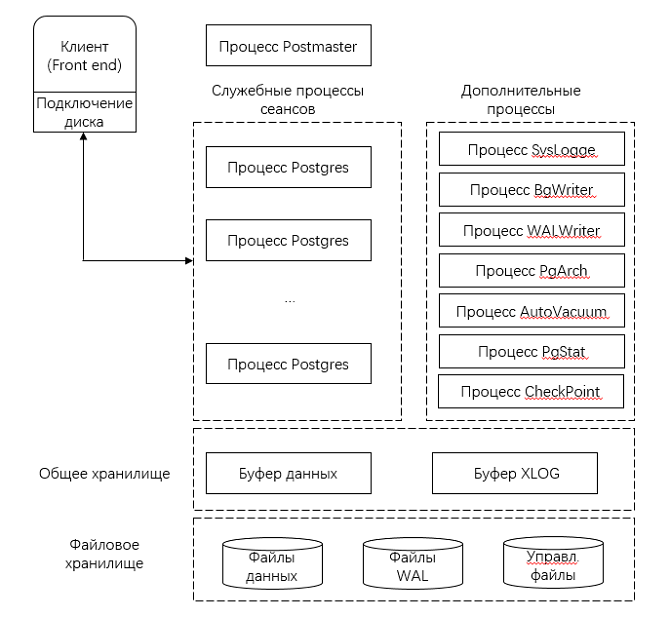
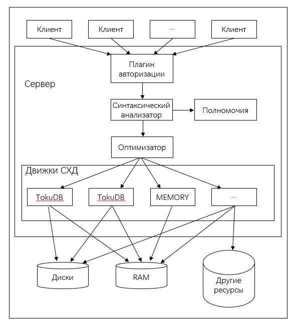

# Настройка сервера базы данных

\[\[toc]]

## Сервер PostgreSQL

### Описание программного обеспечения

На [Рис. 1](#fig26022387391) показана архитектура PostgreSQL, а в [Табл. 1](#table62020913417) приведены основные процессы.

**Рис. 1** Архитектура PostgreSQL


**Табл. 1** Основные процессы PostgreSQL

| **Тип процесса**         | **Имя процесса**                | **Описание**                                                 |
| ------------------------ | ------------------------------- | ------------------------------------------------------------ |
| Основной  процесс        | Postmaster                      | Процесс Postmaster контролирует все экземпляры базы данных в целом и отвечает за их запуск и остановку. |
| Резидентный процесс      | Postgres  (resident process)    | Этот  процесс управляет внутренними резидентными процессами, его также называют  администратором почты. По умолчанию этот процесс прослушивает доменные сокеты  Unix и порт 5432 TCP/IP и ожидает обработки соединений на внешней  (клиентской) стороне. Номер порта прослушивания можно изменить в файле **postgresql.conf** PostgreSQL. |
| Подпроцесс               | Postgres  (subprocess)          | Подпроцесс определяет,  разрешить или не разрешить соединение в соответствии с политикой  безопасности, определенной файлом **pg_hba.conf**.  Согласно политике безопасности, подпроцесс отклоняет запросы с определенных  IP-адресов и сетей и разрешает подключаться к базам данных только  определенным пользователям или разрешает подключиться только к определенным  базам данных.  Postgres принимает запрос с  клиентской стороны, выполняет поиск в базе данных и возвращает результаты.  Иногда также обновляет базу данных. Обновленные данные записываются в журналы транзакций (журналы WAL для PostgreSQL). Этот метод используется при  отключении питания системы, выходе сервера из строя или перезапуске сервера.  Кроме того, журналы могут использоваться для восстановления данных в других сценариях. В версии PostgreSQL 9.0 или более поздней версии журналы WAL могут  передаваться другим системам PostgreSQL с целью репликации базы данных в реальном  времени. |
| Вспомогательные процессы | SysLogger  (system log)         | Основной процесс запускает  вспомогательный процесс, только если параметру **logging_collection** в файле **Postgres.conf**  присвоено значение **on**. |
|                          | BgWriter (background write)     | Этот  процесс записывает «грязные» страницы из общей памяти на диск. Цель операции  заключается в улучшении производительности добавления, обновления и удаления  данных. |
|                          | WALWriter  (write-ahead log)    | Этот  процесс записывает операции модификации на диски до изменения данных, поэтому  данные не требуется сохранять в файлы при последующих обновлениях данных в  реальном времени. |
|                          | PgArch (archive)                | Журналы  упреждающей записи (WAL) помещаются в архив. Процесс PgArch создает резервную  копию WAL перед архивированием. После резервного копирования всей базы данных  можно использовать технологию восстановления на момент времени (PITR) (Point  in Time Recovery; PITR) для помещения журналов WAL в архив. Базу данных можно  восстановить на любой момент времени после выполнения полного резервного  копирования с сохранением всех данных с последующим помещением WAL в архив. |
|                          | AutoVacuum  (automatic cleanup) | В базе  данных PostgreSQL после выполнения операции DELETE с таблицей старые данные  сразу же не удаляются. При добавлении новых данных система создает строку  данных вместо того, чтобы перезаписывать старые данные. Старые данные только  помечаются как удаленные, но удаляются только в том случае, если эти данные  не считываются в других параллельных транзакциях. В этом случае данные удаляются  процессом AutoVacuum. |
|                          | PgStat  (statistics collection) | Этот  процесс собирает статистику данных. Он используется для оценки затрат  ресурсов во время оптимизации запросов, в том числе количество операций  добавления, обновления и удаления, выполняемых с таблицей или индексом,  количество операций чтения и записи на блоки дисков и количество операций чтения строк. **pg_statistic** хранит информацию,  собранную PgStat. |
|                          | CheckPoint  (checkpoint)        | Контрольная  точка является точкой последовательности транзакций, установленной системой. Информация журнала до момента контрольной точки записывается на диски. |

### Конфигурирование среды

>  **ПРИМЕЧАНИЕ**:  
Следующая конфигурация среды приведена только в качестве примера. Сконфигурируйте требуемую среду в соответствии с условиями площадки.

#### Отключение межсетевого экрана и функции автоматического запуска

>  **ПРИМЕЧАНИЕ**:  
Чтобы не влиять на сеть, рекомендуется отключить межсетевой экран в тестовой среде. Сконфигурируйте межсетевой экран в соответствии с фактическими требованиями.

1. Как пользователь с правами **root** остановите работу службы межсетевого экрана.
   
   ```
   # systemctl stop firewalld
   ```

2. Как пользователь с правами **root** отключите службу межсетевого экрана.
   
   ```
   # systemctl disable firewalld
   ```
   
   >  **ПРИМЕЧАНИЕ**:  
Автоматический запуск службы отключается вместе с отключением межсетевого экрана.

#### Отключение SELinux

1. Как пользователь с правами **root** измените конфигурационный файл.
   
   ```
   # sed -i 's/SELINUX=enforcing/SELINUX=disabled/g' /etc/sysconfig/selinux
   ```

#### Создание группы пользователей и пользователя

>  ПРИМЕЧАНИЕ:  
Чтобы в целях безопасности разграничить полномочия, в серверной среде каждому процессу назначаются независимые пользователи. Группа пользователей и пользователь создаются для конкретной операционной системы, а не для базы данных.

1. Создайте пользователя PostgreSQL или группу пользователей как пользователь с правами **root**.
   
   ```
   # groupadd  postgres
   ```
   
   ```
   # useradd  -g postgres postgres
   ```

2. Установите пароль пользователя postgres как пользователь с правами **root**. (Введите пароль дважды для подтверждения.)
   
   ```
   #passwd postgres
   ```

#### Создание дисков хранения данных

>  **ПРИМЕЧАНИЕ**:
> 
> - Чтобы избежать влияния со стороны операций ввода-вывода диска на результат тестирования производительности, рекомендуется подключить твердотельные диски NVMe с улучшенной производительностью ввода-вывода, которые будут использованы для создания тестовых экземпляров PostgreSQL. В этом разделе в качестве примера используются диски SSD с интерфейсом NVMe. Для получения более подробной информации см. шаги 1–4.
> - При другом виде тестирования (не производительности) создайте каталог данных, выполнив следующую команду как пользователь **root**. Далее пропустите этот раздел.  
\# mkdir /data

1. Создайте файловую систему (в качестве примера для пользователя с правами **root** взята система xfs, измените ее в соответствии с требованиями площадки). Если файловая система уже создана для диска, при выполнении этой команды будет передана ошибка. Для принудительного создания файловой системы можно использовать параметр -f.
   
   ```
   # mkfs.xfs /dev/nvme0n1
   ```

2. Создайте каталог данных.
   
   ```
   # mkdir /data
   ```

3. Смонтируйте диски.
   
   ```
   # mount -o noatime,nobarrier /dev/nvme0n1 /data
   ```

#### Установка разрешений на каталог хранения данных

1. Как пользователь с правами **root** установите разрешение на каталог.
   
   ```
   # chown -R postgres:postgres /data/
   ```

### Установка, запуск и удаление PostgreSQL

#### Установка PostgreSQL

1. Сконфигурируйте локальный источник Yum. Для получения подробной информации обратитесь к разделу [Конфигурирование сервера-репозитория](./configuring-the-repo-server.html).

2. Очистите кэш.
   
   ```
   $ dnf clean all
   ```

3. Создайте кэш.
   
   ```
   $ dnf makecache
   ```

4. Как пользователь с правами **root** установите сервер PostgreSQL.
   
   ```
   #dnf install postgresql-server
   ```

5. Проверьте установленный пакет RPM.
   
   ```
   $ rpm -qa | grep postgresql
   ```

#### Запуск PostgreSQL

##### Инициализация базы данных

>  **ПРИМЕЧАНИЕ**:  
Выполните этот шаг как пользователь postgres.

1. Переключитесь на созданного пользователя PostgreSQL.
   
   ```
   # su - postgres
   ```

2. Инициализируйте базу данных. В данной команде **/usr/bin** — это каталог, в котором находится команда **initdb**.
   
   ```
   $ /usr/bin/initdb -D /data/
   ```

##### Запуск базы данных

1. Включите базу данных PostgreSQL.
   
   ```
   $ /usr/bin/pg_ctl -D /data/ -l /data/logfile start
   ```

2. Проверьте корректность запуска процесса базы данных PostgreSQL.
   
   ```
   $ ps -ef | grep postgres
   ```
   
   Если появится следующая информация, значит, процессы PostgreSQL запущены.
   
   

##### Вход в базу данных.

1. Войдите в базу данных.
   
   ```
   $ /usr/bin/psql -U postgres
   ```
   
   
   
   >  **ПРИМЕЧАНИЕ**:  
При первом входе в базу данных вводить пароль не требуется.

##### Настройка учетных записей и паролей на вход в базы данных

1. После входа в систему установите пароль пользователя **postgres**.
   
   ```
   postgres=#alter user postgres with password '123456';
   ```
   
   

##### Выход из базы данных

1. Чтобы выйти из базы данных, выполните команду **\\q**.
   
   ```
   postgres=# \q
   ```

##### Остановка работы базы данных

1. Остановите работу базы данных PostgreSQL следующей командой.
   
   ```
   $/usr/bin/pg_ctl -D /data/ -l /data/logfile stop
   ```

#### Удаление PostgreSQL

1. Остановите работу базы данных как пользователь **postgres**.
   
   ```
   $ /usr/bin/pg_ctl -D /data/ -l /data/logfile stop
   ```

2. Выполните команду **dnf remove postgresql-server** как пользователь **root** для удаления базы данных PostgreSQL.
   
   ```
   # dnf remove postgresql-server
   ```

### Управление ролями базы данных

#### Создание роли

Для создания роли можно использовать оператор **CREATE ROLE** или команду **createuser**. Команда **createuser,** инкапсулирующая оператор **CREATE ROLE**, должна быть выполнена в графическом интерфейсе оболочки, а не в графическом интерфейсе базы данных.

```
CREATE ROLE rolename [ [ WITH ] option [ ... ] ];
```

```
createuser rolename
```

Параметры:

- **rolename**: имя роли.
- Параметры в поле _option_ :
  - **SUPERUSER \| NOSUPERUSER**: определяет, является или не является новая роль суперпользователем. Если этот параметр не указан, используется значение по умолчанию **NOSUPERUSER**, означающее, что данная роль не является суперпользователем.
  - **CREATEDB \| NOCREATEDB**: устанавливает, может роль создать базу данных или не может. Если этот параметр не указан, используется значение по умолчанию **NOCREATEDB**, означающее, что данная роль не может создать базу данных.
  - **CREATEROLE \| NOCREATEROLE**: определяет, может роль создавать другие роли или не может. Если этот параметр не указан, используется значение по умолчанию **NOCREATEROLE**, означающее, что данная роль не может создавать другие роли.
  - **INHERIT \| NOINHERIT**: устанавливает, наследует определенная роль разрешения других ролей в группе, которой она принадлежит, или нет. Роль с атрибутом **INHERIT** может автоматически использовать любые разрешения, которые были назначены ее непосредственной или дополнительной группе. Если этот параметр не указан, используется значение по умолчанию **INHERIT**.
  - **LOGIN \| NOLOGIN**: определяет, может определенная роль совершать вход или нет. Роль с атрибутом **LOGIN** рассматривается как пользователь. Роль без этого атрибута может использоваться для управления разрешениями на доступ к базе данных, но не рассматривается как пользователь. Если этот атрибут не указан, используется значение по умолчанию **NOLOGIN**. Однако если для создания роли используется **CREATE USER** вместо **CREATE ROLE**, по умолчанию используется атрибут **LOGIN**.
  - **\[ENCRYPTED \| UNENCRYPTED] PASSWORD'password'**: пароль для определенной роли. Пароль действителен только для ролей с атрибутом LOGIN.  **ENCRYPTED \| UNENCRYPTED**: устанавливает, будет или не будет шифроваться пароль. Если этот параметр не указан, используется значение **ENCRYPTED**, то есть пароль шифруется.
  - **VALID UNTIL'timestamp'**: метка времени, означающая истечение срока действия пароля роли. Если этот параметр не указан, пароль действителен на постоянной основе.
  - **IN ROLE rolename1**: параметр указывает одну или несколько существующих ролей. Имя _rolename_ новой роли добавляется в состав **rolename1**.
  - **ROLE rolename2**: параметр указывает одну или несколько существующих ролей. Эти роли автоматически добавляются в состав новой роли с именем *rolename*. То есть новая роль — это группа пользователей.

Для выполнения этой команды необходимо иметь разрешение CREATEROLE или быть суперпользователем базы данных.

##### Пример

#Создание роли **roleexample1** с разрешением на вход.

```
postgres=# CREATE ROLE roleexample1 LOGIN;
```

#Создание роли **roleexample2** с паролем **123456**.

```
postgres=# CREATE ROLE roleexample2 WITH LOGIN PASSWORD '123456';
```

#Создание роли с именем **roleexample3**.

```
[postgres@localhost ~]$ createuser roleexample3
```

#### Просмотр ролей

Просмотреть роль можно запуском оператора SELECT или метакоманды **\\du** PostgreSQL.

```
SELECT rolename FROM pg_roles;
```

```
\du
```

В данной команде *rolename* означает имя роли.

##### Пример

#Просмотр роли **roleexample1**.

```
postgres=# SELECT roleexample1 from pg_roles;
```

#Просмотр существующих ролей.

```
postgres=# \du
```

#### Изменение роли

##### Изменение имени пользователя

Существующее имя роли изменяется с помощью оператора ALTER ROLE.

```
ALTER ROLE oldrolername RENAME TO newrolename;
```

Параметры:

- *oldrolername*: первоначальное имя роли.
- *newrolename*: новое имя роли.

##### Пример изменения пользователя

#Изменение имени роли **roleexample1** на **roleexapme2**.

```
postgres=# ALTER ROLE roleexample1 RENAME TO roleexample2;
```

##### Изменение пароля пользователя

Пароль роли пользователя на вход изменяется с помощью оператора ALTER ROLE.

```
ALTER ROLE rolename PASSWORD 'password'
```

Параметры:

- _rolename_: имя роли.
- _password_: пароль.

##### Пример изменения пароля роли

#Изменение пароля роли с именем **roleexample1** на **456789**.

```
postgres=# ALTER ROLE roleexample1 WITH PASSWORD '456789';
```

#### Удаление роли

Для удаления роли можно использовать оператор **DROP ROLE** или команду **dropuser**. Команда **dropuser,** инкапсулирующая оператор **DROP ROLE**, должна быть выполнена в графическом интерфейсе оболочки, а не в графическом интерфейсе базы данных.

```
DROP ROLE rolename;
```

```
dropuser rolename
```

В данной команде *rolename* означает имя роли.

##### Пример

#Удаление роли **userexample1**.

```
postgres=# DROP ROLE userexample1;
```

#Удаление роли **userexample2**.

```
[postgres@localhost ~]$ dropuser userexample2
```

#### Разрешения для ролей

Для установления определенных разрешений для какой-либо роли можно использовать оператор **GRANT**.

Установление для роли разрешения на выполнение операций с таблицами.

```
GRANT { { SELECT | INSERT | UPDATE | DELETE | REFERENCES | TRIGGER } [,...] | ALL [ PRIVILEGES ] } ON [ TABLE ] tablename [, ...] TO { rolename | GROUP groupname | PUBLIC } [, ...] [ WITH GRANT OPTION ]
```

Установление для роли разрешения на выполнение операций с последовательностями.

```
GRANT { { USAGE | SELECT | UPDATE } [,...] | ALL [ PRIVILEGES ] } ON SEQUENCE sequencename [, ...] TO { rolename | GROUP groupname | PUBLIC } [, ...] [ WITH GRANT OPTION ] 
```

Установление для роли разрешения на выполнение операций с базой данных.

```
GRANT { { CREATE | CONNECT | TEMPORARY | TEMP } [,...] | ALL [ PRIVILEGES ] } ON DATABASE databasename [, ...] TO { rolename | GROUP groupname | PUBLIC } [, ...] [ WITH GRANT OPTION ]  
```

Установление для роли разрешения на выполнение операций с функциями.

```
GRANT { EXECUTE | ALL [ PRIVILEGES ] } ON FUNCTION funcname ( [ [ argmode ] [ argname ] argtype [, ...] ] ) [, ...] TO { rolename | GROUP groupname | PUBLIC } [, ...] [ WITH GRANT OPTION ]  
```

Установление для роли разрешения на выполнение операций с процедурным языком.

```
GRANT { USAGE | ALL [ PRIVILEGES ] } ON LANGUAGE langname [, ...] TO { rolename | GROUP groupname | PUBLIC } [, ...] [ WITH GRANT OPTION ]  
```

Установление для роли разрешения на выполнение операций со схемой.

```
GRANT { { CREATE | USAGE } [,...] | ALL [ PRIVILEGES ] } ON SCHEMA schemaname [, ...] TO { rolename | GROUP groupname | PUBLIC } [, ...] [ WITH GRANT OPTION ]  
```

Установление для роли разрешения на выполнение операций с табличным пространством.

```
GRANT { CREATE | ALL [ PRIVILEGES ] } ON TABLESPACE tablespacename [, ...] TO { rolename | GROUP groupname | PUBLIC } [, ...] [ WITH GRANT OPTION ] 
```

Назначение отношения членства роли с именем rolename1 для роли с именем rolename2.

```
GRANT rolename1 [, ...] TO rolename2 [, ...] [ WITH ADMIN OPTION ]
```

Параметры:

- **SELECT**,  **INSERT**,  **UPDATE**,  **DELETE**,  **REFERENCES**,  **TRIGGER**,  **USAGE**,  **CREATE**,  **CONNECT**,  **TEMPORARY**,  **TEMP**,  **EXECUTE**, **ALL \[**_PRIVILEGES_**]** — разрешения на выполнение операций пользователями.  **ALL \[**_PRIVILEGES_**]** означает все разрешения, ключевое слово *PRIVILEGES* является необязательным в PostgreSQL, но обязательно в строгих операторах SQL.
- Условие **ON**: указывает объект, на который предоставляется разрешение.
- **tablename**: имя таблицы.
- Условие **TO**: указывает роль, которой предоставляется разрешение.
- **rolename**,  **rolename1**, **rolename2**: имена ролей.
- **groupname**: имя группы ролей
- **PUBLIC**: указывает, что разрешение предоставляется всем ролям, включая пользователей, которые могут быть созданы позже.
- **WITH GRANT OPTION**: означает, что получатель разрешения может предоставить разрешение другим. Этот параметр нельзя установить для всех ролей (опция **PUBLIC**).
- **sequencename**: имя последовательности.
- **databasename**: имя базы данных.
- **funcname (\[\[argmode] \[argname] argtype \[, ...]])**: имя функции и ее параметры.
- **langname**: имя процедурного языка.
- **schemaname**: имя схемы.
- **tablespacename**: имя табличного пространства.
- **WITH ADMIN OPTION**: участник может назначить отношения членства какой-либо роли другим ролям и отменить отношения членства других ролей.

##### Пример

#Предоставление пользователю с именем userexample разрешения CREATE на базу данных с именем database1.

```
postgres=# GRANT CREATE ON DATABASE database1 TO userexample; 
```

#Предоставление всем пользователям всех разрешений на работу с таблицей с именем table1.

```
postgres=# GRANT ALL PRIVILEGES ON TABLE table1 TO PUBLIC; 
```

#### Удаление разрешений пользователей

Аннулировать разрешения, ранее предоставленные одной или нескольким ролям, можно с помощью оператора REVOKE.

Аннулирование разрешения на выполнение операций с таблицами, выданного определенной роли.

```
REVOKE [ GRANT OPTION FOR ] { { SELECT | INSERT | UPDATE | DELETE | REFERENCES | TRIGGER } [,...] | ALL [ PRIVILEGES ] } ON [ TABLE ] tablename [, ...] FROM { rolename | GROUP groupname | PUBLIC } [, ...]
```

Аннулирование разрешения на выполнение операций с последовательностями, выданного определенной роли.

```
REVOKE [ GRANT OPTION FOR ] { { USAGE | SELECT | UPDATE } [,...] | ALL [ PRIVILEGES ] } ON SEQUENCE sequencename [, ...] FROM { rolename | GROUP groupname | PUBLIC } [, ...] [ CASCADE | RESTRICT ]  
```

Аннулирование разрешения на выполнение операций с базой данных, выданного определенной роли.

```
REVOKE [ GRANT OPTION FOR ] { { CREATE | CONNECT | TEMPORARY | TEMP } [,...] | ALL [ PRIVILEGES ] } ON DATABASE databasename [, ...] FROM { rolename | GROUP groupname | PUBLIC } [, ...] [ CASCADE | RESTRICT ] 
```

Аннулирование разрешения на выполнение операций с функциями, выданного определенной роли.

```
REVOKE [ GRANT OPTION FOR ] { EXECUTE | ALL [ PRIVILEGES ] } ON FUNCTION funcname ( [ [ argmode ] [ argname ] argtype [, ...] ] ) [, ...] FROM { rolename | GROUP groupname | PUBLIC } [, ...] [ CASCADE | RESTRICT ] 
```

Аннулирование разрешения на выполнение операций с процедурным языком, выданного определенной роли.

```
REVOKE [ GRANT OPTION FOR ] { USAGE | ALL [ PRIVILEGES ] } ON LANGUAGE langname [, ...] FROM { rolename | GROUP groupname | PUBLIC } [, ...] [ CASCADE | RESTRICT ] 
```

Аннулирование разрешения на выполнение операций со схемой, выданного определенной роли.

```
REVOKE [ GRANT OPTION FOR ] { { CREATE | USAGE } [,...] | ALL [ PRIVILEGES ] } ON SCHEMA schemaname [, ...] FROM { rolename | GROUP groupname | PUBLIC } [, ...] [ CASCADE | RESTRICT ]  
```

Аннулирование разрешения на выполнение операций с табличным пространством, выданного определенной роли.

```
REVOKE [ GRANT OPTION FOR ] { CREATE | ALL [ PRIVILEGES ] } ON TABLESPACE tablespacename [, ...] FROM { rolename | GROUP groupname | PUBLIC } [, ...] [ CASCADE | RESTRICT ] 
```

Аннулирование отношения членства роли с именем rolename1, установленного роли с именем rolename2.

```
REVOKE [ ADMIN OPTION FOR ] rolename1 [, ...] FROM rolename2 [, ...] [ CASCADE | RESTRICT ]
```

Параметры:

- **GRANT OPTION FOR**: разрешение нельзя предоставить другим, но само по себе разрешение не аннулируется.
- **SELECT**,  **INSERT**,  **UPDATE**,  **DELETE**,  **REFERENCES**,  **TRIGGER**,  **USAGE**,  **CREATE**,  **CONNECT**,  **TEMPORARY**,  **TEMP**,  **EXECUTE**, **ALL \[**_PRIVILEGES_**]** — разрешения на выполнение операций пользователями.  **ALL \[**_PRIVILEGES_**]** означает все разрешения, ключевое слово *PRIVILEGES* является необязательным в PostgreSQL, но обязательно в строгих операторах SQL.
- Условие **ON**: указывает объект, разрешение на который аннулируется.
- _tablename_: имя таблицы.
- Условие **FROM**: указывает роль, разрешение которой аннулируется.
- _rolename_,  _rolename1_, _rolename2_: имена ролей.
- _groupname_: имя группы ролей
- **PUBLIC**: аннулирует неявно определенные группы, у которых есть все роли. Однако это не означает, что все роли теряют данные разрешения. Разрешения, полученные напрямую, и разрешения, полученные через группу, остаются действительными.
- _sequencename_: имя последовательности.
- **CASCADE**: аннулирует все зависимые разрешения.
- **RESTRICT**: не аннулирует все зависимые разрешения.
- _databasename_: имя базы данных.
- **funcname (**_\[\[argmode] \[argname] argtype \[, ...]]_**)**: имя функции и ее параметры.
- **langname**: имя процедурного языка.
- _schemaname_: имя схемы.
- _tablespacename_: имя табличного пространства.
- **ADMIN OPTION FOR**: переданное разрешение автоматически не аннулируется.

##### Пример

#Предоставление пользователю с именем userexample разрешения CREATE на базу данных с именем database1.

```
postgres=# GRANT CREATE ON DATABASE database1 TO userexample; 
```

#Предоставление всем пользователям всех разрешений на работу с таблицей с именем table1.

```
postgres=# GRANT ALL PRIVILEGES ON TABLE table1 TO PUBLIC; 
```

### Управление базами данных

#### Создание базы данных

Для создания роли можно использовать оператор **CREATE DATABASE** или команду **createdb**. Команда **createdb,** инкапсулирующая оператор **CREATE DATABASE**, должна быть выполнена в графическом интерфейсе оболочки, а не в графическом интерфейсе базы данных.

```
CREATE DATABASE databasename;
```

```
createdb databasename
```

В данной команде **databasename** означает имя базы данных.

Для выполнения данной команды необходимо иметь разрешение CREATEDB.

##### Пример

#Создание базы данных с именем **database1**.

```
postgres=# CREATE DATABASE database1;
```

#### Выбор базы данных

Для выбора базы данных используется оператор **\\c**.

```
\c databasename;
```

В данной команде **databasename** означает имя базы данных.

##### Пример

#Выбор базы данных с именем **databaseexample**.

```
postgres=# \c databaseexample;
```

#### Просмотр базы данных

Для просмотра базы данных используется оператор **\\l**.

```
\l;
```

##### Пример

#Просмотр всех баз данных.

```
postgres=# \l;
```

#### Удаление базы данных

Для удаления базы данных можно использовать оператор **DROP DATABASE** или команду **dropdb**. Команда **dropdb,** инкапсулирующая оператор **DROP DATABASE**, должна быть выполнена в графическом интерфейсе оболочки, а не в графическом интерфейсе базы данных.

>  **ВНИМАНИЕ**:  
Проявляйте осторожность, удаляя базу данных. После удаления базы данных все ее таблицы и данные будут удалены.

```
DROP DATABASE databasename;
```

```
dropdb databasename
```

В данной команде **databasename** означает имя базы данных.

Оператор **DROP DATABASE** удаляет системные каталоги базы данных и файловые каталоги, содержащие данные.

**DROP DATABASE** может выполняться только от имени суперадминистратора или владельца базы данных.

##### Пример

#Удаление базы данных с именем **databaseexample**.

```
postgres=# DROP DATABASE databaseexample;
```

#### Резервное копирование базы данных

Выполнением команды **pg\_dump** создается резервная копия базы данных и осуществляется выгрузка базы данных в файл скрипта или другой файл архива.

```
pg_dump [option]... [databasename] > outfile
```

Параметры:

- _databasename_: имя базы данных. Если этот параметр не указан, используется переменная среды **PGDATABASE**. Если эта переменная среды не указана, используется имя пользователя, который инициирует соединение.
- _outfile_: файл с резервной копией базы данных.
- _option_: параметр команды **pg\_dump**. Несколько параметров указываются с пробелами. Общие параметры команды **pg\_dump**:
  - **-f, --file**\= _filename_: указанный выходной файл. Если этот параметр игнорируется, используется стандартный вывод команды.
  - **-d, --dbname**\= _databasename_: база данных, подлежащая выгрузке.
  - **-h, --host**\= _hostname_: имя хоста.
  - **-p, --port**\= _portnumber_: номер порта.
  - **-U, --username**\= _username_: имя пользователя соединения.
  - **-W, --password**: вынуждает PostgreSQL запрашивать пароль перед подключением к базе данных.

##### Пример

#Резервное копирование базы данных с именем database1 пользователя **postgres** на порте **3306** хоста, IP-адресом которого является **192.168.202.144**, в файл **db1.sql**.

```
[postgres@localhost ~]$ pg_dump -h 192.168.202.144 -p 3306 -U postgres -W database1 > db1.sql
```

#### Восстановление базы данных

Восстановление базы данных выполняется командой **psql**.

```
psql [option]... [databasename [username]] < infile
```

Параметры:

- _databasename_: имя базы данных. Если этот параметр не указан, используется переменная среды **PGDATABASE**. Если эта переменная среды не указана, используется имя пользователя, который инициирует соединение.
- _username_: имя пользователя.
- _infile_:  **outfile**: параметр в команде **pg\_dump**.
- _option_: параметр команды **psql**. Несколько параметров указываются с пробелами. Общие параметры команды **psql**:
  - **-f, --file**\= _filename_: указанный выходной файл. Если этот параметр игнорируется, используется стандартный вывод команды.
  - **-d, --dbname**\= _databasename_: база данных, подлежащая выгрузке.
  - **-h, --host**\= _hostname_: имя хоста.
  - **-p, --port**\= _portnumber_: номер порта.
  - **-U, --username**\= _username_: имя пользователя соединения.
  - **-W, --password**: вынуждает PostgreSQL запрашивать пароль перед подключением к базе данных.

Команду psql нельзя использовать для автоматического создания базы данных **databasename**. Поэтому перед ее выполнением с целью восстановления базы данных необходимо создать базу данных **databasename**.

##### Пример

#Импортируйте файл скрипта **db1.sql** в базу данных **newdb** пользователя postgres на хосте **192.168.202.144** через порт **3306**.

```
[postgres@localhost ~]$ createdb newdb
[postgres@localhost ~]$ psql -h 192.168.202.144 -p 3306 -U postgres -W -d newdb < db1.sql
```

## Сервер MariaDB

### Описание программного обеспечения

Система управления базой данных MariaDB является ответвлением реляционной СУБД MySQL и поддерживается сообществом разработчиков ПО с открытым исходным кодом. СУБД MariaDB действует под лицензией на свободное программное обеспечение General Public License (GPL). MariaDB разработана полностью совместимой с MySQL, включая API и командные строки, и может легко заменить MySQL. СУБД MariaDB также имеет ряд новых функций.

На [Рис. 2](#fig13492418164520) показана архитектура MariaDB.

**Рис. 2** Логическая архитектура MariaDB  


Когда MariaDB получает оператор SQL, процесс выполнения выглядит следующим образом:

1. Когда клиент подключается к MariaDB, имя хоста, имя пользователя и пароль клиента проходят проверку на подлинность. Функция аутентификации может быть реализована в виде плагина.
2. Если вход успешен, клиент отправляет команды SQL серверу. Парсер выполняет синтаксический анализ операторов SQL.
3. Сервер проверяет, имеет или не имеет клиент разрешение на получение затребованных ресурсов.
4. Если запрос сохранился в кэш-памяти запросов, результат возвращается немедленно.
5. Оптимизатор находит политику или план самого быстрого выполнения. То есть оптимизатор определяет, какие таблицы будут считываться, какие индексы будут доступны, и какие временные таблицы будут использоваться. Оптимальная политика способна уменьшить количество операций доступа к диску и операций сортировки.
6. Движки хранилища считывают и записывают данные и файлы индексов. Для ускорения этих операций используется кэш-память. Такие элементы, как транзакции и внешние ключи, обрабатываются на уровне движка хранилища.

Движки управляют данными на физическом уровне и контролируют их. Управление затрагивает файлы данных, сами данные, индексы и кэши, что повышает эффективность чтения. Каждая таблица имеет файл .frm, содержащий определения таблиц.

Каждый движок хранилища применяет разные подходы к управлению данными и их хранению, а также поддерживает различные функции и уровни производительности. Пример:

- MyISAM: подходит для сред с большим объемом операций чтения и меньшим объемом операций записи. Данный движок не поддерживает транзакции, но поддерживает полнотекстовые индексы.
- noDB: поддерживает транзакции, блокировку на уровне строки и внешние ключи.
- MEMORY: хранит данные в памяти.
- CSV: хранит данные в формате CSV.

### Конфигурирование среды

>  **ПРИМЕЧАНИЕ**:  
Следующая конфигурация среды приведена только в качестве примера. Сконфигурируйте требуемую среду в соответствии с условиями площадки.

#### Отключение межсетевого экрана и функции автоматического запуска

>  **ПРИМЕЧАНИЕ**:  
Чтобы не влиять на сеть, рекомендуется отключить межсетевой экран в тестовой среде. Сконфигурируйте межсетевой экран в соответствии с фактическими требованиями.

1. Как пользователь с правами **root** остановите работу службы межсетевого экрана.
   
   ```
   # systemctl stop firewalld
   ```

2. Как пользователь с правами **root** отключите службу межсетевого экрана.
   
   ```
   # systemctl disable firewalld
   ```
   
   >  **ПРИМЕЧАНИЕ**:  
Автоматический запуск службы отключается вместе с отключением межсетевого экрана.

#### Отключение SELinux

1. Как пользователь с правами **root** измените конфигурационный файл.
   
   ```
   # sed -i 's/SELINUX=enforcing/SELINUX=disabled/g' /etc/sysconfig/selinux
   ```

#### Создание группы пользователей и пользователя

>  **ПРИМЕЧАНИЕ**:  
Чтобы в целях безопасности разграничить полномочия, в серверной среде каждому процессу назначаются независимые пользователи. Группа пользователей и пользователь создаются для конкретной операционной системы, а не для базы данных.

1. Создайте пользователя MySQL или группу пользователей как пользователь с правами **root**.
   
   ```
   # groupadd mysql
   ```
   
   ```
   # useradd -g mysql mysql
   ```

2. Установите пароль пользователя как пользователь с правами **root**.
   
   ```
   # passwd mysql
   ```
   
   Введите пароль дважды для подтверждения.

#### Создание дисков хранения данных

>  **ПРИМЕЧАНИЕ**:
> 
> - Если планируется тест рабочих характеристик, для каталога данных требуется независимый диск. Данный диск необходимо отформатировать и смонтировать. Для получения более подробной информации см. способ 1 или способ 2.
> - При другом виде тестирования (не производительности) создайте каталог данных, выполнив следующую команду как пользователь **root**. Далее пропустите этот раздел.  
\# mkdir /data

##### Способ 1. Управление дисками с помощью fdisk от имени пользователя **root**

1. Создайте раздел, например **//dev/sdb**.
   
   ```
   # fdisk /dev/sdb
   ```

2. Введите **n** и нажмите **Enter**.

3. Введите **p** и нажмите **Enter**.

4. Введите **1** и нажмите **Enter**.

5. Сохраните настройки по умолчанию и нажмите **Enter**.

6. Сохраните настройки по умолчанию и нажмите **Enter**.

7. Введите **w** и нажмите **Enter**.

8. Создайте файловую систему, например **xfs**.
   
   ```
   # mkfs.xfs /dev/sdb1
   ```

9. Смонтируйте раздел в каталог **/data** для ОС.
   
   ```
   # mkdir /data
   ```
   
   ```
   # mount /dev/sdb1 /data
   ```

10. Выполните команду **vi /etc/fstab** и редактируйте файл **/etc/fstab**, чтобы диск данных автоматически монтировался после перезапуска системы. Например, добавьте содержимое в последнюю строку, как показано на следующем рисунке.
    
    В последней строке информация **/dev/nvme0n1p1** приведена как пример.
    
    

##### Способ 2. Управление дисками с помощью LVM от имени пользователя **root**

>  **ПРИМЕЧАНИЕ**:  
Установите пакет LVM2 в образ следующим образом:
> 
> 1. Сконфигурируйте локальный источник Yum. Для получения подробной информации обратитесь к разделу [Конфигурирование сервера-репозитория](./configuring-the-repo-server.html). Если репозиторий уже сконфигурирован, пропустите этот шаг.
> 2. Установите LVM2.  
**\# yum install lvm2**

1. Создайте физический том, например **sdb**.
   
   ```
   # pvcreate /dev/sdb
   ```

2. Создайте группу физических томов, например **datavg**.
   
   ```
   # vgcreate datavg  /dev/sdb
   ```

3. Создайте логический том, например, **datalv** 600 ГБ.
   
   ```
   # lvcreate -L 600G -n datalv datavg
   ```

4. Создайте файловую систему.
   
   ```
   # mkfs.xfs /dev/datavg/datalv
   ```

5. Создайте каталог данных и смонтируйте его.
   
   ```
   # mkdir /data
   ```
   
   ```
   # mount /dev/datavg/datalv /data
   ```

6. Выполните команду **vi /etc/fstab** и редактируйте файл **/etc/fstab**, чтобы диск данных автоматически монтировался после перезапуска системы. Например, добавьте содержимое в последнюю строку, как показано на следующем рисунке.
   
   В последней строке информация **/dev/datavg/datalv** приведена как пример.
   
   

#### Создание каталога базы данных и предоставление разрешений

1. В созданном каталоге данных **/data** создайте каталоги для процессов и предоставьте разрешения группе MySQL или пользователю, созданному как пользователь **root**.
   
   ```
   # mkdir -p /data/mariadb
   # cd /data/mariadb
   # mkdir data tmp run log
   # chown -R mysql:mysql /data
   ```

### Установка, запуск и удаление сервера MariaDB

#### Установка MariaDB

1. Сконфигурируйте локальный источник Yum. Для получения подробной информации обратитесь к разделу [Конфигурирование сервера-репозитория](./configuring-the-repo-server.html).

2. Очистите кэш.
   
   ```
   $ dnf clean all
   ```

3. Создайте кэш.
   
   ```
   $ dnf makecache
   ```

4. Установите сервер MariaDB.
   
   ```
   # dnf install mariadb-server
   ```

5. Проверьте установленный пакет RPM.
   
   ```
   $ rpm -qa | grep mariadb
   ```

#### Запуск сервера MariaDB

1. Как пользователь с правами **root** запустите сервер MariaDB.
   
   ```
   # systemctl start mariadb
   ```

2. Как пользователь с правами **root** инициализируйте базу данных.
   
   ```
   # /usr/bin/mysql_secure_installation
   ```
   
   Во время выполнения команды необходимо ввести пароль пользователя **root** на доступ к базе данных. Если пароль не установлен, нажмите **Enter**. При появлении запроса установите пароль.

3. Войдите в базу данных.
   
   ```
   $ mysql -u root -p
   ```
   
   После выполнения команды система предложит ввести пароль. Используется пароль, установленный на шаге [2](#li197143190587).
   
   >  **ПРИМЕЧАНИЕ**:  
Выход из базы данных выполняется командой **\\q** или **exit**.

#### Удаление MariaDB

1. Как пользователь с правами **root** остановите процесс базы данных.
   
   ```
   $ ps -ef | grep mysql
   # kill -9 PID
   ```

2. Чтобы удалить базу MariaDB, выполните команду **dnf remove mariadb-server** как пользователь **root**.
   
   ```
   # dnf remove mariadb-server
   ```

### Управление пользователями базы данных

#### Создание пользователей

Чтобы создать одного или нескольких пользователей и установить соответствующие пароли, выполните оператор **CREATE USER**.

```
CREATE USER 'username'@'hostname' IDENTIFIED BY 'password';
```

Параметры:

- _username_: имя пользователя.
- *host*: имя хоста, с которым пользователь подключается к базе данных. Локальный пользователь может установить параметр **localhost**. Если имя хоста не указано во время создания пользователя, по умолчанию используется имя %, указывающее на группу хостов.
- *password*: пароль для входа на сервер. Пароль может быть пустым. Если пароль пустой, пользователь может войти на сервер, не вводя его. Этот метод, однако, не рекомендуется, потому что небезопасен.

Чтобы использовать оператор **CREATE USER**, необходимо иметь разрешение **INSERT** в базе данных или глобальное разрешение **CREATE USER**.

Учетная запись, созданная с использованием оператора **CREATE USER**, добавляется в таблицу пользователя в базе данных. Если созданная учетная запись уже существует, произойдет ошибка во время выполнения оператора.

У нового пользователя мало прав, поэтому он может выполнять только операции, которые не требуют разрешений. Например, пользователь может запросить список всех движков и наборов символов, выполнив оператор **SHOW**.

##### Пример

#Создание локального пользователя с именем userexample1 и паролем **123456**.

```
> CREATE USER 'userexample1'@'localhost' IDENTIFIED BY '123456';
```

#Создание пользователя с именем userexample2, паролем **123456** и именем хоста — **192.168.1.100**.

```
> CREATE USER 'userexample2'@'192.168.1.100' IDENTIFIED BY '123456';
```

#### Просмотр информации о пользователях

Чтобы просмотреть информацию об одном или нескольких пользователях, выполните оператор **SHOW** **GRANTS** или **SELECT**.

Просмотр информации о конкретном пользователе:

```
SHOW GRANTS [FOR 'username'@'hostname'];
```

```
SELECT USER,HOST,PASSWORD FROM mysql.user WHERE USER='username';
```

Просмотр информации обо всех пользователях:

```
SELECT USER,HOST,PASSWORD FROM mysql.user;
```

Параметры:

- _username_: имя пользователя.
- _hostname_: имя хоста.

##### Пример

#Просмотр пользователя с именем userexample1.

```
> SHOW GRANTS FOR 'userexample1'@'localhost';
```

#Просмотр всех пользователей в базе данных MySQL.

```
> SELECT USER,HOST,PASSWORD FROM mysql.user;
```

#### Изменение пользователей

##### Изменение имени пользователя

Чтобы изменить одно и более существующих имен пользователей, выполните оператор  **RENAME** **USER**.

```
RENAME USER 'oldusername'@'hostname' TO 'newusername'@'hostname';
```

Параметры:

- _oldusername_: исходное имя пользователя.
- _newusername_: новое имя пользователя.
- _hostname_: имя хоста.

Оператор **RENAME USER** используется для переименования существующей учетной записи. Если исходная учетная запись в системе не существует, или уже существует новая учетная запись, при выполнении оператора произойдет ошибка.

Чтобы использовать оператор **RENAME USER**, необходимо иметь разрешение **UPDATE** в базе данных или глобальное разрешение **CREATE USER**.

##### Пример изменения пользователя

\#Изменение имени пользователя **userexample1** на **userexample2** и изменение имени хоста на **locahost**.

```
> RENAME USER 'userexample1'@'localhost' TO 'userexample2'@'localhost';
```

##### Изменение пароля пользователя

Пароль пользователя на вход изменяется с помощью оператора **SET PASSWORD**.

```
SET PASSWORD FOR 'username'@'hostname' = PASSWORD('newpassword');
```

Параметры:

- **FOR 'username'@'hostname'**: имя пользователя и имя хоста, пароль которых требуется изменить. Параметр необязателен.
- **PASSWORD('newpassword')**: задает использование функции **PASSWORD()** для установки нового пароля. То есть новый пароль передается для шифрования функцией **PASSWORD()**.

>  **ВНИМАНИЕ**:  
**PASSWORD()** — это функция однонаправленного шифрования. Зашифрованный исходный открытый текст не подлежит дешифрованию.

Если условие **FOR** не добавлено в оператор **SET PASSWORD**, пароль текущего пользователя изменяется.

Условие **FOR** должно быть представлено в формате **'**_username_**'@'**_hostname_**'**, где _username_ означает имя пользователя учетной записи, а _hostname_ — имя хоста учетной записи.

Учетная запись, пароль которой требуется изменить, должна существовать в системе. В противном случае при выполнении оператора возникнет ошибка.

##### Пример изменения пароля пользователя

#Изменение пароля пользователя **userexample** с именем хоста **locahost** на **0123456**.

```
> SET PASSWORD FOR 'userexample'@'localhost' = PASSWORD('0123456') ;
```

#### Удаление пользователей

Чтобы удалить одного и более пользователей и их разрешения, выполните оператор **DROP USER**.

```
DROP USER 'username1'@'hostname1' [,'username2'@'hostname2']...;
```

>  **ВНИМАНИЕ**:  
Операция удаления пользователей не затронет созданные ими таблицы, индексы или другие объекты базы данных, поскольку база данных не регистрирует учетные записи, под которыми были созданы эти объекты.

Чтобы удалить одну и более учетных записей базы данных и их исходные разрешения, выполните оператор **DROP USER**.

Чтобы использовать оператор **DROP USER**, необходимо иметь разрешение **DELETE** в базе данных или глобальное разрешение **CREATE USER**.

Если имя хоста учетной записи не указано в операторе **DROP USER**, по умолчанию используется имя **%**.

##### Пример

#Удаление локального пользователя **userexample**.

```
> DROP USER 'userexample'@'localhost';
```

#### Предоставление разрешений пользователю

Чтобы предоставить разрешения новым пользователям, выполните оператор **GRANT**.

```
GRANT privileges ON databasename.tablename TO 'username'@'hostname';
```

Параметры:

- Условие **ON**: указывает объект, на который предоставляется разрешение, и его уровень.
- **privileges**: разрешения на операции, выполняемые пользователем, например **SELECT**, **INSERT**, **UPDATE**. Чтобы предоставить пользователю все разрешения, используйте опцию **ALL**.
- _databasename_: имя базы данных.
- _tablename_: имя таблицы.
- Условие **TO**: устанавливает пароль пользователя и указывает пользователя, которому предоставлено разрешение.
- _username_: имя пользователя.
- _hostname_: имя хоста.

Чтобы предоставить пользователю разрешение на управление всеми базами данных и таблицами, используйте символ звездочки (\*), например \*.\*.

Если в условии **TO** будет указан пароль для существующего пользователя, новый пароль перезапишет исходный пароль.

Если разрешение будет предоставлено несуществующему пользователю, для его создания автоматически будет выполнен оператор **CREATE USER**, но для создаваемого пользователя необходимо указать пароль.

##### Пример

#Предоставление разрешений **SELECT** и **INSERT** локальному пользователю с именем **userexample**.

```
> GRANT SELECT,INSERT ON *.* TO 'userexample'@'localhost'; 
```

#### Удаление разрешений пользователей

Для удаления разрешения пользователя выполните оператор **REVOKE**, но пользователь не будет удален.

```
REVOKE privilege ON databasename.tablename FROM 'username'@'hostname';
```

Параметры оператора **REVOKE** совпадают с параметрами оператора **GRANT**.

Чтобы использовать оператор **REVOKE**, необходимо иметь глобальное разрешение **CREATE USER** или **UPDATE** для работы с базой данных.

##### Пример

#Удаление разрешения **INSERT** локального пользователя с именем **userexample**.

```
> REVOKE INSERT ON *.* FROM 'userexample'@'localhost';
```

### Управление базами данных

#### Создание базы данных

База данных создается с помощью оператора **CREATE DATABASE**.

```
CREATE DATABASE databasename;
```

Здесь в поле *databasename* вводится имя базы данных без учета регистра.

##### Пример

#Создание базы данных с именем **databaseexample**.

```
> CREATE DATABASE databaseexample;
```

#### Просмотр базы данных

Информацию о базе данных можно просмотреть с помощью оператора **SHOW DATABASE**.

```
SHOW DATABASES;
```

##### Пример

#Просмотр всех баз данных.

```
> SHOW DATABASES;
```

#### Выбор базы данных

Как правило, прежде чем создавать или запрашивать таблицу, необходимо выбрать целевую базу данных. Для выбора базы данных используется оператор **USE**.

```
USE databasename;
```

В данной команде **databasename** означает имя базы данных.

##### Пример

#Выбор базы данных с именем **databaseexample**.

```
> USE databaseexample;
```

#### Удаление базы данных

Для удаления базы данных можно использовать оператор **DROP DATABASE**.

>  **ВНИМАНИЕ**:  
Проявляйте осторожность, удаляя базу данных. После удаления базы данных все ее таблицы и данные будут удалены.

```
DROP DATABASE databasename;
```

В данной команде **databasename** означает имя базы данных.

Оператор **DROP DATABASE** используется для удаления существующей базы данных. После выполнения этой команды удаляются все таблицы в базе данных, но разрешения пользователя на работу с базой данных автоматически удалить нельзя.

Для использования оператора **DROP DATABASE** необходимо разрешение **DROP** на работу с базой данных.

**DROP SCHEMA** — это синоним оператора **DROP DATABASE**.

##### Пример

#Удаление базы данных с именем **databaseexample**.

```
> DROP DATABASE databaseexample;
```

#### Резервное копирование базы данных

Чтобы сделать резервную копию базы данных, выполните команду **mysqldump** как пользователь **root**:

Создайте резервную копию одной или нескольких таблиц.

```
mysqldump [options] databasename [tablename ...] > outfile
```

Резервное копирование одной и более баз данных:

```
mysqldump [options] -databases databasename ... > outfile
```

Резервное копирование всех баз данных:

```
mysqldump [options] -all-databases > outputfile
```

Параметры:

- _databasename_: имя базы данных.
- *tablename*: имя таблицы данных.
- _outfile_: файл с резервной копией базы данных.
- _options_: параметр команды **mysqldump**. Несколько параметров указываются с пробелами. Общие параметры команды **mysqldump**:
  - **-u, --user**\= _username_: имя пользователя.
  - **-p, --password**\[= _password_]: пароль.
  - **-P, --port**\= _portnumber_: номер порта.
  - **-h, --host**\= _hostname_: имя хоста.
  - **-r, --result-file**\= _filename_: сохраняет результат экспорта в указанный файл, который эквивалентен >.
  - **-t**: резервное копирование только данных.
  - **-d**: резервное копирование только структуры таблицы.

##### Пример

#Резервное копирование всех баз данных пользователя **root** на хосте **192.168.202.144** через порт **3306** в файл **alldb.sql**.

```
# mysqldump -h 192.168.202.144 -P 3306 -uroot -p123456 --all-databases > alldb.sql
```

#Резервное копирование базы данных с именем db1 пользователя **root** на хосте **192.168.202.144** через порт **3306** в файл **db1.sql**.

```
# mysqldump -h 192.168.202.144 -P 3306 -uroot -p123456 --databases db1 > db1.sql
```

#Резервное копирование таблицы tb1 базы данных с именем db1 пользователя **root** на хосте **192.168.202.144** через порт **3306** в файл **db1tb1.sql**.

```
# mysqldump -h 192.168.202.144 -P 3306 -uroot -p123456 db1 tb1 > db1tb1.sql
```

#Резервное копирование только структуры таблицы базы данных с именем db1 пользователя **root** на порте **3306** хоста, IP-адресом которого является **192.168.202.144**, в файл **db1.sql**.

```
# mysqldump -h 192.168.202.144 -P 3306 -uroot -p123456 -d db1 > db1.sql
```

#Резервное копирование только данных базы данных с именем db1 пользователя **root** на хосте **192.168.202.144** через порт **3306** в файл **db1.sql**.

```
# mysqldump -h 192.168.202.144 -P 3306 -uroot -p123456 -t db1 > db1.sql
```

#### Восстановление базы данных

Чтобы восстановить базу данных, выполните команду **mysql** как пользователь **root**:

Восстановление одной и более таблицы:

```
mysql -h hostname -P portnumber -u username -ppassword databasename < infile
```

Параметры:

- _hostname_: имя хоста.
- *portnumber*: номер порта.
- _username_: имя пользователя.
- _password_: пароль.
- _databasename_: имя базы данных.
- _infile_:  **outfile**: параметр в команде **mysqldump**.

##### Пример

#Восстановление одной базы данных.

```
# mysql -h 192.168.202.144 -P 3306 -uroot -p123456 -t db1 < db1.sql
```

## Сервер MySQL

### Описание программного обеспечения

MySQL— это система управления реляционной базой данных (Relational Database Management System; RDBMS), разработанная шведской компанией MySQL AB и приобретенная корпорацией Sun Microsystems (сейчас Oracle). Это одна из самых популярных в отрасли RDBMS, особенно в отношении веб-приложений.

Реляционная база данных хранит данные не в больших хранилищах, а в различных таблицах. Это повышает эффективность и гибкость работы.

В СУБД MySQL используется наиболее распространенный стандартный язык доступа к базам данных — язык структурированного запроса (Structured Query Language; SQL). Применяемый в MySQL дистрибутив с двойной лицензией доступен в двух версиях: Community Edition (версия сообщества) и Commercial Edition (коммерческая версия). MySQL оптимально подходит для веб-сайтов небольшого и среднего размера благодаря облегченной конфигурации, высокой скорости работы, низким затратам и, что особенно важно, открытому исходному коду.

### Конфигурирование среды

>  **ПРИМЕЧАНИЕ**:  
Следующая конфигурация среды приведена только в качестве примера. Сконфигурируйте требуемую среду в соответствии с условиями площадки.

#### Отключение межсетевого экрана и функции автоматического запуска

>  **ПРИМЕЧАНИЕ**:  
Чтобы не влиять на сеть, рекомендуется отключить межсетевой экран в тестовой среде. Сконфигурируйте межсетевой экран в соответствии с фактическими требованиями.

1. Как пользователь с правами **root** остановите работу службы межсетевого экрана.
   
   ```
   # systemctl stop firewalld
   ```

2. Как пользователь с правами **root** отключите службу межсетевого экрана.
   
   ```
   # systemctl disable firewalld
   ```
   
   >  **ПРИМЕЧАНИЕ**:  
Автоматический запуск службы отключается вместе с отключением межсетевого экрана.

#### Отключение SELinux

1. Как пользователь с правами **root** измените конфигурационный файл.
   
   ```
   # sed -i 's/SELINUX=enforcing/SELINUX=disabled/g' /etc/sysconfig/selinux
   ```

#### Создание группы пользователей и пользователя

>  **ПРИМЕЧАНИЕ**:  
Чтобы в целях безопасности разграничить полномочия, в серверной среде каждому процессу назначаются независимые пользователи. Группа пользователей и пользователь создаются для конкретной операционной системы, а не для базы данных.

1. Создайте пользователя MySQL или группу пользователей как пользователь с правами **root**.
   
   ```
   # groupadd mysql
   ```
   
   ```
   # useradd -g mysql mysql
   ```

2. Установите пароль пользователя как пользователь с правами **root**.
   
   ```
   # passwd mysql
   ```
   
   Введите пароль дважды для подтверждения.

#### Создание дисков хранения данных

>  **ПРИМЕЧАНИЕ**:
> 
> - Если планируется тест рабочих характеристик, для каталога данных требуется независимый диск. Данный диск необходимо отформатировать и смонтировать. Для получения более подробной информации см. способ 1 или способ 2.
> - При другом виде тестирования (не производительности) создайте каталог данных, выполнив следующую команду как пользователь **root**. Далее пропустите этот раздел.  
\# mkdir /data

##### Способ 1. Управление дисками с помощью fdisk от имени пользователя **root**

1. Создайте раздел, например **//dev/sdb**.
   
   ```
   # fdisk /dev/sdb
   ```

2. Введите **n** и нажмите **Enter**.

3. Введите **p** и нажмите **Enter**.

4. Введите **1** и нажмите **Enter**.

5. Сохраните настройки по умолчанию и нажмите **Enter**.

6. Сохраните настройки по умолчанию и нажмите **Enter**.

7. Введите **w** и нажмите **Enter**.

8. Создайте файловую систему, например **xfs**.
   
   ```
   # mkfs.xfs /dev/sdb1
   ```

9. Смонтируйте раздел в каталог **/data** для ОС.
   
   ```
   # mkdir /data
   ```
   
   ```
   # mount /dev/sdb1 /data
   ```

10. Выполните команду **vi /etc/fstab** и редактируйте файл **/etc/fstab**, чтобы диск данных автоматически монтировался после перезапуска системы. Например, добавьте содержимое в последнюю строку, как показано на следующем рисунке.
    
    В последней строке информация **/dev/nvme0n1p1** приведена как пример.
    
    

##### Способ 2. Управление дисками с помощью LVM от имени пользователя **root**

>  **ПРИМЕЧАНИЕ**:  
Установите пакет LVM2 в образ следующим образом:
> 
> 1. Сконфигурируйте локальный источник Yum. Для получения подробной информации обратитесь к разделу [Конфигурирование сервера-репозитория](./configuring-the-repo-server.html). Если репозиторий уже сконфигурирован, пропустите этот шаг.
> 2. Установите LVM2.  
**\# yum install lvm2**

1. Создайте физический том, например **sdb**.
   
   ```
   # pvcreate /dev/sdb
   ```

2. Создайте группу физических томов, например **datavg**.
   
   ```
   # vgcreate  datavg  /dev/sdb
   ```

3. Создайте логический том, например, **datalv** 600 ГБ.
   
   ```
   # lvcreate -L 600G -n datalv datavg
   ```

4. Создайте файловую систему.
   
   ```
   # mkfs.xfs /dev/datavg/datalv
   ```

5. Создайте каталог данных и смонтируйте его.
   
   ```
   # mkdir /data
   ```
   
   ```
   #mount /dev/datavg/datalv /data
   ```

6. Выполните команду **vi /etc/fstab** и редактируйте файл **/etc/fstab**, чтобы диск данных автоматически монтировался после перезапуска системы. Например, добавьте содержимое в последнюю строку, как показано на следующем рисунке.
   
   В последней строке информация **/dev/datavg/datalv** приведена как пример.
   
   

#### Создание каталога базы данных и предоставление разрешений

1. В созданном каталоге данных **/data** создайте каталоги для процессов и предоставьте разрешения группе MySQL или пользователю, созданному как пользователь **root**.
   
   ```
   # mkdir -p /data/mysql
   # cd /data/mysql
   # mkdir data tmp run log
   # chown -R mysql:mysql /data
   ```

### Установка, запуск и удаление MySQL

#### Установка MySQL

1. Сконфигурируйте локальный источник Yum. Для получения подробной информации обратитесь к разделу [Конфигурирование сервера-репозитория](./configuring-the-repo-server.html).

2. Очистите кэш.
   
   ```
   $ dnf clean all
   ```

3. Создайте кэш.
   
   ```
   $ dnf makecache
   ```

4. Как пользователь с правами **root** установите сервер MySQL.
   
   ```
   # dnf install mysql-server
   ```

5. Проверьте установленный пакет RPM.
   
   ```
   $ rpm -qa | grep mysql-server
   ```

#### Запуск MySQL

1. Измените конфигурационный файл.
   
   1. Создайте файл **my.cnf** как пользователь **root** и измените пути к файлам (включая путь к каталогу установки программного обеспечения **basedir** и путь к каталогу данных **datadir**) в соответствии с фактической ситуацией.
      
      ```
      # vi /etc/my.cnf
      ```
      
      Измените файл **my.cnf** следующим образом:
      
      ```
      [mysqld_safe]
      log-error=/data/mysql/log/mysql.log
      pid-file=/data/mysql/run/mysqld.pid
      [mysqldump]
      quick
      [mysql]
      no-auto-rehash
      [client]
      default-character-set=utf8
      [mysqld]
      basedir=/usr/local/mysql
      socket=/data/mysql/run/mysql.sock
      tmpdir=/data/mysql/tmp
      datadir=/data/mysql/data
      default_authentication_plugin=mysql_native_password
      port=3306
      user=mysql
      ```
   
   2. Убедитесь, что файл **my.cnf** корректно изменен.
      
      ```
      $ cat /etc/my.cnf
      ```
      
      
      
      >  **ВНИМАНИЕ**:  
В конфигурационном файле **baseir** указывается путь к каталогу установки программного обеспечения. Измените значение в соответствии с фактической ситуацией.
   
   3. От имени пользователя **root** измените группу и пользователя файла **/etc/my.cnf** значениями **mysql:mysql**.
      
      ```
      # chown mysql:mysql /etc/my.cnf
      ```

2. Настройте переменные среды.
   
   1. Добавьте путь к двоичным файлам MySQL к параметру **PATH** от имени пользователя **root**.
      
      ```
      # echo export  PATH=$PATH:/usr/local/mysql/bin  >> /etc/profile
      ```
      
      >  **ВНИМАНИЕ**:  
В данной команде **/usr/local/mysql/bin** является абсолютным путем к файлам **bin** в каталоге установки программного обеспечения MySQL. Измените значение в соответствии с фактической ситуацией.
   
   2. Чтобы переменные среды вступили в силу, выполните следующую команду от имени пользователя **root**:
      
      ```
      # source /etc/profile
      ```

3. Как пользователь с правами **root** инициализируйте базу данных.
   
   >  **ПРИМЕЧАНИЕ**:  
Вторая строка снизу содержит исходный пароль, который будет использоваться во время входа в базу данных.
   
   ```
   # mysqld --defaults-file=/etc/my.cnf --initialize
   2020-03-18T03:27:13.702385Z 0 [System] [MY-013169] [Server] /usr/local/mysql/bin/mysqld (mysqld 8.0.17) initializing of server in progress as process 34014
   2020-03-18T03:27:24.112453Z 5 [Note] [MY-010454] [Server] A temporary password is generated for root@localhost: iNat=)#V2tZu
   2020-03-18T03:27:28.576003Z 0 [System] [MY-013170] [Server] /usr/local/mysql/bin/mysqld (mysqld 8.0.17) initializing of server has completed
   ```
   
   Если командный вывод содержит информацию «initializing of server has completed», база данных инициализирована. В командном выводе значение "iNat=)#V2tZu" в строке "A temporary password is generated for root@localhost: iNat=)#V2tZu" — это исходный пароль.

4. Запустите базу данных.
   
   >  **ВНИМАНИЕ**:  
Если служба база данных запускается впервые, запустите MySQL как пользователь **mysql**. Если MySQL запускается от имени пользователя **root**, появится сообщение об отсутствии файла **mysql.log**. Если MySQL запускается от имени пользователя **mysql**, в каталоге **/data/mysql/log** будет создан файл **mysql.log**. После чего ошибка больше не будет появляться при повторной попытке запуска базы данных от имени пользователя **root**.
   
   1. Как пользователь с правами **root** измените разрешение на доступ к файлу.
      
      ```
      # chmod 777 /usr/local/mysql/support-files/mysql.server
      ```
   
   2. Запустите MySQL от имени пользователя **root**.
      
      ```
      # cp /usr/local/mysql/support-files/mysql.server /etc/init.d/mysql
      # chkconfig mysql on
      ```
      
      Запустите MySQL от имени пользователя **mysql**.
      
      ```
      # su - mysql
      $ service mysql start
      ```

5. Войдите в базу данных.
   
   >  **ПРИМЕЧАНИЕ**:
   > 
   > - Введите исходный пароль, сгенерированный во время инициализации базы данных ([3](#li15634560582)).
   > - Если MySQL устанавливается с помощью пакета RPM, полученного с официального веб-сайта, файл **mysqld** находится в каталоге **/usr/sbin**. Убедитесь, что каталог корректно указан в команде.
   
   ```
   $ /usr/local/mysql/bin/mysql -uroot -p  -S /data/mysql/run/mysql.sock
   ```
   
   

6. Настройте учетные записи и пароли на вход в базу данных.
   
   1. Войдя в базу данных, измените пароль пользователя **root** на вход.
      
      ```
      mysql>alter user 'root'@'localhost' identified by "123456";
      ```
   
   2. Создайте пользователя **root** для всех остальных хостов в домене.
      
      ```
      mysql>create user 'root'@'%' identified by '123456';
      ```
   
   3. Передайте разрешения пользователю **root**.
      
      ```
      mysql>grant all privileges on *.* to 'root'@'%';
      mysql>flush privileges;
      ```
      
      

7. Выйдите из базы данных.
   
   Выход из базы данных выполняется командой **\\q** или **exit**.
   
   ```
   mysql>exit
   ```
   
   

#### Удаление MySQL

1. Как пользователь с правами **root** остановите процесс базы данных.
   
   ```
   $ ps -ef | grep mysql
   # kill -9 PID
   ```

2. Чтобы удалить MySQL, выполните команду **dnf remove mysql** как пользователь **root**.
   
   ```
   # dnf remove mysql
   ```

### Управление пользователями базы данных

#### Создание пользователей

Чтобы создать одного или нескольких пользователей и установить соответствующие пароли, выполните оператор **CREATE USER**.

```
CREATE USER 'username'@'hostname' IDENTIFIED BY 'password';
```

Параметры:

- _username_: имя пользователя.
- *host*: имя хоста, с которым пользователь подключается к базе данных. Локальный пользователь может установить параметр **localhost**. Если имя хоста не указано во время создания пользователя, по умолчанию используется имя %, указывающее на группу хостов.
- *password*: пароль для входа на сервер. Пароль может быть пустым. Если пароль пустой, пользователь может войти на сервер, не вводя его. Этот метод, однако, не рекомендуется, потому что небезопасен.

Чтобы использовать оператор **CREATE USER**, необходимо иметь разрешение **INSERT** в базе данных или глобальное разрешение **CREATE USER**.

Учетная запись, созданная с использованием оператора **CREATE USER**, добавляется в таблицу пользователя в базе данных. Если созданная учетная запись уже существует, произойдет ошибка во время выполнения оператора.

У нового пользователя мало прав, поэтому он может выполнять только операции, которые не требуют разрешений. Например, пользователь может запросить список всех движков и наборов символов, выполнив оператор **SHOW**.

##### Пример

#Создание локального пользователя с именем **userexample1** и паролем **123456**.

```
> CREATE USER 'userexample1'@'localhost' IDENTIFIED BY '123456';
```

#Создание пользователя с именем **userexample2**, паролем **123456** и именем хоста — **192.168.1.100**.

```
> CREATE USER 'userexample2'@'192.168.1.100' IDENTIFIED BY '123456';
```

#### Просмотр информации о пользователях

Чтобы просмотреть информацию об одном или нескольких пользователях, выполните оператор **SHOW** **GRANTS** или **SELECT**.

Просмотр информации о конкретном пользователе:

```
SHOW GRANTS [FOR 'username'@'hostname'];
```

```
SELECT USER,HOST,PASSWORD FROM mysql.user WHERE USER='username';
```

Просмотр информации обо всех пользователях:

```
SELECT USER,HOST FROM mysql.user;
```

Параметры:

- _username_: имя пользователя.
- _hostname_: имя хоста.

##### Пример

#Просмотр пользователя с именем **userexample1**.

```
> SHOW GRANTS FOR 'userexample1'@'localhost';
```

#Просмотр всех пользователей в базе данных MySQL.

```
> SELECT USER,HOST FROM mysql.user;
```

#### Изменение пользователей

##### Изменение имени пользователя

Чтобы изменить одно и более существующих имен пользователей, выполните оператор **RENAME** **USER**.

```
RENAME USER 'oldusername'@'hostname' TO 'newusername'@'hostname';
```

Параметры:

- _oldusername_: исходное имя пользователя.
- _newusername_: новое имя пользователя.
- _hostname_: имя хоста.

Оператор **RENAME USER** используется для переименования существующей учетной записи. Если исходная учетная запись в системе не существует, или уже существует новая учетная запись, при выполнении оператора произойдет ошибка.

Чтобы использовать оператор **RENAME USER**, необходимо иметь разрешение **UPDATE** в базе данных или глобальное разрешение **CREATE USER**.

##### Пример изменения пользователя

\# Изменение имени пользователя **userexample1** на **userexample2** и изменение имени хоста на **locahost**.

```
> RENAME USER 'userexample1'@'localhost' TO 'userexample2'@'localhost';
```

##### Изменение пароля пользователя

Пароль пользователя на вход изменяется с помощью оператора **SET PASSWORD**.

```
SET PASSWORD FOR 'username'@'hostname' = 'newpassword';
```

Параметры:

- **FOR'**_username_**'@'**_hostname_**'**: имя пользователя и имя хоста, пароль которых требуется изменить. Параметр необязателен.
- _newpassword_: новый пароль.

Если условие **FOR** не добавлено в оператор **SET PASSWORD**, пароль текущего пользователя изменяется.

Условие **FOR** должно быть представлено в формате **'**_username_**'@'**_hostname_**'**, где _username_ означает имя пользователя учетной записи, а _hostname_ — имя хоста учетной записи.

Учетная запись, пароль которой требуется изменить, должна существовать в системе. В противном случае при выполнении оператора возникнет ошибка.

##### Пример изменения пароля пользователя

#Изменение пароля пользователя **userexample** с именем хоста **locahost** на **0123456**.

```
> SET PASSWORD FOR 'userexample'@'localhost' = '0123456';
```

#### Удаление пользователей

Чтобы удалить одного и более пользователей и их разрешения, выполните оператор **DROP USER**.

```
DROP USER 'username1'@'hostname1' [,'username2'@'hostname2']...;
```

>  **ВНИМАНИЕ**:  
Операция удаления пользователей не затронет созданные ими таблицы, индексы или другие объекты базы данных, поскольку база данных не регистрирует учетные записи, под которыми были созданы эти объекты.

Чтобы удалить одну и более учетных записей базы данных и их исходные разрешения, выполните оператор **DROP USER**.

Чтобы использовать оператор **DROP USER**, необходимо иметь разрешение **DELETE** в базе данных или глобальное разрешение **CREATE USER**.

Если имя хоста учетной записи не указано в операторе **DROP USER**, по умолчанию используется имя **%**.

##### Пример

#Удаление локального пользователя **userexample**.

```
> DROP USER 'userexample'@'localhost';
```

#### Предоставление разрешений пользователю

Чтобы предоставить разрешения новым пользователям, выполните оператор **GRANT**.

```
GRANT privileges ON databasename.tablename TO 'username'@'hostname';
```

Параметры:

- Условие **ON**: указывает объект, на который предоставляется разрешение, и его уровень.
- _privileges_: разрешения на операции, выполняемые пользователем, например **SELECT**, **INSERT**, **UPDATE**. Чтобы предоставить пользователю все разрешения, используйте опцию **ALL**.
- _databasename_: имя базы данных.
- _tablename_: имя таблицы.
- Условие **TO**: устанавливает пароль пользователя и указывает пользователя, которому предоставлено разрешение.
- _username_: имя пользователя.
- _hostname_: имя хоста.

Чтобы предоставить пользователю разрешение на управление всеми базами данных и таблицами, используйте символ звездочки (\*), например \*.\*.

Если в условии **TO** будет указан пароль для существующего пользователя, новый пароль перезапишет исходный пароль.

Если разрешение будет предоставлено несуществующему пользователю, для его создания автоматически будет выполнен оператор **CREATE USER**, но для создаваемого пользователя необходимо указать пароль.

##### Пример

#Предоставление разрешений **SELECT** и **INSERT** локальному пользователю с именем **userexample**.

```
> GRANT SELECT,INSERT ON *.* TO 'userexample'@'localhost'; 
```

#### Удаление разрешений пользователей

Для удаления разрешения пользователя выполните оператор **REVOKE**, но пользователь не будет удален.

```
REVOKE privilege ON databasename.tablename FROM 'username'@'hostname';
```

Параметры оператора **REVOKE** совпадают с параметрами оператора **GRANT**.

Чтобы использовать оператор **REVOKE**, необходимо иметь глобальное разрешение **CREATE USER** или **UPDATE** для работы с базой данных.

##### Пример

#Удаление разрешения **INSERT** локального пользователя с именем **userexample**.

```
> REVOKE INSERT ON *.* FROM 'userexample'@'localhost';
```

### Управление базами данных

#### Создание базы данных

База данных создается с помощью оператора **CREATE DATABASE**.

```
CREATE DATABASE databasename;
```

Здесь в поле *databasename* вводится имя базы данных без учета регистра.

##### Пример

#Создание базы данных с именем **databaseexample**.

```
> CREATE DATABASE databaseexample;
```

#### Просмотр базы данных

Информацию о базе данных можно просмотреть с помощью оператора **SHOW DATABASE**.

```
SHOW DATABASES;
```

##### Пример

#Просмотр всех баз данных.

```
> SHOW DATABASES;
```

#### Выбор базы данных

Как правило, прежде чем создавать или запрашивать таблицу, необходимо выбрать целевую базу данных. Для выбора базы данных используется оператор **USE**.

```
USE databasename;
```

В данной команде _databasename_ означает имя базы данных

##### Пример

#Выбор базы данных с именем **databaseexample**.

```
> USE databaseexample;
```

#### Удаление базы данных

База данных удаляется с помощью оператора **DROP DATABASE**.

>  **ВНИМАНИЕ**:  
Проявляйте осторожность, удаляя базу данных. После удаления базы данных все ее таблицы и данные будут удалены.

```
DROP DATABASE databasename;
```

В данной команде _databasename_ означает имя базы данных

Оператор **DROP DATABASE** используется для удаления существующей базы данных. После выполнения этой команды удаляются все таблицы в базе данных, но разрешения пользователя на работу с базой данных автоматически удалить нельзя.

Для использования оператора **DROP DATABASE** необходимо разрешение **DROP** на работу с базой данных.

**DROP SCHEMA** — это синоним оператора **DROP DATABASE**.

##### Пример

#Удаление базы данных с именем **databaseexample**.

```
> DROP DATABASE databaseexample;
```

#### Резервное копирование базы данных

Чтобы сделать резервную копию базы данных, выполните команду **mysqldump** как пользователь **root**:

Создайте резервную копию одной или нескольких таблиц:

```
mysqldump [options] databasename [tablename ...] > outfile
```

Резервное копирование одной и более баз данных:

```
mysqldump [options] -databases databasename ... > outfile
```

Резервное копирование всех баз данных:

```
mysqldump [options] -all-databases > outputfile
```

Параметры:

- _databasename_: имя базы данных.
- *tablename*: имя таблицы данных.
- _outfile_: файл с резервной копией базы данных.
- _options_: параметр команды **mysqldump**. Несколько параметров указываются с пробелами. Общие параметры команды **mysqldump**:
  - **-u, --user**\= _username_: имя пользователя.
  - **-p, --password**\[= _password_]: пароль.
  - **-P, --port**\= _portnumber_: номер порта.
  - **-h, --host**\= _hostname_: имя хоста.
  - **-r, --result-file**\= _filename_: сохраняет результат экспорта в указанный файл, который эквивалентен >.
  - **-t**: резервное копирование только данных.
  - **-d**: резервное копирование только структуры таблицы.

##### Пример

#Резервное копирование всех баз данных пользователя **root** на порте **3306** хоста, IP-адресом которого является **192.168.202.144**, в файл **dballdb.sql**.

```
# mysqldump -h 192.168.202.144 -P 3306 -uroot -p123456 --all-databases > alldb.sql
```

#Резервное копирование базы данных с именем db1 пользователя **root** на порте **3306** хоста, IP-адресом которого является **192.168.202.144**, в файл **db1.sql**.

```
# mysqldump -h 192.168.202.144 -P 3306 -uroot -p123456 --databases db1 > db1.sql
```

#Резервное копирование таблицы tb1 базы данных с именем db1 пользователя **root** на порте **3306** хоста, IP-адресом которого является **192.168.202.144**, в файл **db1tb1.sql**.

```
# mysqldump -h 192.168.202.144 -P 3306 -uroot -p123456 db1 tb1 > db1tb1.sql
```

#Резервное копирование только структуры таблицы базы данных с именем db1 пользователя **root** на порте **3306** хоста, IP-адресом которого является **192.168.202.144**, в файл **db1.sql**.

```
# mysqldump -h 192.168.202.144 -P 3306 -uroot -p123456 -d db1 > db1.sql
```

#Резервное копирование только структуры таблицы базы данных с именем db1 пользователя **root** на порте **3306** хоста, IP-адресом которого является **192.168.202.144**, в файл **db1.sql**.

```
# mysqldump -h 192.168.202.144 -P 3306 -uroot -p123456 -t db1 > db1.sql
```

#### Восстановление базы данных

Чтобы восстановить базу данных, выполните команду **mysql** как пользователь **root**:

Восстановление одной и более таблицы:

```
mysql -h hostname -P portnumber -u username -ppassword databasename < infile
```

Параметры:

- _hostname_: имя хоста.
- *portnumber*: номер порта.
- _username_: имя пользователя.
- _password_: пароль.
- _databasename_: имя базы данных.
- _infile_:  **outfile**: параметр в команде **mysqldump**.

##### Пример

#Восстановление одной базы данных.

```
# mysql -h 192.168.202.144 -P 3306 -uroot -p123456 -t db1 < db1.sql
```