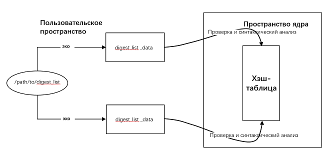
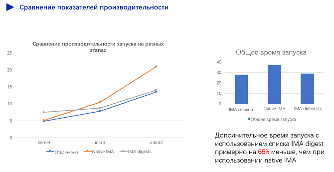

# Доверенные вычисления

\[\[toc]]

## Основы понятия доверенных вычислений

### Доверенные вычисления

Различные международные организации предлагают разные определения «доверенный».

1. Trusted Computing Group (TCG):
   
   Объект, которому доверяют, всегда достигает желаемой цели ожидаемым способом.

2. Международная организация по стандартизации (ISO) и Международная электротехническая комиссия (МЭК) (1999):
   
   Участвующие в вычислениях компоненты, операции или процессы предсказуемы в любых условиях и устойчивы к вирусам и, в определенной степени, к физическим помехам.

3. Технический комитет компьютерного общества IEEE по доверенным вычислениям:
   
   «Доверенный» означает, что надежность предоставляемых компьютерной системой сервисов можно доказать, и это понятие в основном связано с надежностью и доступностью системы.

В целом «доверенный» означает, что система функционирует в соответствии с заранее определенными схемой и политикой.

Доверенная вычислительная система состоит из корня доверия, надежной аппаратной платформы, операционной системы (ОС) и приложения. Основная идея системы состоит в том, чтобы сначала создать доверенную вычислительную базу (Trusted Computing Base; TCB), а затем создать доверенную цепочку, в которую входит аппаратная платформа, ОС и приложение. В цепочке доверия аутентификация осуществляется, начиная от корневого уровня и далее последовательно затрагивает все уровни. Таким образом, создается безопасная и надежная вычислительная среда.


В отличие от традиционного механизма безопасности, который устраняет вирусы без решения основной причины проблемы, доверенные вычисления базируются на механизме белого списка, согласно которому в системе могут работать только получившие на это разрешение ядра, модули ядра и приложения. Система отклоняет запросы на выполнение неизвестной или измененной программы.

## Архитектура измерения целостности ядра

### Обзор

#### IMA

Архитектура измерения целостности (Integrity Measurement Architecture; IMA) представляет собой одну из подсистем ядра. IMA измеряет файлы, доступные через системы **execve()**, **mmap()**, **open()**, применяя политики, заданные пользователем. Результат измерений можно использовать для **локальной или удаленной аттестации** или сравнить с существующим эталонным значением для **контроля доступа к файлам**.

Согласно определению на Wiki-ресурсе, функция подсистемы проверки целостности ядра включает три части:

- Измерение: функция обнаруживает случайные или вредоносные изменения файлов удаленно либо локально.
- Оценка: функция измеряет файл и сравнивает его с эталонным значением, хранящимся в расширенном атрибуте, а таким образом проверяется целостность локального файла.
- Аудит: функция записывает результаты измерений в системные журналы для последующего аудита.

Фигурально измерение IMA можно сравнить с действиями наблюдателя, который только фиксирует изменения, не вмешиваясь в процесс, а оценку IMA можно сравнить с действиями серьезного охранника, который отказывает в любом несанкционированном доступе к программам.

#### EVM

Расширенный модуль проверки (Extended Verification Module; EVM) используется для расчета хеш-значения на основе расширенных атрибутов безопасности файла в системе, включая **sicurezza.ima** и **sicurezza.selinux**. Затем это значение подписывается ключом, хранящимся в TPM или других доверенных средах. Значение подписи хранится в **sicurezza.evm**, и его нельзя подделать путем взлома. В случае обнаружения подделки проверка подписи не проходит при повторном доступе к файлу.

Таким образом, EVM обеспечивает автономную защиту расширенных атрибутов безопасности методом расчета хеш-значений атрибутов с последующим подписанием и хранением их в **security.evm**.

#### IMA Digest Lists

IMA Digest Lists — дайджест-списки IMA — это усовершенствование первоначального механизма защиты проверкой целостности ядра, предоставляемого сообществом openEuler. Он заменяет предыдущий механизм.

Дайджест-списки представляют собой бинарные файлы данных в специальном формате. В каждом таком списке, который соответствует одному пакету RPM, фиксируются хеш-значения защищенных файлов (исполняемые файлы и файлы динамической библиотеки) в пакете RPM.

После правильной настройки параметров запуска ядро поддерживает таблицу хеш-значений (невидимую для пользователей) и предоставляет интерфейсы (**digest\_list\_data** и **digest\_list\_data\_del**), которые обновляют данную таблицу с использованием **securityfs**. Дайджест-списки подписываются секретным ключом во время создания. При выгрузке в ядро через интерфейс дайджест-списки проверяются открытым ключом в ядре.



Если функция оценки IMA включена, при каждом получении доступа к исполняемому файлу или файлу динамической библиотеки происходит вызов функции перехвата (hook) в режиме ядра для вычисления хеш-значений содержимого файла и расширенных атрибутов с последующим поиском в хеш-таблице ядра. Если вычисленные хеш-значения совпадают со значениями в таблице, дается разрешение на выполнение файла. В противном случае доступ будет запрещен.


Расширение IMA Digest Lists, предоставляемое ядром openEuler, повышает безопасность, производительность и удобство использования в сравнении с исходным механизмом IMA ядра, упрощая внедрение механизма защиты методом проверки целостности в рабочую среду.

- **Полная цепочка доверия для высокой безопасности**
  
  Исходный механизм IMA требует, чтобы расширенный атрибут файла был заранее сгенерирован и отмечен в действующей сети. При доступе к файлу расширенный атрибут файла используется в качестве эталонного значения, что делает цепочку доверия неполной.
  
  Механизм-расширение IMA Digest Lists сохраняет эталонное хеш-значение файла в пространстве ядра. Во время компоновки данное эталонное значение файла передается в освобожденный пакет RPM в виде дайджест-списка. Во время установки пакета RPM этот дайджест-список импортируется, а подпись проверяется, и таким образом, эталонное значение гарантированно поступает от издателя программного обеспечения, формируя полную цепочку доверия.

- **Превосходная производительность**
  
  Из-за низкой скорости чипа доверенного платформенного модуля (Trusted Platform Module; TPM) операция расширения PCR становится узким местом производительности в сценарии измерений IMA. Чтобы устранить это узкое место, механизм-расширение Digest Lists убирает ненужные операции по расширению PCR без ущерба безопасности, повышая, при этом, производительность на 65% по сравнению с исходным механизмом IMA.
  
  В сценарии оценки IMA механизм-расширение Digest Lists выполняет проверку подписи на этапе запуска, чтобы подпись не проверялась при каждом доступе к файлу. Это повышает производительность доступа к файлам на 20% на этапе работы по сравнению с исходным сценарием оценки IMA.

- **Быстрое развертывание и беспроблемное обновление**
  
  При первом развертывании исходного механизма IMA или обновлении программного обеспечения необходимо перейти в режим исправлений, вручную отметить расширенные атрибуты файла и затем перезапустить систему, чтобы войти в режим принудительного применения изменений. Это обеспечит нормальный доступ к установленной программе.
  
  Механизм-расширение Digest Lists можно использовать сразу после завершения установки. Пакет RPM также можно установить или обновить в режиме принудительного применения без перезагрузки системы или вручную отметить расширенные атрибуты файла. Таким образом, от пользователей требуются минимальные усилия во время операции, что позволяет быстро развертывать и беспроблемно обновлять систему в действующей сети.

Примечание. Расширение IMA Digest Lists заранее проводит проверку подписи исходного механизма IMA до этапа запуска. Это ведет к убеждению, что память в пространстве ядра нельзя повредить или изменить. На деле же, результат защиты целостности памяти ядра посредством механизма IMA зависит и от других механизмов защиты (безопасный запуск модуля ядра и измерение динамической памяти).

И исходный механизм IMA, и механизм-расширение IMA Digest Lists являются лишь звеньями в цепочке доверия в концепции доверенных вычислений и не могут обеспечить безопасность системы самостоятельно. Обеспечение безопасности всегда требует системного подхода с применением средств всесторонней защиты.

### Ограничения

1. Текущий режим оценки IMA защищает только неизменяемые файлы в системе, включая исполняемые файлы и файлы динамической библиотеки.
2. IMA проводит измерение с целью проверки на целостность на прикладном уровне. Уровень безопасности IMA зависит от надежности предыдущих этапов.
3. В настоящее время IMA не поддерживает импорт дайджест-списков сторонних приложений.
4. Журнал запуска может содержать `Unable to open file: /etc/keys/x509_ima.der`. Эта ошибка передается от сообщества разработчиков ПО с открытым исходным кодом и не влияет на использование функции IMA Digest Lists.
5. В версии ARM ошибки аудита могут возникать, когда для IMA включен режим журнала. Это происходит в связи с тем, что modprobe загружает модуль ядра до импорта дайджест-списков, но не влияет на работу обычных функций.

### Сценарии применения

#### Измерение IMA

Цель измерений IMA заключается в выявлении непредвиденных или вредоносных изменений системных файлов. Результат измерений может использоваться для локальной или удаленной аттестации.

Если в системе существует чип TPM, результат измерения заносится в указанный регистр PCR чипа TPM. В силу однонаправленности регистра-расширения PCR и аппаратной защиты чипа TPM пользователь не может изменить расширенный результат измерения, что обеспечивает подлинность результата.

Пользователь может настроить область файла и условия инициирования измерений IMA с помощью политики IMA.

По умолчанию механизм IMA отключен. Однако система выполняет поиск файла политики **ima-policy** по пути `/etc/ima/`. Найдя файл, система измеряет файлы в системе в соответствии с политикой во время запуска. Если пользователь не планирует вручную компилировать файл политики, можно сконфигурировать `ima_policy=tcb` в параметрах запуска с помощью политики по умолчанию. Подробную информацию о параметрах политики см. в разделе *Параметры запуска IMA* в *Приложении*.

Вы можете проверить текущую загруженную политику IMA в файле `/sys/kernel/security/ima/policy`. Журнал измерений IMA включен в файл `/sys/kernel/security/ima/ascii_runtime_measurements`, см. следующий рисунок:

```shell
$ head /sys/kernel/security/ima/ascii_runtime_measurements
10 ddee6004dc3bd4ee300406cd93181c5a2187b59b ima-ng sha1:9797edf8d0eed36b1cf92547816051c8af4e45ee boot_aggregate
10 180ecafba6fadbece09b057bcd0d55d39f1a8a52 ima-ng sha1:db82919bf7d1849ae9aba01e28e9be012823cf3a /init
10 ac792e08a7cf8de7656003125c7276968d84ea65 ima-ng sha1:f778e2082b08d21bbc59898f4775a75e8f2af4db /bin/bash
10 0a0d9258c151356204aea2498bbca4be34d6bb05 ima-ng sha1:b0ab2e7ebd22c4d17d975de0d881f52dc14359a7 /lib64/ld-2.27.so
10 0d6b1d90350778d58f1302d00e59493e11bc0011 ima-ng sha1:ce8204c948b9fe3ae67b94625ad620420c1dc838 /etc/ld.so.cache
10 d69ac2c1d60d28b2da07c7f0cbd49e31e9cca277 ima-ng sha1:8526466068709356630490ff5196c95a186092b8 /lib64/libreadline.so.7.0
10 ef3212c12d1fbb94de9534b0bbd9f0c8ea50a77b ima-ng sha1:f80ba92b8a6e390a80a7a3deef8eae921fc8ca4e /lib64/libc-2.27.so
10 f805861177a99c61eabebe21003b3c831ccf288b ima-ng sha1:261a3cd5863de3f2421662ba5b455df09d941168 /lib64/libncurses.so.6.1
10 52f680881893b28e6f0ce2b132d723a885333500 ima-ng sha1:b953a3fa385e64dfe9927de94c33318d3de56260 /lib64/libnss_files-2.27.so
10 4da8ce3c51a7814d4e38be55a2a990a5ceec8b27 ima-ng sha1:99a9c095c7928ecca8c3a4bc44b06246fc5f49de /etc/passwd
```

Содержание каждой записи слева направо:

1. PCR: регистр PCR для хранения расширения результатов измерений (значение по умолчанию 10. Этот регистр действителен только тогда, когда в системе установлен чип TPM.)
2. Хеш-значение шаблона: значение хеш-функции, которое, в конечном счете, используется как расширение и содержит хеш-значение содержимого файла, длину и значение пути файла.
3. Шаблон: шаблон расширенного значения измерения, например **ima-ng**.
4. Хеш-значение содержимого файла: значение хеш-функции, измеренное в отношении содержимого файла.
5. Путь к файлу: путь к измеренному файлу.

#### Оценка IMA

Цель оценки IMA заключается в контроле доступа к локальным файлам путем сравнения эталонного значения со стандартным эталонным значением.

Механизм IMA сохраняет эталонные значения, полученные во время измерения для проверки целостности файлов, с помощью атрибутов модуля безопасности **security.ima** и **security.evm**.

- **sicurezza.ima**: хранит хеш-значение содержимого файла.
- **sicurezza.evm**: хранит подпись хеш-значения расширенного атрибута файла.

При попытке получения доступа к защищенному файлу в ядре запускается перехват (hook), который проверяет целостность расширенных атрибутов и содержимого файла.

1. Значение подписи в расширенном атрибуте файла **sicurezza.evm** проверяется с помощью открытого ключа в наборе ключей ядра и затем сравнивается с хеш-значением расширенного атрибута текущего файла. Если они совпадают, расширенный атрибут файла является полным (включая **security.ima**).
2. Если расширенный атрибут файла полный, система сравнивает расширенный атрибут файла **sicurezza.ima** со значением дайджеста текущего содержимого файла. Если они совпадают, система предоставляет доступ к файлу.

Аналогично с помощью политики IMA пользователь может настроить область файла и условия инициирования оценки IMA.

#### IMA Digest Lists

В настоящее время расширение IMA Digest Lists поддерживает следующие три комбинации параметров запуска:

* Режим измерений IMA:
  
  ```shell
  ima_policy=exec_tcb ima_digest_list_pcr=11
  ```

* Режим журнала оценки IMA + режим измерений IMA:
  
  ```shell
  ima_template=ima-sig ima_policy="exec_tcb|appraise_exec_tcb|appraise_exec_immutable" initramtmpfs ima_hash=sha256 ima_appraise=log evm=allow_metadata_writes evm=x509 ima_digest_list_pcr=11 ima_appraise_digest_list=digest
  ```

* Режим принудительной оценки IMA + режим измерений IMA:
  
  ```shell
  ima_template=ima-sig ima_policy="exec_tcb|appraise_exec_tcb|appraise_exec_immutable" initramtmpfs ima_hash=sha256 ima_appraise=enforce-evm evm=allow_metadata_writes evm=x509 ima_digest_list_pcr=11 ima_appraise_digest_list=digest
  ```

### Процедура

#### Первоначальное развертывание в сценарии с исходным механизмом IMA

При первом запуске системы необходимо настроить следующие параметры запуска:

```shell
ima_appraise=fix ima_policy=appraise_tcb
```

В режиме `fix` систему можно запустить, если отсутствует эталонное значение. `appraise_tcb` соответствует политике IMA. Подробнее см. *Параметры запуска IMA* в *Приложении*.

Далее необходимо получить доступ ко всем файлам, которые требуют проверки, чтобы добавить к ним расширенные атрибуты IMA:

```shell
$ time find / -fstype ext4 -type f -uid 0 -exec dd if='{}' of=/dev/null count=0 status=none \;
```

Этот процесс занимает определенное время. После выполнения команды можно увидеть отмеченное эталонное значение в расширенных атрибутах защищенного файла.

```shell
$ getfattr -m - -d /sbin/init
# file: sbin/init
security.ima=0sAXr7Qmun5mkGDS286oZxCpdGEuKT
security.selinux="system_u:object_r:init_exec_t"
```

Настройте следующие параметры запуска и перезапустите систему:

```shell
ima_appraise=enforce ima_policy=appraise_tcb
```

#### Первоначальное развертывание в сценарии с механизмом Digest Lists

1. Настройте параметры ядра для перехода в режим журнала.
   
   Чтобы отредактировать файл `/boot/efi/EFI/euleros/grub.cfg`, добавьте следующие параметры:
   
   ```shell
   ima_template=ima-sig ima_policy="exec_tcb|appraise_exec_tcb|appraise_exec_immutable" initramtmpfs ima_hash=sha256 ima_appraise=log evm=allow_metadata_writes evm=x509 ima_digest_list_pcr=11 ima_appraise_digest_list=digest
   ```
   
   Выполните команду `reboot` для перезапуска системы и перехода в режим журнала. В этом режиме включена проверка целостности, но систему можно запустить даже в случае сбоя проверки.

2. Установите пакет с зависимостями.
   
   Выполните команду **yum** для установки **digest-list-tools** и **ima-evm-utils**. Убедитесь, что версии не ранее следующих:
   
   ```shell
   $ yum install digest-list-tools ima-evm-utils
   $ rpm -qa | grep digest-list-tools
   digest-list-tools-0.3.93-1.oe1.x86_64
   $ rpm -qa | grep ima-evm-utils
   ima-evm-utils-1.2.1-9.oe1.x86_64
   ```

3. Если пакет **plymouth** установлен, необходимо добавить `-a` в конец команды **cp** в строке 147 в файле скрипта `/usr/libexec/plymouth/plymouth-populate-initrd`:
   
   ```shell
       ...
       ddebug "Installing $_src"
    cp -a --sparse=always -pfL "$PLYMOUTH_SYSROOT$_src" "${initdir}/$target"
   }
   ```

4. Выполните `dracut`, чтобы повторно сгенерировать **initrd**:
   
   ```shell
   $ dracut -f -e xattr
   ```
   
   В файле `/boot/efi/EFI/euleros/grub.cfg` замените **ima\_appraise=log** на **ima\_appraise=enforce-evm**.
   
   ```shell
   ima_template=ima-sig ima_policy="exec_tcb|appraise_exec_tcb|appraise_exec_immutable" initramtmpfs ima_hash=sha256 ima_appraise=enforce-evm evm=allow_metadata_writes evm=x509 ima_digest_list_pcr=11 ima_appraise_digest_list=digest
   ```
   
   Выполните команду **reboot**, чтобы завершить первоначальное развертывание.

#### Сборка дайджест-списков на OBS

Open Build Service (OBS) — это система компиляции, которая впервые использовалась для сборки пакетов программного обеспечения в openSUSE. Система поддерживает распределенную компиляцию с привлечением множества архитектур.

Перед сборкой дайджест-списка убедитесь, что в вашем проекте содержатся следующие пакеты RPM от openEuler:

* digest-list-tools
* pesign-obs-integration
* selinux-policy
* rpm
* openEuler-rpm-config

Добавьте **Project Config** в разрабатываемый проект:

```shell
Preinstall: pesign-obs-integration digest-list-tools selinux-policy-targeted
Macros:
%__brp_digest_list /usr/lib/rpm/openEuler/brp-digest-list %{buildroot}
:Macros
```

* В раздел **Preinstall** добавлено следующее содержимое: **digest-list-tools** для создания дайджест-списка; **pesign-obs-integration** для генерирования подписи дайджест-списка; **selinux-policy-targeted** для обеспечения корректности метки SELinux в среде при создании дайджест-списка.
* Определите макрос **%\_\_brp\_digest\_list** в Macros. Этот макрос программное обеспечение RPM запускает, чтобы создать дайджест-список для скомпилированного двоичного файла на этапе сборки. Макрос может использоваться в качестве ключа, который контролирует, создан или не создан дайджест-список в проекте.

После завершения настройки OBS автоматически выполняет полную сборку. Обычно в пакет программного обеспечения добавляются следующие два файла:

* **/etc/ima/digest\_lists/0-metadata\_list-compact-\[package name]-\[version number]**
* **/etc/ima/digest\_lists.tlv/0-metadata\_list-compact\_tlv-\[package name]-\[version number]**

#### Сборка дайджест-списков на Koji

Koji — это система компиляции сообщества Fedora. Сообщество openEuler будет поддерживать Koji в дальнейшем.

### Вопросы и ответы

1. Почему не удается запустить систему или выполнить команды, или не работают службы после запуска системы в режиме принудительного применения?
   
   В режиме принудительного применения IMA контролирует доступ к файлам. Если содержимое или расширенные атрибуты файла, к которому осуществляется доступ, неполные, в доступе будет отказано. Систему нельзя запустить, если не выполняются ключевые команды, влияющие на запуск системы.
   
   Проверьте наличие следующих проблем:
   
   * **Убедитесь, что дайджест-список добавлен в initrd.**
     
     Убедитесь, что выполняется команда **dracut**, которая добавляет дайджест-список в ядро во время первоначального развертывания. Если дайджест-список не добавлен в **initrd**, его нельзя импортировать во время запуска. В результате происходит сбой запуска.
   
   * **Убедитесь, что используется официальный пакет RPM.**
     
     В неофициальном пакете RPM может не быть дайджест-списка, или секретный ключ для его подписания не соответствует открытому ключу, используемому для проверки подписи в ядре. В результате дайджест-список невозможно импортировать в ядро.
   
   Если причина неясна, войдите в режим журнала и найдите причину в журнале ошибок:
   
   ```shell
   $ dmesg | grep appraise
   ```

2. Почему контроль доступа не выполняется в отношении системных файлов в режиме принудительного применения?
   
   Если система не выполняет контроль доступа к файлу, убедитесь в корректности настроек политики IMA в параметрах запуска:
   
   ```shell
   $ cat /proc/cmdline
   ...ima_policy=exec_tcb|appraise_exec_tcb|appraise_exec_immutable...
   ```
   
   Убедитесь, что политика IMA вступила в силу в текущем ядре, выполнив следующую команду:
   
   ```shell
   $ cat /sys/kernel/security/ima/policy
   ```
   
   Если файл политики пуст, значит, политика не установлена. В этом случае система не выполняет контроль доступа.

3. Требуется ли вручную запускать команду **dracut** после завершения первоначального развертывания, чтобы сгенерировать **initrd** после установки, обновления или удаления пакета программного обеспечения?
   
   Нет. Подключаемый модуль **digest\_list.so**, включенный в пакет RPM, автоматически обновляет дайджест-список на уровне детализации пакета RPM, в результате пользователям не требуется знать о дайджест-списке.

### Приложение

#### Описание интерфейса securityfs IMA

Исходный механизм IMA предоставляет следующие интерфейсы securityfs:

> Примечание. Следующие пути к интерфейсу находятся в каталоге `/sys/kernel/security/`.

| Путь                             | Разрешение | Описание                                                     |
| -------------------------------- | ---------- | ------------------------------------------------------------ |
| ima/policy                       | 600        | Интерфейс политики IMA                                       |
| ima/ascii\_runtime\_measurement  | 440        | Результат измерения IMA в формате кода ASCII                 |
| ima/binary\_runtime\_measurement | 440        | Результат измерения IMA в двоичном формате                   |
| ima/runtime\_measurement\_count  | 440        | Статистика результатов измерений                             |
| ima/violations                   | 440        | Количество конфликтов в результатах измерений IMA            |
| evm                              | 660        | Режим EVM, то есть режим проверки расширенных атрибутов файлов на целостность |
Значения `/sys/kernel/security/evm` следующие:

* 0: режим EVM не инициализирован.
* 1: для проверки расширенных атрибутов на целостность используется HMAC (симметричное шифрование).
* 2: для проверки расширенных атрибутов на целостность используется подпись открытого ключа (асимметричное шифрование).
* 6: отключение проверки расширенных атрибутов на целостность (этот режим используется для openEuler).

Дополнительные интерфейсы **securityfs**, предоставляемые расширением IMA Digest Lists:

| Путь                        | Разрешение | Описание                                                    |
| --------------------------- | ---------- | ----------------------------------------------------------- |
| ima/digests\_count          | 440        | Общее количество дайджестов (IMA+EVM) в хэш-таблице системы |
| ima/digest\_list\_data      | 200        | Новые интерфейсы в дайджест-списке                          |
| ima/digest\_list\_data\_del | 200        | Интерфейсы, удаленные из дайджест-списка                    |
#### Синтаксис политики IMA

Каждый оператор политики IMA должен начинаться с ключевого слова **action**, за которым следует условие фильтрации:

- **action**: конкретное действие политики. Для одной политики можно выбрать только одно действие.
  
  > Примечание. Слово **action** можно опустить и сразу ввести **dont\_measure** вместо **action=dont\_measure.**

- **func**: тип файла, подлежащего измерению или аутентификации. Часто используется вместе с **mask**. Для одной политики можно выбрать только один параметр **func**.
  
  - **FILE\_CHECK** может использоваться только вместе с **MAY\_EXEC**, **MAY\_WRITE** и **MAY\_READ**.
  - **MODULE\_CHECK**, **MMAP\_CHECK** и **BPRM\_CHECK** могут использоваться только вместе с **MAY\_EXEC**.
  - Комбинация без учета вышеописанных сочетаний не вступает в силу.

- **mask**: операция, с помощью которой будут измеряться или оцениваться файлы. Для одной политики можно выбрать только один параметр **mask**.

- **fsmagic**: шестнадцатеричный магический код (magic number) типа файловой системы, который определен в файле `/usr/include/linux/magic.h`.
  
  > Примечание. По умолчанию все файловые системы проходят измерение, если не используется отметка **dont\_measure/dont\_appraise**, означающая, что файловая система не подлежит измерению.

- **fsuid**: UUID системного устройства. Значение представляет собой шестнадцатеричную строку из 16 символов.

- **objecttype**: тип файла. Для одной политики можно выбрать только один параметр типа файла.
  
  > Примечание: **objtype** имеет более мелкую гранулярность, чем **func**. Например, **obj\_type=nova\_log\_t** указывает на файл журнала nova.

- **uid**: идентификатор пользователя, который выполняет операции с файлом. Для одной политики можно выбрать только один параметр **uid**.

- **fowner**: идентификатор владельца файла. Для одной политики можно выбрать только один параметр **fowner**.

Значения и описание ключевых слов:

| Ключевое слово| Значение| Описание|
|----------|----------|----------|
| action| measure| Включение измерений IMA|
| | dont\_measure| Отключение измерений IMA|
| | appraise| Включение оценки IMA|
| | dont\_appraise| Отключение оценки IMA|
| | audit| Включение аудита|
| func| FILE\_CHECK| Открываемый файл|
| | MODULE\_CHECK| Загружаемый файл модуля ядра|
| | MMAP\_CHECK| Файл динамической библиотеки, которому должно соответствовать определенное пространство памяти, занимаемое процессом|
| | BRPM\_CHECK| Исполняемый файл (за исключением файлов скриптов, открытых программами, например `/bin/hash`)|
| | POLICY\_CHECK| Файл, загружаемый в дополнение к политике IMA|
| | FIRMWARE\_CHECK| Встроенное программное обеспечение, загружаемое в память|
| | DIGEST\_LIST\_CHECK| Файл дайджест-списка, загружаемый в ядро|
| | KEXEC\_KERNEL\_CHECK| Новое ядро, загружаемое через kexec из-под текущего работающего ядра|
| mask| MAY\_EXEC| Исполнение файла|
| | MAY\_WRITE| Запись данных в файл. Эту операцию не рекомендуется выполнять, поскольку она ограничена такими механизмами открытого исходного кода, как echo и vim (суть изменения заключается в создании временного файла с последующим переименованием). Измерение IMA со значением **MAY\_WRITE** не запускается при каждом изменении файла.|
| | MAY\_READ| Чтение файла|
| | MAY\_APPEND| Расширение атрибутов файлов|
| fsmagic| fsmagic=xxx| Шестнадцатеричный магический код типа файловой системы |
| fsuuid| fsuuid=xxx| UUID системного устройства. Значение представляет собой шестнадцатеричную строку из 16 символов.|
| fowner| fowner=xxx| Идентификатор владельца файла|
| uid| uid=xxx| Идентификатор пользователя, который работает с файлом |
| obj\_type| obj\_type=xxx\_t| Тип файла (на основе тега SELinux)|
| pcr| pcr=<num>| Выбор PCR, используемого для расширения значений измерений в TPM. Значение по умолчанию — 10.|
| appraise\_type| imasig| Оценка IMA на основе подписей|
| | meta\_immutable | Оценка расширенных атрибутов файла на основе подписей (с поддержкой дайджест-списка). |
> Примечание. Значение **PATH\_CHECK** эквивалентно **FILE\_CHECK**, значение **FILE\_MMAP** эквивалентно **MMAP\_CHECK**. В данной таблице они не приведены.

#### Параметры запуска исходного механизма IMA

В следующей таблице перечислены параметры запуска ядра для исходного механизма IMA.

| Параметр           | Значение      | Описание                                                     |
| ------------------ | ------------- | ------------------------------------------------------------ |
| ima\_appraise      | off           | Отключение режима оценки IMA. В этом случае при доступе к файлу проверка на целостность не выполняется, и для файла не генерируется никаких новых эталонных значений. |
|                    | enforce       | Включение режима принудительного применения оценки IMA для выполнения проверки на целостность во время доступа к файлу. То есть вычисляется дайджест-значение файла и затем сравнивается с исходным значением. Если результат сравнения не соответствует, доступ к файлам отклоняется. В этом случае механизм IMA генерирует новое эталонное значение для нового файла. |
|                    | fix           | Включение режима восстановления IMA. В этом режиме можно обновить эталонное значение защищенного файла. |
|                    | log           | Включение режима журнала для оценки IMA при выполнении проверки на целостность во время доступа к файлу. Однако команды могут выполняться даже в случае сбоя проверки, и записываются только журналы. |
| ima\_policy        | tcb           | Измерение всех исполняемых файлов, всех сопоставленных динамических библиотек, всех импортированных модулей ядра и всех загруженных драйверов устройства. Измеряется также характер чтения файлов пользователя **root**. |
|                    | appraise\_tcb | Оценка всех файлов, владельцем которых является пользователь **root**. |
|                    | secure\_boot  | Оценка импортированных модулей ядра, загруженных драйверов устройства, новых ядер, загруженных через kexec из-под текущего работающего ядра, политик IMA. Обязательным условием является наличие у данных файлов подписей IMA. |
| ima\_tcb           | \--           | Параметр эквивалентен **ima\_policy=tcb**.                   |
| ima\_appraise\_tcb | \--           | Параметр эквивалентен **ima\_policy=appraise\_tcb**.         |
| ima\_hash          | sha1/md5/...  | Дайджест-алгоритм IMA. Значение по умолчанию — **sha1**.     |
| ima\_template      | ima           | Шаблон для расширения значений измерений IMA                 |
|                    | ima-ng        | Шаблон для расширения значений измерений IMA                 |
|                    | ima-sig       | Шаблон для расширения значений измерений IMA                 |
| integrity\_audit   | 0             | Базовая информация, подлежащая проверке на целостность (по умолчанию) |
|                    | 1             | Дополнительная информация, подлежащая проверке на целостность |
> Примечание. Параметр **ima\_policy** может иметь несколько значений одновременно, например **ima\_policy=tcb\|appraise\_tcb.** После запуска системы ее политика IMA представляет собой сумму политик по двум параметрам.

Политика IMA для параметра запуска `ima_policy=tcb`:

```
# PROC_SUPER_MAGIC = 0x9fa0
dont_measure fsmagic=0x9fa0
# SYSFS_MAGIC = 0x62656572
dont_measure fsmagic=0x62656572
# DEBUGFS_MAGIC = 0x64626720
dont_measure fsmagic=0x64626720
# TMPFS_MAGIC = 0x01021994
dont_measure fsmagic=0x1021994
# DEVPTS_SUPER_MAGIC=0x1cd1
dont_measure fsmagic=0x1cd1
# BINFMTFS_MAGIC=0x42494e4d
dont_measure fsmagic=0x42494e4d
# SECURITYFS_MAGIC=0x73636673
dont_measure fsmagic=0x73636673
# SELINUX_MAGIC=0xf97cff8c
dont_measure fsmagic=0xf97cff8c
# SMACK_MAGIC=0x43415d53
dont_measure fsmagic=0x43415d53
# CGROUP_SUPER_MAGIC=0x27e0eb
dont_measure fsmagic=0x27e0eb
# CGROUP2_SUPER_MAGIC=0x63677270
dont_measure fsmagic=0x63677270
# NSFS_MAGIC=0x6e736673
dont_measure fsmagic=0x6e736673 
measure func=MMAP_CHECK mask=MAY_EXEC 
measure func=BPRM_CHECK mask=MAY_EXEC 
measure func=FILE_CHECK mask=MAY_READ uid=0 
measure func=MODULE_CHECK 
measure func=FIRMWARE_CHECK
```

Политика IMA для параметра запуска `ima_policy=tcb_appraise`:

```
# PROC_SUPER_MAGIC = 0x9fa0
dont_appraise fsmagic=0x9fa0
# SYSFS_MAGIC = 0x62656572
dont_appraise fsmagic=0x62656572
# DEBUGFS_MAGIC = 0x64626720 
dont_appraise fsmagic=0x64626720 
# TMPFS_MAGIC = 0x01021994
dont_appraise fsmagic=0x1021994
# RAMFS_MAGIC
dont_appraise fsmagic=0x858458f6 
# DEVPTS_SUPER_MAGIC=0x1cd1
dont_appraise fsmagic=0x1cd1
# BINFMTFS_MAGIC=0x42494e4d
dont_appraise fsmagic=0x42494e4d 
# SECURITYFS_MAGIC=0x73636673
dont_appraise fsmagic=0x73636673
# SELINUX_MAGIC=0xf97cff8c
dont_appraise fsmagic=0xf97cff8c 
# SMACK_MAGIC=0x43415d53
dont_appraise fsmagic=0x43415d53 
# NSFS_MAGIC=0x6e736673
dont_appraise fsmagic=0x6e736673 
# CGROUP_SUPER_MAGIC=0x27e0eb
dont_appraise fsmagic=0x27e0eb 
# CGROUP2_SUPER_MAGIC=0x63677270
dont_appraise fsmagic=0x63677270 
appraise fowner=0
```

Политика IMA для параметра запуска `ima_policy=secure_boot`:

```
appraise func=MODULE_CHECK appraise_type=imasig 
appraise func=FIRMWARE_CHECK appraise_type=imasig 
appraise func=KEXEC_KERNEL_CHECK appraise_type=imasig 
appraise func=POLICY_CHECK appraise_type=imasig
```

#### Параметры запуска в механизме IMA Digest List

Параметры запуска ядра, добавленные в дайджест-список IMA:

| Параметр                    | Значение                  | Описание                                                     |
| --------------------------- | ------------------------- | ------------------------------------------------------------ |
| integrity                   | 0                         | Отключение функции IMA (по умолчанию)                        |
|                             | 1                         | Включение функции IMA                                        |
| ima\_appraise               | off                       | Отключение режима оценки IMA                                 |
|                             | enforce-evm               | Включение режима принудительной оценки IMA при выполнении проверки на целостность во время доступа к файлу. |
| ima\_appraise\_digest\_list | digest                    | Если режим EVM отключен, для оценки IMA используется абстрактный список. Абстрактный список защищает как содержимое, так и расширенные атрибуты файла. |
|                             | digest-nometadata         | Если дайджест-значение EVM не существует, проверка на целостность выполняется только на основе дайджест-значения IMA (расширенный атрибут файла не защищен). |
| evm                         | fix                       | Позволяет вносить любые изменения в расширенный атрибут (даже если изменение ведет к невозможности проверки расширенного атрибута на целостность). |
|                             | ignore                    | Позволяет вносить изменения в расширенный атрибут, только если он не существует или некорректен. |
| ima\_policy                 | exec\_tcb                 | Политика измерений IMA. Для получения подробной информации см. следующее описание политики. |
|                             | appraise\_exec\_tcb       | Политика оценки IMA. Для получения подробной информации см. следующее описание политики. |
|                             | appraise\_exec\_immutable | Политика оценки IMA. Для получения подробной информации см. следующее описание политики. |
| ima\_digest\_list\_pcr      | 11                        | Используется PCR 11 вместо PCR 10, а для измерения используется только дайджест-список. |
|                             | +11                       | Измерение PCR 10 зарезервировано. Результаты измерений записываются в чип TPM, если он доступен. |
| initramtmpfs                | \--                       | Поддержка **tmpfs**.                                         |
Политика IMA для параметра запуска `ima_policy=exec_tcb`:

```
dont_measure fsmagic=0x9fa0 
dont_measure fsmagic=0x62656572 
dont_measure fsmagic=0x64626720 
dont_measure fsmagic=0x1cd1 
dont_measure fsmagic=0x42494e4d 
dont_measure fsmagic=0x73636673 
dont_measure fsmagic=0xf97cff8c 
dont_measure fsmagic=0x43415d53 
dont_measure fsmagic=0x27e0eb 
dont_measure fsmagic=0x63677270 
dont_measure fsmagic=0x6e736673 
measure func=MMAP_CHECK mask=MAY_EXEC 
measure func=BPRM_CHECK mask=MAY_EXEC 
measure func=MODULE_CHECK 
measure func=FIRMWARE_CHECK 
measure func=POLICY_CHECK 
measure func=DIGEST_LIST_CHECK 
measure parser
```

Политика IMA для параметра запуска `ima_policy=appraise_exec_tcb`:

```
appraise func=MODULE_CHECK appraise_type=imasig 
appraise func=FIRMWARE_CHECK appraise_type=imasig 
appraise func=KEXEC_KERNEL_CHECK appraise_type=imasig 
appraise func=POLICY_CHECK appraise_type=imasig 
appraise func=DIGEST_LIST_CHECK appraise_type=imasig 
dont_appraise fsmagic=0x9fa0 
dont_appraise fsmagic=0x62656572 
dont_appraise fsmagic=0x64626720 
dont_appraise fsmagic=0x858458f6 
dont_appraise fsmagic=0x1cd1 
dont_appraise fsmagic=0x42494e4d 
dont_appraise fsmagic=0x73636673 
dont_appraise fsmagic=0xf97cff8c 
dont_appraise fsmagic=0x43415d53 
dont_appraise fsmagic=0x6e736673 
dont_appraise fsmagic=0x27e0eb 
dont_appraise fsmagic=0x63677270
```

Политика IMA для параметра запуска `ima_policy=appraise_exec_immutable`:

```
appraise func=BPRM_CHECK appraise_type=imasig appraise_type=meta_immutable 
appraise func=MMAP_CHECK 
appraise parser appraise_type=imasig
```

#### Параметры компиляции для ядра IMA

Исходный механизм IMA предоставляет следующие параметры компиляции:

| Параметр компиляции                 | Описание                                     |
| ----------------------------------- | -------------------------------------------- |
| CONFIG\_INTEGRITY                   | Ключ компиляции IMA/EVM                      |
| CONFIG\_INTEGRITY\_SIGNATURE        | Включение проверки подписей IMA              |
| CONFIG\_INTEGRITY\_ASYMMETRIC\_KEYS | Включение проверки асимметричной подписи IMA |
| CONFIG\_INTEGRITY\_TRUSTED\_KEYRING | Активация набора ключей IMA/EVM              |
| CONFIG\_INTEGRITY\_AUDIT            | Компиляция модуля аудита IMA                 |
| CONFIG\_INTEGRITY\_AUDIT            | Компиляция модуля аудита IMA                 |
| CONFIG\_IMA                         | Ключ компиляции IMA                          |
| CONFIG\_IMA\_WRITE\_POLICY          | Обновление политики IMA на этапе выполнения  |
| CONFIG\_IMA\_MEASURE\_PCR\_IDX      | Задание номера PCR для измерений IMA         |
| CONFIG\_IMA\_LSM\_RULES             | Настройка правил LSM                         |
| CONFIG\_IMA\_APPRAISE               | Ключ компиляции для оценки IMA               |
| IMA\_APPRAISE\_BOOTPARAM            | Включение параметров запуска оценки IMA      |
| CONFIG\_EVM                         | Ключ компиляции EVM                          |
Дополнительные параметры компиляции, предоставляемые расширением IMA Digest Lists:

| Параметр компиляции  | Описание                          |
| -------------------- | --------------------------------- |
| CONFIG\_DIGEST\_LIST | Активация функции IMA Digest List |


#### Эталонные данные производительности IMA

На следующем рисунке сравнивается производительность в условиях выключенной функции IMA, включенного исходного механизма IMA и включенного механизма IMA Digest List.

