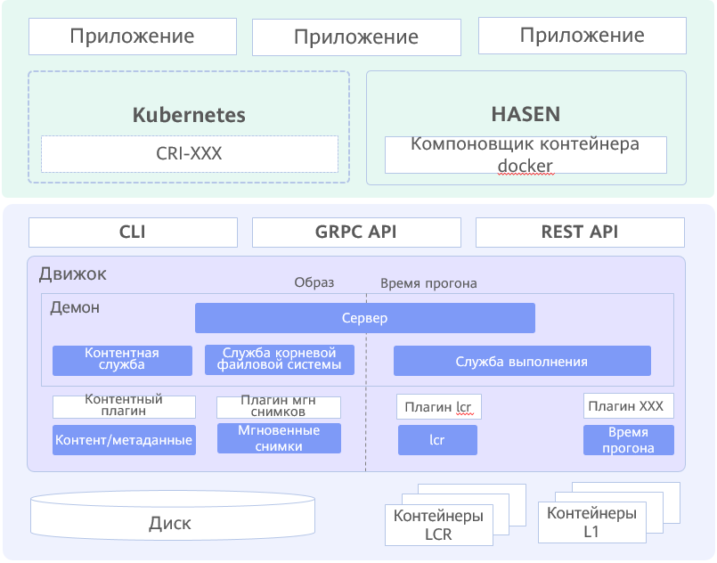

# Контейнерный движок iSulad

В сравнении с Docker, iSulad представляет собой новое контейнерное решение с унифицированной архитектурой, отвечающее различным требованиям к компьютерной технике и ИТ-оборудованию. Облегченные контейнеры реализованы посредством языка C/C++. Это интеллектуальные, быстродействующие средства, не имеющие ограничений в отношении использования аппаратного обеспечения и архитектуры. Такие контейнеры широко используются благодаря меньшему уровню шума.

На [Рис. 1](#en-us_topic_0182207099_fig10763114141217) показана унифицированная архитектура контейнера.

**Рис. 1** Унифицированная архитектура контейнера

