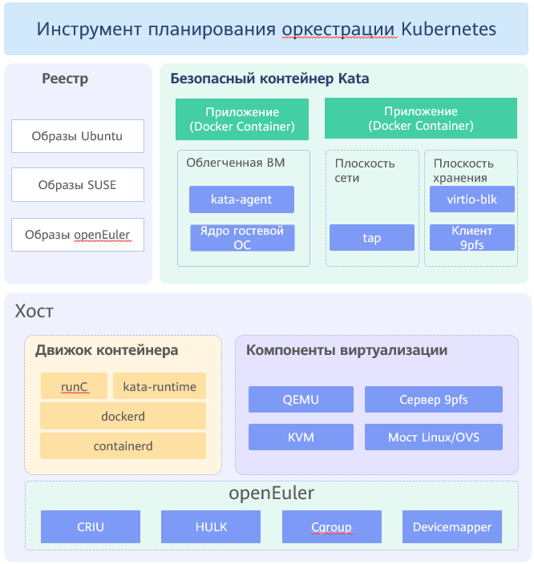

# Безопасный контейнер

## Обзор

Безопасные контейнеры органично сочетают технологии виртуализации и контейнерные технологии. По сравнению с обычным контейнером Linux, безопасный контейнер обладает улучшенной изолированностью.

В обычных контейнерах Linux для изолирования рабочей среды процессов используется пространство имен, а для ограничения ресурсов — контрольные группы cgroups. По сути, обычные контейнеры Linux совместно используют ресурсы одного ядра. Поэтому в результате намеренного или ненамеренного влияния на ядро со стороны одного контейнера затрагивается работа контейнеров на этом же хосте.

Безопасные контейнеры изолированы уровнем виртуализации. Контейнеры на одном хосте не влияют на работу друг друга.

**Рис. 1** Архитектура безопасного контейнера

Безопасные контейнеры тесно связаны с применяемой в Kubernetes концепцией объекта pod. Kubernetes устанавливает стандарт экосистемы с открытым исходным кодом для платформы управления планированием контейнеров. Стандарт определяет группу интерфейсов в среде исполнения контейнеров (CRI).

В стандартах CRI объект pod представляет собой логическую группу, состоящую из одного или нескольких контейнеров, которые планируются на совместную работу и имеют общий доступ к ресурсам механизма межпроцессного взаимодействия (IPC) и пространству сетевых имен. Выполняя роль самого маленького блока планирования, объект pod должен содержать приостановленный контейнер (pause-контейнер), а также один и более сервисных контейнеров. Жизненный цикл pause-контейнера такой же, как у объекта pod.

Облегченная виртуальная машина (ВМ) в безопасном контейнере представляет собой объект pod. Первым контейнером, запущенным в ВМ, является pause-контейнер, а контейнеры, запущенные позже, являются сервисными контейнерами.

В безопасном контейнере можно запустить отдельный контейнер или объект pod.

На [Рис. 2](#fig17734185518269) показана взаимосвязь между безопасным контейнером и периферийными компонентами.

**Рис. 2** Взаимосвязь между безопасным контейнером и периферийными компонентами  
