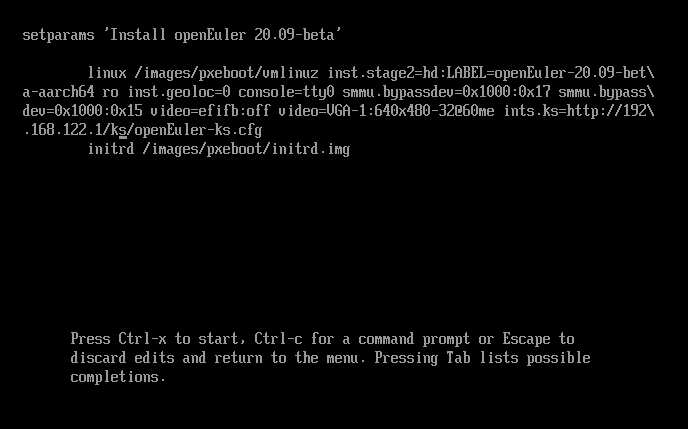

# Автоматическая установка с помощью инструмента kickstart

\[\[toc]]

## Введение

### Обзор

С помощью инструмента kickstart операционная система openEuler устанавливается автоматически одним из следующих способов:

- Полуавтоматический режим установки. Необходимо указать только местоположение файла kickstart. kickstart автоматически конфигурирует такие атрибуты операционной системы, как клавиатура, язык и разделы.
- Автоматический режим установки. Операционная система устанавливается полностью в автоматическом режиме.

### Преимущества и недостатки

В [Табл. 1](#table1388812373315) перечислены преимущества и недостатки полуавтоматического и полностью автоматического режимов установки с помощью инструмента kickstart. Выберите подходящий режим.

**Табл. 1** Преимущества и недостатки режимов

| **Режимы установки**                     | **Преимущество**                                          | **Недостаток**                                             |
| ---------------------------------------- | --------------------------------------------------------- | ---------------------------------------------------------- |
| Полуавтоматический режим установки       | Не требуется отдельная подготовка служб TFTP, PXE и DHCP. | Необходимо вручную указать местоположение файла kickstart. |
| Полностью автоматический режим установки | Операционная система устанавливается автоматически.       | Требуется настройка служб TFTP, DHCPD и PXE.               |

### Основные понятия

**Kickstart**

kickstart — это режим установки без вмешательства персонала. Его принцип заключается в записи типовых параметров, которые необходимо ввести вручную во время установки, и генерации конфигурационного файла **ks.cfg**. Во время установки программа сначала ищет конфигурационный файл **ks.cfg,** из которого получает необходимые параметры. При отсутствии подходящих параметров их необходимо настроить вручную. Если в файле kickstart содержатся все требуемые параметры, для автоматической установки необходимо указать только путь к файлу kickstart.

Инструмент kickstart позволяет выполнять установку как в полностью автоматическом, так и полуавтоматическом режимах.

**PXE**

Pre-boot Execution Environment (PXE) — это среда загрузки компьютеров с помощью сетевой карты без использования локальных носителей, которая работает в режиме сети клиент-сервер. Клиент PXE получает IP-адрес от сервера DHCP во время запуска. Загрузка и установка клиента осуществляется через сеть на основе таких протоколов, как упрощенный протокол передачи файлов (Trivial File Transfer Protocol; TFTP).

**TFTP**

TFTP используется для передачи простых файлов между клиентами и сервером.

## Инструкции по установке в полуавтоматическом режиме

### Требования к среде

Для установки операционной системы openEuler в полуавтоматическом режиме с помощью инструмента kickstart необходимо реализовать следующую среду:

- Физическая машина/виртуальная машина (подробную информацию о том, как создавать виртуальные машины, см. в документации поставщиков): это компьютер, на котором используется инструмент kickstart для автоматической установки, и компьютер, на котором установлен инструмент kickstart.
- Httpd: хранит файл запуска.
- ISO: openEuler-20.09-aarch64-dvd.iso

### Процедура

Чтобы установить операционную систему openEuler в полуавтоматическом режиме с помощью инструмента kickstart, выполните следующие шаги:

**Подготовка среды**

>  ПРИМЕЧАНИЕ:  
Перед установкой убедитесь, что межсетевой экран сервера HTTP отключен. Выполните следующую команду, чтобы отключить межсетевой экран:
> 
> ```
> iptables -F  
> ```

1. Установите и запустите службу httpd.
   
   ```
   # dnf install httpd -y
   # systemctl start httpd
   # systemctl enable httpd
   ```

2. Выполните следующую команду, чтобы подготовить файл kickstart:
   
   ```
   # mkdir /var/www/html/ks
   #vim /var/www/html/ks/openEuler-ks.cfg ===>The file can be obtained by modifying the anaconda-ks.cfg file automatically generated from openEuler.
   ====================================
   ***Modify the following information as required.***
   #version=DEVEL
   ignoredisk --only-use=sda
   autopart --type=lvm
   # Partition clearing information
   clearpart --none --initlabel
   # Use graphical install
   graphical
   # Use CDROM installation media
   cdrom
   # Keyboard layouts
   keyboard --vckeymap=cn --xlayouts='cn'
   # System language
   lang zh_CN.UTF-8
   
   # Network information
   network  --bootproto=dhcp --device=enp4s0 --ipv6=auto --activate
   network  --hostname=openeuler.com
   # Root password
   rootpw --iscrypted $6$fQE83lxEZ48Or4zc$j7/PlUMHn29yTjCD4Fi44WTZL/RzVGxJ/7MGsZMl6QfE3KjIVT7M4UrhFXbafvRq2lUddAFcyWHd5WRmXfEK20
   # Run the Setup Agent on first boot
   firstboot --enable
   # Do not configure the X Window System
   skipx
   # System services
   services --disabled="chronyd"
   # System timezone
   timezone Asia/Shanghai --isUtc--nontp
   
   %packages
   @^minimal-environment
   @standard
   
   %end
   
   %anaconda
   pwpolicy root --minlen=8 --minquality=1 --notstrict --nochanges --notempty
   pwpolicy user --minlen=8 --minquality=1 --notstrict --nochanges --emptyok
   pwpolicy luks --minlen=8 --minquality=1 --notstrict --nochanges --notempty
   %end
   
   %post
   #enable kdump
   sed  -i "s/ ro / ro crashkernel=1024M,high /" /boot/efi/EFI/openEuler/grub.cfg
   %end
   =====================================
   ```
   
   >  ПРИМЕЧАНИЕ:  
Применяется следующий способ генерирования шифрованного текста пароля:  
\# python3  
Python 3.7.0 (default, Apr  1 2019, 00:00:00)  
\[GCC 7.3.0] on linux  
Type "help", "copyright", "credits" or "license" for more information.  
\>>> import crypt  
\>>> passwd = crypt.crypt("myPasswd")  
\>>> print(passwd)  
$6$63c4tDmQGn5SDayV$mZoZC4pa9Jdt6/ALgaaDq6mIExiOO2EjzomB.Rf6V1BkEMJDcMddZeGdp17cMyc9l9ML9ldthytBEPVcnboR/0

3. Смонтируйте файл с образом ISO на диск CD-ROM компьютера, на который устанавливается ОС openEuler.
   
   Если требуется установить openEuler через NFS, укажите путь (по умолчанию **cdrom**) источника установки в файле kickstart.

**Установка системы**

1. На экране появится диалоговое окно выбора раздела для установки.
   
   1. На странице мастера установки, упомянутого в разделе [Начало установки,](./installation-guideline.html#starting-the-installation) выберите **Install openEuler 20.09** и нажмите **e**.
   
   2. Добавьте **inst.ks=http://server ip/ks/openEuler-ks.cfg** к параметрам запуска.
      
      
   
   3. Нажмите **Ctrl+x**, чтобы начать автоматическую установку.

2. Убедитесь, что установка завершена.
   
   После завершения установки система автоматически начинает загрузку. Если в качестве первого способа загрузки системы указан диск CD-ROM, экран установки откроется снова. Выключите компьютер и измените способ загрузки на загрузку приоритетно с жесткого диска.
   
   

## Инструкции по установке в полностью автоматическом режиме

### Требования к среде

Для установки операционной системы openEuler в полностью автоматическом режиме с помощью инструмента kickstart необходимо реализовать следующую среду:

- Физическая машина/виртуальная машина (подробную информацию о том, как создавать виртуальные машины, см. в документации поставщиков): это компьютер, на котором используется инструмент kickstart для автоматической установки, и компьютер, на котором установлен инструмент kickstart.
- Httpd: хранит файл запуска.
- TFTP: предоставляет файлы vmlinuz и initrd.
- DHCPD/PXE: предоставляет службу DHCP.
- ISO: openEuler-20.09-aarch64-dvd.iso

### Процедура

Чтобы установить операционную систему openEuler в полностью автоматическом режиме с помощью инструмента kickstart, выполните следующие шаги:

**Подготовка среды**

>  ПРИМЕЧАНИЕ:  
Перед установкой убедитесь, что межсетевой экран сервера HTTP отключен. Выполните следующую команду, чтобы отключить межсетевой экран
> 
> ```
> iptables -F  
> ```

1. Установите и запустите службу httpd.
   
   ```
   # dnf install httpd -y
   # systemctl start httpd
   # systemctl enable httpd
   ```

2. Установите и настройте TFTP.
   
   ```
   # dnf install tftp-server -y
   # vim /etc/xinetd.d/tftp
   service tftp
   {
   socket_type = dgram
   protocol = udp
   wait = yes
   user = root
   server = /usr/sbin/in.tftpd
   server_args = -s /var/lib/tftpboot
   disable = no
   per_source = 11
   cps = 100 2
   flags = IPv4
   }
   # systemctl start tftp
   # systemctl enable tftp
   # systemctl start xinetd
   # systemctl status xinetd
   # systemctl enable xinetd
   ```

3. <a name="en-us_topic_0229291289_l1692f6b9284e493683ffa2ef804bc7ca"></a>Выполните следующую команду, чтобы подготовить источник установки:
   
   ```
   # mount openEuler-20.09-aarch64-dvd.iso /mnt
   # cp -r /mnt/* /var/www/html/openEuler/
   ```

4. Настройте и измените конфигурационный файл **openEuler-ks.cfg**. Выберите источник установки HTTP, следуя шагу [3](#en-us_topic_0229291289_l1692f6b9284e493683ffa2ef804bc7ca).
   
   ```
   #vim  /var/www/html/ks/openEuler-ks.cfg
   ====================================
   ***Modify the following information as required.***
   #version=DEVEL
   ignoredisk --only-use=sda
   autopart --type=lvm
   # Partition clearing information
   clearpart --none --initlabel
   # Use graphical install
   graphical
   # Keyboard layouts
   keyboard --vckeymap=cn --xlayouts='cn'
   # System language
   lang zh_CN.UTF-8
   #Use http installation source
   url  --url=http://192.168.122.1/openEuler/
   %post
   #enable kdump
   sed  -i "s/ ro / ro crashkernel=1024M,high /" /boot/efi/EFI/openEuler/grub.cfg
   %end
   ...
   ```

5. Измените конфигурационный файл PXE — **grub.cfg** — следующим образом:
   
   ```
   # cp -r /mnt/images/pxeboot/* /var/lib/tftpboot/
   # cp /mnt/EFI/BOOT/grubaa64.efi /var/lib/tftpboot/
   # cp /mnt/EFI/BOOT/grub.cfg /var/lib/tftpboot/
   # ls /var/lib/tftpboot/
   grubaa64.efi  grub.cfg  initrd.img  TRANS.TBL  vmlinuz
   # vim /var/lib/tftpboot/grub.cfg
   set default="1"
   
   function load_video {
     if [ x$feature_all_video_module = xy ]; then
       insmod all_video
     else
       insmod efi_gop
       insmod efi_uga
       insmod ieee1275_fb
       insmod vbe
       insmod vga
       insmod video_bochs
       insmod video_cirrus
     fi
   }
   
   load_video
   set gfxpayload=keep
   insmod gzio
   insmod part_gpt
   insmod ext2
   
   set timeout=60
   
   
   ### BEGIN /etc/grub.d/10_linux ###
   menuentry 'Install openEuler 20.09' --class red --class gnu-linux --class gnu --class os {
           set root=(tftp,192.168.122.1)
           linux /vmlinuz ro inst.geoloc=0 console=ttyAMA0 console=tty0 rd.iscsi.waitnet=0 inst.ks=http://192.168.122.1/ks/openEuler-ks.cfg
           initrd /initrd.img
   }
   ```

6. Выполните следующие команды для настройки службы DHCP (которую можно заменить службой DNSmasq):
   
   ```
   # dnf install dhcp -y
   #
   # DHCP Server Configuration file.
   #   see /usr/share/doc/dhcp-server/dhcpd.conf.example
   #   see dhcpd.conf(5) man page
   #
   # vim /etc/dhcp/dhcpd.conf
   ddns-update-style interim;
   ignore client-updates;
   filename "grubaa64.efi";  # pxelinux location of the startup file;
   next-server 192.168.122.1;     # (IMPORTANT) TFTP server IP address;
   subnet 192.168.122.0 netmask 255.255.255.0 {
   option routers 192.168.122.1; # Gateway address
   option subnet-mask 255.255.255.0; # Subnet mask
   range dynamic-bootp 192.168.122.50 192.168.122.200; # Dynamic IP address range
   default-lease-time 21600;
   max-lease-time 43200;
   }
   # systemctl start dhcpd
   # systemctl enable dhcpd
   ```

**Установка системы**

1. На экране **Start boot option** нажмите **F2** для загрузки с PXE и запуска автоматической установки.
   
   
   
   
   
   

2. На экране появится окно автоматической установки.

3. Убедитесь, что установка завершена.
   
   