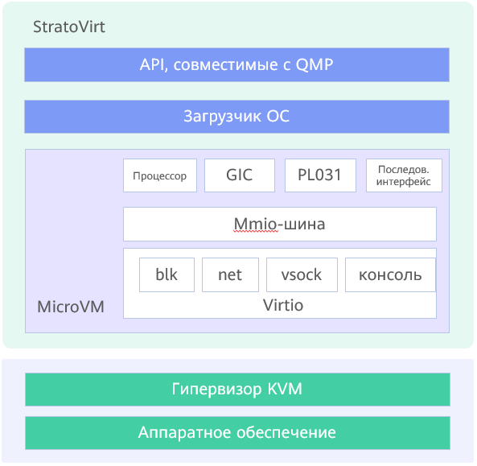

# Основы StratoVirt

\[\[toc]]

## Обзор

StratoVirt — это VMM(Virtual Machine Monitor) корпоративного класса для облачных центров обработки данных, которая позволяет создать унифицированную архитектуру, поддерживающую виртуальные машины, контейнеры и бессерверные среды. Среди главных конкурентных преимуществ StratoVirt — небольшой вес, низкий уровень шума, аппаратно-программное взаимодействие, безопасность на уровне языка программирования Rust. StratoVirt предоставляет функционалы и интерфейсы для сборки компонентов при проектировании архитектуры и организации взаимодействия. Очень важное достоинство StratoVirt — гибкость в подборе передовых функций по запросу — позволит развивать архитектуру по потребности до поддержки стандартной виртуальной среды с оптимальным балансом между запросами в тех или иных функциях, условиями применения и гибкостью внедрения.

## Описание архитектуры

Базовая архитектура StratoVirt делится на три уровня (сверху вниз):

- OCI: полностью совместим с протоколом QEMU Machine Protocol.
- BootLoader — это упрощенный и ускоренный загрузчик, используемый вместо традиционного способа загрузки BIOS+GRUB.
- MicroVM представляет собой уровень виртуализации, на котором используются все возможности взаимодействия программного и аппаратного обеспечения для получения простой модели устройств и масштабирования ресурсов с низкой задержкой.

Общая архитектура показана на **Рис. 1**.

**Рис. 1** Общая архитектура StratoVirt

