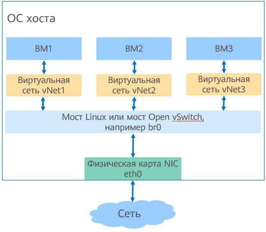

# Подготовка среды

- [Подготовка среды](#environment-preparation)
  - [Подготовка образа виртуальной машины](#preparing-a-vm-image)
  - [Подготовка сети виртуальной машины](#preparing-the-vm-network)
  - [Подготовка микропрограммы начальной загрузки ](#preparing-boot-firmware)

## Подготовка образа виртуальной машины

### Обзор

Образ виртуальной машины (ВМ) представляет собой файл, содержащий установленный виртуальный диск, который можно использовать для запуска ОС. Образы ВМ создаются в разных форматах, например raw и qcow2. По сравнению с raw, формат qcow2 занимает меньше места и поддерживает такие функции, как моментальный снимок, копирование при записи, шифрование по улучшенному стандарту (AES) и сжатие в формате zlib. Однако производительность формата qcow2 несколько ниже, чем у формата raw. Для создания файлов образов используется инструмент qemu-img. Процедура создания образа виртуальной машины в этом разделе приведена на примере формата qcow2.

### Создание образа

Для создания образа в формате qcow2 выполните следующие действия:

1. Установите программный пакет **qemu-img**.
   
   ```
   # yum install -y qemu-img
   ```

2. Выполните команду **create**, чтобы создать файл образа. Формат команды выглядит следующим образом:
   
   ```
   $ qemu-img create -f <imgFormat> -o <fileOption> <fileName> <diskSize>
   ```
   
   Описание параметров:
   
   - _imgFormat_: формат образа. Принимаемые значения — **raw** или **qcow2**.
   - _fileOption_: это необязательный параметр, который задает свойства файла образа, например, это может быть файл образа постпроцессорного компонента, файл со свойством сжатия или шифрования.
   - _fileName_: имя файла.
   - _diskSize_: размер диска блочного хранения. Единицы измерения — K, M, G и T, что означает КиБ, МиБ, ГиБ и ТиБ соответственно.
   
   Например, для создания файла образа openEuler-imge.qcow2, размер диска которого составляет 
   4 ГБ, а формат образа — qcow2, команда и результат ее выполнения будут следующими:
   
   ```
   $ qemu-img create -f qcow2 openEuler-image.qcow2 4G
   Formatting 'openEuler-image.qcow2', fmt=qcow2 size=4294967296 cluster_size=65536 lazy_refcounts=off refcount_bits=16
   ```

### Изменение размера дискового пространства образов

Если для виртуальной машины требуется больше места на диске, можно изменить его размер с помощью инструмента qemu-img. Применяется следующий метод:

1. Выполните следующую команду для запроса места на диске образа виртуальной машины:
   
   ```
   # qemu-img info <imgFiLeName>
   ```
   
   Ниже приведен пример выполнения команды для запроса размера дискового пространства образа openEuler-image.qcow2. В выходных данных команды указано, что свободное пространство образа составляет 4 ГиБ.
   
   ```
   # qemu-img info openEuler-image.qcow2 
   image: openEuler-image.qcow2
   file format: qcow2
   virtual size: 4.0G (4294967296 bytes)
   disk size: 196K
   cluster_size: 65536
   Format specific information:
       compat: 1.1
       lazy refcounts: false
       refcount bits: 16
       corrupt: false
   ```

2. Измените размер дискового пространства, выполнив следующую команду. В команде *imgfielName* означает имя образа, а + и - означают соответственно увеличение и уменьшение места на диске образа. Единицы измерения — KB, MB, GB и T, что означает КиБ, МиБ, ГиБ и ТиБ соответственно.
   
   ```
   # qemu-img resize <imgFiLeName> [+|-]<size>
   ```
   
   Например, чтобы увеличить дисковое пространство образа openEuler-image.qcow2 до 24 ГиБ, то есть для добавления 20 ГиБ к диску исходного образа 4 ГиБ, команда и результат ее выполнения будут следующими:
   
   ```
   # qemu-img resize openEuler-image.qcow2 +20G
   Image resized.
   ```

3. Убедитесь, что размер дискового пространства образа изменен, выполнив следующую команду:
   
   ```
   # qemu-img info <imgFiLeName>
   ```
   
   Например, если размер дискового пространства образа openEuler-image.qcow2 был увеличен до 24 ГиБ, команда и результат ее выполнения будут следующими:
   
   ```
   # qemu-img info openEuler-image.qcow2 
   image: openEuler-image.qcow2
   file format: qcow2
   virtual size: 24G (25769803776 bytes)
   disk size: 200K
   cluster_size: 65536
   Format specific information:
       compat: 1.1
       lazy refcounts: false
       refcount bits: 16
       corrupt: false
   ```

## Подготовка сети виртуальной машины

### Обзор

Чтобы виртуальная машина могла взаимодействовать с внешними сетями, необходимо для нее настроить сетевую среду. Виртуализация на основе технологии KVM (Kernel-based Virtual Machine) поддерживает несколько типов мостов, среди которых Linux и Open vSwitch. На [Рис. 1](#fig1785384714917) путь передачи данных: **VM > virtual NIC device > Linux bridge or Open vSwitch bridge > physical NIC**. Для подключения к виртуализированной сети необходимо настроить виртуальные сетевые карты NIC (vNIC) для виртуальных машин и создать мост для хоста.

В этом разделе описывается, как настроить мосты Linux и Open vSwitch, чтобы подключить виртуальную машину к сети. Тип моста выбирается в соответствии с условиями площадки.

**Рис. 1** Структура виртуальной сети  


### Настройка моста Linux

Далее описывается процедура привязки физической сетевой карты NIC eth0 к мосту Linux br0.

1. Установите пакет программного обеспечения **bridge-utils**.
   
   Мост Linux управляется инструментом brctl. Соответствующий установочный пакет — bridge-utils. Команда установки:
   
   ```
   # yum install -y bridge-utils
   ```

2. Создайте мост br0.
   
   ```
   # brctl addbr br0
   ```

3. Привяжите физическую сетевую карту eth0 к мосту Linux.
   
   ```
   # brctl addif br0 eth0
   ```

4. IP-адрес карты eth0, подключенной к мосту, устанавливается в значение 0.0.0.0.
   
   ```
   # ifconfig eth0 0.0.0.0
   ```

5. Установите IP-адрес br0.
   
   - Если есть сервер DHCP, настройте динамический IP-адрес через dhclient.
     
     ```
     # dhclient br0
     ```
   
   - Если сервера DHCP нет, настройте статический IP-адрес br0. Например, задайте статический IP-адрес 192.168.1.2 и маску подсети 255.255.255.0.
     
     ```
     # ifconfig br0 192.168.1.2 netmask 255.255.255.0
     ```

### Настройка моста Open vSwitch

Мост Open vSwitch более удобен с точки зрения функций автоматической оркестрации. В данном разделе приведено описание процедуры установки компонентов сетевой виртуализации для настройки моста Open vSwitch.

**1 Установка компонента Open vSwitch**

Если для предоставления виртуальной сети используется мост Open vSwitch, необходимо установить компонент виртуализации сети Open vSwitch.

1. Установите компонент Open vSwitch.
   
   ```
   # yum install -y openvswitch
   ```

2. Запустите службу Open vSwitch.
   
   ```
   # systemctl start openvswitch
   ```

**2 Проверка успешного выполнения установки**

Убедитесь, что компоненты Open vSwitch установлены.

1. Если установка выполнена успешно, выводится информация о пакете программного обеспечения. Команда и ее выходные данные выглядят следующим образом:
   
   ```
   # rpm -qi openvswitch
   Name        : openvswitch
   Version     : 2.11.1
   Release     : 1
   Architecture: aarch64
   Install Date: Thu 15 Aug 2019 05:08:35 PM CST
   Group       : System Environment/Daemons
   Size        : 6051185
   License     : ASL 2.0
   Signature   : (none)
   Source RPM  : openvswitch-2.11.1-1.src.rpm
   Build Date  : Thu 08 Aug 2019 05:24:46 PM CST
   Build Host  : armbuild10b247b121b105
   Relocations : (not relocatable)
   Vendor      : Nicira, Inc.
   URL         : http://www.openvswitch.org/
   Summary     : Open vSwitch daemon/database/utilities
   Description :
   Open vSwitch provides standard network bridging functions and
   support for the OpenFlow protocol for remote per-flow control of
   traffic.
   ```

2. Убедитесь, что служба Open vSwitch запущена. Если служба имеет статус **Active**, значит она запущена успешно. Можно воспользоваться инструментом командной строки, предоставляемым Open vSwitch. Команда и ее выходные данные выглядят следующим образом:
   
   ```
   # systemctl status openvswitch
   ● openvswitch.service - LSB: Open vSwitch switch
      Loaded: loaded (/etc/rc.d/init.d/openvswitch; generated)
      Active: active (running) since Sat 2019-08-17 09:47:14 CST; 4min 39s ago
        Docs: man:systemd-sysv-generator(8)
     Process: 54554 ExecStart=/etc/rc.d/init.d/openvswitch start (code=exited, status=0/SUCCESS)
       Tasks: 4 (limit: 9830)
      Memory: 22.0M
      CGroup: /system.slice/openvswitch.service
              ├─54580 ovsdb-server: monitoring pid 54581 (healthy)
              ├─54581 ovsdb-server /etc/openvswitch/conf.db -vconsole:emer -vsyslog:err -vfile:info --remote=punix:/var/run/openvswitch/db.sock --private-key=db:Open_vSwitch,SSL,private_key --certificate>
              ├─54602 ovs-vswitchd: monitoring pid 54603 (healthy)
              └─54603 ovs-vswitchd unix:/var/run/openvswitch/db.sock -vconsole:emer -vsyslog:err -vfile:info --mlockall --no-chdir --log-file=/var/log/openvswitch/ovs-vswitchd.log --pidfile=/var/run/open>
   ```

**3 Настройка моста Open vSwitch**

Далее приведен метод настройки моста Open vSwitch layer-1 bridge br0.

1. Создайте мост Open vSwitch br0.
   
   ```
   # ovs-vsctl add-br br0
   ```

2. Добавьте к этому мосту физическую сетевую карту NIC eth0.
   
   ```
   # ovs-vsctl add-port br0 eth0
   ```

3. IP-адрес карты eth0, подключенной к мосту, устанавливается в значение 0.0.0.0.
   
   ```
   # ifconfig eth0 0.0.0.0
   ```

4. Задайте IP-адрес для OVS-моста br0.
   
   - Если есть сервер DHCP, настройте динамический IP-адрес через dhclient.
     
     ```
     # dhclient br0
     ```
   
   - Если сервера DHCP нет, настройте статический IP-адрес br0, например 192.168.1.2.
     
     ```
     # ifconfig br0 192.168.1.2
     ```

## Подготовка микропрограммы начальной загрузки

### Обзор

Режим загрузки зависит от архитектуры. Серверы x86 поддерживают режим загрузки через унифицированный расширяемый интерфейс связи между ОС и микропрограммой (Unified Extensible Firmware Interface; UFEI) и режим BIOS, а серверы AArch64 — только режим UFEI. По умолчанию на openEuler установлены загрузочные файлы, соответствующие режиму BIOS. Дополнительные операции не требуется. В данном разделе приведено описание процедуры установки загрузочных файлов, соответствующих режиму UEFI.

Unified Extensible Firmware Interface (UEFI) — это новый стандарт интерфейса, используемый для автоматической проверки при включении питания и загрузки операционной системы. Интерфейс является альтернативой традиционному способу загрузки BIOS. EDK II — это среда разработки открытого исходного кода, в которой реализован стандарт UEFI. В сценариях виртуализации комплект инструментов EDK II используется для запуска ВМ в режиме UEFI. Перед запуском виртуальной машины с использованием инструментов EDK II необходимо установить соответствующий пакет программного обеспечения. В данном разделе описываются методы установки инструмента EDK II.

### Методы установки

Если используется режим UEFI, то необходимо установить набор инструментов EDK II. Установочный пакет для архитектуры AArch64 — **edk2-aarch64**, а для архитектуры x86 — **edk2-ovmf**. В этом разделе описана установка на примере архитектуры AArch64. Для архитектуры х86 требуется только заменить **edk2-aarch64** на **edk2-ovmf**.

1. Выполните следующую команду, чтобы установить пакет программного обеспечения **edk**:
   
   Имя пакета **edk2** для архитектуры AArch64 — **edk2-aarch64**.
   
   ```
   # yum install -y edk2-aarch64
   ```
   
   Имя пакета **edk2** для архитектуры x86\_64 — **edk2-ovmf**.
   
   ```
   # yum install -y edk2-ovmf
   ```

2. Выполните следующую команду, чтобы проверить успешность установки пакета программного обеспечения **edk**:
   
   Для архитектуры AArch64 команда выглядит следующим образом:
   
   ```
   # rpm -qi edk2-aarch64
   ```
   
   Если на экране появится подобная информация, значит, пакет программного обеспечения **edk** успешно установлен:
   
   ```
   Name        : edk2-aarch64
   Version     : 20180815gitcb5f4f45ce
   Release     : 1.oe3
   Architecture: noarch
   Install Date: Mon 22 Jul 2019 04:52:33 PM CST
   Group       : Applications/Emulators
   ```
   
   Для архитектуры x86\_64 команда выглядит следующим образом:
   
   ```
   # rpm -qi edk2-ovmf
   ```
   
   Если на экране появится подобная информация, значит, пакет программного обеспечения **edk** успешно установлен:
   
   ```
   Name        : edk2-ovmf
   Version     : 201908
   Release     : 6.oe1
   Architecture: noarch
   Install Date: Thu 19 Mar 2020 09:09:06 AM CST
   ```