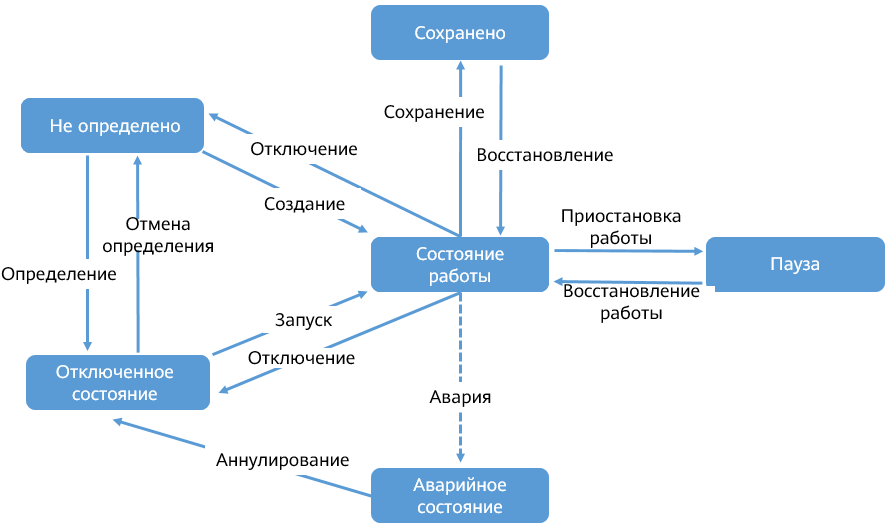
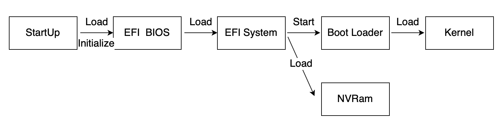
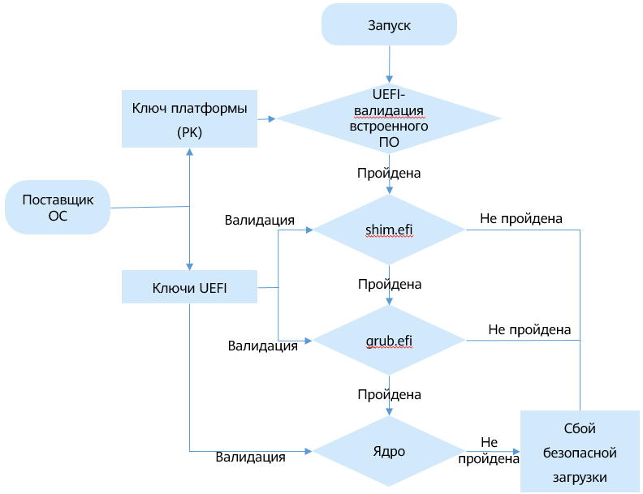

## Управление виртуальными машинами

- [Управление виртуальными машинами](#managing-vms)
  - [Жизненный цикл ВМ](#vm-life-cycle)
    - [Введение](#introduction-0)
    - [Команды управления](#management-commands)
    - [Пример](#example)
  - [Изменение конфигурации виртуальной машины в режиме онлайн](#modify-vm-configurations-online)
  - [Запрос информации о виртуальной машине](#querying-vm-information)
  - [Вход в виртуальную машину](#logging-in-to-a-vm)
    - [Вход с использованием паролей VNC](#logging-in-using-vnc-passwords)
    - [Настройка входа по VNC TLS](#configuring-vnc-tls-login)
  - [Безопасная загрузка виртуальной машины](#VM-Secure-Boot)
    - [Введение](#General-Introduction)
    - [Пример безопасной загрузки](#Secure-Boot-Practice)

### Жизненный цикл ВМ

#### Введение

##### Обзор

Для эффективного использования аппаратных ресурсов и уменьшения затрат необходимо оптимизировать управление виртуальными машинами. В этом разделе описываются основные операции, выполняемые в течение жизненного цикла виртуальной машины: создание, использование и удаление ВМ.

##### Состояние виртуальной машины

Виртуальная машина может находиться в одном из следующих состояний:

- **undefined**: виртуальная машина не определена или не создана. То есть, служба libvirt считает, что данная ВМ не существует.
- **shut off**: виртуальная машина определена, но не запущена, или ее работа завершена.
- **running**: виртуальная машина запущена в работу.
- **paused**: работа виртуальной машины приостановлена, и данные ее рабочего состояния временно хранятся в памяти. Рабочее состояние данной ВМ можно восстановить.
- **saved**: подобно состоянию **paused**, данные рабочего состояния виртуальной машины хранятся на постоянном устройстве хранения, и рабочее состояние данной ВМ можно восстановить.
- **crashed**: сбой работы виртуальной машины по причине внутренней ошибки с невозможностью восстановления рабочего состояния.

##### Переход между состояниями

Возможен переход виртуальной машины между разными состояниями с соблюдением определенных правил. На [Рис. 1](#fig671014583483) приведены общие правила перехода между состояниями виртуальной машины.

**Рис. 1** Схема перехода между состояниями  


##### Идентификатор виртуальной машины

Созданный экземпляр виртуальной машины называется в службе libvirt доменом (**domain**). Домен описывает конфигурационную информацию таких ресурсов, как процессор, память, сетевое устройство и устройство хранения виртуальной машины. На хосте каждый домен имеет уникальный идентификатор, задаваемый параметрами **Name**, **UUID** и **Id** виртуальной машины. Более подробная информация приведена в [Табл. 1](#table84397266483). В течение жизненного цикла определенной виртуальной машины любая операция выполняется с помощью идентификатора этой машины.

**Табл. 1** Описание параметров идентификации домена

| **ID** | **Описание**                                                 |
| ------ | ------------------------------------------------------------ |
| Name   | Имя виртуальной машины                                       |
| UUID   | Универсальный уникальный идентификатор                       |
| Id     | Идентификатор работающей виртуальной машины  <br>ПРИМЕЧАНИЕ: данный идентификатор не отображается для виртуальной машины устройства с выключенным питанием. |


>  ПРИМЕЧАНИЕ:  
Запрос идентификаторов VM ID и UUID выполняется командой **virsh**. Для получения более подробной информации обратитесь к разделу [Запрос информации о виртуальной машине](#querying-vm-information).

#### Команды управления

##### Обзор

Управление жизненным циклом виртуальной машины осуществляется набором команд **virsh**. В данном разделе приведено описание команд, связанных с жизненным циклом.

##### Необходимые условия

- Перед выполнением операций на виртуальной машине необходимо запросить ее состояние, чтобы убедиться, что данные операции можно выполнять. Подробнее о переходе между состояниями см. [Переход между состояниями](#introduction-0).
- Пользователь имеет права администратора.
- Подготовлены конфигурационные XML-файлы виртуальной машины.

##### Использование команды

Управление жизненным циклом виртуальной машины осуществляется командой **virsh**. Формат команды выглядит следующим образом:

```
virsh <operate> <obj> <options>
```

Описание параметров:

- *operate*: данный параметр задает операцию с виртуальной машиной, выполняемую в течение ее жизненного цикла — создание, удаление и запуск ВМ.
- *obj*: определяет объект, в отношении которого будет выполнена операция, например виртуальная машина.
- *options*: выбираемый параметр команды. Параметр необязателен.

В [Табл. 1](#table389518422611) приведено описание команд, используемых при управлении жизненным циклом виртуальной машины. *VMInstanse* — имя или ID-идентификатор, или UUID-идентификатор виртуальной машины, *XMLFile* — конфигурационный XML-файл виртуальной машины, а *DumpFile* — файл дампа. Измените их в соответствии с требованиями площадки.

**Табл. 1** Команды управления жизненным циклом ВМ

| Команда                                     | Описание                                                     |
| ------------------------------------------- | ------------------------------------------------------------ |
| **virsh define** <*XMLFile*>                | Определение постоянной виртуальной машины. После определения данная машина завершает работу и рассматривается как экземпляр **domain**. |
| **virsh create** <*XMLFile*>                | Создание временной виртуальной машины. После создания виртуальная машина остается в рабочем состоянии. |
| **virsh  start** <*VMInstanse*>             | Запуск виртуальной машины.                                   |
| **virsh shutdown** <*VMInstanse*>           | Завершение работы виртуальной машины. Команда запускает процесс выключения виртуальной машины. Если виртуальная машина не может завершить работу, необходимо остановить ее принудительно. |
| **virsh destroy** <*VMInstanse*>            | Принудительная остановка виртуальной машины.                 |
| **virsh reboot** <*VMInstanse*>             | Перезагрузка виртуальной машины.                             |
| **virsh  save**<*VMInstanse*>  <*DumpFile*> | Выгрузка рабочего состояния виртуальной машины в файл.       |
| **virsh restore** <*DumpFile*>              | Восстановление состояния виртуальной машины из файла дампа состояния. |
| **virsh suspend** <*VMInstanse*>            | Приостановка работы виртуальной машины и перевод ее в состояние паузы. |
| **virsh resume** <*VMInstanse*>             | Возобновление рабочего состояния виртуальной машины переключением из состояния паузы. |
| **virsh undefine** <*VMInstanse*>           | После удаления постоянной виртуальной машины ее жизненный цикл заканчивается, операции с машиной выполнить нельзя. |


#### Пример

В данном разделе приведены примеры команд, связанных с управлением жизненным циклом виртуальной машины.

- Создание виртуальной машины
  
  В качестве конфигурационного XML-файла виртуальной машины используется файл **openEulerVM.xml**. Команда и ее выходные данные выглядят следующим образом:
  
  ```
  # virsh define openEulerVM.xml
  Domain openEulerVM defined from openEulerVM.xml
  ```

- Запуск виртуальной машины
  
  Выполните следующую команду, чтобы запустить *openEulerVM*:
  
  ```
  # virsh start openEulerVM
  Domain openEulerVM started
  ```

- Перезагрузка виртуальной машины.
  
  Выполните следующую команду, чтобы перезапустить *openEulerVM*:
  
  ```
  # virsh reboot openEulerVM
  Domain openEulerVM is being rebooted
  ```

- Завершение работы виртуальной машины
  
  Выполните следующую команду, чтобы завершить работу *openEulerVM*:
  
  ```
  # virsh shutdown openEulerVM
  Domain openEulerVM is being shutdown
  ```

- Удаление виртуальной машины.
  
  - Если во время запуска виртуальной машины файл **nvram** не используется, выполните следующую команду для удаления виртуальной машины:
    
    ```
    # virsh undefine <VMInstanse>
    ```
  
  - Если при запуске виртуальной машины используется файл **nvram**, при удалении виртуальной машины необходимо указать политику его обработки следующей командой:
    
    ```
    # virsh undefine <VMInstanse> <strategy>
    ```
    
    *strategy* определяет политику удаления виртуальной машины. Возможные значения:
    
    **--nvram**: при удалении виртуальной машины удаляется соответствующий файл **nvram**.
    
    **--keep-nvram**: удаление виртуальной машины с сохранением соответствующего файла **nvram**.
    
    Например, для удаления *openEulerVM* и ее файла **nvram** выполняется команда:
    
    ```
    # virsh undefine openEulerVM --nvram
    Domain openEulerVM has been undefined
    ```

### Изменение конфигурации виртуальной машины в режиме онлайн

#### Обзор

После создания виртуальной машины пользователи могут изменять ее конфигурацию. Этот процесс называется изменением конфигурации виртуальной машины в режиме онлайн. После онлайн-изменения конфигурации новый конфигурационный файл сохраняется и вступает в силу после завершения работы и перезапуска виртуальной машины.

Для изменения конфигурации ВМ используется следующий формат команды:

```
virsh edit <VMInstance>
```

Команда **virsh edit** используется для редактирования конфигурационного XML-файла, который соответствует **domain**. По умолчанию команда **virsh edit** использует редактор **vi**. Тип редактора можно задать, изменив переменную среды *EDITOR* или *VISUAL*. По умолчанию **virsh edit** приоритетно использует текстовый редактор, указанный с помощью переменной среды *VISUAL*.

#### Процедура

1. (Опционально) Задайте редактор **vim** для команды **virsh edit**.
   
   ```
   # export VISUAL=vim
   ```

2. Выполните команду **virsh edit**, чтобы открыть конфигурационный XML-файл виртуальной машины *openEulerVM*.
   
   ```
   # virsh edit openEulerVM
   ```

3. Измените конфигурационный файл виртуальной машины.

4. Сохраните конфигурационный файл виртуальной машины и выйдите.

5. Перезагрузите виртуальную машину, чтобы настройки вступили в силу.
   
   ```
   # virsh reboot openEulerVM
   ```

### Запрос информации о виртуальной машине

#### Обзор

Для запроса информации о виртуальной машине служба libvirt предоставляет набор команд. В данном разделе приведены инструкции по использованию команд для получения информации о ВМ.

#### Необходимые условия

Для запроса информации о виртуальной машине необходимо выполнить следующие условия:

- Служба libvirtd запущена.

- Полномочия на выполнение данных команд имеет только администратор системы.

#### Запрос информации о виртуальной машине на хосте

- Запрос списка работающих и приостановленных виртуальных машин на хосте.
  
  ```
  # virsh list
  ```
  
  Например, в приведенных далее выходных данных команды содержится информация о том, что на хосте существуют три ВМ. **openEulerVM01** и **openEulerVM02** работают, **openEulerVM03** приостановлена.
  
  ```
   Id    Name                           State
  ----------------------------------------------------
   39    openEulerVM01                   running
   40    openEulerVM02                   running
   69    openEulerVM03                   paused
  ```

- Запрос информации о виртуальных машинах на хосте.
  
  ```
  # virsh list --all
  ```
  
  Например, в приведенных далее выходных данных команды содержится информация о том, что на текущем хосте определены четыре ВМ: **openEulerVM01** работает, **openEulerVM02** приостановлена, работа машин **openEulerVM03** и **openEulerVM04** завершена.
  
  ```
   Id    Name                           State
  ----------------------------------------------------
   39    openEulerVM01                  running
   69    openEulerVM02                  paused
   -     openEulerVM03                  shut off
   -     openEulerVM04                  shut off
  ```

#### Запрос базовой информации о виртуальной машине

Компонент libvirtd предоставляет группу команд для запроса статуса виртуальной машины, в том числе о ее рабочем состоянии, информацию об устройстве и атрибуты планирования. Более подробная информация приведена в [Табл. 1](#table10582103963816).

**Табл. 1** Запрос базовой информации о виртуальной машине

| Информация, подлежащая запросу               | Командная строка          | **Описание**                                                 |
| -------------------------------------------- | :------------------------ | ------------------------------------------------------------ |
| Основная информация                          | **virsh dominfo** **      | Информация включает в себя VM ID, UUID и спецификации виртуальной машины. |
| Текущее состояние                            | **virsh domstate** **     | Для запроса причины изменения текущего состояния виртуальной машины можно воспользоваться параметром **--reason**. |
| Информация о планировании                    | **virsh schedinfo** **    | Информация включает выделенные доли виртуальных процессоров. |
| Количество vCPU                              | **virsh vcpucount** **    | Количество процессоров виртуальной машины.                   |
| Статус виртуального устройства блочного типа | **virsh domblkstat** **   | Чтобы запросить имя устройства блочного типа, выполните команду **virsh domblklist**. |
| Статус vNIC                                  | **virsh domifstat** **    | Чтобы запросить имя карты NIC, выполните команду **virsh domiflist**. |
| Потоки ввода-вывода                          | **virsh iothreadinfo** ** | Потоки ввода-вывода виртуальной машины и привязка к ядрам процессора. |


#### Пример

- Чтобы запросить базовую информацию о созданной виртуальной машине, выполните команду **virsh dominfo**. Результат запроса показывает, что идентификатор ВМ равен 5, идентификатор UUID имеет значение **ab472210-db8c-4018-9b3e-fc5319a769f7**, объем памяти равен 8 ГиБ, а количество vCPUs равно 4.
  
  ```
  # virsh dominfo openEulerVM
  Id:             5
  Name:           openEulerVM
  UUID:           ab472210-db8c-4018-9b3e-fc5319a769f7
  OS Type:        hvm
  State:          running
  CPU(s):         4
  CPU time:       6.8s
  Max memory:     8388608 KiB
  Used memory:    8388608 KiB
  Persistent:     no
  Autostart:      disable
  Managed save:   no
  Security model: none
  Security DOI:   0
  ```

- Чтобы запросить данные о состоянии виртуальной машины, выполните команду **virsh domstate.** Результат запроса показывает, что виртуальная машина **openEulerVM** запущена и работает.
  
  ```
  # virsh domstate openEulerVM
  running
  ```

- Чтобы запросить информацию о планировании ВМ, выполните команду **virsh schedulinfo**. Результат запроса показывает, что доля процессора, выделенная под виртуальную машину, равна 1024.
  
  ```
  # virsh schedinfo openEulerVM
  Scheduler      : posix
  cpu_shares     : 1024
  vcpu_period    : 100000
  vcpu_quota     : -1
  emulator_period: 100000
  emulator_quota : -1
  global_period  : 100000
  global_quota   : -1
  iothread_period: 100000
  iothread_quota : -1
  ```

- Чтобы запросить количество виртуальных процессоров vCPU, выполните команду **virsh vcpucount**. Результат запроса показывает, что виртуальная машина имеет четыре процессора.
  
  ```
  # virsh vcpucount openEulerVM
  maximum      live           4
  current      live           4
  ```

- Чтобы запросить информацию о диске виртуальной машины, выполните команду **virsh domblklist.** Результат запроса показывает, что виртуальная машина имеет два диска: sda является виртуальным диском в формате qcow2, а sdb представляет собой устройство cdrom.
  
  ```
   # virsh domblklist openEulerVM
   Target   Source
  ---------------------------------------------------------------------
   sda      /home/openeuler/vm/openEuler_aarch64.qcow2
   sdb      /home/openeuler/vm/openEuler-20.03-LTS-aarch64-dvd.iso
  ```

- Чтобы запросить информацию о сетевой карте NIC виртуальной машины, выполните команду **virsh domiflist.** Результат запроса показывает, что виртуальная машина имеет одну сетевую карту NIC, постпроцессорный компилятор vnet0 находится на мосту br0 хоста. MAC-адрес: 00:05:fe:d4:f1:cc.
  
  ```
  # virsh domiflist openEulerVM
  Interface  Type       Source     Model       MAC
  -------------------------------------------------------
  vnet0      bridge     br0        virtio      00:05:fe:d4:f1:cc
  ```

- Чтобы запросить информацию о потоке ввода-вывода виртуальной машины, выполните команду **virsh iothreadinfo.** Результат запроса показывает, что виртуальная машина имеет пять потоков ввода-вывода, которые запланированы на физических процессорах 7–10.
  
  ```
  # virsh iothreadinfo openEulerVM
   IOThread ID     CPU Affinity
  ---------------------------------------------------
   3               7-10
   4               7-10
   5               7-10
   1               7-10
   2               7-10
  ```

### Вход в виртуальную машину

В этом разделе описывается процедура входа в виртуальную машину с помощью VNC.

#### Вход с использованием паролей VNC

##### Обзор

Чтобы управлять виртуальной машиной после установки на нее ОС, можно удаленно войти в виртуальную машину с помощью VNC.

##### Необходимые условия

Перед входом в виртуальную машину с использованием клиента, например RealVNC или TightVNC, убедитесь, что:

- Получен IP-адрес хоста, на котором расположена виртуальная машина.

- В среде, в которой находится клиент, можно получить доступ к сети хоста.

- Получен порт прослушивания VNC виртуальной машины. Этот порт автоматически выделяется при запуске клиента. Как правило, номер порта имеет формат **5900 + x** (*x* является положительным целым числом, которое увеличивается согласно последовательности запуска виртуальной машины, **5900** пользователи не видят).

- Если для VNC установлен пароль, необходимо также получить пароль VNC виртуальной машины.
  
  >  ПРИМЕЧАНИЕ:  
Чтобы задать пароль VNC для виртуальной машины, отредактируйте конфигурационный XML-файл данной машины. То есть, добавьте атрибут **passwd** в элемент **graphics** и в качестве значения данного атрибута установите пароль, который необходимо сконфигурировать. Например, чтобы установить пароль VNC виртуальной машины равным **n8VfjbFK**, выполните следующие настройки XML-файла:
  > 
  > ```
  > <graphics type='vnc' port='5900' autoport='yes' listen='0.0.0.0' keymap='en-us' passwd='n8VfjbFK'>  
  > <listen type='address' address='0.0.0.0'/>  
  > </graphics>  
  > ```

##### Процедура

##### Процедура

1. Запросите номер порта VNC, используемого виртуальной машиной. Например, если имя ВМ — _openEulerVM_, выполните следующую команду:
   
   ```
   # virsh vncdisplay openEulerVM
   :3
   ```
   
   >  ПРИМЕЧАНИЕ:  
Для входа в VNC необходимо настроить правила межсетевого экрана, по которым будет даваться разрешение на подключение порта VNC. Далее приведен пример команды, где *X* — это 5900 + номер порта, например, 5903.
   > 
   > ```
   > firewall-cmd --zone=public --add-port=X/tcp  
   > ```

2. Запустите программу VncViewer, введите IP-адрес и номер порта хоста. Формат: **IP-адрес хоста:номер порта** (например, **10.133.205.53:3**).

3. Нажмите кнопку **ОК** и введите пароль VNC (необязательно) для входа в VNC виртуальной машины.

#### Настройка входа по VNC TLS

##### Обзор

По умолчанию клиент и сервер VNC передают данные открытым текстом. Поэтому передаваемое содержимое могут перехватить сторонние лица. Чтобы повысить безопасность, для сервера VNC можно сконфигурировать режим безопасности транспортного уровня по протоколу Transport Layer Security (TLS), в котором будут выполняться шифрование и процедура аутентификации. Протокол TLS реализует зашифрованную передачу между клиентом и сервером VNC, предотвращая перехват данных сторонними лицами.

>  ПРИМЕЧАНИЕ:
> 
> - Чтобы использовать режим аутентификации с шифрованием TLS, клиент VNC должен поддерживать режим TLS (например, TigerVNC). В противном случае клиент VNC не сможет подключиться.
> - Режим аутентификации с шифрованием TLS настраивается на уровне хоста. Режим аутентификации с шифрованием TLS включается для клиентов VNC всех виртуальных машин, работающих на хосте, после того, как будет включена данная функция.

##### Процедура

Чтобы включить режим аутентификации с шифрованием TLS для VNC, выполните следующие шаги:

1. Войдите на хост, на котором находится сервер VNC, и отредактируйте соответствующие параметры настройки в конфигурационном файле **/etc/libvirt/qemu.conf** сервера. Метод настройки:
   
   ```
   vnc_listen = "x.x.x.x"                    # "x.x.x.x" indicates the listening IP address of the VNC. Set this parameter based on the site requirements. The VNC server allows only the connection requests from clients whose IP addresses are in this range.
   vnc_tls = 1                        # If this parameter is set to 1, VNC TLS is enabled.
   vnc_tls_x509_cert_dir = "/etc/pki/libvirt-vnc"                           # Specify /etc/pki/libvirt-vnc as the path for storing the certificate.
   vnc_tls_x509_verify = 1                              #If this parameter is set to 1, the X509 certificate is used for TLS authentication.
   ```

2. Создайте сертификат и файл закрытого ключа для клиента VNC. Далее в качестве примера приведена программная библиотека GNU TLS.
   
   >  ПРИМЕЧАНИЕ:  
Чтобы использовать GNU TLS, установите пакет программного обеспечения gnu-utils.
   
   1. Создайте файл сертификата, выданный удостоверяющим центром (Certificate Authority; CA).
      
      ```
      # certtool --generate-privkey > ca-key.pem
      ```
   
   2. Создайте самозаверяющий сертификат CA на основе открытого и закрытого ключей. _Your organization name_ означает имя организации, указываемое пользователем.
      
      ```
      # cat > ca.info<<EOF
      cn = Your organization name 
      ca
      cert_signing_key
      EOF
      ```
      
      ```
      # certtool --generate-self-signed \
               --load-privkey ca-key.pem \
               --template ca.info \
               --outfile ca-cert.pem
      ```
      
      В указанном выше сгенерированном файле **ca-cert.pem** — сгенерированный открытый ключ СА, а **ca-key.pem** — сгенерированный закрытый ключ СА. Сертификат СА должен хранить ключи должным образом, чтобы предотвратить раскрытие информации.
   
   3. Выдайте сертификат серверу VNC. **Client Organization Name** означает действительное имя службы, например **cleint.foo.com**. Установите этот параметр в соответствии с условиями площадки.
      
      ```
      # cat > server.info<<EOF
      cn = Server Organization Name
      tls_www_server
      encryption_key
      signing_key
      EOF
      ```
      
      ```
      # certtool --generate-privkey > server-key.pem
      # certtool --generate-certificate \
                 --load-ca-certificate ca-cert.pem \
                 --load-ca-privkey ca-key.pem \
                 --load-privkey server-key.pem \
                 --template server.info \
                 --outfile server-cert.pem
      ```
      
      В указанном выше сгенерированном файле **server-key.pem** является закрытым ключом сервера VNC, а **server-cert.pem** — открытым ключом.
   
   4. Выдайте сертификат клиенту VNC.
      
      ```
      # cat > client.info<<EOF
      cn = Client Organization Name
      tls_www_client
      encryption_key
      signing_key
      EOF
      ```
      
      ```
      # certtool --generate-privkey > client-key.pem
      # certtool --generate-certificate \
                 --load-ca-certificate ca-cert.pem \
                 --load-ca-privkey ca-key.pem \
                 --load-privkey client-key.pem \
                 --template client.info \
                 --outfile client-cert.pem
      ```
      
      В указанном выше сгенерированном файле **client-key.pem** является закрытым ключом клиента VNC, а **client-cert.pem** — открытым ключом клиента VNC. Сгенерированные пары открытого и закрытого ключей необходимо скопировать на клиент VNC.

3. Завершите работу виртуальной машины, вход на которую необходимо выполнить, и перезапустите службу libvirtd на хосте, на котором находится сервер VNC.
   
   ```
   # systemctl restart libvirtd
   ```

4. Сохраните сгенерированный сертификат сервера в указанный каталог на сервере VNC и предоставьте права на чтение и запись сертификата только текущему пользователю.
   
   ```
   # sudo mkdir -m 750 /etc/pki/libvirt-vnc
   # cp ca-cert.pem /etc/pki/libvirt-vnc/ca-cert.pem
   # cp server-cert.pem /etc/pki/libvirt-vnc/server-cert.pem
   # cp server-key.pem /etc/pki/libvirt-vnc/server-key.pem
   # chmod 0600 /etc/pki/libvirt-vnc/*
   ```

5. Скопируйте сгенерированные сертификаты клиента **ca-cert.pem, client-cert.pem** и **client-key.pem** на клиент VNC. После настройки сертификата TLS клиента VNC вход на виртуальную машину можно осуществлять по VNC TLS.
   
   >  ПРИМЕЧАНИЕ:
   > 
   > - Для получения более подробной информации о процедуре настройки сертификата клиента VNC обратитесь к инструкциям по использованию каждого клиента.
   > - Для получения более подробной информации о процедуре входа в виртуальную машину обратитесь к разделу «Вход с использованием паролей VNC».

### Безопасная загрузка виртуальной машины

#### Введение

##### Обзор

При безопасной загрузке подпись и проверка загрузочных компонентов осуществляется при помощи пары открытого и закрытого ключей. Во время запуска текущий компонент проверяет цифровую подпись следующего компонента. Если проверка проходит успешно, запускается следующий компонент. Если проверка не проходит, запуск не выполняется. Безопасная загрузка необходима для проверки программного обеспечения и встроенных программ на предмет несанкционированного изменения во время запуска устройства. Эта мера позволяет предотвратить внедрение вредоносных программных средств. Во время безопасной загрузки обеспечивается целостность каждого компонента при запуске системы и не допускается загрузка и работа неразрешенных компонентов, что предотвращает угрозы, направленные на систему и пользовательские данные. Безопасная загрузка осуществляется в режиме UEFI. Данный режим не поддерживается в ранних версиях. В соответствии со спецификациями UEFI в материнскую плату перед поставкой встраиваются определенные надежные открытые ключи. Любой загружаемый на такую материнскую плату драйвер аппаратного обеспечения или любая операционная система проверяются на подлинность данными открытыми ключами. Безопасная загрузка физической машины реализуется физической системой BIOS, в то время как безопасная загрузка виртуальной машины симулируется программным обеспечением. Процесс безопасной загрузки виртуальной машины аналогичен процессу безопасной загрузки хоста, и оба соответствуют спецификациям среды UEFI с открытым исходным кодом. Среду UEFI на платформе виртуализации обеспечивает компонент EDK. При запуске виртуальной машины QEMU сопоставляет образ UEFI с памятью для симуляции процесса запуска встроенного ПО для виртуальной машины. Безопасная загрузка, функции которой выполняет компонент EDK, защищает от подделки ядра ОС виртуальной машины во время ее запуска. Последовательность проверки подписи во время безопасной загрузки следующая: UEFI BIOS->shim->GRUB->vmlinuz (проверка подписи и загрузка осуществляются последовательно).

| Термин на английском языке | Сокращение | Описание                                                     |
| -------------------------- | ---------- | ------------------------------------------------------------ |
| Secure boot                | \-         | Данный термин означает безопасный режим загрузки, когда компонент проверяет цифровую подпись следующего компонента во время запуска системы. Если проверка проходит успешно, компонент запускается. Если проверка не проходит, компонент не запускается. Данный режим обеспечивает целостность каждого компонента при запуске системы. |
| Platform key               | PK         | Это ключ платформы, владельцем которого является оригинальный производитель оборудования. Используемый ключом тип шифрования должен быть не ниже RSA2048. PK устанавливает доверительные отношения между владельцем платформы и встроенным ПО платформы. Владелец платформы вносит открытый ключ PK (PKpub) в регистр встроенного ПО платформы. Для смены владельца платформы или регистрации ключа KEK текущий владелец может использовать секретный ключ PK (PKpriv). |
| Key exchange key           | KEK        | Ключ обмена ключами обеспечивает надежную связь между встроенным ПО платформы и ОС. Каждая ОС и стороннее приложение, взаимодействующее со встроенным ПО платформы, регистрирует открытый ключ KEK (KEKpub) во встроенном ПО платформы. |
| Database whitelist         | DB         | Белый список базы данных хранит и проверяет ключи таких компонентов, как shim, GRUB и vmlinuz. |
| Database blacklist         | DBx        | В черном списке базы данных хранятся отозванные ключи.       |


##### Описание функционала

Функция безопасной загрузки виртуальной машины реализована на основе проекта EDK с открытым исходным кодом. Без применения режима безопасной загрузки основной процесс Linux выглядит следующим образом:

**Рис. 1** Процесс запуска системы



В безопасном режиме первым компонентом, загружаемым после загрузки UEFI BIOSI, является компонент shim в образе системы. Взаимодействуя с UEFI BIOS, shim получает ключ, хранящийся в базе данных переменных UEFI BIOS, для проверки GRUB. После загрузки GRUB вызываются также ключ и интерфейс API аутентификации для проверки ядра. Процедура загрузки Linux выглядит следующим образом:

**Рис. 2** Процесс безопасной загрузки



Функция безопасной загрузки реализуется в нескольких основных сценариях. Функционал безопасной загрузки, разработанный на основе анализа сценариев и причин сбоя системы, включает в себя следующие подсистемы: UEFI BIOS, проверяющая компонент shim; компонент shim, проверяющий GRUB, и загрузчик GRUB, проверяющий ядро. Если проверка проходит успешно, запускается компонент shim. Если проверка не проходит, выводится сообщение об ошибке и shim не запускается. Во время компиляции и создания образа компонент shim использует закрытый ключ для подписи, а сертификат открытого ключа необходимо импортировать в БД переменных UEFI BIOS. После запуска shim проверяется GRUB. Если проверка проходит успешно, GRUB запускается. Если проверка не проходит, выводится сообщение об ошибке и GRUB не запускается. Во время создания и компиляции образа необходима подпись GRUB. Используются пары открытого и закрытого ключей, как у компонента shim. После запуска GRUB проверяется ядро вызовом данного ключа и ключа API аутентификации, зарегистрированного в UEFI BIOS. Если проверка проходит успешно, GRUB запускает ядро. Если проверка не проходит, выводится сообщение об ошибке. Во время компиляции и создания загрузчик GRUB должен подписать образ, используя пару открытого и закрытого ключей, аналогичную паре, используемой компонентом shim.

##### Ограничения

* Запуск на UEFI BIOS без поддержки безопасной загрузки не повлияет на работу существующих функций и служб.
* Функция безопасной загрузки срабатывает только в том случае, если UEFI поддерживает ее.
* Если в UEFI BIOS включен режим безопасной загрузки, система не запускается, если соответствующие компоненты не имеют подписи или подпись некорректна.
* Если режим безопасной загрузки отключен в UEFI BIOS, функция проверки во время загрузки отключается.
* Вторая половина цепи проверки безопасной загрузки, то есть shim->GRUB->kernel, служит для запуска ядра. Эта часть реализуется с помощью образа операционной системы. Если ОС не поддерживает запуск ядра в режиме безопасной загрузки, запустить виртуальную машину в данном режиме невозможно.
* В настоящее время архитектура х86 не имеет функционала конфигурирования файла nvram для настройки режима безопасной загрузки виртуальной машины.

#### Пример безопасной загрузки

Безопасная загрузка виртуальной машины зависит от поддержки этого функционала в UEFI BIOS. Образ UEFI BIOS монтируется с помощью пакета edk rpm. Процедура настройки режима безопасной загрузки виртуальной машины в этом разделе приведена на примере архитектуры AArch64.

##### Конфигурирование виртуальной машины

Компоненты пакета edk rpm устанавливаются в каталоге **/usr/share/edk2/aarch64**, в том числе `QEMU_EFI-pflash.raw` и `vars-template-pflash.raw`. Далее представлен пример конфигурации XML-файла, используемого в UEFI BIOS во время запуска виртуальной машины.

```
<os>
    <type arch='aarch64' machine='virt'>hvm</type>
    <loader readonly='yes' type='pflash'>/usr/share/edk2/aarch64/QEMU_EFI-pflash.raw</loader>
    <nvram template='/usr/share/edk2/aarch64/vars-template-pflash.raw'>/path/to/QEMU-VARS.fd</nvram>
</os>
```

В данной конфигурации **/usr/share/edk2/aarch64/QEMU\_EFI-pflash.raw** означает путь к образу UEFI BIOS. **/usr/share/edk2/aarch64/vars-template-pflash.raw** — это путь к шаблону образа NVRAM, а **/path/to/QEMU-VARS.fd** — путь к файлу образа NVRAM текущей виртуальной машины, который используется для хранения переменных среды в UEFI BIOS.

##### Импорт сертификата

Сертификат для безопасной загрузки виртуальной машины импортируется со страницы BIOS. Перед импортом сертификата необходимо импортировать файл сертификата на виртуальную машину. Каталог, в котором находится файл сертификата, монтируется на виртуальной машине путем монтирования диска. Например, в следующем примере создан образ, содержащий сертификат, и далее смонтирован в конфигурационный файл XML виртуальной машины.

Создайте образ файла сертификата.

```
dd of='/path/to/data.img' if='/dev/zero' bs=1M count=64
mkfs.vfat -I /path/to/data.img
mkdir /path/to/mnt
mount path/to/data.img /path/to/mnt/
cp -a /path/to/certificates/* /path/to/mnt/
umount /path/to/mnt/
```

В данном примере команды **/path/to/certificates/** — это путь к файлу сертификата, **/path/to/data.img** — путь к образу файла сертификата, **/path/to/mnt/** — путь к смонтированному образу.

Смонтируйте образ в файле XML виртуальной машины.

```
<devices>
	<disk type='file' device='disk'>
		<driver name='qemu' type='raw' cache='none' io='native'/>
		<source file='/path/to/data.img'/>
		<target dev='sdc' bus='scsi'/>
		<boot order='2'/>
		<readonly/>
	</disk>
</devices>
```

Запустите виртуальную машину и импортируйте PK-сертификат. Процедура выглядит следующим образом: (процедура импорта сертификата KEK аналогична процедуре импорта сертификата БД):

После запуска виртуальной машины нажмите F2 для перехода к экрану BIOS.

**Рис. 1** Экран BIOS


**Рис. 2** Диспетчер устройств


**Рис. 3** Настраиваемые параметры безопасной загрузки


**Рис. 4** Параметры ключа PK


**Рис. 5** Регистрация ключа PK


В окне проводника файлов отображаются дисковые каталоги, включая каталог с файлами сертификатов, смонтированный на диске.

**Рис. 6** Проводник файлов


Выберите сертификат PK, который необходимо импортировать, в дисковом каталоге.

**Рис. 7** Диск, на котором хранится сертификат


**Рис. 8** Выбор опции Commit Changes and Exit для сохранения импортированного сертификата


После импорта сертификата UEFI BIOS записывает информацию о сертификате и атрибуты безопасной загрузки в конфигурационный файл NVRAM: **/path/to/QEMU-VARS.fd**. При следующем запуске виртуальная машина считывает соответствующую конфигурацию из файла **/path/to/QEMU-VARS.fd**, инициализирует информацию о сертификате и атрибуты безопасной загрузки, автоматически импортирует сертификат и выполняет безопасную загрузку. Также файл **/path/to/QEMU-VARS.fd** можно использовать в качестве файла шаблона конфигурации загрузки UEFI BIOS для запуска других виртуальных машин с такой же конфигурацией. Запуская другие виртуальные машины, измените поле шаблона nvram, чтобы автоматически импортировать сертификат и включить параметр безопасной загрузки. Конфигурация XML-файла виртуальной машины изменяется следующим образом:

```
<os>
    <type arch='aarch64' machine='virt'>hvm</type>
    <loader readonly='yes' type='pflash'>/usr/share/edk2/aarch64/QEMU_EFI-pflash.raw</loader>
    <nvram template='/path/to/QEMU-VARS.fd'></nvram>
</os>
```

##### Наблюдение за безопасной загрузкой

После правильной настройки и импорта сертификатов PK, KEK и DB виртуальная машина запускается в безопасном режиме. Можно настроить файл журнала последовательного порта в конфигурационном XML-файле ВМ, чтобы убедиться, что данная машина загружается в безопасном режиме. На следующем рисунке показано, как сконфигурировать файл журнала последовательного порта.

```
<serial type='file'>
	<source path='/path/to/log_file' append='on'/>
</serial>
```

Если после успешной загрузки образа ОС на виртуальную машину в файле журнала последовательного порта появляется информация «UEFI-Secure Boot is enabled», значит, виртуальная машина находится в состоянии безопасной загрузки.