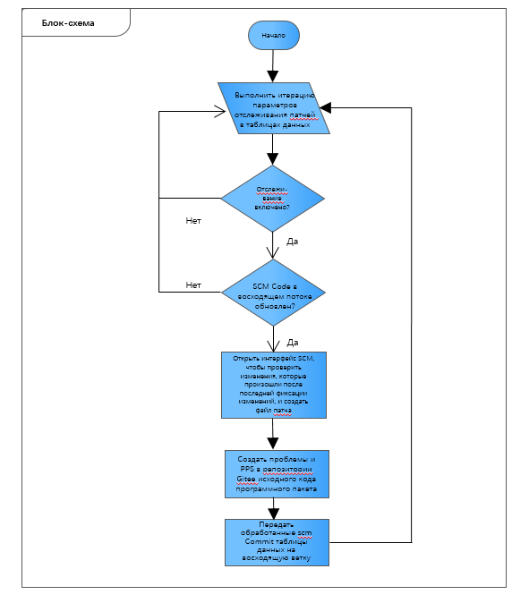

# patch-tracking: инструмент отслеживания патчей

\[\[toc]]

## Обзор

Во время подготовки релиза openEuler необходимо своевременно обновить актуальный исходный код в каждом пакете программного обеспечения исходного (upstream) сообщества разработчиков, чтобы исправить функциональные ошибки и устранить уязвимости в системе безопасности, которые могут содержаться в релизах openEuler.

Этот инструмент служит для управления патчами пакетов программного обеспечения, упреждающего отслеживания патчей, отправляемых исходным сообществом разработчиков, автоматической генерации новых патчей, передачи проблемы соответствующему специалисту по сопровождению проекта и проверки основных функций патчей. Использование инструмента снизит рабочую нагрузку по проверке и позволит специалисту по сопровождению проекта быстро принимать решения.

## Архитектура

### Архитектура C/S

Инструмент отслеживания патчей (patch-tracking) работает на архитектуре C/S.

Инструмент размещается на сервере. Он выполняет задачи отслеживания патчей, включая поддержку элементов отслеживания, идентификацию изменений кода в ветке проекта в вышестоящем (upstream) репозитории, генерирование файлов патчей и отправку проблем и PR в Gitee. Кроме того, инструмент patch-tracking предоставляет интерфейсы RESTful API, служащие для добавления, удаления, изменения и запроса элементов отслеживания.

patch-tracking-cli — это инструмент командной строки, размещаемый на клиенте. Обращаясь к интерфейсам RESTful API, данный инструмент добавляет, удаляет, изменяет и запрашивает элементы отслеживания.

### Основная процедура

1\. Процедура службы отслеживания патчей

Процедура обработки отправленного патча состоит в следующем:

1. Добавьте элемент отслеживания с помощью инструмента командной строки.
2. Получите файлы с патчами от upstream-репозитория (например, GitHub), который сконфигурирован для элемента отслеживания.
3. Создайте временную ветвь и отправьте на нее полученный файл с патчем.
4. Передайте проблему в соответствующий репозиторий и сгенерируйте PR, связанный с данной проблемой.



2\. Процедура обработки отправленного патча специалистом по сопровождению проекта

Процедура обработки отправленного патча состоит в следующем:

1. Специалист по сопровождению проекта анализирует PR.
2. Специалист выполняет непрерывную интеграцию (CI). После успешного выполнения CI необходимо определить, требуется или не требуется слияние (merge) PR.


### Структура данных

* Таблица отслеживания

| №    | Имя              | Описание                                                     | Тип            | Ключ      | Допускается нулевое значение |
| ---- | ---------------- | ------------------------------------------------------------ | -------------- | --------- | ---------------------------- |
| 1    | id               | Порядковый номер элемента отслеживания автоматически добавленного патча | Целое число    | \-        | Нет                          |
| 2    | version\_control | Тип системы управления версиями SCM восходящей (upstream) ветви | Строка         | \-        | Нет                          |
| 3    | scm\_repo        | Адрес репозитория SCM восходящей ветви                       | Строка         | \-        | Нет                          |
| 4    | scm\_branch      | Ветвь отслеживания восходящей SCM                            | Строка         | \-        | Нет                          |
| 5    | scm\_commit      | Последний идентификатор фиксации изменений, обработанный исходным кодом | Строка         | \-        | Да                           |
| 6    | repo             | Адрес репозитория Gitee, в котором хранится исходный код пакета | Строка         | Первичный | Нет                          |
| 7    | branch           | Ветвь репозитория Gitee, в котором хранится исходный код пакета | Строка         | Первичный | Нет                          |
| 8    | enabled          | Запускает процесс отслеживания                               | Логический тип | \-        | Нет                          |


* Таблица проблем

| №    | Имя    | Описание                                                     | Тип    | Ключ      | Допускается нулевое значение |
| ---- | ------ | ------------------------------------------------------------ | ------ | --------- | ---------------------------- |
| 1    | issue  | № проблемы                                                   | Строка | Первичный | Нет                          |
| 2    | repo   | Адрес репозитория Gitee, в котором хранится исходный код пакета | Строка | \-        | Нет                          |
| 3    | branch | Ветвь репозитория Gitee, в котором хранится исходный код пакета | Строка | \-        | Нет                          |


## Развертывание инструмента

### Загрузка программного обеспечения

Источник репозитория официально опубликован на странице https://repo.openeuler.org/.

Пакет RPM можно получить из источника https://build.openeuler.org/package/show/openEuler:20.03-LTS/patch-tracking.

### Установка инструмента

Способ 1. Установите инструмент отслеживания патчей из источника репозитория.

1. Смонтируйте источник репозитория с помощью DNF (требуется источник репозитория 20.03-LTS или более поздней версии). Подробнее см. [Руководство по разработке приложений](https://openeuler.org/en/docs/20.03-LTS/docs/ApplicationDev/application-development.html). Выполните следующую команду, чтобы загрузить и установить инструмент отслеживания патчей и его зависимости.

2. Команда для установки `patch-tracking`:
   
   ```shell script
   dnf install patch-tracking
   ```

Способ 2. Установите инструмент отслеживания патчей с помощью пакета RPM.

1. Установите требуемые зависимости.
   
   ```shell script
   dnf install python3-uWSGI python3-flask python3-Flask-SQLAlchemy python3-Flask-APScheduler python3-Flask-HTTPAuth python3-requests python3-pandas
   ```

2. Пакет `patch-tracking-1.0.0-1.oe1.noarch.rpm` приведен здесь в качестве примера. Команда для установки инструмента отслеживания патчей:
   
   ```shell script
   rpm -ivh patch-tracking-1.0.0-1.oe1.noarch.rpm
   ```

### Создание сертификата

Выполните следующую команду, чтобы создать сертификат.

```shell script
openssl req -x509 -days 3650 -subj "/CN=self-signed" \
-nodes -newkey rsa:4096 -keyout self-signed.key -out self-signed.crt
```

Скопируйте сгенерированные файлы `self-signed.key` и `self-signed.crt` в каталог **/etc/patch-tracking**.

### Настройка параметров

Настройте соответствующие параметры в конфигурационном файле. Путь к конфигурационному файлу — `/etc/patch-tracking/settings.conf`.

1. Настройте адрес прослушивания службы.
   
   ```
   LISTEN = "127.0.0.1:5001"
   ```

2. Для доступа к информации репозитория, размещенного в upstream-репозитории ПО с открытым исходным кодом GitHub, используются маркеры GitHub. Подробнее см. [Создание персонального маркера доступа](https://docs.github.com/en/github/authenticating-to-github/creating-a-personal-access-token).
   
   ```
   GITHUB_ACCESS_TOKEN = ""
   ```

3. Для репозитория, который размещен в Gitee и требует отслеживания, настройте маркер Gitee с разрешением отправки файлов патчей, проблем и PR с данного репозитория.
   
   ```
   GITEE_ACCESS_TOKEN = ""
   ```

4. Отсканировав базу данных в соответствии с планом, найдите новые или измененные элементы отслеживания и получите патчи с восходящего потока для данных обнаруженных элементов. Установите интервал сканирования в секундах.
   
   ```
   SCAN_DB_INTERVAL = 3600
   ```

5. Во время работы инструмента необходимо ввести имя пользователя и хеш-значение пароля, чтобы пройти аутентификацию для доступа к интерфейсу POST.
   
   ```
   USER = "admin"
   
   PASSWORD = ""
   ```

> Значение по умолчанию `USER` — `admin`.

Выполните следующую команду, чтобы получить хеш-значение пароля. Test@123 — это настроенный пароль.

```
[root]# generate_password Test@123
pbkdf2:sha256:150000$w38eLeRm$ebb5069ba3b4dda39a698bd1d9d7f5f848af3bd93b11e0cde2b28e9e34bfbbae
```

> Хеш-значение пароля пользователя должно отвечать заданным требованиям сложности:
> 
> * Длина больше или равна 6 байтам.
> * Пароль должен содержать прописные буквы, строчные буквы, цифры и специальные символы (~!@#%\^\*-\_=+).

Вставьте хеш-значение пароля `pbkdf2:sha256:150000$w38eLeRm$ebb5069ba3b4dda39a698bd1d9d7f5f848af3bd93b11e0cde2b28e9e34bfbbae` в кавычки `PASSWORD = ""`.

### Запуск службы отслеживания патчей

Для запуска службы можно использовать один из следующих способов:

* Войдите в режим systemd.
  
  ```
  systemctl start patch-tracking
  ```

* Запустите исполняемую программу.
  
  ```
  /usr/bin/patch-tracking
  ```

## Использование инструмента

1\. Добавление элемента отслеживания

Репозиторий программного обеспечения и ветвь, которую требуется отслеживать, можно связать с соответствующим upstream-репозиторием программного обеспечения с открытым исходным кодом и восходящей ветвью любым из следующих способов:

* Использование CLI

Описание параметров

> --user: имя пользователя, который должен пройти проверку подлинности для доступа к интерфейсу POST. Имя совпадает с параметром USER в файле **settings.conf**. 
> --password: пароль пользователя, который должен пройти проверку подлинности для доступа к интерфейсу POST. Это строка пароля соответствует хеш-значению PASSWORD в файле **settings.conf**. 
> --server: URL-адрес для запуска службы отслеживания патчей, например 127.0.0.1:5001. 
> --version\_control: инструмент управления версией upstream-репозитория. Поддерживается только GitHub. 
> --repo: имя репозитория, который требует отслеживания, в формате «организация/репозиторий».
>
> --branch: имя ветви репозитория, который требует отслеживания. 
> --scm\_repo: имя upstream-репозитория, который требует отслеживания, в формате GitHub «организация/репозиторий». 
> --scm\_branch: ветвь upstream-репозитория, который требует отслеживания.
>
> --enabled: автоматически включает функцию отслеживания репозитория.

Пример:

```shell script
patch-tracking-cli add --server 127.0.0.1:5001 --user admin --password Test@123 --version_control github --repo testPatchTrack/testPatch1 --branch master --scm_repo BJMX/testPatch01 --scm_branch test  --enabled true
```

* Использование заданного файла

Описание параметров

> --server: URL-адрес для запуска службы отслеживания патчей, например 127.0.0.1:5001. 
> --user: имя пользователя, который должен пройти проверку подлинности для доступа к интерфейсу POST. Имя совпадает с параметром USER в файле **settings.conf**. 
> --password: пароль пользователя, который должен пройти проверку подлинности для доступа к интерфейсу POST. Это строка пароля соответствует хеш-значению PASSWORD в файле **settings.conf**. 
> --file: путь к файлу YAML.

В файл YAML (например, **tracking.yaml**) добавьте информацию о репозитории, ветви, инструменте управления версиями и необходимости включения функции отслеживания. Путь к файлу используется в качестве команды вызова входных параметров для `--file`.

Пример:

```shell script
patch-tracking-cli add --server 127.0.0.1:5001 --user admin --password Test@123 --file tracking.yaml
```

Далее приведен пример формата файла YAML. Содержимое слева от двоеточия (:) изменять нельзя, содержимое справа от двоеточия (:) необходимо изменить в соответствии с требованиями площадки.

```shell script
version_control: github
scm_repo: xxx/xxx
scm_branch: master
repo: xxx/xxx
branch: master
enabled: true
```

> version\_control: инструмент управления версией upstream-репозитория. Поддерживается только GitHub. 
> scm\_repo: имя upstream-репозитория, который требует отслеживания, в формате GitHub «организация/репозиторий». 
> scm\_branch: ветвь upstream-репозитория, который требует отслеживания. 
> repo: имя репозитория, который требует отслеживания, в формате «организация/репозиторий». 
> branch: имя ветви репозитория, который требует отслеживания. 
> enabled: автоматически включает функцию отслеживания репозитория.

* Использование заданного каталога

Разместите несколько файлов `xxx.yaml` в указанном каталоге, например `test_yaml`, и выполните следующую команду, которая будет вносить элементы отслеживания всех файлов YAML в указанный каталог.

Описание параметров

> --user: имя пользователя, который должен пройти проверку подлинности для доступа к интерфейсу POST. Имя совпадает с параметром USER в файле **settings.conf**. 
> --password: пароль пользователя, который должен пройти проверку подлинности для доступа к интерфейсу POST. Это строка пароля соответствует хеш-значению PASSWORD в файле **settings.conf**. 
> --server: URL-адрес для запуска службы отслеживания патчей, например 127.0.0.1:5001. 
> --dir: путь, по которому хранится файл YAML.

```shell script
patch-tracking-cli add --server 127.0.0.1:5001 --user admin --password Test@123 --dir /home/Work/test_yaml/
```

2\. Запрос элемента отслеживания

Описание параметров

> --server: (обязательная настройка) URL-адрес для запуска службы отслеживания патчей, например 127.0.0.1:5001. 
> --table: (обязательная настройка) запрашиваемая таблица. 
> --Repo: (необязательная настройка) запрашиваемый репозиторий. Если этот параметр не установлен, запрашивается все содержимое таблицы. 
> --branch: (необязательная настройка) запрашиваемая ветвь.

```shell script
patch-tracking-cli query --server <SERVER> --table tracking
```

Доступ на веб-сайт осуществляется корректно.

```shell script
patch-tracking-cli query --server 127.0.0.1:5001 --table tracking
```

3\. Запрос созданной проблемы

```shell script
patch-tracking-cli query --server <SERVER> --table issue
```

Пример:

```shell script
patch-tracking-cli query --server 127.0.0.1:5001 --table issue
```

4\. Удаление элемента отслеживания

```shell script
patch-tracking-cli delete --server SERVER --user USER --password PWD --repo REPO [--branch BRANCH]
```

Пример:

```shell script
patch-tracking-cli delete --server 127.0.0.1:5001 --user admin --password Test@123 --repo testPatchTrack/testPatch1 --branch master
```

> Из указанного репозитория или ветви можно удалить один фрагмент данных. Из указанного репозитория или ветви можно удалить также все ветви.

5\. Проверка проблем и PR в Gitee

Войдите в Gitee и проверьте проект разработки программного обеспечения, который требуется отследить. На вкладках Issues и Pull Requests проекта можно увидеть элемент с именем в формате `[patch tracking] TIME`, например `[patch tracking] 20200713101548`. Этот элемент представляет собой проблему и PR, содержащихся в только что созданном файле патча.

## Вопросы и ответы

### Отказ в соединении при попытке получить доступ к api.github.com.

#### Признак

Во время работы инструмента отслеживания патчей может возникнуть следующее сообщение об ошибке:

```
 9月 21 22:00:10 localhost.localdomain patch-tracking[36358]: 2020-09-21 22:00:10,812 - patch_tracking.util.github_api - WARNING - HTTPSConnectionPool(host='api.github.com', port=443): Max retries exceeded with url: /user (Caused by NewConnectionError('<urllib3.connection.HTTPSConnection object at 0xfffe19d35820>: Failed to establish a new connection: [Errno 111] Connection refused'))   
```

#### Анализ причин

Данная проблема вызвана нестабильным сетевым соединением между инструментом patch-tracking и API GitHub. Убедитесь, что инструмент работает в стабильной сетевой среде (например, в среде зарубежной площадки HUAWEI CLOUD).