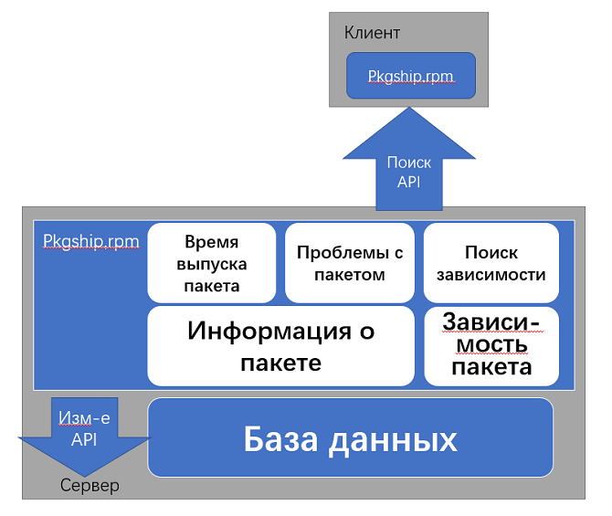

# pkgship

\[\[toc]]

## Обзор

pkgship — это инструмент запроса, используемый для управления зависимостями пакетов программного обеспечения ОС и создания полного графа зависимостей. В pkgship предусмотрены такие функции, как запрос зависимостей пакетов программного обеспечения, управление жизненным циклом и запрос патчей.

1. Запрос зависимостей пакета программного обеспечения: с помощью запроса разработчики сообщества смогут понять, как повлияет операция выпуска, обновления или удаления пакетов программного обеспечения.
2. Управление жизненным циклом: отслеживая состояние релизов пакетов исходного программного обеспечения, специалисты по техобслуживанию смогут своевременно обновлять программное обеспечение.
3. Запрос патчей: с помощью данного запроса разработчики сообщества получают информацию о патчах, включенных в пакеты программного обеспечения openEuler. Подробнее см. [patch-tracking: инструмент отслеживания патчей](patch-tracking.md).

## Архитектура

Система разработана с помощью Flask-RESTful и использует структуру запросов SQLAlchemy ORM.



## Загрузка программного обеспечения

* Источник репозитория официально опубликован на странице <https://repo.openeuler.org/>
* Исходный код можно получить на странице <https://gitee.com/openeuler/openEuler-Advisor/tree/master/packageship>.
* Пакет RPM бета-версии можно получить на странице <https://117.78.1.88/project/show/openEuler:Mainline>.

## Рабочая среда

* Доступная память — более 700 МБ.
* Python 3.8 или более поздняя версия.
* SQLite 3.32 или более поздняя версия.

## Установка инструмента

Для установки данного инструмента можно использовать один из следующих способов:

* Способ 1. Монтирование источника репозитория с помощью DNF.  
Используйте DNF для установки источника репозитория, в котором размещен инструмент pkgship (подробнее см. [Руководство по разработке приложений](https://openeuler.org/zh/docs/20.09/docs/ApplicationDev/%E5%BC%80%E5%8F%91%E7%8E%AF%E5%A2%83%E5%87%86%E5%A4%87.html)), загрузите и установите pkgship и его зависимости, выполнив следующую команду:
  
  ```bash
  dnf install pkgship
  ```

* Способ 2. Установка пакета RPM. Загрузите RPM-пакет с инструментом pkgship и выполните следующую команду, чтобы установить pkgship (x.x-x означает номер фактической версии):
  
  ```bash
  rpm -ivh pkgship-x.x-x.oe1.noarch.rpm
  ```
  
  Или выполните следующую команду:
  
  ```bash
  dnf install pkgship-x.x-x.oe1.noarch.rpm
  ```

## Настройка параметров

1. Настройте параметры в конфигурационном файле. Конфигурационный файл системы по умолчанию хранится в пакете **/etc/pkgship/packge.ini**. Измените конфигурационный файл в соответствии с требованиями.
   
   ```basn
   vim /etc/pkgship/package.ini
   ```
   
   ```ini
   [SYSTEM CONFIGURATION]
   
   ; Directory for storing the YAML file imported during database initialization. The YAML file records the location of the imported SQLite file.
   init_conf_path=/etc/pkgship/conf.yaml
   
   ; Path for storing the SQLite file that is successfully imported
   data_base_path=/var/run/pkgship_dbs
   
   ; Write port
   write_port=8080
   
   ; Query port
   query_port=8090
   
   ; Write permission access IP address
   write_ip_addr=127.0.0.1
   
   ; Query permission access IP address
   query_ip_addr=127.0.0.1
   
   ; Address of the remote service. The command line can directly invoke the remote service to complete data requests. You only need to add the -remote parameter to the end of each command line.
   remote_host=https://api.openeuler.org/pkgmanage
   
   [LOG]
   
   ; Path for storing logs
   log_path=/var/log/pkgship/
   
   ; Log level as follows:
   ; INFO DEBUG WARNING ERROR CRITICAL
   log_level=INFO
   
   ; Log name
   log_name=log_info.log
   
   ; Number of logs that are dynamically created after the size of a log file reaches the upper limit.
   backup_count=10
   
   ; Size of each log file
   max_bytes=314572800
   
   [uWSGI SERVICE CONFIGURATION]
   
   ; Path for storing uwsgi log
   daemonize=/var/log/uwsgi.log
   
   ; Size of data transmitted at the front- and back-end
   buffer-size=65536
   
   ; HTTP connection time
   http-timeout=600
   
   ; Server response time
   harakiri=600
   
   [TIMEDTASK]
   
   ; Whether to enable scheduled tasks
   open=True
   
   ; Set the time when a scheduled task is triggered
   hour=3
   minute=0
   
   [LIFECYCLE]
   ; Remote storage address of the YAML address of each package
   warehouse_remote=https://gitee.com/openeuler/openEuler-Advisor/raw/master/upstream-info/
   
   ; When executing a scheduled task, you can enable multi-thread execution and set the number of threads in the thread pool based on the server configuration.
   pool_workers=10
   
   ; Warehouse name
   warehouse=src-openeuler
   
   ```

2. Создайте конфигурационный файл YAML для инициализации базы данных. По умолчанию файл conf.yaml хранится в каталоге **/etc/pkgship/**. На основе этой конфигурации pkgship считывает имя создаваемой базы данных и файл SQLite, который необходимо импортировать. Пример конфигурационного файла conf.yaml:
   
   ```yaml
   - dbname: openEuler-20.09
     src_db_file: /etc/pkgship/src.sqlite
     bin_db_file: /etc/pkgship/bin.sqlite
     lifecycle: enable
     priority: 1
   ```

> Чтобы изменить путь к месту хранения, измените значение **init\_conf\_path** в файле **pack.ini.**

## Запуск и остановка служб

Для работы инструмент pkgship использует веб-сервер uWSGI. Далее приведены команды для запуска и остановки служб. Можно настроить запуск службы только для чтения (службы только для записи) или запуск служб для чтения и записи одновременно.

```bash
pkgshipd start [manage/selfpkg]

pkgshipd stop [manage/selfpkg]
```

## Использование инструмента

1. Инициализация базы данных.
   
   > Сценарий применения. Чтобы после запуска службы запросить информацию о пакете и зависимостях пакета из соответствующей базы данных, например Mainline и openEuler 20.09, необходимо импортировать SQLite (включая библиотеку исходного кода и бинарную библиотеку), который генерируется базой данных с помощью createrepo, и создать соответствующий файл DB. Если параметр жизненного цикла **lifecycle** базы данных настроен на включение в файле conf.yaml, в базе данных **lifecycle.db** создается соответствующая таблица, в которую вносится информация базы данных. В дальнейшем из этого файла считывается имя таблицы базы данных (**tablename**). Параметр **\[-filepath]** необязателен.
   
   ```bash
   pkgship init [-filepath path]
   ```
   
   > Описание параметров  
**-filepath**: путь к инициализированному конфигурационному файлу. Можно использовать либо относительный, либо абсолютный путь. Если данный параметр не указан, для инициализации используется конфигурация по умолчанию.

2. Запрос информации об одном пакете.
   
   Запрос информации о пакете с исходным кодом (**packagename**) осуществляется в указанной базе данных (**tablename**).
   
   > Сценарий применения. В указанной базе данных можно запросить информацию о конкретном пакете с исходным кодом. Параметры **packagename** и **tablename** являются обязательными.
   
   ```bash
   pkgship single packagename tablename
   ```
   
   > Описание параметров  
**packagename**: имя пакета с исходным кодом, который требуется запросить.  
**tablename**: имя базы данных.

3. Запрос всех пакетов.
   
   Запросите информацию обо всех пакетах в базе данных.
   
   > Сценарий применения. В указанной базе данных можно запросить информацию обо всех пакетах. Параметр **tablename** обязателен, параметры **\[-packagename]** и **\[-maintainer]** необязательны.
   
   ```bash
   pkgship list tablename [-packagename pkgName] [-maintainer maintainer]
   ```
   
   > Описание параметров  
**tablename**: имя базы данных.  
**-packagename**: соответствует пакету, имя которого содержит строку параметров.  
**-maintainer**: соответствует пакету, в котором указан параметр, обозначающий специалиста по сопровождению.

4. Запрос установочных зависимостей.
   
   Запросите зависимости для установки бинарного пакета (**binaryName**).
   
   > Сценарий применения. Если требуется установить бинарный пакет A, необходимо установить пакет B, установочные зависимости A и C, установочные зависимости B и т.д. Пакет A будет успешно установлен только после того, как в системе будут установлены все установочные зависимости. Поэтому перед установкой бинарного пакета A, возможно, потребуется запросить все установочные зависимости A. Следующей командой запросите несколько баз данных в соответствии с приоритетом платформы по умолчанию и настройте необходимый приоритет запроса базы данных.
   
   ```bash
   pkgship installdep binaryName [-dbs dbName1 dbName2...]
   ```
   
   > Описание параметров  
**-dbs**: приоритет запроса базы данных. **dbName** — это имя базы данных.

5. Запрос компиляционных зависимостей.
   
   Запросите все компиляционные зависимости пакета с исходным кодом (**sourceName**).
   
   > Сценарий применения. Для компиляции пакета А с исходным кодом необходимо установить пакет B, пакет компиляционных зависимостей A. Чтобы установить пакет B, необходимо получить все пакеты установочных зависимостей пакета B. Поэтому перед компиляцией пакета А с исходным кодом, возможно, потребуется запросить компиляционные зависимости A и все установочные зависимости этих компиляционных зависимостей. Следующей командой запросите несколько баз данных в соответствии с приоритетом платформы по умолчанию и настройте необходимый приоритет запроса базы данных.
   
   ```bash
   pkgship builddep sourceName [-dbs dbName1 dbName2...]
   ```
   
   > Описание параметров  
**-dbs**: приоритет запроса базы данных. **dbName** — это имя базы данных.

6. Запрос зависимостей автоматической компиляции и автоматической установки.
   
   Запросите установочные и компиляционные зависимости для указанного бинарного пакета (**binaryName**) или пакета с исходным кодом (**sourceName**). В приведенной команде **\[pkgName]** означает имя запрашиваемого бинарного пакета и пакета с исходным кодом. При запросе бинарного пакета можно запросить все его установочные зависимости, компиляционные зависимости пакета с исходным кодом, соответствующего бинарному пакету, а также все установочные зависимости данных компиляционных зависимостей. При запросе пакета с исходным кодом можно запросить его компиляционную зависимость, все установочные зависимости данных компиляционных зависимостей, а также все установочные зависимости бинарных пакетов, сгенерированных пакетом с исходным кодом. Кроме того, выполняя эту команду с указанием соответствующих параметров, можно запросить зависимости автоматической компиляции пакета программного обеспечения и зависимости подпакета.
   
   > Сценарий применения. Если планируется выпустить новый пакет программного обеспечения, основанный на существующей библиотеке версий, необходимо представить все компиляционные и установочные зависимости пакета программного обеспечения. Данной командой можно одновременно запросить оба типа зависимостей и таким образом узнать, какие пакеты были выпущены с новым пакетом программного обеспечения, а также запросить бинарные пакеты и пакеты с исходным кодом.
   
   ```bash
    pkgship selfbuild [pkgName] [-dbs dbName1 dbName2 ] [-t source] [-s 1] [-w 1]
   ```
   
   > Описание параметров  
**-dbs:** приоритет базы данных. **dbName** — это имя базы данных. Пример:
   
   > ```bash
   > pkgship selfbuild pkgName -dbs dbName1 dbName2 
   > ```
   
   > **-t source/binary**: параметр устанавливает, является запрашиваемый пакет **pkgName** пакетом с исходным кодом или бинарным пакетом. Если параметр **-t** не добавлен, пакет по умолчанию является бинарным пакетом.  
**-s**: этот параметр добавляется для запроса всех установочных и компиляционных зависимостей пакета программного обеспечения (то есть, компиляционных зависимостей пакета с исходным кодом, от которого зависит процесс сборки) и все установочные зависимости компиляционных зависимостей. В данной команде **0** после **-s** означает, что зависимость автоматической компиляции не запрашивается, а **1** означает, что данная зависимость запрашивается. Значение по умолчанию **0**, которое можно изменить на 1. Если параметр **-s** не добавлен, запрашиваются все установочные зависимости, компиляционные зависимости уровня 1 и компиляционные зависимости уровня 1 пакета программного обеспечения. Пример запроса зависимостей для автоматической компиляции:
   
   > ```bash
   > pkgship selfbuild pkgName -t source -s 1
   > ```
   
   > **-w**: если выпускается бинарный пакет и добавляется этот параметр, в результате запроса отображаются пакет с исходным кодом, соответствующий бинарному пакету, и все бинарные пакеты, сгенерированные пакетом с исходным кодом. В данной команде **0** после **-w** означает, что соответствующий подпакет не запрашивается, а **1** означает, что данный подпакет запрашивается. Значение по умолчанию **0**, которое можно изменить на 1. Если параметр **-w** не добавлен, в результате запроса при выпуске бинарного пакета отображается только соответствующий пакет с исходным кодом. Пример запроса подпакета:
   
   > ```bash
   > pkgship selfbuild pkgName -w 1
   > ```

7. Запрос зависимостей.  
Необходимо запросить пакеты, которые зависят от пакета с исходным кодом (**sourceName**), в базе данных (**dbName**).
   
   > Сценарий применения. Этой командой можно запросить пакеты программного обеспечения, которые будут затронуты операцией обновления или удаления пакета **А** с исходным кодом программного обеспечения. Эта команда отображает пакеты с исходным кодом (например, **B**), сборка которых зависит от всех бинарных пакетов, генерируемых пакетом **А** с исходным кодом, и бинарные пакеты (например, **C1**), установка которых зависит от всех бинарных пакетов, генерируемых пакетом **A**. Эта команда также отображает пакеты с исходным кодом (например, **D**), сборка которых зависит от пакета **C1** и бинарного пакета, генерируемого пакетом **B**, и бинарные пакеты (например, **E1**), установка которых зависит от пакета **C1** и бинарного пакета, генерируемого пакетом **B**, и т.д. Выполните повторный запрос пакетов, которые зависят от этих бинарных пакетов. **\[-w 0/1]** — необязательный параметр. Пример:
   
   ```bash
    pkgship bedepend sourceName dbName [-w 1]
   ```
   
   > Описание параметров  
**-w (0/1)**: если команда не содержит конфигурационного параметра или **\[-w 0]**, по умолчанию результат запроса не содержит подпакета соответствующего бинарного пакета. Если за командой следует конфигурационный параметр или **\[-w 1]**, запрашиваются зависимости бинарного пакета C1, а также зависимости других бинарных пакетов (например, **C2** и **C3**), сгенерированных пакетом **C**, и пакет с исходным кодом, соответствующий пакету **C1**.

8. Изменение информации о пакете.
   
   > Сценарий применения. Для указанного пакета с исходным кодом можно изменить информацию о специалисте по сопровождению и уровне техобслуживания. **\[-Packagename]**, **\[-maintainer]**, **\[-maintainlevel]**, **\[-filefolder]**, **\[--batch]** — это необязательные параметры.
   
   Информация изменяется одним из следующих способов:  
Способ 1. Укажите имя пакета с исходным кодом (**packagename**), чтобы изменить информацию о специалисте по сопровождению (**Newmaintainer**) и уровне техобслуживания (**Newmaintainlevel**) для данного пакета. Пример:
   
   ```bash
   pkgship updatepkg [-packagename packagename] [-maintainer Newmaintainer] [-maintainlevel Newmaintainlevel]
   ```
   
   > Описание параметров  
**-packagename**: имя обслуживаемого пакета.  
**-maintainer**: специалист по сопровождению пакета обновлений.  
**-maintainlevel**: уровень техобслуживания пакета обновлений. Значение варьируется в диапазоне от 1 до 4, а значение по умолчанию — 1.
   
   Способ 2. Укажите путь к файлу, специалиста по сопровождению и уровень техобслуживания для соответствующего пакета обновлений пакета. В команду необходимо включить параметр 
   **--batch**. Пример:
   
   ```bash
   pkgship updatepkg [--batch] [-filefolder path]
   ```
   
> Описание параметров  
**-filefolder**: файл YAML, в котором хранится информация о пакете. Указанный каталог может содержать только обновленные файлы YAML.  
   **--batch**: групповое обновление. Этот параметр должен использоваться вместе с параметром **\[-filefolder]**.

Можно создать файл с именем **A.yaml**, задать пакету имя **A** и указать содержимое YAML, чтобы изменить информацию о пакете.  
   Далее приведен пример формата файла YAML:

   ```
   maintainer：Newmaintainlevel
   maintainlevel： Newmaintainlevel
   ```

9. Удаление баз данных.
   
   > Сценарий применения. Требуется удалить указанную базу данных (**dbName**).
   
   ```bash
   pkgship rm dbName
   ```

10. Запрос данных таблицы.
    
    > Сценарий применения. Просмотр всех таблиц с данными в текущей базе данных жизненного цикла.
    
    ```bash
     pkgship tables
    ```

11. Запрос проблемы.
    
    > Сценарий применения. Просмотр информации обо всех проблемах во всех пакетах с исходным кодом. Необязательные параметры: **\[-packagename]**, **\[-issue\_type]**, **\[-issue\_status]**, **\[-maintainer]**, **\[-page N]**, **\[-pagesize pageSize]**.
    
    ```bash
     pkgship issue [-packagename pkgName],[-issue_type issueType],[-issue_status issueStatus],[-maintainer maintainer],[-page N],[-pagesize pageSize]
    ```
    
    > Описание параметров  
**-packagename**: имя пакета для нечеткого запроса.  
**-issue\_type**: тип запрашиваемой проблемы.  
**-issue\_status**: статус запрашиваемой проблемы.  
**-maintainer**: специалист по сопровождению для выполнения данного запроса.  
**-page**: запрашиваемые данные на странице N.  
**-pagesize**: количество записей данных, отображаемых на каждой странице.
    
    ```bash
    Run the following command to specify a package name for fuzzy search:
    pkgship issue -packagename pkgName
    ```
    
    ```bash
    Run the following command to specify an issue type for query:
    pkgship issue -issue_type issueType
    ```
    
    ```bash
    Run the following command to specify an issue status for query:
    pkgship issue -issue_status issueStatus
    ```
    
    ```bash
    Run the following command to specify a maintainer for query:
    pkgship issue -maintainer maintainer
    ```
    
    ```bash
    Run the following command to specify the data of page N for query:
    pkgship issue -page N
    ```
    
    ```bash
    Run the following command to specify the number of data items of each page for query:
    pkgship issue -pagesize pageSize
    ```

12. Обновление жизненного цикла пакета программного обеспечения.
    
    > Сценарий применения. Обновление информации о проблемах, специалисте по сопровождению и уровне техобслуживания всех пакетов программного обеспечения в таблице жизненного цикла. Необязательные параметры: **\[--issue]** и **\[--package]**.
    
    ```bash
    pkgship update [--issue] [--package]
    ```
    
    > Описание параметров  
**--issue**: обновление информации о проблемах всех пакетов программного обеспечения в таблице жизненного цикла. Система собирает информацию о проблемах, соответствующую конкретному пакету программного обеспечения, по имени, содержащемуся в таблице жизненного цикла.  
**--package**: обновление информации о жизненном цикле, специалисте по сопровождению и уровне техобслуживания для всех пакетов программного обеспечения в таблице жизненного цикла.
    
    ```bash
    Run the following command to update the issue information of all software packages in the lifecycle table:
    pkgship update --issue
    ```
    
    ```bash
    Run the following command to update the lifecycles, maintainers, and maintenance levels of all software packages in the lifecycle table:
    pkgship update --package
    ```