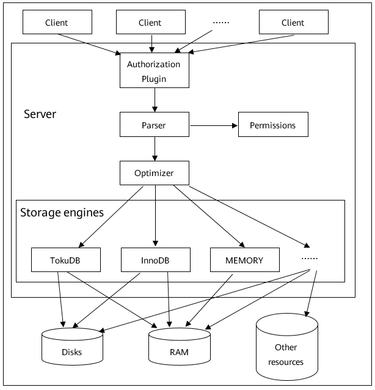

# 搭建数据库服务器
<!-- TOC -->

- [搭建数据库服务器](#搭建数据库服务器)
    - [PostgreSql服务器](#postgresql服务器)
        - [软件介绍](#软件介绍)
        - [配置环境](#配置环境)
        - [安装、运行和卸载](#安装运行和卸载)
        - [管理数据库角色](#管理数据库角色)
        - [管理数据库](#管理数据库)
    - [Mariadb服务器](#mariadb服务器)
        - [软件介绍](#软件介绍-1)
        - [配置环境](#配置环境-1)
        - [安装、运行和卸载](#安装运行和卸载-1)
        - [管理数据库用户](#管理数据库用户)
        - [管理数据库](#管理数据库-1)
    - [MySQL服务器](#mysql服务器)
        - [软件介绍](#软件介绍-2)
        - [配置环境](#配置环境-2)
        - [安装、运行和卸载](#安装运行和卸载-2)
        - [管理数据库用户](#管理数据库用户-1)
        - [管理数据库](#管理数据库-2)

<!-- /TOC -->
## PostgreSql服务器
### 软件介绍

PostgreSQL的架构如[图1](#fig26022387391)所示，主要进程说明如[表1](#table62020913417)所示。

**图 1**  PostgreSql架构<a name="fig26022387391"></a>  


**表 1**  PostgreSql中的主要进程说明

<a name="table62020913417"></a>
<table><thead align="left"><tr id="row23365171"><th class="cellrowborder" valign="top" width="7.07%" id="mcps1.2.4.1.1"><p id="p13530737"><a name="p13530737"></a><a name="p13530737"></a>进程类别</p>
</th>
<th class="cellrowborder" valign="top" width="21.21%" id="mcps1.2.4.1.2"><p id="p22247923"><a name="p22247923"></a><a name="p22247923"></a>进程名称</p>
</th>
<th class="cellrowborder" valign="top" width="71.72%" id="mcps1.2.4.1.3"><p id="p57251362"><a name="p57251362"></a><a name="p57251362"></a>说明</p>
</th>
</tr>
</thead>
<tbody><tr id="row6848741"><td class="cellrowborder" valign="top" width="7.07%" headers="mcps1.2.4.1.1 "><p id="p17877157"><a name="p17877157"></a><a name="p17877157"></a>主进程</p>
</td>
<td class="cellrowborder" valign="top" width="21.21%" headers="mcps1.2.4.1.2 "><p id="p38763593"><a name="p38763593"></a><a name="p38763593"></a>Postmaster</p>
</td>
<td class="cellrowborder" valign="top" width="71.72%" headers="mcps1.2.4.1.3 "><p id="p52843322"><a name="p52843322"></a><a name="p52843322"></a>Postmaster是整个数据库实例的总控进程，负责启动和关闭该数据库实例。</p>
</td>
</tr>
<tr id="row5827850"><td class="cellrowborder" valign="top" width="7.07%" headers="mcps1.2.4.1.1 "><p id="p2293848"><a name="p2293848"></a><a name="p2293848"></a>常驻进程</p>
</td>
<td class="cellrowborder" valign="top" width="21.21%" headers="mcps1.2.4.1.2 "><p id="p51584039"><a name="p51584039"></a><a name="p51584039"></a>Postgres（常驻进程）</p>
</td>
<td class="cellrowborder" valign="top" width="71.72%" headers="mcps1.2.4.1.3 "><p id="p17557663"><a name="p17557663"></a><a name="p17557663"></a>管理后端的常驻进程，也称为“postmaster”。其默认侦听UNIXDomain Socket和TCP/IP（Windows等，一部分的平台只侦听TCP/IP）的5432端口，等待来自前端的的连接处理。侦听的端口号可以在PostgreSql的设置文件postgresql.conf中修改。</p>
</td>
</tr>
<tr id="row23801241"><td class="cellrowborder" valign="top" width="7.07%" headers="mcps1.2.4.1.1 "><p id="p48852384"><a name="p48852384"></a><a name="p48852384"></a>子进程</p>
</td>
<td class="cellrowborder" valign="top" width="21.21%" headers="mcps1.2.4.1.2 "><p id="p64729060"><a name="p64729060"></a><a name="p64729060"></a>Postgres（子进程）</p>
</td>
<td class="cellrowborder" valign="top" width="71.72%" headers="mcps1.2.4.1.3 "><p id="p8562508"><a name="p8562508"></a><a name="p8562508"></a>子进程根据pg_hba.conf定义的安全策略来判断是否允许进行连接，根据策略，会拒绝某些特定的IP及网络，或者也可以只允许某些特定的用户或者对某些数据库进行连接。</p>
<p id="p9953713"><a name="p9953713"></a><a name="p9953713"></a>Postgres会接受前端过来的查询，然后对数据库进行检索，最后把结果返回，有时也会对数据库进行更新。更新的数据同时还会记录在事务日志里面（PostgreSQL称为WAL日志）。这个主要是当停电、服务器宕机、重新启动的时候进行恢复处理的时候使用。另外，把日志归档保存起来，可在需要进行恢复的时候使用。在PostgreSQL 9.0以后，通过把WAL日志传送其他的postgreSQL，可以实时的进行数据库复制，这就是所谓的“数据库复制”功能。</p>
</td>
</tr>
<tr id="row22474561"><td class="cellrowborder" rowspan="7" valign="top" width="7.07%" headers="mcps1.2.4.1.1 "><p id="p8500138"><a name="p8500138"></a><a name="p8500138"></a>辅助进程</p>
</td>
<td class="cellrowborder" valign="top" width="21.21%" headers="mcps1.2.4.1.2 "><p id="p17422576"><a name="p17422576"></a><a name="p17422576"></a>SysLogger（系统日志）</p>
</td>
<td class="cellrowborder" valign="top" width="71.72%" headers="mcps1.2.4.1.3 "><p id="p1942522"><a name="p1942522"></a><a name="p1942522"></a>需要在Postgres.conf中logging_collection设置为on，此时主进程才会启动Syslogger辅助进程。</p>
</td>
</tr>
<tr id="row17482700"><td class="cellrowborder" valign="top" headers="mcps1.2.4.1.1 "><p id="p6812600"><a name="p6812600"></a><a name="p6812600"></a>BgWriter（后台写）</p>
</td>
<td class="cellrowborder" valign="top" headers="mcps1.2.4.1.2 "><p id="p14949724"><a name="p14949724"></a><a name="p14949724"></a>把共享内存中的脏页写到磁盘上的进程。主要是为了提高插入、更新和删除数据的性能。</p>
</td>
</tr>
<tr id="row329795"><td class="cellrowborder" valign="top" headers="mcps1.2.4.1.1 "><p id="p26713455"><a name="p26713455"></a><a name="p26713455"></a>WALWriter（预写式日志）</p>
</td>
<td class="cellrowborder" valign="top" headers="mcps1.2.4.1.2 "><p id="p16306280"><a name="p16306280"></a><a name="p16306280"></a>在修改数据之前把修改操作记录到磁盘中，以便后面更新实时数据时就不需要数据持久化到文件中。</p>
</td>
</tr>
<tr id="row12538797"><td class="cellrowborder" valign="top" headers="mcps1.2.4.1.1 "><p id="p9009603"><a name="p9009603"></a><a name="p9009603"></a>PgArch（归档）</p>
</td>
<td class="cellrowborder" valign="top" headers="mcps1.2.4.1.2 "><p id="p58689242"><a name="p58689242"></a><a name="p58689242"></a>WAL日志会被循环使用，PgArch在归档前会把WAL日志备份出来。通过PITY（Point in Time Recovery）技术，可以对数据库进行一次全量备份后，该技术将备份时间点之后的WAL日志通过归档进行备份，使用数据库的全量备份再加上后面产生的WAL日志，即可把数据库向前推到全量备份后的任意一个时间点。</p>
</td>
</tr>
<tr id="row58441133"><td class="cellrowborder" valign="top" headers="mcps1.2.4.1.1 "><p id="p36111336"><a name="p36111336"></a><a name="p36111336"></a>AutoVacuum（系统自动清理）</p>
</td>
<td class="cellrowborder" valign="top" headers="mcps1.2.4.1.2 "><p id="p39337079"><a name="p39337079"></a><a name="p39337079"></a>在PostgreSQL数据库中，对表进行DELETE操作后，旧的数据并不会立即被删除，并且，在更新数据时，也并不会在旧的数据上做更新，而是新生成一行数据。旧的数据只是被标识为删除状态，只有在没有并发的其他事务读到这些就数据时，它们才会被清除。这个清除工作就由AutoVacuum进程完成。</p>
</td>
</tr>
<tr id="row18489394"><td class="cellrowborder" valign="top" headers="mcps1.2.4.1.1 "><p id="p21245915"><a name="p21245915"></a><a name="p21245915"></a>PgStat（统计收集）</p>
</td>
<td class="cellrowborder" valign="top" headers="mcps1.2.4.1.2 "><p id="p43197516"><a name="p43197516"></a><a name="p43197516"></a>做数据的统计收集工作。主要用于查询优化时的代价估算，包括一个表和索引进行了多少次的插入、更新、删除操作，磁盘块读写的次数、行的读次数。pg_statistic中存储了PgStat收集的各类信息。</p>
</td>
</tr>
<tr id="row53233327"><td class="cellrowborder" valign="top" headers="mcps1.2.4.1.1 "><p id="p16932256"><a name="p16932256"></a><a name="p16932256"></a>CheckPoint（检查点）</p>
</td>
<td class="cellrowborder" valign="top" headers="mcps1.2.4.1.2 "><p id="p29335534"><a name="p29335534"></a><a name="p29335534"></a>检查点是系统设置的事务序列点，设置检查点保证检查点前的日志信息刷到磁盘中。</p>
</td>
</tr>
</tbody>
</table>

### 配置环境

> **说明：**   
>以下环境配置仅为参考示例，具体配置视实际需求做配置  
#### 关闭防火墙并取消开机自启动

> **说明：**   
>测试环境下通常会关闭防火墙以避免部分网络因素影响，视实际需求做配置。  

1.  在root权限下停止防火墙。

    ```
    # systemctl stop firewalld
    ```

2.  在root权限下关闭防火墙。

    ```
    # systemctl disable firewalld
    ```

    > **说明：**   
    >执行disable命令关闭防火墙的同时，也取消了开机自启动。  


#### 修改SELINUX为disabled

1.  在root权限下修改配置文件。

    ```
    # sed -i 's/SELINUX=enforcing/SELINUX=disabled/g' /etc/sysconfig/selinux
    ```


#### 创建组和用户

> **说明：**   
>服务器环境下，为了系统安全，通常会为进程分配单独的用户，以实现权限隔离。本章节创建的组和用户都是操作系统层面的，不是数据库层面的。  

1.  在root权限下创建PostgreSQL用户（组）。

    ```
    # groupadd  postgres
    ```

    ```
    # useradd  -g postgres postgres
    ```

2.  在root权限下设置postgres用户密码（重复输入密码）。

    ```
    # passwd postgres
    ```


#### 搭建数据盘

> **说明：**   
>-   测试极限性能时，建议单独挂载IO性能更优的NVME SSD存储介质创建PostgreSQL测试实例，避免磁盘IO对性能测试结果的影响，本文以单独挂载NVME SSD为例，参考步骤1\~步骤4。  
>-   非性能测试时，在root权限下执行以下命令，创建数据目录即可。然后跳过本小节：  
>    \# mkdir /data  

1.  在root权限下创建文件系统（以xfs为例，根据实际需求创建文件系统），若磁盘之前已做过文件系统，执行此命令会出现报错，可使用-f参数强制创建文件系统。

    ```
    # mkfs.xfs /dev/nvme0n1
    ```

2.  在root权限下创建数据目录。

    ```
    # mkdir /data
    ```

3.  在root权限下挂载磁盘。

    ```
    # mount -o noatime,nobarrier /dev/nvme0n1 /data
    ```


#### 数据目录授权

1.  在root权限下修改目录权限。

    ```
    # chown -R postgres:postgres /data/
    ```


### 安装、运行和卸载<a name="安装运行和卸载"></a>
#### 安装

1.  配置本地yum源，详细信息请参考[搭建repo服务器](./搭建repo服务器.html)。
2.  清除缓存。

    ```
    $ dnf clean all
    ```

3.  创建缓存。

    ```
    $ dnf makecache
    ```

4.  在root权限下安装PostgreSQL服务器。

    ```
    # dnf install postgresql-server
    ```

5.  查看安装后的rpm包。

    ```
    $ rpm -qa | grep postgresql
    ```


#### 运行
##### 初始化数据库

> **须知：**   
>此步骤在postgres用户下操作。  

1.  切换到已创建的PostgreSQL用户。

    ```
    # su - postgres
    ```

2.  初始化数据库，其中命令中的/usr/bin是命令initdb所在的目录。

    ```
    $ /usr/bin/initdb -D /data/
    ```


##### 启动数据库

1.  启动PostgreSQL数据库。

    ```
    $ /usr/bin/pg_ctl -D /data/ -l /data/logfile start
    ```

2.  确认PostgreSQL数据库进程是否正常启动。

    ```
    $ ps -ef | grep postgres
    ```

    命令执行后，打印信息如下图所示，PostgreSQL相关进程已经正常启动了。

    


##### 登录数据库

1.  登录数据库。

    ```
    $ /usr/bin/psql -U postgres
    ```

    

    > **说明：**   
    >初次登录数据库，无需密码。  


##### 配置数据库账号密码

1.  登录后，设置postgres密码。

    ```
    postgres=#alter user postgres with password '123456';
    ```

    


##### 退出数据库

1.  执行\\q退出数据库。

    ```
    postgres=#\q
    ```


##### 停止数据库

1.  停止PostgreSQL数据库。

    ```
    $ /usr/bin/pg_ctl -D /data/ -l /data/logfile stop
    ```


#### 卸载

1.  在postgres用户下停止数据库。

    ```
    $ /usr/bin/pg_ctl -D /data/ -l /data/logfile stop
    ```

2.  在root用户下执行**dnf remove postgresql-server**卸载PostgreSQL数据库。

    ```
    # dnf remove postgresql-server
    ```


### 管理数据库角色
#### 创建角色

可以使用CREATE ROLE语句或createuser来创建角色。createuser是对CREATE ROLE命令的封装，需要在shell界面执行，而不是在数据库界面。

```
CREATE ROLE rolename [ [ WITH ] option [ ... ] ];
```

```
createuser rolename
```

其中：

-   rolename：角色名。
-   option为参数选项，常用的有：
    -   SUPERUSER | NOSUPERUSER：决定一个新角色是否为"超级用户"，若未指定，则默认为NOSUPERUSER，即不是超级用户。
    -   CREATEDB | NOCREATEDB：定义一个角色是否能创建数据库，若未指定，则默认为NOCREATEDB，即不能创建数据库。
    -   CREATEROLE | NOCREATEROLE：决定一个角色是否可以创建新角色，若未指定，则默认为NOCREATEROLE，即不能创建新角色。
    -   INHERIT | NOINHERIT：决定一个角色是否"继承"它所在组的角色的权限。一个带有 INHERIT 属性的角色可以自动使用已经赋与它直接或间接所在组的任何权限。若未指定，则默认为INHERIT。
    -   LOGIN | NOLOGIN：决定一个角色是否可以登录，一个拥有LOGIN属性的角色可以认为是一个用户，若无此属性的角色可以用于管理数据库权限，但是并不是用户，若未指定，则默认为NOLOGIN。但若创建角色是使用的是CREATE USER而不是CREATE ROLE，则默认是LOGIN属性。
    -   \[ ENCRYPTED | UNENCRYPTED \] PASSWORD 'password'：设置角色的密码，密码只对那些拥有 LOGIN 属性的角色有意义。ENCRYPTED | UNENCRYPTED表示是否对密码进行加密，若未指定，则默认为ENCRYPTED，即加密。
    -   VALID UNTIL 'timestamp'：角色的密码失效的时间戳，若为指定，则表示密码永久有效。
    -   IN ROLE rolename1：列出一个或多个现有的角色，新角色rolename将立即加入这些角色，成为rolename1的成员。
    -   ROLE rolename2：列出一个或多个现有的角色，它们将自动添加为新角色rolename的成员，即新角色为"组"。


要使用这条命令，必须拥有 CREATEROLE 权限或者是数据库超级用户。

##### 示例

\#创建一个可以登录的角色roleexample1。

```
postgres=# CREATE ROLE roleexample1 LOGIN;
```

\#创建一个密码为123456的角色roleexample2。

```
postgres=# CREATE ROLE roleexample2 WITH LOGIN PASSWORD '123456';
```

\#创建角色名为roleexample3的角色。。

```
[postgres@localhost ~]$ createuser roleexample3
```

#### 查看角色

可以使用SELECT语句或psql的元命令\\du查看角色。

```
SELECT rolename FROM pg_roles;
```

```
\du
```

其中：rolename：角色名。

##### 示例

\#查看roleexample1角色。

```
postgres=# SELECT roleexample1 from pg_roles;
```

\#查看现有角色。

```
postgres=# \du
```

#### 修改角色

##### 修改用户名

可以使用ALTER ROLE语句修改一个已经存在的角色名。

```
ALTER ROLE oldrolername RENAME TO newrolename;
```

其中：

-   oldrolername：旧的角色名。
-   newrolename：新的角色名。

##### 修改用户示例

\#将角色名roleexample1修改为roleexapme2。

```
postgres=# ALTER ROLE roleexample1 RENAME TO roleexample2;
```

##### 修改用户密码

可以使用ALTER ROLE语句修改一个角色的登录密码。

```
ALTER ROLE rolename PASSWORD 'password'
```

其中：

-   rolename：角色名。
-   password：密码。

##### 修改角色密码示例

\#将roleexample1的密码修改为456789。

```
postgres=# ALTER ROLE roleexample1 WITH PASSWORD '456789';
```

#### 删除角色

可以使用DROP ROLE语句或dropuser来删除角色。dropuser是对DROP ROLE命令的封装，需要在shell界面执行，而不是在数据库界面。

```
DROP ROLE rolename;
```

```
dropuser rolename
```

其中：rolename：角色名。

##### 示例

\#删除userexample1角色。

```
postgres=# DROP ROLE userexample1;
```

\#删除userexample2角色。。

```
[postgres@localhost ~]$ dropuser userexample2
```

#### 角色授权

可以使用GRANT语句来对角色授权。

对角色授予表的操作权限：

```
GRANT { { SELECT | INSERT | UPDATE | DELETE | REFERENCES | TRIGGER } [,...] | ALL [ PRIVILEGES ] } ON [ TABLE ] tablename [, ...] TO { rolename | GROUP groupname | PUBLIC } [, ...] [ WITH GRANT OPTION ]
```

对角色授予序列的操作权限：

```
GRANT { { USAGE | SELECT | UPDATE } [,...] | ALL [ PRIVILEGES ] } ON SEQUENCE sequencename [, ...] TO { rolename | GROUP groupname | PUBLIC } [, ...] [ WITH GRANT OPTION ] 
```

对角色授予数据库的操作权限：

```
GRANT { { CREATE | CONNECT | TEMPORARY | TEMP } [,...] | ALL [ PRIVILEGES ] } ON DATABASE databasename [, ...] TO { rolename | GROUP groupname | PUBLIC } [, ...] [ WITH GRANT OPTION ]  
```

对角色授予函数的操作权限：

```
GRANT { EXECUTE | ALL [ PRIVILEGES ] } ON FUNCTION funcname ( [ [ argmode ] [ argname ] argtype [, ...] ] ) [, ...] TO { rolename | GROUP groupname | PUBLIC } [, ...] [ WITH GRANT OPTION ]  
```

对角色授予过程语言的操作权限：

```
GRANT { USAGE | ALL [ PRIVILEGES ] } ON LANGUAGE langname [, ...] TO { rolename | GROUP groupname | PUBLIC } [, ...] [ WITH GRANT OPTION ]  
```

对角色授予模式的操作权限：

```
GRANT { { CREATE | USAGE } [,...] | ALL [ PRIVILEGES ] } ON SCHEMA schemaname [, ...] TO { rolename | GROUP groupname | PUBLIC } [, ...] [ WITH GRANT OPTION ]  
```

对角色授予表空间的操作权限：

```
GRANT { CREATE | ALL [ PRIVILEGES ] } ON TABLESPACE tablespacename [, ...] TO { rolename | GROUP groupname | PUBLIC } [, ...] [ WITH GRANT OPTION ] 
```

将角色rolename1的成员关系赋予角色rolename2：

```
GRANT rolename1 [, ...] TO rolename2 [, ...] [ WITH ADMIN OPTION ]
```

其中：

-   SELECT、INSERT、UPDATE、DELETE、REFERENCES、TRIGGER、USAGE、CREATE、CONNECT、TEMPORARY、TEMP、EXECUTE、ALL \[ PRIVILEGES \]：用户的操作权限，ALL \[ PRIVILEGES \]表示所有的权限，PRIVILEGES关键字在 PostgreSQL里是可选的，但是严格的SQL 要求有这个关键字。
-   ON字句：用于指定权限授予的对象。
-   tablename：表名。
-   TO字句：用来指定被赋予权限的角色。
-   rolename、rolename1、rolename2：角色名。
-   groupname：角色组名。
-   PUBLIC：表示该权限要赋予所有角色，包括那些以后可能创建的用户。
-   WITH GRANT OPTION：表示权限的接收者也可以将此权限赋予他人，否则就不能授权他人。该选项不能赋予给PUBLIC。
-   sequencename：序列名。
-   databasename：数据库名。
-   funcname \( \[ \[ argmode \] \[ argname \] argtype \[, ...\] \] \)：函数名及其参数。
-   langname：过程语言名。
-   schemaname：模式名。
-   tablespacename：表空间名。
-   WITH ADMIN OPTION：表示成员随后就可以将角色的成员关系赋予其它角色，以及撤销其它角色的成员关系。

##### 示例

\#对userexample授予数据库database1的CREATE权限。

```
postgres=# GRANT CREATE ON DATABASE database1 TO userexample; 
```

\#对所有用户授予表table1的所有权限。

```
postgres=# GRANT ALL PRIVILEGES ON TABLE table1 TO PUBLIC; 
```

#### 删除用户权限

可以使用REVOKE语句来撤销以前赋予一个或多个角色的权限。

撤销角色对表的操作权限：

```
REVOKE [ GRANT OPTION FOR ] { { SELECT | INSERT | UPDATE | DELETE | REFERENCES | TRIGGER } [,...] | ALL [ PRIVILEGES ] } ON [ TABLE ] tablename [, ...] FROM { rolename | GROUP groupname | PUBLIC } [, ...]
```

撤销角色对序列的操作权限：

```
REVOKE [ GRANT OPTION FOR ] { { USAGE | SELECT | UPDATE } [,...] | ALL [ PRIVILEGES ] } ON SEQUENCE sequencename [, ...] FROM { rolename | GROUP groupname | PUBLIC } [, ...] [ CASCADE | RESTRICT ]  
```

撤销角色对数据库的操作权限：

```
REVOKE [ GRANT OPTION FOR ] { { CREATE | CONNECT | TEMPORARY | TEMP } [,...] | ALL [ PRIVILEGES ] } ON DATABASE databasename [, ...] FROM { rolename | GROUP groupname | PUBLIC } [, ...] [ CASCADE | RESTRICT ] 
```

撤销角色对函数的操作权限：

```
REVOKE [ GRANT OPTION FOR ] { EXECUTE | ALL [ PRIVILEGES ] } ON FUNCTION funcname ( [ [ argmode ] [ argname ] argtype [, ...] ] ) [, ...] FROM { rolename | GROUP groupname | PUBLIC } [, ...] [ CASCADE | RESTRICT ] 
```

撤销角色对过程语言的操作权限：

```
REVOKE [ GRANT OPTION FOR ] { USAGE | ALL [ PRIVILEGES ] } ON LANGUAGE langname [, ...] FROM { rolename | GROUP groupname | PUBLIC } [, ...] [ CASCADE | RESTRICT ] 
```

撤销角色对模式的操作权限：

```
REVOKE [ GRANT OPTION FOR ] { { CREATE | USAGE } [,...] | ALL [ PRIVILEGES ] } ON SCHEMA schemaname [, ...] FROM { rolename | GROUP groupname | PUBLIC } [, ...] [ CASCADE | RESTRICT ]  
```

撤销角色对表空间的操作权限：

```
REVOKE [ GRANT OPTION FOR ] { CREATE | ALL [ PRIVILEGES ] } ON TABLESPACE tablespacename [, ...] FROM { rolename | GROUP groupname | PUBLIC } [, ...] [ CASCADE | RESTRICT ] 
```

删除rolename2的rolename1的成员关系：

```
REVOKE [ ADMIN OPTION FOR ] rolename1 [, ...] FROM rolename2 [, ...] [ CASCADE | RESTRICT ]
```

其中：

-   GRANT OPTION FOR：表示只是撤销对该权限的授权的权力，而不是撤销该权限本身。
-   SELECT、INSERT、UPDATE、DELETE、REFERENCES、TRIGGER、USAGE、CREATE、CONNECT、TEMPORARY、TEMP、EXECUTE、ALL \[ PRIVILEGES \]：用户的操作权限，ALL \[ PRIVILEGES \]表示所有的权限，PRIVILEGES关键字在 PostgreSQL里是可选的，但是严格的SQL 要求有这个关键字。
-   ON字句：用于指定撤销权限的对象。
-   tablename：表名。
-   FROM字句：用来指定被撤销权限的角色。
-   rolename、rolename1、rolename2：角色名。
-   groupname：角色组名。
-   PUBLIC：表示撤销隐含定义的、拥有所有角色的组，但并不意味着所有角色都失去了权限，那些直接得到的权限以及通过一个组得到的权限仍然有效。
-   sequencename：序列名。
-   CASCADE：撤销所有依赖性权限。
-   RESTRICT：不撤销所有依赖性权限。
-   databasename：数据库名。
-   funcname \( \[ \[ argmode \] \[ argname \] argtype \[, ...\] \] \)：函数名及其参数。
-   langname：过程语言名。
-   schemaname：模式名。
-   tablespacename：表空间名。
-   ADMIN OPTION FOR：表示传递的授权不会自动收回。

##### 示例

\#对userexample授予数据库database1的CREATE权限。

```
postgres=# GRANT CREATE ON DATABASE database1 TO userexample; 
```

\#对所有用户授予表table1的所有权限。

```
postgres=# GRANT ALL PRIVILEGES ON TABLE table1 TO PUBLIC; 
```

### 管理数据库
#### 创建数据库

可以使用CREATE DATABASE语句或createdb来创建角色。createrdb是对CREATE DATABASE命令的封装，需要在shell界面执行，而不是在数据库界面。

```
CREATE DATABASE databasename;
```

```
createdb databasename
```

其中：databasename为数据库名。

要使用这条命令，必须拥有CREATEDB权限。

##### 示例

\#创建一个数据库database1。

```
postgres=# CREATE DATABASE database1;
```

#### 选择数据库

可以使用\\c语句来选择数据库。

```
\c databasename;
```

其中：databasename为数据库名称。

##### 示例

\#选择databaseexample数据库。

```
postgres=# \c databaseexample;
```

#### 查看数据库

可以使用\\l语句来查看数据库。

```
\l;
```

##### 示例

\#查看所有数据库。

```
postgres=# \l;
```

#### 删除数据库

可以使用DROP DATABASE语句或dropdb来删除数据库。dropdb是对DROP DATABASE命令的封装，需要在shell界面执行，而不是在数据库界面。

> **注意：**   
>删除数据库要谨慎操作，一旦删除，数据库中的所有表和数据都会删除。  

```
DROP DATABASE databasename;
```

```
dropdb databasename
```

其中：databasename为数据库名称。

DROP DATABASE会删除数据库的系统目录项并且删除包含数据的文件目录。

DROP DATABASE只能由超级管理员或数据库拥有者执行。

##### 示例

\#删除databaseexample数据库。

```
postgres=# DROP DATABASE databaseexample;
```

#### 备份数据库

可以使用pg\_dump命令备份数据库，将数据库转储到一个脚本文件或其他归档文件中。

```
pg_dump [option]... [databasename] > outfile
```

其中：

-   databasename：数据库名称。如果没有声明这个参数，那么使用环境变量 PGDATABASE 。如果那个环境变量也没声明，那么使用发起连接的用户名。
-   outfile：数据库备份的文件。
-   option：pg\_dump命令参数选项，多个参数之间可以使用空格分隔。常用的pg\_dump命令参数选项如下：
    -   -f，\-\-file= _filename_ ：指输出到指定的文件。如果忽略，则使用标准输出。
    -   -d，\-\-dbname= _databasename_ ：指定转储的数据库。
    -   -h，\-\-host= _hostname_ ：指定主机名。
    -   -p，\-\-port= _portnumber_ ：指定端口。
    -   -U，\-\-username= _username_ ：指定连接的用户名。
    -   -W，\-\-password：强制口令提示（自动）。


##### 示例

\#备份主机为192.168.202.144，端口为3306，postgres用户下的database1数据库到db1.sql中。

```
[postgres@localhost ~]$ pg_dump -h 192.168.202.144 -p 3306 -U postgres -W database1 > db1.sql
```

#### 恢复数据库

可以使用psql命令恢复数据库。

```
psql [option]... [databasename [username]] < infile
```

其中：

-   databasename：数据库名称。如果没有声明这个参数，那么使用环境变量 PGDATABASE 。如果那个环境变量也没声明，那么使用发起连接的用户名。
-   username：用户名。
-   infile：pg\_dump命令中的outfile参数。
-   option：psql命令参数选项，多个参数之间可以使用空格分隔。常用的psql命令参数选项如下：
    -   -f，\-\-file=filename：指输出到指定的文件。如果忽略，则使用标准输出。
    -   -d，\-\-dbname=databasename：指定转储的数据库。
    -   -h，\-\-host=hostname：指定主机名。
    -   -p，\-\-port=portnumber：指定端口。
    -   -U，\-\-username=username：指定连接的用户名。
    -   -W，\-\-password：强制口令提示（自动）。


psql命令不会自动创建databasename数据库，所以在执行psql恢复数据库之前需要先创建databasename数据库。

##### 示例

\#将db1.sql脚本文件导入到主机为192.168.202.144，端口为3306，postgres用户下newdb数据库中。

```
[postgres@localhost ~]$ createdb newdb
[postgres@localhost ~]$ psql -h 192.168.202.144 -p 3306 -U postgres -W -d newdb < db1.sql
```

## Mariadb服务器
### 软件介绍<a name="软件介绍-1"></a>  

MariaDB数据库管理系统是MySQL的一个分支，主要由开源社区在维护，采用GPL授权许可。MariaDB的目的是完全兼容MySQL，包括API和命令行，使之能轻松成为MySQL的代替品，MariaDB还提供了许多更好的新特性。

MariaDB的架构如[图2](#fig13492418164520)所示。

**图 2**  MariaDB逻辑架构<a name="fig13492418164520"></a>  


当Mariadb接受到Sql语句时，其详细的执行过程如下：

1.  当客户端连接到mariadb的时候，会认证客户端的主机名、用户、密码，认证功能可以做成插件。
2.  如果登录成功，客户端发送sql命令到服务端。由解析器解析sql语句。
3.  服务端检查客户端是否有权限去获取它想要的资源。
4.  如果查询已经存储在query cache当中，那么结果立即返回。
5.  优化器将会找出最快的执行策略，或者是执行计划，也就是说优化器可以决定什么表将会被读，以及哪些索引会被访问，哪些临时表会被使用，一个好的策略能够减少大量的磁盘访问和排序操作等。
6.  存储引擎读写数据和索引文件，cache用来加速这些操作，其他的诸如事物和外键特性，都是在存储引擎层处理的。

存储引擎在物理层管控数据，它负责数据文件、数据、索引、cache等的管理，这使得管理和读取数据变得更高效，每一张表，都有一个.frm文件，这些文件包含着表的定义。

每一个存储引擎管理、存储数据的方式都是不同的，所支持的特性和性能也不尽相同。例如：

-   MyISAM，适合读多写少的环境，且不支持事务，支持全文索引等。
-   noDB，支持事务，支持行锁和外键等。
-   MEMORY，将数据存储在内存当中。
-   CSV，将数据存储为CSV格式。

### 配置环境<a name="配置环境-1"></a>  

> **说明：**   
>以下环境配置仅为参考示例，具体配置视实际需求做配置  
#### 关闭防火墙并取消开机自启动

> **说明：**   
>测试环境下通常会关闭防火墙以避免部分网络因素影响，视实际需求做配置。  

1.  在root权限下停止防火墙。

    ```
    # systemctl stop firewalld
    ```

2.  在root权限下关闭防火墙。

    ```
    # systemctl disable firewalld
    ```

    > **说明：**   
    >执行disable命令关闭防火墙的同时，也取消了开机自启动。  


#### 修改SELINUX为disabled

1.  在root权限下修改配置文件。

    ```
    # sed -i 's/SELINUX=enforcing/SELINUX=disabled/g' /etc/sysconfig/selinux
    ```


#### 创建组和用户

> **说明：**   
>服务器环境下，为了系统安全，通常会为进程分配单独的用户，以实现权限隔离。本章节创建的组和用户都是操作系统层面的，不是数据库层面的。  

1.  在root权限下创建MySQL用户（组）。

    ```
    # groupadd mysql
    ```

    ```
    # useradd -g mysql mysql
    ```

2.  在root权限下设置MySQL用户密码。

    ```
    # passwd mysql
    ```

    重复输入密码（根据实际需求设置密码）。


#### 搭建数据盘

> **说明：**   
>-   进行性能测试时，数据目录使用单独硬盘，需要对硬盘进行格式化并挂载，参考方法一或者方法二  
>-   非性能测试时，在root权限下执行以下命令，创建数据目录即可。然后跳过本小节：  
>    \#mkdir /data  

##### 方法一：在root权限下使用fdisk进行磁盘管理

1.  创建分区（以/dev/sdb为例，根据实际情况创建）

    ```
    # fdisk /dev/sdb
    ```

2.  输入n，按回车确认。
3.  输入p，按回车确认。
4.  输入1，按回车确认。
5.  采用默认配置，按回车确认。
6.  采用默认配置，按回车确认。
7.  输入w，按回车保存。
8.  创建文件系统（以xfs为例，根据实际需求创建文件系统）

    ```
    # mkfs.xfs /dev/sdb1
    ```

9.  挂载分区到“/data”以供操作系统使用。

    ```
    # mkdir /data
    ```

    ```
    # mount /dev/sdb1 /data
    ```

10. 执行命令“vi /etc/fstab", 编辑“/etc/fstab”使重启后自动挂载数据盘。如下图中，添加最后一行内容。

    其中，/dev/nvme0n1p1为示例，具体名称以实际情况为准。

    


##### 方法二：在root权限下使用LVM进行磁盘管理

> **说明：**   
>此步骤需要安装镜像中的lvm2相关包，步骤如下：  
>
>1.  配置本地yum源，详细信息请参考[搭建repo服务器](./搭建repo服务器.html)。如果已经执行，则可跳过此步。  
>2.  在root权限下执行命令安装lvm2。  
>   **\# yum install lvm2**  

1.  创建物理卷（sdb为硬盘名称，具体名字以实际为准）。

    ```
    # pvcreate /dev/sdb
    ```

2.  创建物理卷组（其中datavg为创建的卷组名称，具体名字以实际规划为准）。

    ```
    # vgcreate datavg  /dev/sdb
    ```

3.  创建逻辑卷（其中600G为规划的逻辑卷大小，具体大小以实际情况为准；datalv为创建的逻辑卷的名字，具体名称以实际规划为准。\)。

    ```
    # lvcreate -L 600G -n datalv datavg
    ```

4.  创建文件系统。

    ```
    # mkfs.xfs /dev/datavg/datalv
    ```

5.  创建数据目录并挂载。

    ```
    # mkdir /data
    ```

    ```
    # mount /dev/datavg/datalv /data
    ```

6.  执行命令**vi /etc/fstab**，编辑“/etc/fstab”使重启后自动挂载数据盘。如下图中，添加最后一行内容。

    其中，/dev/datavg/datalv为示例，具体名称以实际情况为准。

    


#### 创建数据库目录并且授权

1.  在已创建的数据目录 **/data** 基础上，使用root权限继续创建进程所需的相关目录并授权MySQL用户（组）。

    ```
    # mkdir -p /data/mariadb
    # cd /data/mariadb
    # mkdir data tmp run log
    # chown -R mysql:mysql /data
    ```


### 安装、运行和卸载<a name="安装运行和卸载-1"></a>
#### 安装

1.  配置本地yum源，详细信息请参考[搭建repo服务器](./搭建repo服务器.html)。
2.  清除缓存。

    ```
    $ dnf clean all
    ```

3.  创建缓存。

    ```
    $ dnf makecache
    ```

4.  在root权限下安装mariadb服务器。

    ```
    # dnf install mariadb-server
    ```

5.  查看安装后的rpm包。

    ```
    $ rpm -qa | grep mariadb
    ```


#### 运行

1.  在root权限下开启mariadb服务器。

    ```
    # systemctl start mariadb
    ```

2.  <a name="li197143190587"></a>在root权限下初始化数据库。

    ```
    # /usr/bin/mysql_secure_installation
    ```

    命令执行过程中需要输入数据库的root设置的密码，若没有密码则直接按“Enter”。然后根据提示及实际情况进行设置。

3.  登录数据库。

    ```
    $ mysql -u root -p
    ```

    命令执行后提示输入密码。密码为[2](#li197143190587)中设置的密码。

    > **说明：**   
    >执行 **\\q** 或者 **exit** 可退出数据库。  


#### 卸载

1.  在root权限下关闭数据库进程。

    ```
    $ ps -ef | grep mysql
    # kill -9 进程ID
    ```

2.  在root权限下执行**dnf remove mariadb-server**命令卸载mariadb。

    ```
    # dnf remove mariadb-server
    ```


### 管理数据库用户<a name="管理数据库用户"></a>  
#### 创建用户

可以使用CREATE USER语句来创建一个或多个用户，并设置相应的口令。

```
CREATE USER 'username'@'hostname' IDENTIFIED BY 'password';
```

其中：

-   username：用户名。
-   host：主机名，即用户连接数据库时所在的主机的名字。若是本地用户可用localhost，若在创建的过程中，未指定主机名，则主机名默认为“%”，表示一组主机。
-   password：用户的登陆密码，密码可以为空，如果为空则该用户可以不需要密码登陆服务器，但从安全的角度而言，不推荐这种做法。

使用CREATE USER语句必须拥有数据库的INSERT权限或全局CREATE USER权限。

使用CREATE USER语句创建一个用户账号后，会在系统自身的数据库的user表中添加一条新记录。若创建的账户已经存在，则语句执行时会出现错误。

新创建的用户拥有的权限很少，只允许进行不需要权限的操作，如使用SHOW语句查询所有存储引擎和字符集的列表等。

##### 示例

\#创建密码为123456，用户名为userexample1的本地用户。

```
> CREATE USER 'userexample1'@'localhost' IDENTIFIED BY '123456';
```

\#创建密码为123456，用户名为userexample2，主机名为192.168.1.100的用户。

```
> CREATE USER 'userexample2'@'192.168.1.100' IDENTIFIED BY '123456';
```

#### 查看用户

可以使用SHOW GRANTS语句或SELECT语句查看一个或多个用户。

查看特定用户：

```
SHOW GRANTS [FOR 'username'@'hostname'];
```

```
SELECT USER,HOST,PASSWORD FROM mysql.user WHERE USER='username';
```

查看所有用户：

```
SELECT USER,HOST,PASSWORD FROM mysql.user;
```

其中：

-   username：用户名。
-   hostname：主机名。

##### 示例

\#查看userexample1用户。

```
> SHOW GRANTS FOR 'userexample1'@'localhost';
```

\#查看mysql数据库中所有用户。

```
> SELECT USER,HOST,PASSWORD FROM mysql.user;
```

#### 修改用户

##### 修改用户名

可以使用RENAME USER语句修改一个或多个已经存在的用户名。

```
RENAME USER 'oldusername'@'hostname' TO 'newusername'@'hostname';
```

其中：

-   oldusername：旧的用户名。
-   newusername：新的用户名。
-   hostname：主机名。

RENAME USER语句用于对原有的账号进行重命名。若系统中旧账号不存在或者新账号已存在，则该语句执行时会出现错误。

使用RENAME USER语句，必须拥有数据库的UPDATE权限或全局CREATE USER权限。

##### 修改用户示例

\#将用户名userexample1修改为userexapme2，主机名为locahost。

```
> RENAME USER 'userexample1'@'localhost' TO 'userexample2'@'localhost';
```

##### 修改用户密码

可以使用SET PASSWORD语句修改一个用户的登录密码。

```
SET PASSWORD FOR 'username'@'hostname' = PASSWORD('newpassword');
```

其中：

-   FOR 'username'@'hostname'：FOR字句，可选项，指定欲修改密码的用户名及主机名。
-   PASSWORD\('newpassword'\)：表示使用函数PASSWORD\(\)设置新口令，即新口令必须传递到函数PASSWORD\(\)中进行加密。

> **注意：**   
>PASSWORD\(\)函数为单向加密函数，一旦加密后不能解密出原明文。  

在SET PASSWORD语句中，若不加上FOR子句，表示修改当前用户的密码。

FOR字句中必须以'username'@'hostname'的格式给定，username为账户的用户名，hostname为账户的主机名。

欲修改密码的账号必须在系统中存在，否则语句执行时会出现错误。

##### 修改用户密码示例

\#将用户名为userexample的密码修改为0123456，主机名为locahost。

```
> SET PASSWORD FOR 'userexample'@'localhost' = PASSWORD('0123456') ;
```

#### 删除用户

可以使用DROP USER语句来删除一个或多个用户账号以及相关的权限。

```
DROP USER 'username1'@'hostname1' [,'username2'@'hostname2']…;
```

> **注意：**   
>用户的删除不会影响他们之前所创建的表、索引或其他数据库对象，因为数据库并不会记录创建了这些对象的账号。  

DROP USER语句可用于删除一个或多个数据库账号，并删除其原有权限。

使用DROP USER语句必须拥有数据库的DELETE权限或全局CREATE USER权限。

在DROP USER语句的使用中，若没有明确地给出账号的主机名，则该主机名默认为“%”。

##### 示例

\#删除用户名为userexample的本地用户。

```
> DROP USER 'userexample'@'localhost';
```

#### 用户授权

可以使用GRANT语句来对新建用户的授权。

```
GRANT privileges ON databasename.tablename TO 'username'@'hostname';
```

其中：

-   ON字句：用于指定权限授予的对象和级别。
-   privileges：用户的操作权限，如SELECT，INSERT，UPDATE等，如果要授予所有的权限则使用ALL。
-   databasename：数据库名。
-   tablename：表名。
-   TO字句：用来设定用户密码，以及指定被赋予权限的用户。
-   username：用户名。
-   hostname：主机名。

如果要授予该用户对所有数据库和表的相应操作权限则可用\*表示，如\*.\*。

如果在TO子句中给系统中存在的用户指定密码，则新密码会将原密码覆盖。

如果权限被授予给一个不存在的用户，则会自动执行一条CREATE USER语句来创建这个用户，但同时必须为该用户指定密码。

##### 示例

\#对本地用户userexample授予SELECT和INSERT权限。

```
> GRANT SELECT,INSERT ON *.* TO 'userexample'@'localhost'; 
```

#### 删除用户权限

可以使用REVOKE语句来删除一个用户的权限，但此用户不会被删除。

```
REVOKE privilege ON databasename.tablename FROM 'username'@'hostname';
```

其中REVOKE语句的参数与GRANT语句的参数含义相同。

要使用 REVOKE 语句，必须拥有数据库的全局CREATE USER权限或UPDATE权限。

##### 示例

\#删除本地用户userexample的INSERT权限。

```
> REVOKE INSERT ON *.* FROM 'userexample'@'localhost';
```

### 管理数据库<a name="管理数据库-1"></a>  
#### 创建数据库

可以使用CREATE DATABASE语句来创建数据库。

```
CREATE DATABASE databasename;
```

其中：databasename为数据库名称，且数据库名称不区分大小写。

##### 示例

\#创建数据库名为databaseexample的数据库。

```
> CREATE DATABASE databaseexample;
```

#### 查看数据库

可以使用SHOW DATABASES语句来查看数据库。

```
SHOW DATABASES;
```

##### 示例

\#查看所有数据库。

```
> SHOW DATABASES;
```

#### 选择数据库

一般创建表，查询表等操作首先需要选择一个目标数据库。可以使用USE语句来选择数据库。

```
USE databasename;
```

其中：databasename为数据库名称。

##### 示例

\#选择databaseexample数据库。

```
> USE databaseexample;
```

#### 删除数据库

可以使用DROP DATABASE语句来删除数据库。

> **注意：**   
>删除数据库要谨慎操作，一旦删除，数据库中的所有表和数据都会删除。  

```
DROP DATABASE databasename;
```

其中：databasename为数据库名称。

DROP DATABASE命令用于删除创建过\(已存在\)的数据库，且会删除数据库中的所有表，但数据库的用户权限不会自动删除。

要使用DROP DATABASE，您需要数据库的DROP权限。

DROP SCHEMA是DROP DATABASE的同义词。

##### 示例

\#删除databaseexample数据库。

```
> DROP DATABASE databaseexample;
```

#### 备份数据库

可以在root权限下使用mysqldump命令备份数据库。

备份一个或多个表：

```
mysqldump [options] databasename [tablename ...] > outfile
```

备份一个或多个库：

```
mysqldump [options] -databases databasename ... > outfile
```

备份所有库：

```
mysqldump [options] -all-databases > outputfile
```

其中：

-   databasename：数据库名称。
-   tablename：数据表名称。
-   outfile：数据库备份的文件。
-   options：mysqldump命令参数选项，多个参数之间可以使用空格分隔。常用的mysqldump命令参数选项如下：
    -   -u, \-\-user= _username_ ：指定用户名。
    -   -p, \-\-password\[= _password_\]：指定密码。
    -   -P, \-\-port= _portnumber_ ：指定端口。
    -   -h, \-\-host= _hostname_ ：指定主机名。
    -   -r, \-\-result-file= _filename_ ：将导出结果保存到指定的文件中，等同于“\>”。
    -   -t：只备份数据。
    -   -d：只备份表结构。


##### 示例

\#备份主机为192.168.202.144，端口为3306，root用户下的所有数据库到alldb.sql中。

```
# mysqldump -h 192.168.202.144 -P 3306 -uroot -p123456 --all-databases > alldb.sql
```

\#备份主机为192.168.202.144，端口为3306，root用户下的db1数据库到db1.sql中。

```
# mysqldump -h 192.168.202.144 -P 3306 -uroot -p123456 --databases db1 > db1.sql
```

\#备份主机为192.168.202.144，端口为3306，root用户下的db1数据库的tb1表到db1tb1.sql中。

```
# mysqldump -h 192.168.202.144 -P 3306 -uroot -p123456 db1 tb1 > db1tb1.sql
```

\#只备份主机为192.168.202.144，端口为3306，root用户下的db1数据库的表结构到db1.sql中。

```
# mysqldump -h 192.168.202.144 -P 3306 -uroot -p123456 -d db1 > db1.sql
```

\#只备份主机为192.168.202.144，端口为3306，root用户下的db1数据库的数据到db1.sql中。

```
# mysqldump -h 192.168.202.144 -P 3306 -uroot -p123456 -t db1 > db1.sql
```

#### 恢复数据库

可以在root权限下使用mysql命令恢复数据库。

恢复一个或多个表：

```
mysql -h hostname -P portnumber -u username -ppassword databasename < infile
```

其中：

-   hostname：主机名。
-   portnumber：端口号。
-   username：用户名。
-   password：密码。
-   databasename：数据库名。
-   infile：mysqldump命令中的outfile参数。

##### 示例

\#恢复数据库。

```
# mysql -h 192.168.202.144 -P 3306 -uroot -p123456 -t db1 < db1.sql
```

## MySQL服务器
### 软件介绍<a name="软件介绍-2"></a>  

MySQL是一个关系型数据库管理系统，由瑞典MySQL AB公司开发，目前属于Oracle旗下产品。MySQL是业界最流行的RDBMS \(Relational Database Management System，关系数据库管理系统\)之一，尤其在WEB应用方面。

关系数据库将数据保存在不同的表中，而不是将所有数据放在一个大仓库内，这样就加快了速度并提高了灵活性。

MySQL所使用的SQL语言是用于访问数据库的最常用标准化语言。MySQL软件采用了双授权模式，分为社区版和商业版，由于其体积小、速度快、总体拥有成本低，尤其是开放源码这一特点，一般中小型网站的开发都选择MySQL作为网站数据库。

### 配置环境<a name="配置环境-2"></a>  

> **说明：**   
>以下环境配置仅为参考示例，具体配置视实际需求做配置  
#### 关闭防火墙并取消开机自启动

> **说明：**   
>测试环境下通常会关闭防火墙以避免部分网络因素影响，视实际需求做配置。  

1.  在root权限下停止防火墙。

    ```
    # systemctl stop firewalld
    ```

2.  在root权限下关闭防火墙。

    ```
    # systemctl disable firewalld
    ```

    > **说明：**   
    >执行disable命令关闭防火墙的同时，也取消了开机自启动。  


#### 修改SELINUX为disabled

1.  在root权限下修改配置文件。

    ```
    # sed -i 's/SELINUX=enforcing/SELINUX=disabled/g' /etc/sysconfig/selinux
    ```


#### 创建组和用户

> **说明：**   
>服务器环境下，为了系统安全，通常会为进程分配单独的用户，以实现权限隔离。本章节创建的组和用户都是操作系统层面的，不是数据库层面的。  

1.  在root权限下创建MySQL用户（组）。

    ```
    # groupadd mysql
    ```

    ```
    # useradd -g mysql mysql
    ```

2.  在root权限下设置MySQL用户密码。

    ```
    # passwd mysql
    ```

    重复输入密码（根据实际需求设置密码）。


#### 搭建数据盘

> **说明：**   
>-   进行性能测试时，数据目录使用单独硬盘，需要对硬盘进行格式化并挂载，参考方法一或者方法二  
>-   非性能测试时，在root权限下执行以下命令，创建数据目录即可。然后跳过本小节：  
>    \# mkdir /data  

##### 方法一：在root权限下使用fdisk进行磁盘管理

1.  创建分区（以/dev/sdb为例，根据实际情况创建）

    ```
    # fdisk /dev/sdb
    ```

2.  输入n，按回车确认。
3.  输入p，按回车确认。
4.  输入1，按回车确认。
5.  采用默认配置，按回车确认。
6.  采用默认配置，按回车确认。
7.  输入w，按回车保存。
8.  创建文件系统（以xfs为例，根据实际需求创建文件系统）

    ```
    # mkfs.xfs /dev/sdb1
    ```

9.  挂载分区到“/data”以供操作系统使用。

    ```
    # mkdir /data
    ```

    ```
    # mount /dev/sdb1 /data
    ```

10. 执行命令“vi /etc/fstab", 编辑“/etc/fstab”使重启后自动挂载数据盘。如下图中，添加最后一行内容。

    其中，/dev/nvme0n1p1为示例，具体名称以实际情况为准。

    


##### 方法二：在root权限下使用LVM进行磁盘管理

> **说明：**   
>此步骤需要安装镜像中的lvm2相关包，步骤如下：  
>1.  配置本地yum源，详细信息请参考[搭建repo服务器](./搭建repo服务器.html)。如果已经执行，则可跳过此步。  
>2.  执行命令安装lvm2。  
>    **\#yum install lvm2**  

1.  创建物理卷（sdb为硬盘名称，具体名字以实际为准）。

    ```
    #pvcreate /dev/sdb
    ```

2.  创建物理卷组（其中datavg为创建的卷组名称，具体名字以实际规划为准）。

    ```
    #vgcreate  datavg  /dev/sdb
    ```

3.  创建逻辑卷（其中600G为规划的逻辑卷大小，具体大小以实际情况为准；datalv为创建的逻辑卷的名字，具体名称以实际规划为准。\)。

    ```
    #lvcreate -L 600G -n datalv datavg
    ```

4.  创建文件系统。

    ```
    #mkfs.xfs /dev/datavg/datalv
    ```

5.  创建数据目录并挂载。

    ```
    #mkdir /data
    ```

    ```
    #mount /dev/datavg/datalv /data
    ```

6.  执行命令**vi /etc/fstab**，编辑“/etc/fstab”使重启后自动挂载数据盘。如下图中，添加最后一行内容。

    其中，/dev/datavg/datalv为示例，具体名称以实际情况为准。

    


#### 创建数据库目录并且授权

1.  在已创建的数据目录 **/data** 基础上，使用root权限继续创建进程所需的相关目录并授权MySQL用户（组）。

    ```
    # mkdir -p /data/mysql
    # cd /data/mysql
    # mkdir data tmp run log
    # chown -R mysql:mysql /data
    ```


### 安装、运行和卸载<a name="安装运行和卸载-2"></a>
#### 安装
> **说明：**   
>针对20.03LTS版本，如果用户从mysql-8.0.17-3.oe1版本升级到较新版本，使用rpm -Uvh xxx（其中XXX指具体的版本，例如mysql-8.0.21-1.oe1.aarch64.rpm）命令，升级后功能不可用，可以通过以下两种方式进行版本升级（以mysql-8.0.17-3.oe1升级到mysql-8.0.21-1.oe1举例）：
>
>方法1，执行如下升级命令实现：    
   ``` 
   # rpm -Uvh mysql-8.0.21-1.oe1.aarch64.rpm --noscripts 
   ```
>
>方法2，先卸载旧版本的mysql，再安装新版本的mysql，命令如下：
   ```
   # rpm -e mysql-8.0.17-3.oe1       
   # rpm -ivh mysql-8.0.21-1.oe1.aarch64.rpm
   ``` 

1.  配置本地yum源，详细信息请参考[搭建repo服务器](./搭建repo服务器.html)章节。
2.  清除缓存。

    ```
    $ dnf clean all
    ```

3.  创建缓存。

    ```
    $ dnf makecache
    ```

4.  在root权限下安装MySQL服务器。

    ```
    # dnf install mysql-server
    ```

5.  查看安装后的rpm包。

    ```
    $ rpm -qa | grep mysql-server
    ```


#### 运行

1.  修改配置文件。
    1.  在root权限下创建my.cnf文件，其中文件路径（包括软件安装路径basedir、数据路径datadir等）根据实际情况修改。

        ```
        # vi /etc/my.cnf
        ```

        编辑my.cnf内容如下：

        ```
        [mysqld_safe]
        log-error=/data/mysql/log/mysql.log
        pid-file=/data/mysql/run/mysqld.pid
        [mysqldump]
        quick
        [mysql]
        no-auto-rehash
        [client]
        default-character-set=utf8
        [mysqld]
        basedir=/usr/local/mysql
        socket=/data/mysql/run/mysql.sock
        tmpdir=/data/mysql/tmp
        datadir=/data/mysql/data
        default_authentication_plugin=mysql_native_password
        port=3306
        user=mysql
        ```

    2.  确保my.cnf配置文件修改正确。

        ```
        $ cat /etc/my.cnf
        ```

        

        > **注意：**   
        >其中basedir为软件安装路径，请根据实际情况修改。  

    3.  在root权限下修改/etc/my.cnf文件的组和用户为mysql:mysql

        ```
        # chown mysql:mysql /etc/my.cnf
        ```

2.  配置环境变量。
    1.  安装完成后，在root权限下将MySQL二进制文件路径到PATH。

        ```
        # echo export  PATH=$PATH:/usr/local/mysql/bin  >> /etc/profile
        ```

        > **注意：**   
        >其中PATH中的“/usr/local/mysql/bin“路径，为MySQL软件安装目录下的bin文件的绝对路径。请根据实际情况修改。  

    2.  在root权限下使环境变量配置生效。

        ```
        # source /etc/profile
        ```

3.  <a name="li15634560582"></a>在root权限下初始化数据库。

    > **说明：**   
    >本步骤倒数第2行中有初始密码，请注意保存，登录数据库时需要使用。  

    ```
    # mysqld --defaults-file=/etc/my.cnf --initialize
    2020-03-18T03:27:13.702385Z 0 [System] [MY-013169] [Server] /usr/local/mysql/bin/mysqld (mysqld 8.0.17) initializing of server in progress as process 34014
    2020-03-18T03:27:24.112453Z 5 [Note] [MY-010454] [Server] A temporary password is generated for root@localhost: iNat=)#V2tZu
    2020-03-18T03:27:28.576003Z 0 [System] [MY-013170] [Server] /usr/local/mysql/bin/mysqld (mysqld 8.0.17) initializing of server has completed
    ```

    查看打印信息，打印信息中包括“initializing of server has completed”表示初始化数据库完成，且打印信息中“A temporary password is generated for root@localhost: iNat=\)\#V2tZu”的“iNat=\)\#V2tZu”为初始密码。

4.  启动数据库。

    > **注意：**   
    >如果第一次启动数据库服务，以root用户启动数据库，则启动时会提示缺少mysql.log文件而导致失败。使用mysql用户启动之后，会在/data/mysql/log目录下生成mysql.log文件，再次使用root用户启动则不会报错。  

    1.  在root权限下修改文件权限。

        ```
        # chmod 777 /usr/local/mysql/support-files/mysql.server
        ```

    2.  在root权限下启动MySQL。

        ```
        # cp /usr/local/mysql/support-files/mysql.server /etc/init.d/mysql
        # chkconfig mysql on
        ```

        以mysql用户启动数据库。

        ```
        # su - mysql
        $ service mysql start
        ```

5.  登录数据库。

    > **说明：**   
    >-   提示输入密码时，请输入[3](#li15634560582)产生的初始密码。  
    >-   如果采用官网RPM安装方式，则mysql文件在/usr/bin目录下。登录数据库的命令根据实际情况修改。  

    ```
    $ /usr/local/mysql/bin/mysql -uroot -p  -S /data/mysql/run/mysql.sock
    ```

    

6.  配置数据库帐号密码。
    1.  登录数据库以后，修改通过root用户登录数据库的密码。

        ```
        mysql> alter user 'root'@'localhost' identified by "123456";
        ```

    2.  创建全域root用户（允许root从其他服务器访问）。

        ```
        mysql> create user 'root'@'%' identified by '123456';
        ```

    3.  进行授权。

        ```
        mysql> grant all privileges on *.* to 'root'@'%';
        mysql> flush privileges;
        ```

        

7.  退出数据库。

    执行 **\\q** 或者 **exit** 退出数据库。

    ```
    mysql> exit
    ```

    


#### 卸载

1.  在root权限下关闭数据库进程。

    ```
    $ ps -ef | grep mysql
    # kill -9 进程ID
    ```

2.  在root权限下执行**dnf remove mysql**命令卸载MySQL。

    ```
    # dnf remove mysql
    ```


### 管理数据库用户<a name="管理数据库用户-1"></a>  
#### 创建用户

可以使用CREATE USER语句来创建一个或多个用户，并设置相应的口令。

```
CREATE USER 'username'@'hostname' IDENTIFIED BY 'password';
```

其中：

-   username：用户名。
-   host：主机名，即用户连接数据库时所在的主机的名字。若是本地用户可用localhost，若在创建的过程中，未指定主机名，则主机名默认为“%”，表示一组主机。
-   password：用户的登陆密码，密码可以为空，如果为空则该用户可以不需要密码登陆服务器，但从安全的角度而言，不推荐这种做法。

使用CREATE USER语句必须拥有数据库的INSERT权限或全局CREATE USER权限。

使用CREATE USER语句创建一个用户账号后，会在系统自身的数据库的user表中添加一条新记录。若创建的账户已经存在，则语句执行时会出现错误。

新创建的用户拥有的权限很少，只允许进行不需要权限的操作，如使用SHOW语句查询所有存储引擎和字符集的列表等。

##### 示例

\#创建密码为123456，用户名为userexample1的本地用户。

```
> CREATE USER 'userexample1'@'localhost' IDENTIFIED BY '123456';
```

\#创建密码为123456，用户名为userexample2，主机名为192.168.1.100的用户。

```
> CREATE USER 'userexample2'@'192.168.1.100' IDENTIFIED BY '123456';
```

#### 查看用户

可以使用SHOW GRANTS语句或SELECT语句查看一个或多个用户。

查看特定用户：

```
SHOW GRANTS [FOR 'username'@'hostname'];
```

```
SELECT USER,HOST,PASSWORD FROM mysql.user WHERE USER='username';
```

查看所有用户：

```
SELECT USER,HOST FROM mysql.user;
```

其中：

-   username：用户名。
-   hostname：主机名。

##### 示例

\#查看userexample1用户。

```
> SHOW GRANTS FOR 'userexample1'@'localhost';
```

\#查看mysql数据库中所有用户。

```
> SELECT USER,HOST FROM mysql.user;
```

#### 修改用户

##### 修改用户名

可以使用RENAME USER语句修改一个或多个已经存在的用户名。

```
RENAME USER 'oldusername'@'hostname' TO 'newusername'@'hostname';
```

其中：

-   oldusername：旧的用户名。
-   newusername：新的用户名。
-   hostname：主机名。

RENAME USER语句用于对原有的账号进行重命名。若系统中旧账号不存在或者新账号已存在，则该语句执行时会出现错误。

使用RENAME USER语句，必须拥有数据库的UPDATE权限或全局CREATE USER权限。

##### 修改用户示例

\#将用户名userexample1修改为userexapme2，主机名为locahost。

```
> RENAME USER 'userexample1'@'localhost' TO 'userexample2'@'localhost';
```

##### 修改用户密码

可以使用SET PASSWORD语句修改一个用户的登录密码。

```
SET PASSWORD FOR 'username'@'hostname' = 'newpassword';
```

其中：

-   FOR 'username'@'hostname'：FOR字句，可选项，指定欲修改密码的用户名及主机名。
-   'newpassword'：新密码。

在SET PASSWORD语句中，若不加上FOR子句，表示修改当前用户的密码。

FOR字句中必须以'username'@'hostname'的格式给定，username为账户的用户名，hostname为账户的主机名。

欲修改密码的账号必须在系统中存在，否则语句执行时会出现错误。

##### 修改用户密码示例

\#将用户名为userexample的密码修改为0123456，主机名为locahost。

```
> SET PASSWORD FOR 'userexample'@'localhost' = '0123456';
```

#### 删除用户

可以使用DROP USER语句来删除一个或多个用户账号以及相关的权限。

```
DROP USER 'username1'@'hostname1' [,'username2'@'hostname2']…;
```

> **注意：**   
>用户的删除不会影响他们之前所创建的表、索引或其他数据库对象，因为数据库并不会记录创建了这些对象的账号。  

DROP USER语句可用于删除一个或多个数据库账号，并删除其原有权限。

使用DROP USER语句必须拥有数据库的DELETE权限或全局CREATE USER权限。

在DROP USER语句的使用中，若没有明确地给出账号的主机名，则该主机名默认为“%”。

##### 示例

\#删除用户名为userexample的本地用户。

```
> DROP USER 'userexample'@'localhost';
```

#### 用户授权

可以使用GRANT语句来对新建用户的授权。

```
GRANT privileges ON databasename.tablename TO 'username'@'hostname';
```

其中：

-   ON字句：用于指定权限授予的对象和级别。
-   privileges：用户的操作权限，如SELECT，INSERT，UPDATE等，如果要授予所有的权限则使用ALL。
-   databasename：数据库名。
-   tablename：表名。
-   TO字句：用来设定用户密码，以及指定被赋予权限的用户。
-   username：用户名。
-   hostname：主机名。

如果要授予该用户对所有数据库和表的相应操作权限则可用\*表示，如\*.\*。

如果在TO子句中给系统中存在的用户指定密码，则新密码会将原密码覆盖。

如果权限被授予给一个不存在的用户，则会自动执行一条CREATE USER语句来创建这个用户，但同时必须为该用户指定密码。

##### 示例

\#对本地用户userexample授予SELECT和INSERT权限。

```
> GRANT SELECT,INSERT ON *.* TO 'userexample'@'localhost'; 
```

#### 删除用户权限

可以使用REVOKE语句来删除一个用户的权限，但此用户不会被删除。

```
REVOKE privilege ON databasename.tablename FROM 'username'@'hostname';
```

其中REVOKE语句的参数与GRANT语句的参数含义相同。

要使用 REVOKE 语句，必须拥有数据库的全局CREATE USER权限或UPDATE权限。

##### 示例

\#删除本地用户userexample的INSERT权限。

```
> REVOKE INSERT ON *.* FROM 'userexample'@'localhost';
```

### 管理数据库<a name="管理数据库-2"></a>  
#### 创建数据库

可以使用CREATE DATABASE语句来创建数据库。

```
CREATE DATABASE databasename;
```

其中：databasename为数据库名称，且数据库名称不区分大小写。

##### 示例

\#创建数据库名为databaseexample的数据库。

```
> CREATE DATABASE databaseexample;
```

#### 查看数据库

可以使用SHOW DATABASES语句来查看数据库。

```
SHOW DATABASES;
```

##### 示例

\#查看所有数据库。

```
> SHOW DATABASES;
```

#### 选择数据库

一般创建表，查询表等操作首先需要选择一个目标数据库。可以使用USE语句来选择数据库。

```
USE databasename;
```

其中：databasename为数据库名称。

##### 示例

\#选择databaseexample数据库。

```
> USE databaseexample;
```

#### 删除数据库

可以使用DROP DATABASE语句来删除数据库。

> **注意：**   
>删除数据库要谨慎操作，一旦删除，数据库中的所有表和数据都会删除。  

```
DROP DATABASE databasename;
```

其中：databasename为数据库名称。

DROP DATABASE命令用于删除创建过\(已存在\)的数据库，且会删除数据库中的所有表，但数据库的用户权限不会自动删除。

要使用DROP DATABASE，您需要数据库的DROP权限。

DROP SCHEMA是DROP DATABASE的同义词。

##### 示例

\#删除databaseexample数据库。

```
> DROP DATABASE databaseexample;
```

#### 备份数据库

可以在root权限下使用mysqldump命令备份数据库。

备份一个或多个表：

```
mysqldump [options] databasename [tablename ...] > outfile
```

备份一个或多个库：

```
mysqldump [options] -databases databasename ... > outfile
```

备份所有库：

```
mysqldump [options] -all-databases > outputfile
```

其中：

-   databasename：数据库名称。
-   tablename：数据表名称。
-   outfile：数据库备份的文件。
-   options：mysqldump命令参数选项，多个参数之间可以使用空格分隔。常用的mysqldump命令参数选项如下：
    -   -u, \-\-user= _username_ ：指定用户名。
    -   -p, \-\-password\[= _password_\]：指定密码。
    -   -P, \-\-port= _portnumber_ ：指定端口。
    -   -h, \-\-host= _hostname_ ：指定主机名。
    -   -r, \-\-result-file= _filename_ ：将导出结果保存到指定的文件中，等同于“\>”。
    -   -t：只备份数据。
    -   -d：只备份表结构。


##### 示例

\#备份主机为192.168.202.144，端口为3306，root用户下的所有数据库到alldb.sql中。

```
# mysqldump -h 192.168.202.144 -P 3306 -uroot -p123456 --all-databases > alldb.sql
```

\#备份主机为192.168.202.144，端口为3306，root用户下的db1数据库到db1.sql中。

```
# mysqldump -h 192.168.202.144 -P 3306 -uroot -p123456 --databases db1 > db1.sql
```

\#备份主机为192.168.202.144，端口为3306，root用户下的db1数据库的tb1表到db1tb1.sql中。

```
# mysqldump -h 192.168.202.144 -P 3306 -uroot -p123456 db1 tb1 > db1tb1.sql
```

\#只备份主机为192.168.202.144，端口为3306，root用户下的db1数据库的表结构到db1.sql中。

```
# mysqldump -h 192.168.202.144 -P 3306 -uroot -p123456 -d db1 > db1.sql
```

\#只备份主机为192.168.202.144，端口为3306，root用户下的db1数据库的数据到db1.sql中。

```
# mysqldump -h 192.168.202.144 -P 3306 -uroot -p123456 -t db1 > db1.sql
```

#### 恢复数据库

可以在root权限下使用mysql命令恢复数据库。

恢复一个或多个表：

```
mysql -h hostname -P portnumber -u username -ppassword databasename < infile
```

其中：

-   hostname：主机名。
-   portnumber：端口号。
-   username：用户名。
-   password：密码。
-   databasename：数据库名。
-   infile：mysqldump命令中的outfile参数。

##### 示例

\#恢复数据库。

```
# mysql -h 192.168.202.144 -P 3306 -uroot -p123456 -t db1 < db1.sql
```
