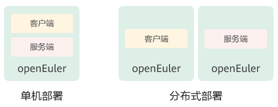

# 安装与部署
本章介绍如何安装和部署A-Tune。

<!-- TOC -->

- [安装与部署](#安装与部署)
    - [软硬件要求](#软硬件要求)
    - [环境准备](#环境准备)
    - [安装A-Tune](#安装a-tune)
        - [安装模式介绍](#安装模式介绍)
        - [安装操作](#安装操作)
    - [部署A-Tune](#部署a-tune)
        - [配置介绍](#配置介绍)
    - [启动A-Tune](#启动a-tune)
    - [启动A-Tune engine](#启动a-tune-engine)
    <!-- /TOC -->

## 软硬件要求

### 硬件要求<a name="section175931749114410"></a>

-   鲲鹏920处理器

### 软件要求<a name="section19201810164619"></a>

-   操作系统：openEuler 20.09

## 环境准备

-   安装openEuler系统，安装方法参考 《openEuler 20.09 安装指南》。

-   安装A-Tune需要使用root权限。

## 安装A-Tune

本章介绍A-Tune的安装模式和安装方法。
### 安装模式介绍

A-Tune支持单机模式和分布式模式安装：

-   单机模式

    client和server安装到同一台机器上。

-   分布式模式

    client和server分别安装在不同的机器上。


两种安装模式的简单图示如下：



### 安装操作

安装A-Tune的操作步骤如下：

1.  挂载openEuler的iso文件。

    ```
    # mount openEuler-20.09-aarch64-dvd.iso /mnt
    ```

2.  配置本地yum源。

    ```
    # vim /etc/yum.repos.d/local.repo
    ```

    配置内容如下所示：

    ```
    [local]
    name=local
    baseurl=file:///mnt
    gpgcheck=1
    enabled=1
    ```

3.  将RPM数字签名的GPG公钥导入系统。

    ```
    # rpm --import /mnt/RPM-GPG-KEY-openEuler
    ```


4. 安装A-Tune服务端。

    > **说明：**   
    >本步骤会同时安装服务端和客户端软件包，对于单机部署模式，请跳过**步骤5**。  

    ```
    # yum install atune -y
    # yum install atune-engine -y
    ```

5.  若为分布式部署，请安装A-Tune客户端。

    ```
    # yum install atune-client -y
    ```

6.  验证是否安装成功。命令和回显如下表示安装成功。

    ```
    # rpm -qa | grep atune
    atune-client-xxx
    atune-db-xxx
    atune-xxx
    atune-engine-xxx
    ```


## 部署A-Tune

本章介绍A-Tune的配置部署。
### 配置介绍

A-Tune配置文件/etc/atuned/atuned.cnf的配置项说明如下：

- A-Tune服务启动配置

    可根据需要进行修改。

    -   protocol：系统grpc服务使用的协议，unix或tcp，unix为本地socket通信方式，tcp为socket监听端口方式。默认为unix。
    -   address：系统grpc服务的侦听地址，默认为unix socket，若为分布式部署，需修改为侦听的ip地址。
    -   port：系统grpc服务的侦听端口，范围为0\~65535未使用的端口。如果protocol配置是unix，则不需要配置。
    -   connect：若为集群部署时，atune所在节点的ip列表，ip地址以逗号分隔。
    -   rest_host：系统rest service的侦听地址，默认为localhost。
    -   rest_port：系统rest service的侦听端口，范围为0~65535未使用的端口，默认为8383。
    -   engine_host：与系统atune engine service链接的地址。
    -   engine_port：与系统atune engine service链接的端口。
    -   sample_num：系统执行analysis流程时采集样本的数量，默认为20。
    -   interval：系统执行analysis流程时采集样本的间隔时间，默认为5s。
    -   grpc_tls：系统grpc的SSL/TLS证书校验开关，默认不开启。开启grpc_tls后，atune-adm命令在使用前需要设置以下环境变量方可与服务端进行通讯：
        -   export ATUNE_TLS=yes
        -   export ATUNED_CACERT=<客户端CA证书路径>
        -   export ATUNED_CLIENTCERT=<客户端证书路径>
        -   export ATUNED_CLIENTKEY=<客户端秘钥路径>
        -   export ATUNED_SERVERCN=server
    -   tlsservercafile：gPRC服务端CA证书路径。
    -   tlsservercertfile：gPRC服务端证书路径。
    -   tlsserverkeyfile：gPRC服务端秘钥路径。
    -   rest_tls：系统rest service的SSL/TLS证书校验开关，默认开启。
    -   tlsrestcacertfile：系统rest service的服务端CA证书路径。
    -   tlsrestservercertfile：系统rest service的服务端证书路径
    -   tlsrestserverkeyfile：系统rest service的服务端秘钥路径。
    -   engine_tls：系统atune engine service的SSL/TLS证书校验开关，默认开启。
    -   tlsenginecacertfile：系统atune engine service的客户端CA证书路径。
    -   tlsengineclientcertfile：系统atune engine service的客户端证书路径
    -   tlsengineclientkeyfile：系统atune engine service的客户端秘钥路径

-   system信息

    system为系统执行相关的优化需要用到的参数信息，必须根据系统实际情况进行修改。

    -   disk：执行analysis流程时需要采集的对应磁盘的信息或执行磁盘相关优化时需要指定的磁盘。
    -   network：执行analysis时需要采集的对应的网卡的信息或执行网卡相关优化时需要指定的网卡。
    
    -   user：执行ulimit相关优化时用到的用户名。目前只支持root用户。
    
-   日志信息

    根据情况修改日志的级别，默认为info级别，日志信息打印在/var/log/messages中。

-   monitor信息

    为系统启动时默认采集的系统硬件信息。
    
-   tuning信息

    tuning为系统进行离线调优时需要用到的参数信息。
    
    -   noise：高斯噪声的评估值。
    -   sel_feature：控制离线调优参数重要性排名输出的开关，默认关闭。


### 配置示例<a name="section616213774714"></a>

```
#################################### server ############################### 
 # atuned config 
 [server] 
 # the protocol grpc server running on 
 # ranges: unix or tcp 
 protocol = unix 

 # the address that the grpc server to bind to
 # default is unix socket /var/run/atuned/atuned.sock
 # ranges: /var/run/atuned/atuned.sock or ip address
 address = /var/run/atuned/atuned.sock 

 # the atune nodes in cluster mode, separated by commas
 # it is valid when protocol is tcp
 # connect = ip01,ip02,ip03

 # the atuned grpc listening port
 # the port can be set between 0 to 65535 which not be used
 # port = 60001

 # the rest service listening port, default is 8383
 # the port can be set between 0 to 65535 which not be used
 rest_host = localhost
 rest_port = 8383

 # the tuning optimizer host and port, start by engine.service
 # if engine_host is same as rest_host, two ports cannot be same
 # the port can be set between 0 to 65535 which not be used
 engine_host = localhost
 engine_port = 3838

 # when run analysis command, the numbers of collected data.
 # default is 20
 sample_num = 20

 # interval for collecting data, default is 5s
 interval = 5

 # enable gRPC authentication SSL/TLS
 # default is false
 # grpc_tls = false
 # tlsservercafile = /etc/atuned/grpc_certs/ca.crt
 # tlsservercertfile = /etc/atuned/grpc_certs/server.crt
 # tlsserverkeyfile = /etc/atuned/grpc_certs/server.key

 # enable rest server authentication SSL/TLS
 # default is true
 rest_tls = true
 tlsrestcacertfile = /etc/atuned/rest_certs/ca.crt
 tlsrestservercertfile = /etc/atuned/rest_certs/server.crt
 tlsrestserverkeyfile = /etc/atuned/rest_certs/server.key

 # enable engine server authentication SSL/TLS
 # default is true
 engine_tls = true
 tlsenginecacertfile = /etc/atuned/engine_certs/ca.crt
 tlsengineclientcertfile = /etc/atuned/engine_certs/client.crt
 tlsengineclientkeyfile = /etc/atuned/engine_certs/client.key


 #################################### log ############################### 
 [log]
 # either "debug", "info", "warn", "error", "critical", default is "info"
 level = info

 #################################### monitor ############################### 
 [monitor]
 # with the module and format of the MPI, the format is {module}_{purpose}
 # the module is Either "mem", "net", "cpu", "storage"
 # the purpose is "topo"
 module = mem_topo, cpu_topo

 #################################### system ############################### 
 # you can add arbitrary key-value here, just like key = value
 # you can use the key in the profile
 [system]
 # the disk to be analysis
 disk = sda

 # the network to be analysis
 network = enp189s0f0

 user = root
 
 #################################### tuning ###############################
 # tuning configs
 [tuning]
 noise = 0.000000001
 sel_feature = false
```

A-Tune engine配置文件/etc/atuned/engine.cnf的配置项说明如下：

- A-Tune engine服务启动配置

  可根据需要进行修改。

  -   engine_host：系统atune engine service的侦听地址，默认为localhost。
  -   engine_port：系统atune engine service的侦听端口，范围为0~65535未使用的端口，默认为3838。
  -   engine_tls：系统atune engine service的SSL/TLS证书校验开关，默认开启。
  -   tlsenginecacertfile：系统atune engine service的服务端CA证书路径。
  -   tlsengineservercertfile：系统atune engine service的服务端证书路径
  -   tlsengineserverkeyfile：系统atune engine service的服务端秘钥路径。

- 日志信息

  根据情况修改日志的级别，默认为info级别，日志信息打印在/var/log/messages中。

### 配置示例<a name="section616213774714"></a>

```
 #################################### engine ###############################
 [server]
 # the tuning optimizer host and port, start by engine.service
 # if engine_host is same as rest_host, two ports cannot be same
 # the port can be set between 0 to 65535 which not be used
 engine_host = localhost
 engine_port = 3838

 # enable engine server authentication SSL/TLS
 # default is true
 engine_tls = true
 tlsenginecacertfile = /etc/atuned/engine_certs/ca.crt
 tlsengineservercertfile = /etc/atuned/engine_certs/server.crt
 tlsengineserverkeyfile = /etc/atuned/engine_certs/server.key

 #################################### log ###############################
 [log]
 # either "debug", "info", "warn", "error", "critical", default is "info"
 level = info
```

## 启动A-Tune

A-Tune安装完成后，需要启动A-Tune服务才能使用。

-   启动atuned服务：

    ```
    # systemctl start atuned
    ```


-   查询atuned服务状态：

    ```
    # systemctl status atuned
    ```

    若回显为如下，则服务启动成功。

    

## 启动A-Tune engine

若需要使用AI相关的功能，需要启动A-Tune engine服务才能使用。

- 启动atune-engine服务：

  ```
  # systemctl start atune-engine
  ```


- 查询atune-engine服务状态：

  ```
  # systemctl status atune-engine
  ```

  若回显为如下，则服务启动成功。

  