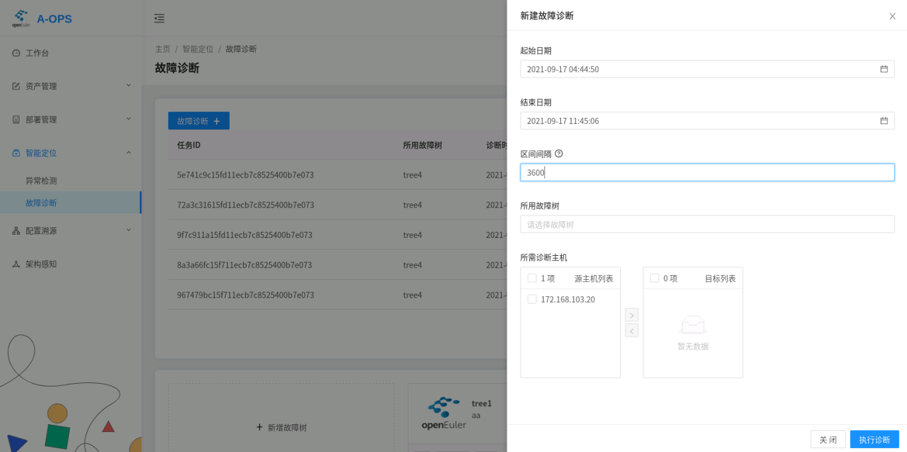

# 故障诊断模块

<!-- TOC -->

- [故障诊断模块](#故障诊断模块)
  - [介绍](#介绍)
  - [架构](#架构)
  - [配置参数](#配置参数)
  - [服务启停和停止](#服务启动和停止)
  - [故障诊断操作](#诊断操作)
  - [FAQ](#FAQ)

<!-- /TOC -->

## 介绍

故障诊断模块负责对异常检测的结果进行组合判断，通过树状图的形式分析、展现出可能出现的故障。

主要分为两个子模块：

1. 诊断调度器模块：负责响应上层用户发来的restful请求，以及生成诊断消息发入消息队列，供诊断执行器执行相应诊断。
2. 诊断执行器模块：负责从消息队列中消费消息，执行诊断后，将诊断结果存入数据库中。

## 架构

系统采用flask-restful开发，架构如下图所示。


## 配置参数

1.在配置文件中对相应参数进行配置，系统的默认配置文件存放在 /etc/aops/diag_scheduler.ini 以及 /etc/aops/diag_executor.ini中，请根据实际情况进行配置更改。

```
vim /etc/aops/diag_scheduler.ini
```

```ini
[producer]
# kafka server 地址，必须使用主机真实ip地址
kafka_server_list=10.0.0.0:9092
# 指定的kafka api版本
api_version=0.11.5
# acks 0表示producer不理睬发送是否成功；1表示需要等待leader成功写入日志才返回；all表示所有副本都写入日志才返回
acks=1
# 消息发送失败后尝试重发的次数
retries=3
# 每次重试间隔多少毫秒
retry_backoff_ms=100

[topic]
# 诊断topic
name=DIAGNOSE_EXECUTE_REQ

[diag_scheduler]
# flask服务启动的ip
ip=127.0.0.1
# flask服务启动的端口号
port=60116

[uwsgi]
# 服务启动脚本
wsgi-file=manage.py
# 操作日志路径
daemonize=/var/log/aops/uwsgi/diag_scheduler.log
# 网络连接超时时间
http-timeout=600
# 服务响应时间
harakiri=600
```

```
vim /etc/aops/diag_executor.ini
```

```ini
[consumer]
# kafka server 地址，必须使用主机真实ip地址
kafka_server_list=10.0.0.0:9092
# 消费者组， 同一组的消费者消费的消息不会重复
group_id=DiagGroup
# 是否自动提交偏移量
enable_auto_commit=False
# 重置偏移量，earliest移到最早的可用消息，latest最新的消息
auto_offset_reset=earliest
# 在buffer中拉取时等待的毫秒
timeout_ms=5
# 一次拉取的消息数量
max_records=3

[topic]
# 消费的诊断topic
name=DIAGNOSE_EXECUTE_REQ
```

## 服务启动和停止

部署好后的诊断调度器以及诊断执行器通过systemctl去启动。

```shell
systemctl start adoctor-diag-scheduler 启动诊断调度器服务

systemctl stop adoctor-diag-scheduler 停止诊断调度器服务

systemctl restart adoctor-diag-scheduler 重启诊断调度器服务
```

```sh
systemctl start adoctor-diag-executor 启动诊断调度器服务

systemctl stop adoctor-diag-executor 停止诊断调度器服务

systemctl restart adoctor-diag-executor 重启诊断调度器服务
```

## 故障诊断操作

诊断模块支持三大类操作：故障树相应操作、诊断操作以及诊断任务相关操作。大部分操作同时支持web界面以及cli命令，根据不同场景可以进行选择。

> 故障诊断主界面如下：

   

1. ##### 故障树相应操作

- 导入故障树

  * web:

   点击“新增故障树” 区域，进入新增故障树子界面，指定诊断树的名称、本地文件以及诊断树描述，将诊断树添加进数据库中：

   

   <div align=left>


  * cli:

    `adoctor faultree --action add --tree_list tree1 --conf [conf.json] [--access_token] [token]`

    * **`必选参数`**

      * **`--conf`**

        action=add时使用，指定故障树文件（json）
      * **`--tree_list`**

        指定插入的诊断树的名字 （注意 只能单棵添加）

      * **`--access_token`**

        授权码
    
    * **`举例`**
    
      * 导入tree1故障树
    
      `adoctor faultree --action add --tree_list tree1 --conf tree1.json --access_token token`

- 查看，导出和删除故障树

  * web:

   在“新增故障树”区域右侧的某一故障树的右下角，点击操作按钮，可以对该树进行删除操作, 导出web端暂不支持；

  点击某一故障树，可以看到故障树的更详细信息，也可以在此界面进行删除：

   <div align=left>
  
  
  
    - cli:
  
      `adoctor faultree [--action] [action] [--tree_list] [list] [--export] [path] [--access_token] [token]`
  
      * **`必选参数`**
  
        * **`--action`**
  
          delete表示删除故障树，get表示获取故障树
  
        * **`--access_token`**
  
          授权码
  
      * **`可选参数`**
  
        * **`--tree_list`**
  
          表示删除或获取指定的故障树，以逗号分隔，get时为空表示所有；delete时为空则不做操作
  
        * **`--export`**
  
          action=get时使用，指定export的路径，可将故障树导出到指定路径
  
      * **`举例`**
  
        * 获取故障树tree1，并导出到tree1.json下
  
          `adoctor faultree --action get --tree_list tree1 --export tree1.json --access_token token`
  
        * 删除故障树tree1
  
          `adoctor faultree --action delete --tree_list tree1 --access_token token`

2. 诊断操作

   > 注：执行故障诊断前请确保诊断模块的两个服务启动正常且与kafka的集群连接正常

- 执行诊断
  
   诊断时，用户需设置4个参数：
   
   1. 所诊断的主机id
   2. 诊断所使用的诊断树
   3. 诊断的时间范围
   4. 诊断的区间间隔，以秒为单位
   
   其中诊断区间间隔用于对大的时间范围进行切片，分片多次诊断。
   
   * web:
   
   
   * cli:
   
     `adoctor diag [--tree_list] [list] [--host_list] [list] [--start] [time1] [--end] [time2] [--interval] [int] [--access_token] [token]`
   
     * **`必选参数`**
   
       * **`--access_token`**
   
         授权码
   
       * **`--tree_list`**
   
         指定故障树，以逗号分隔，不为空
   
       * **`--host_list`**
   
         指定诊断的主机id，以逗号分隔，不为空
   
       * **`--start`**
   
         指定故障诊断的起始时间
   
       * **`--end`**
         指定故障诊断的截止时间
   
       * **`--interval`**
         指定故障诊断的间隔时间
   
     * **`举例`**
   
       * 根据tree1执行主机host1的故障诊断
   
         `adoctor diag --tree_list tree1 --host_list host1 --start 20210908-11:11:11 --end 20210908-12:11:11 --interval 1800 --access_token token`

3. ##### 诊断任务相关操作
- 查看诊断任务列表
	* web:
	在诊断主界面，用户可以查看并点选相应任务，进行查看
	
	* cli:
	
	  执行诊断后，cli会返回此次诊断的任务id。目前命令行不支持根据用户id去查找任务列表


- 查看和删除诊断报告
	* web:
	  点击进入某一诊断任务的界面之后，用户可以点选报告进行查看。

	  诊断列表如下：

	  <div align=left>
	  
	  
	  诊断报告如下：
	  
	  <div align=left>
	  
	* cli:
	
	  `adoctor report [--action] [action] [--tree_list] [tree1] [--host_list] [list] [--start] [time1] [--end] [time2] [--report_list] [id1,id2] [--task_id] [id]`
	
	  * **`必选参数`**
	
	    * **`--action`**
	
	      get表示获取report，delete表示删除report
	
	    * **`--access_token`**
	
	      授权码
	
	  * **`可选参数`**
	
	    * **`--tree_list`**
	
	      指定故障树，以逗号分隔，未指定report_id和task_id时根据这个查询
	
	    * **`--host_list`**
	
	      指定诊断的主机id，以逗号分隔，未指定report_id和task_id时根据这个查询
	
	    * **`--start`**
	
	      指定故障诊断的起始时间
	
	    * **`--end`**
	      指定故障诊断的截止时间
	
	    * **`--task_id`**
	
	      可根据任务id来查询报告，如果指定该项，只根据该项查询
	
	    * **`--report_list`**
	
	      报告id列表，查询和删除详细报告时使用
	
	  * **`举例`**
	
	    * 删除指定的报告
	
	      `aops report --action delete --report_list r1,r2 --access_token token` 
	
	    * 获取指定树指定主机的诊断报告列表
	      `aops report --action get --tree_list tree1,tree2 --host_list id1,id2 --start xxx --end xx --access_token token` 
	
	    * 根据任务id查询报告列表
	
	      `aops report --action get --task_id id1 --access_token token`
	
	    * 根据报告id查询报告详细内容
	
	      `aops report --action get --report_list id1,id2 --access_token token`


## 日志查看

诊断模块的日志分为两类，scheduler的日志记录在/var/log/aops/uwsgi/diag_scheduler.log中，executor的日志记录在/var/log/aops.log中。日志转储的相关配置设置在/etc/aops/system.ini中，为aops统一的日志配置。

## FAQ

1. 诊断执行器启动失败，提示NoBrokerAvailable.

	这个报错是由于executor连接kafka失败。需要确认kafka是否启动正常，以及executor的配置文件中 kafka_server_list参数是否准确写明kafka的地址。


诊断调度器也会遇到同样的问题，但是由于诊断调度器启动时并不会直接创建kafka生产者，要触发诊断命令才会创建，所以只能在诊断后观察命令回显或者服务日志，去判断与kafka的连接是否正常。