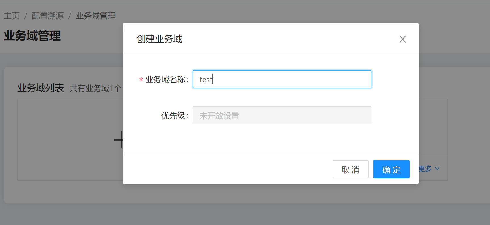
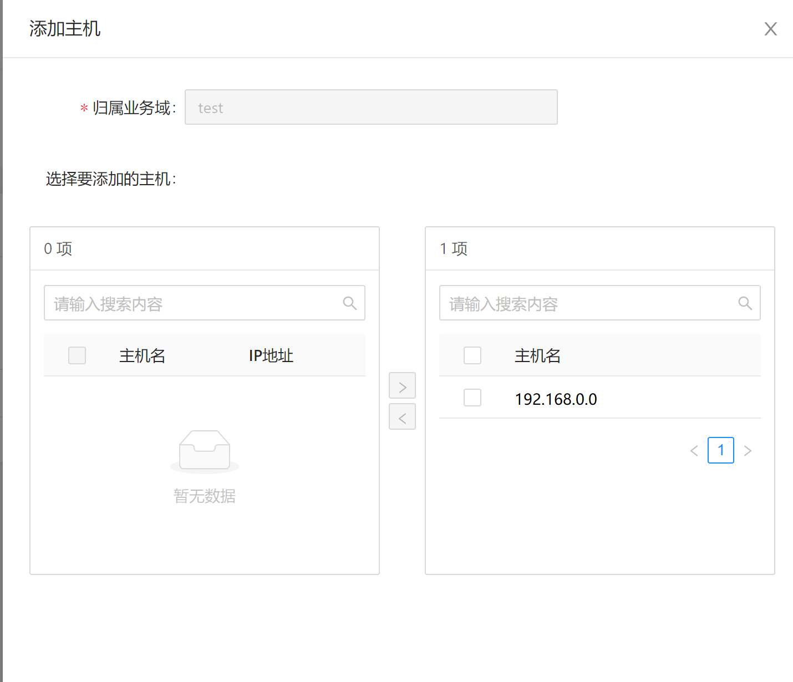
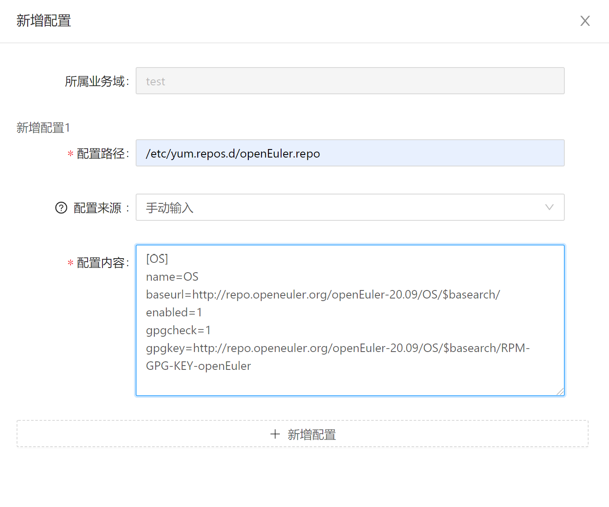
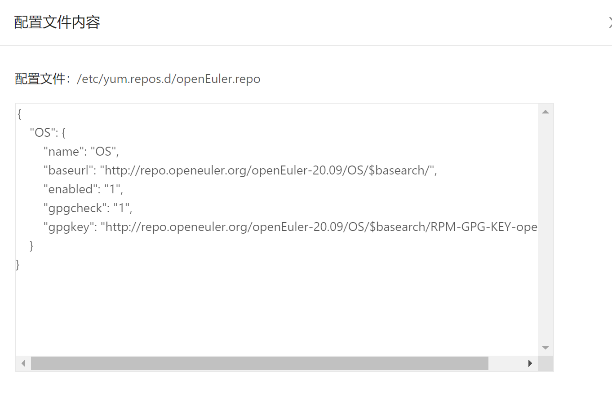

gala-ragdoll的使用指导
============================

本文基于当前已支持的yum源的配置文件/etc/yum.repos.d/openEuler.repo为例，讲解如何将该配置文件进行纳管。

### 配置文件介绍

```/etc/yum.repos.d/openEuler.repo```是用来规定yum源地址的配置文件，该配置文件内容为：

```
[OS]
name=OS
baseurl=http://repo.openeuler.org/openEuler-20.09/OS/$basearch/
enabled=1
gpgcheck=1
gpgkey=http://repo.openeuler.org/openEuler-20.09/OS/$basearch/RPM-GPG-KEY-openEuler
```

### yang模型介绍

`/etc/yum.repos.d/openEuler.repo`采用yang语言进行表示，参见`gala-ragdoll/yang_modules/openEuler-logos-openEuler.repo.yang`;
其中增加了三个拓展字段：

| 拓展字段名称 | 拓展字段格式           | 样例                                      |
| ------------ | ---------------------- | ----------------------------------------- |
| path         | OS类型：配置文件的路径 | openEuler:/etc/yum.repos.d/openEuler.repo |
| type         | 配置文件类型           | ini、key-value、json、text等              |
| spacer       | 配置项和配置值的中间键 | ” “、”=“、”：“等                          |

附：yang语言的学习地址：https://tonydeng.github.io/rfc7950-zh/

### 通过配置溯源创建域

#### 查看配置配文件

gala-ragdoll中存在配置溯源的配置文件

```
[root@openeuler-development-1-1drnd ~]# cat /etc/ragdoll/gala-ragdoll.conf
[git]                                       // 定义当前的git信息：包括git仓的目录和用户信息
git_dir = "/home/confTraceTestConf" 
user_name = "user"
user_email = "email"

[collect]                                  // A-OPS 对外提供的collect接口
collect_address = "http://192.168.0.0:11111"
collect_api = "/manage/config/collect"

[ragdoll]
port = 11114

```

#### 创建配置域





#### 添加配置域纳管node




#### 添加配置域配置




#### 查询预期配置




#### 删除配置


#### 查询实际配置


#### 配置校验


#### 配置同步

暂未提供
