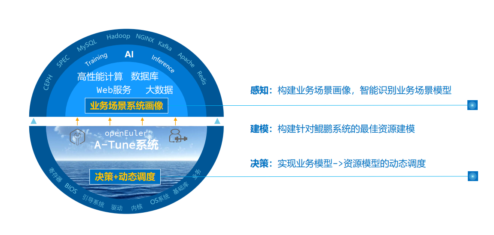

# 认识A-Tune
<!-- TOC -->

- [认识A-Tune](#认识A-Tune)
    - [简介](#简介)
    - [架构](#架构)
    - [支持特性与业务模型](#支持特性与业务模型)

<!-- /TOC -->
## 简介

操作系统作为衔接应用和硬件的基础软件，如何调整系统和应用配置，充分发挥软硬件能力，从而使业务性能达到最优，对用户至关重要。然而，运行在操作系统上的业务类型成百上千，应用形态千差万别，对资源的要求各不相同。当前硬件和基础软件组成的应用环境涉及高达7000多个配置对象，随着业务复杂度和调优对象的增加，调优所需的时间成本呈指数级增长，导致调优效率急剧下降，调优成为了一项极其复杂的工程，给用户带来巨大挑战。

其次，操作系统作为基础设施软件，提供了大量的软硬件管理能力，每种能力适用场景不尽相同，并非对所有的应用场景都通用有益，因此，不同的场景需要开启或关闭不同的能力，组合使用系统提供的各种能力，才能发挥应用程序的最佳性能。

另外，实际业务场景成千上万，计算、网络、存储等硬件配置也层出不穷，实验室无法遍历穷举所有的应用和业务场景，以及不同的硬件组合。

为了应对上述挑战，openEuler推出了A-Tune。

A-Tune是一款基于AI开发的系统性能优化引擎，它利用人工智能技术，对业务场景建立精准的系统画像，感知并推理出业务特征，进而做出智能决策，匹配并推荐最佳的系统参数配置组合，使业务处于最佳运行状态。

## 架构

A-Tune核心技术架构如下图，主要包括智能决策、系统画像和交互系统三层。

-   智能决策层：包含感知和决策两个子系统，分别完成对应用的智能感知和对系统的调优决策。
-   系统画像层：主要包括自动特征工程和两层分类模型，自动特征工程用于业务特征的自动选择，两层分类模型用于业务模型的学习和分类。
-   交互系统层：用于各类系统资源的监控和配置，调优策略执行在本层进行。

## 支持特性与业务模型

### 支持特性

A-Tune支持的主要特性、特性成熟度以及使用建议请参见[表1](#table1919220557576)。

**表 1**  特性成熟度

<table><thead align="left"><tr id="row81921355135715"><th class="cellrowborder" valign="top" width="33.33333333333333%" id="mcps1.2.4.1.1">
<strong id="b175661223205512">特性</strong>

</th>
<th class="cellrowborder" valign="top" width="33.33333333333333%" id="mcps1.2.4.1.2">
<strong id="b185678233555">成熟度</strong>

</th>
<th class="cellrowborder" valign="top" width="33.33333333333333%" id="mcps1.2.4.1.3">
<strong id="b1156872320553">使用建议</strong>

</th>
</tr>
</thead>
<tbody><tr id="row519275518572"><td class="cellrowborder" valign="top" width="33.33333333333333%" headers="mcps1.2.4.1.1 ">
11大类15款应用负载类型自动优化

</td>
<td class="cellrowborder" valign="top" width="33.33333333333333%" headers="mcps1.2.4.1.2 ">
已测试

</td>
<td class="cellrowborder" valign="top" width="33.33333333333333%" headers="mcps1.2.4.1.3 ">
试用

</td>
</tr>
<tr id="row919217552579"><td class="cellrowborder" valign="top" width="33.33333333333333%" headers="mcps1.2.4.1.1 ">
自定义profile和业务模型

</td>
<td class="cellrowborder" valign="top" width="33.33333333333333%" headers="mcps1.2.4.1.2 ">
已测试

</td>
<td class="cellrowborder" valign="top" width="33.33333333333333%" headers="mcps1.2.4.1.3 ">
试用

</td>
</tr>
<tr id="row71921155165711"><td class="cellrowborder" valign="top" width="33.33333333333333%" headers="mcps1.2.4.1.1 ">
参数自调优

</td>
<td class="cellrowborder" valign="top" width="33.33333333333333%" headers="mcps1.2.4.1.2 ">
已测试

</td>
<td class="cellrowborder" valign="top" width="33.33333333333333%" headers="mcps1.2.4.1.3 ">
试用

</td>
</tr>
</tbody>
</table>

### 支持业务模型

根据应用的负载特征，A-Tune将业务分为11大类，各类型的负载特征和A-Tune支持的应用请参见[表2](#table2819164611311)。

**表 2**  支持的业务类型和应用

<table><thead align="left"><tr id="row49114466133"><th class="cellrowborder" valign="top" width="22.12%" id="mcps1.2.5.1.1">
<strong id="b20879355579">业务大类</strong>

</th>
<th class="cellrowborder" valign="top" width="12.959999999999999%" id="mcps1.2.5.1.2">
<strong id="b11881145155715">业务类型</strong>

</th>
<th class="cellrowborder" valign="top" width="37.269999999999996%" id="mcps1.2.5.1.3">
<strong id="b1213516721612">瓶颈点</strong>

</th>
<th class="cellrowborder" valign="top" width="27.650000000000002%" id="mcps1.2.5.1.4">
<strong id="b31363721611">支持的应用</strong>

</th>
</tr>
</thead>
<tbody><tr id="row17911114651318"><td class="cellrowborder" valign="top" width="22.12%" headers="mcps1.2.5.1.1 ">
default

</td>
<td class="cellrowborder" valign="top" width="12.959999999999999%" headers="mcps1.2.5.1.2 ">
默认类型

</td>
<td class="cellrowborder" valign="top" width="37.269999999999996%" headers="mcps1.2.5.1.3 ">
算力、内存、网络、IO各维度资源使用率都不高

</td>
<td class="cellrowborder" valign="top" width="27.650000000000002%" headers="mcps1.2.5.1.4 ">
N/A

</td>
</tr>
<tr id="row791164631318"><td class="cellrowborder" valign="top" width="22.12%" headers="mcps1.2.5.1.1 ">
webserver

</td>
<td class="cellrowborder" valign="top" width="12.959999999999999%" headers="mcps1.2.5.1.2 ">
web应用

</td>
<td class="cellrowborder" valign="top" width="37.269999999999996%" headers="mcps1.2.5.1.3 ">
算力瓶颈、网络瓶颈

</td>
<td class="cellrowborder" valign="top" width="27.650000000000002%" headers="mcps1.2.5.1.4 ">
Nginx、Apache Traffic Server

</td>
</tr>
<tr id="row13911946141311"><td class="cellrowborder" valign="top" width="22.12%" headers="mcps1.2.5.1.1 ">
database

</td>
<td class="cellrowborder" valign="top" width="12.959999999999999%" headers="mcps1.2.5.1.2 ">
数据库

</td>
<td class="cellrowborder" valign="top" width="37.269999999999996%" headers="mcps1.2.5.1.3 ">算力瓶颈、内存瓶颈、IO瓶颈
</td>
<td class="cellrowborder" valign="top" width="27.650000000000002%" headers="mcps1.2.5.1.4 ">
Mongodb、Mysql、Postgresql、Mariadb

</td>
</tr>
<tr id="row3911174641312"><td class="cellrowborder" valign="top" width="22.12%" headers="mcps1.2.5.1.1 ">
big-data

</td>
<td class="cellrowborder" valign="top" width="12.959999999999999%" headers="mcps1.2.5.1.2 ">
大数据

</td>
<td class="cellrowborder" valign="top" width="37.269999999999996%" headers="mcps1.2.5.1.3 ">
算力瓶颈、内存瓶颈

</td>
<td class="cellrowborder" valign="top" width="27.650000000000002%" headers="mcps1.2.5.1.4 ">
Hadoop-hdfs、Hadoop-spark

</td>
</tr>
<tr id="row591112462132"><td class="cellrowborder" valign="top" width="22.12%" headers="mcps1.2.5.1.1 ">
middleware

</td>
<td class="cellrowborder" valign="top" width="12.959999999999999%" headers="mcps1.2.5.1.2 ">
中间件框架

</td>
<td class="cellrowborder" valign="top" width="37.269999999999996%" headers="mcps1.2.5.1.3 ">
算力瓶颈、网络瓶颈

</td>
<td class="cellrowborder" valign="top" width="27.650000000000002%" headers="mcps1.2.5.1.4 ">
Dubbo

</td>
</tr>
<tr id="row59121246181320"><td class="cellrowborder" valign="top" width="22.12%" headers="mcps1.2.5.1.1 ">
in-memory-database

</td>
<td class="cellrowborder" valign="top" width="12.959999999999999%" headers="mcps1.2.5.1.2 ">
内存数据库

</td>
<td class="cellrowborder" valign="top" width="37.269999999999996%" headers="mcps1.2.5.1.3 ">
内存瓶颈、IO瓶颈

</td>
<td class="cellrowborder" valign="top" width="27.650000000000002%" headers="mcps1.2.5.1.4 ">
Redis

</td>
</tr>
<tr id="row1891264641315"><td class="cellrowborder" valign="top" width="22.12%" headers="mcps1.2.5.1.1 ">
basic-test-suite

</td>
<td class="cellrowborder" valign="top" width="12.959999999999999%" headers="mcps1.2.5.1.2 ">
基础测试套

</td>
<td class="cellrowborder" valign="top" width="37.269999999999996%" headers="mcps1.2.5.1.3 ">
算力瓶颈、内存瓶颈

</td>
<td class="cellrowborder" valign="top" width="27.650000000000002%" headers="mcps1.2.5.1.4 ">
SPECCPU2006、SPECjbb2015

</td>
</tr>
<tr id="row2912184671312"><td class="cellrowborder" valign="top" width="22.12%" headers="mcps1.2.5.1.1 ">
hpc

</td>
<td class="cellrowborder" valign="top" width="12.959999999999999%" headers="mcps1.2.5.1.2 ">
人类基因组

</td>
<td class="cellrowborder" valign="top" width="37.269999999999996%" headers="mcps1.2.5.1.3 ">
算力瓶颈、内存瓶颈、IO瓶颈

</td>
<td class="cellrowborder" valign="top" width="27.650000000000002%" headers="mcps1.2.5.1.4 ">
Gatk4

</td>
</tr>
<tr id="row1991224641317"><td class="cellrowborder" valign="top" width="22.12%" headers="mcps1.2.5.1.1 ">
storage

</td>
<td class="cellrowborder" valign="top" width="12.959999999999999%" headers="mcps1.2.5.1.2 ">
存储

</td>
<td class="cellrowborder" valign="top" width="37.269999999999996%" headers="mcps1.2.5.1.3 ">
网络瓶颈、IO瓶颈

</td>
<td class="cellrowborder" valign="top" width="27.650000000000002%" headers="mcps1.2.5.1.4 ">
Ceph

</td>
</tr>
<tr id="row1991224641317"><td class="cellrowborder" valign="top" width="22.12%" headers="mcps1.2.5.1.1 ">
virtualization

</td>
<td class="cellrowborder" valign="top" width="12.959999999999999%" headers="mcps1.2.5.1.2 ">
虚拟化

</td>
<td class="cellrowborder" valign="top" width="37.269999999999996%" headers="mcps1.2.5.1.3 ">
算力瓶颈、内存瓶颈、IO瓶颈

</td>
<td class="cellrowborder" valign="top" width="27.650000000000002%" headers="mcps1.2.5.1.4 ">
Consumer-cloud、Mariadb

</td>
</tr>
<tr id="row1991224641317"><td class="cellrowborder" valign="top" width="22.12%" headers="mcps1.2.5.1.1 ">
docker

</td>
<td class="cellrowborder" valign="top" width="12.959999999999999%" headers="mcps1.2.5.1.2 ">
容器

</td>
<td class="cellrowborder" valign="top" width="37.269999999999996%" headers="mcps1.2.5.1.3 ">
算力瓶颈、内存瓶颈、IO瓶颈

</td>
<td class="cellrowborder" valign="top" width="27.650000000000002%" headers="mcps1.2.5.1.4 ">
Mariadb

</td>
</tr>
</tbody>
</table>

