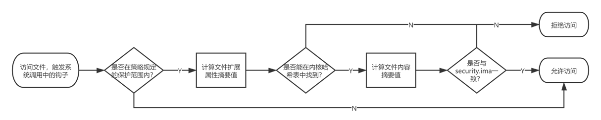

# 可信计算

<!-- TOC -->

- [可信计算](#可信计算)
    - [可信计算基础](#可信计算基础)
        - [可信计算](#可信计算-1)
    - [内核完整性度量（IMA）](#内核完整性度量ima)
        - [概述](#概述)
        - [约束限制](#约束限制)
        - [使用场景](#使用场景)
        - [操作指导](#操作指导)
        - [FAQ](#faq)
        - [附录](#附录)

<!-- /TOC -->


## 可信计算基础

### 可信计算

不同国际组织对可信（Trusted）做了不同的定义。

1. 可信计算组织（TCG）的定义：

   一个实体是可信的，它的行为总是以预期的方式达到预期的目标。

2. 国际标准化组织与国际电子技术委员会定义（1999）：

   参与计算的组件、操作或过程在任意的条件下是可预测的，并能够抵御病毒和一定程度的物理干扰。

3. IEEE Computer Society Technical Committee on Dependable Computing 定义：

   所谓可信，是指计算机系统所提供的服务是可被论证其是可信赖的，可信赖主要是指系统的可靠性和可用性。

简而言之，可信就是系统按照预定的设计和策略运行，不做其他事情。

一个可信计算系统由信任根、可信硬件平台、可信操作系统和可信应用组成，它的基本思想是首先创建一个安全信任根（TCB），然后建立从硬件平台、操作系统到应用的信任链，在这条信任链上从根开始，前一级认证后一级，实现信任的逐级扩展，从而实现一个安全可信的计算环境。


相比于传统安全机制的“头痛医头，脚痛医脚”，发现一个病毒消灭一个病毒，可信计算采用的是白名单机制，即只允许经过认证的内核、内核模块、应用程序等在系统上运行，如果发现程序已发生更改（或本来就是一个未知的程序），就拒绝其执行。

## 内核完整性度量（IMA）

### 概述

#### IMA

IMA，全称 Integrity Measurement Architecture（完整性度量架构），是内核中的一个子系统，能够基于自定义策略对通过 execve()、mmap() 和 open() 系统调用访问的文件进行度量，度量结果可被用于**本地/远程证明**，或者和已有的参考值比较以**控制对文件的访问**。

根据 IMA wiki 的定义，内核完整性子系统的功能可以被分为三部分：

- 度量（measure）：检测对文件的意外或恶意修改，无论远程还是本地。
- 评估（appraise）：度量文件并与一个存储在扩展属性中的参考值作比较，控制本地文件完整性。
- 审计（audit）：将度量结果写到系统日志中，用于审计。

可以看到，相比于 IMA 度量作为一个“只记录不干涉”的观察员，IMA 评估更像是一位严格的保安人员，它的职责是拒绝对所有“人证不一”的程序的访问。

#### EVM

EVM，全称 Extended Verification Module（扩展验证模块），它的作用就是将系统当中某个文件的安全扩展属性，包括 security.ima 、security.selinux 等合起来计算一个哈希值，然后使用 TPM 中存的密钥或其他可信环境中的密钥对其进行签名，签名之后的值存在 security.evm 中，这个签名后的值是不能被篡改的，如果被篡改，再次访问的时候就会验签失败。

总而言之，EVM 的作用就是通过对安全扩展属性计算摘要和签名并将其存储在 security.evm 中，提供对安全扩展属性的离线保护。

#### IMA Digest Lists

IMA Digest Lists（IMA 摘要列表扩展）是 openEuler 对内核原生完整性保护机制的增强，它取代了原生 IMA 机制为文件完整性提供保护。

“摘要列表”（digest lists）是一种特殊格式的二进制数据文件，它与 rpm 包一一对应，记录了 rpm 包中受保护文件（即可执行文件和动态库文件）的哈希值。

当正确配置启动参数后，内核将维护一个哈希表（对用户空间不可见），并通过 securityfs 对外提供更新哈希表的接口（digest_list_data 和 digest_list_data_del）。摘要列表在构建阶段经过私钥签名，通过接口上传到内核时，需经过内核中的公钥验证。


在开启 IMA 评估的情况下，每当访问一个可执行文件或动态库文件，就会调用内核中的钩子，计算文件内容和扩展属性的哈希值，并在内核哈希表中进行搜索，如果匹配就允许文件的执行，否则就拒绝访问。



相比内核社区原生 IMA 机制，openEuler 内核提供的 IMA 摘要列表扩展从安全性、性能、易用性三个方面进行了改良，助力完整性保护机制在生产环境下落地：

- **具备完整的信任链，安全性好**

  原生 IMA 机制要求在现网环境下预先生成并标记文件扩展属性，访问文件时将文件扩展属性作为参考值，信任链不完整。

  IMA 摘要列表扩展将文件参考摘要值保存在内核空间中，构建阶段通过摘要列表的形式携带在发布的 rpm 包中，安装 rpm 包的同时导入摘要列表并执行验签，确保了参考值来自于软件发行商，实现了完整的信任链。

- **惊艳的性能**

  由于 TPM 芯片是一种低速芯片，因此 PCR 扩展操作成为了 IMA 度量场景的性能瓶颈。摘要列表扩展在确保安全性的前提下，减少了不必要的 PCR 扩展操作，相比原生 IMA 性能提升高达 65%。

  IMA 评估场景下，摘要列表扩展将签名验证统一移动到启动阶段进行，避免每次访问文件时都执行验签，相比原生 IMA 评估场景提升运行阶段文件访问的性能约 20%。

- **快速部署，平滑升级**

  原生 IMA 机制在初次部署或每次更新软件包时，都需要切换到 fix 模式手动标记文件扩展属性后再重启进入 enforce 模式，才能正常访问安装的程序。

  摘要列表扩展可实现安装完成后开箱即用，且允许直接在 enforce 模式下安装或升级 rpm 包，无需重启和手动标记即可使用，实现了用户感知最小化，适合现网环境下的快速部署和平滑升级。

需要注意的是，IMA 摘要列表扩展将原生 IMA 的验签过程提前到启动阶段进行，也引入了一个假设，即内核空间的内存无法被篡改，这就使得 IMA 也依赖于其他安全机制（内核模块安全启动和内存动态度量）以保护内核内存的完整性。

但无论社区原生 IMA 机制还是 IMA 摘要列表扩展，都只是可信计算信任链中的一环，无法孤立地保证系统的安全性，安全自始至终都是一个构建纵深防御的系统工程。

### 约束限制

1. 当前 IMA 评估模式仅支持保护系统中的不可变文件（包括可执行文件和动态库文件）。
2. IMA 提供的是应用层的完整性度量，它的安全性依赖于之前环节的可信。
3. 当前阶段 IMA 不支持第三方应用摘要列表的导入。
4. 启动日志中可能存在 `Unable to open file: /etc/keys/x509_ima.der` 字样，该报错来自于开源社区，不影响 IMA 摘要列表特性的使用。
5. ARM 版本中 IMA 开启日志模式可能存在一些 audit 报错信息，这是由于 modprobe 在摘要列表未导入时加载内核模块所致，不影响正常功能。

### 使用场景

#### IMA measurement

IMA 度量的目的是检测对系统文件的意外或恶意修改，度量结果可被用于本地证明或远程证明。

如果系统中存在 TPM 芯片，度量结果将被扩展到 TPM 芯片的指定 PCR 寄存器中，由于 PCR 扩展的单向性以及 TPM 芯片的硬件安全性，用户无法修改已被扩展的度量结果，这就确保了度量结果的真实性。

IMA 度量的文件范围和触发条件可以由用户通过 IMA 策略自行配置。

默认情况下 IMA 不启用，但系统会前往 `/etc/ima/` 路径下寻找 ima-policy 策略文件，如果找到，就会按照策略在启动时度量系统中的文件。如果不想手动编写策略文件，也可以在启动参数中配置 `ima_policy=tcb` 使用默认策略（更多策略参数请参考附录“IMA启动参数”章节）。

系统当前加载的 IMA 策略可以在 `/sys/kernel/security/ima/policy` 文件中查看，IMA 度量日志则位于`/sys/kernel/security/ima/ascii_runtime_measurements` 文件中，如下所示：

```shell
$ head /sys/kernel/security/ima/ascii_runtime_measurements
10 ddee6004dc3bd4ee300406cd93181c5a2187b59b ima-ng sha1:9797edf8d0eed36b1cf92547816051c8af4e45ee boot_aggregate
10 180ecafba6fadbece09b057bcd0d55d39f1a8a52 ima-ng sha1:db82919bf7d1849ae9aba01e28e9be012823cf3a /init
10 ac792e08a7cf8de7656003125c7276968d84ea65 ima-ng sha1:f778e2082b08d21bbc59898f4775a75e8f2af4db /bin/bash
10 0a0d9258c151356204aea2498bbca4be34d6bb05 ima-ng sha1:b0ab2e7ebd22c4d17d975de0d881f52dc14359a7 /lib64/ld-2.27.so
10 0d6b1d90350778d58f1302d00e59493e11bc0011 ima-ng sha1:ce8204c948b9fe3ae67b94625ad620420c1dc838 /etc/ld.so.cache
10 d69ac2c1d60d28b2da07c7f0cbd49e31e9cca277 ima-ng sha1:8526466068709356630490ff5196c95a186092b8 /lib64/libreadline.so.7.0
10 ef3212c12d1fbb94de9534b0bbd9f0c8ea50a77b ima-ng sha1:f80ba92b8a6e390a80a7a3deef8eae921fc8ca4e /lib64/libc-2.27.so
10 f805861177a99c61eabebe21003b3c831ccf288b ima-ng sha1:261a3cd5863de3f2421662ba5b455df09d941168 /lib64/libncurses.so.6.1
10 52f680881893b28e6f0ce2b132d723a885333500 ima-ng sha1:b953a3fa385e64dfe9927de94c33318d3de56260 /lib64/libnss_files-2.27.so
10 4da8ce3c51a7814d4e38be55a2a990a5ceec8b27 ima-ng sha1:99a9c095c7928ecca8c3a4bc44b06246fc5f49de /etc/passwd
```

每一条记录从左到右分别是：

1. PCR：用于扩展度量结果的 PCR 寄存器，默认是 10，只在系统装了 TPM 芯片的情况下有意义。
2. 模板哈希值：最终被用于扩展的哈希值，组合了文件内容哈希和文件路径的长度和值。
3. 模板：扩展度量值的模板，如 ima-ng。
4. 文件内容哈希值：被度量的文件内容的哈希值。
5. 文件路径：被度量的文件路径。

#### IMA appraisal

IMA 评估的目的是通过与标准参考值的比较，控制对本地文件的访问。

IMA 首先使用安全扩展属性 security.ima 和 security.evm 存储文件完整性度量的参考值：

- security.ima：存储文件内容的哈希值；
- security.evm：存储文件扩展属性的哈希值签名。

访问受保护文件时，将会触发内核中的钩子，依次验证文件扩展属性和内容的完整性：

1. 使用内核 keyring 中的公钥对文件 security.evm 扩展属性中的签名值验签，与当前文件扩展属性的哈希值比较，如果匹配就证明文件的扩展属性是完整的（包括 security.ima）。
2. 在文件扩展属性完整的前提下，将文件 security.ima 扩展属性的内容与当前文件内容的摘要值比较，如果匹配就允许对文件的访问。

同样，IMA 评估的文件范围和触发条件也可以由用户通过 IMA 策略自行配置。

#### IMA Digest Lists

IMA 摘要列表扩展当前提供对以下三种启动参数组合的支持：

* IMA measurement 度量模式：

  ```shell
  ima_policy=exec_tcb ima_digest_list_pcr=11
  ```

* IMA appraisal 日志模式 + IMA measurement 度量模式：

  ```shell
  ima_template=ima-sig ima_policy="exec_tcb|appraise_exec_tcb|appraise_exec_immutable" initramtmpfs ima_hash=sha256 ima_appraise=log evm=allow_metadata_writes evm=x509 ima_digest_list_pcr=11 ima_appraise_digest_list=digest
  ```

* IMA appraisal 强制模式 + IMA measurement 度量模式：

  ```shell
  ima_template=ima-sig ima_policy="exec_tcb|appraise_exec_tcb|appraise_exec_immutable" initramtmpfs ima_hash=sha256 ima_appraise=enforce-evm evm=allow_metadata_writes evm=x509 ima_digest_list_pcr=11 ima_appraise_digest_list=digest
  ```

### 操作指导

#### 原生 IMA 场景初次部署

第一次启动时，需要在启动参数中配置：

```shell
ima_appraise=fix ima_policy=appraise_tcb
```

`fix` 模式会允许系统在没有参考值的情况下启动，`appraise_tcb` 对应了一种 IMA 策略，具体可参考附录中的“IMA 启动参数”章节。

接下来，你需要访问所有需要被校验的文件，从而为它们添加 IMA 扩展属性：

```shell
$ time find / -fstype ext4 -type f -uid 0 -exec dd if='{}' of=/dev/null count=0 status=none \;
```

该过程会花费一定时间，请耐心等待。命令执行完成后，你可以从受保护文件的扩展属性中看到参考值已被标记：

```shell
$ getfattr -m - -d /sbin/init
# file: sbin/init
security.ima=0sAXr7Qmun5mkGDS286oZxCpdGEuKT
security.selinux="system_u:object_r:init_exec_t"
```

最后，配置以下启动参数并重新启动系统：

```shell
ima_appraise=enforce ima_policy=appraise_tcb
```

#### 摘要列表场景初次部署

1. 配置内核参数进入 log 模式。

   编辑 `/boot/efi/EFI/euleros/grub.cfg` 文件，加入以下参数：

   ```shell
   ima_template=ima-sig ima_policy="exec_tcb|appraise_exec_tcb|appraise_exec_immutable" initramtmpfs ima_hash=sha256 ima_appraise=log evm=allow_metadata_writes evm=x509 ima_digest_list_pcr=11 ima_appraise_digest_list=digest
   ```

   使用 `reboot` 重启系统进入 log 模式，该模式下已开启完整性校验，但不会因校验失败而无法启动。

2. 安装依赖包。

   使用 yum 安装 digest-list-tools 和 ima-evm-utils，确认不低于以下版本：

   ```shell
   $ yum install digest-list-tools ima-evm-utils
   $ rpm -qa | grep digest-list-tools
   digest-list-tools-0.3.93-1.oe1.x86_64
   $ rpm -qa | grep ima-evm-utils
   ima-evm-utils-1.2.1-9.oe1.x86_64
   ```

3. 如果安装了 plymouth 包，需要编辑 `/usr/libexec/plymouth/plymouth-populate-initrd` 脚本文件，在第 147 行的 cp 命令后增加 `-a`：

   ```shell
       ...
       ddebug "Installing $_src"
    cp -a --sparse=always -pfL "$PLYMOUTH_SYSROOT$_src" "${initdir}/$target"
   }
   ```

4. 执行 `dracut` 重新生成 initrd：

   ```shell
   $ dracut -f -e xattr
   ```

   编辑 `/boot/efi/EFI/euleros/grub.cfg` 文件，将 ima_appraise=log 改为 ima_appraise=enforce-evm：

   ```shell
   ima_template=ima-sig ima_policy="exec_tcb|appraise_exec_tcb|appraise_exec_immutable" initramtmpfs ima_hash=sha256 ima_appraise=enforce-evm evm=allow_metadata_writes evm=x509 ima_digest_list_pcr=11 ima_appraise_digest_list=digest
   ```

   使用 reboot 重启即可完成初次部署。

#### 在 OBS 上进行摘要列表构建

OBS 全称 Open Build Service，是一种编译系统，最早在 openSUSE 用于软件包的构建，能够支持多架构的分布式编译。

进行摘要列表构建之前，首先确保您的工程包含以下 rpm 包，且来自 openEuler：

* digest-list-tools
* pesign-obs-integration
* selinux-policy
* rpm
* openEuler-rpm-config

在交付件工程中增加 Project Config：

```shell
Preinstall: pesign-obs-integration digest-list-tools selinux-policy-targeted
Macros:
%__brp_digest_list /usr/lib/rpm/openEuler/brp-digest-list %{buildroot}
:Macros
```

* 在 Preinstall 中新增 digest-list-tools 用于生成摘要列表，pesign-obs-integration 用于生成摘要列表的签名，新增 selinux-policy-targeted 用于确保生成摘要列表时构建环境内 SELinux 标签正确。
* 在 Macros 中定义宏 %__brp_digest_list，rpm 将在构建阶段通过这个宏执行命令为编译完成的二进制文件生成摘要列表。这个宏可以作为一个开关控制工程中的摘要列表是否生成。

配置完成后，OBS 会自动执行全量构建，正常情况下构建完成后，软件包中会新增以下两个文件：

* /etc/ima/digest_lists/0-metadata_list-compact-[包名]-[版本号]
* /etc/ima/digest_lists.tlv/0-metadata_list-compact_tlv-[包名]-[版本号]

#### 在 Koji 上进行摘要列表构建

Koji 是 Fedora 社区的编译系统，openEuler 社区将在后续支持，敬请期待。

### FAQ

1. 为什么进入 enforce 模式后系统无法启动或启动后命令无法执行/服务不正常？

   enforce 模式下 IMA 会对文件访问做控制，如果访问文件的内容或扩展属性不完整，就会被拒绝访问，当影响启动的关键命令无法执行时，就会造成系统无法启动。

   请确认是否存在以下问题：

   * **摘要列表是否被加入到 initrd 中？**

     初次部署时是否执行了 dracut 命令将摘要列表加入内核？如果摘要列表没有加入 initrd，启动阶段就无法导入摘要列表，从而导致启动失败。

   * **是否使用官方提供的 rpm 包？**

     如果使用的是非 openEuler 官方提供的 rpm 包，rpm 包可能没有携带摘要列表，或者对摘要列表签名的私钥与内核中的验签公钥不匹配，从而导致摘要列表没有被导入内核。

   如果原因还不明确，可以进入 log 模式启动，从错误日志中寻找原因：

   ```shell
   $ dmesg | grep appraise
   ```

2. 为什么 enforce 模式下没有对系统文件做访问控制？

   系统没有按照预期对文件执行访问控制，首先查看启动参数中的 IMA 策略是否已被正确配置：

   ```shell
   $ cat /proc/cmdline
   ...ima_policy=exec_tcb|appraise_exec_tcb|appraise_exec_immutable...
   ```

   其次查看当前内核中 IMA 策略是否已生效：

   ```shell
   $ cat /sys/kernel/security/ima/policy
   ```

   如果 policy 文件是空的，证明策略没有设置成功，系统也就不会进行访问控制。

3. 初次部署完成后，安装/升级/卸载软件包后还需要手动执行 dracut 生成 initrd 吗？

   不需要。rpm 包提供的 digest_list.so 插件能够在 rpm 包粒度提供摘要列表的自动更新，可以实现用户对摘要列表的无感知。

### 附录

#### IMA securityfs 接口说明

原生 IMA 提供的 securityfs 接口如下：

> 注：以下接口路径都位于 `/sys/kernel/security/` 目录下。

| 路径                           | 权限 | 说明                                     |
| ------------------------------ | ---- | ---------------------------------------- |
| ima/policy                     | 600  | IMA 策略接口                             |
| ima/ascii_runtime_measurement  | 440  | ascii 码形式表示的 IMA 度量结果          |
| ima/binary_runtime_measurement | 440  | 二进制形式表示的 IMA 度量结果            |
| ima/runtime_measurement_count  | 440  | 度量结果数量统计                         |
| ima/violations                 | 440  | IMA 度量结果冲突数                       |
| evm                            | 660  | EVM 模式，即校验文件扩展属性完整性的方式 |

其中，`/sys/kernel/security/evm` 的取值有以下三种：

* 0：EVM 未初始化；
* 1：使用 HMAC（对称加密）方式校验扩展属性完整性；
* 2：使用公钥验签（非对称加密）方式校验扩展属性完整性；
* 6：关闭扩展属性完整性校验（openEuler 使用此方式）。

IMA 摘要列表扩展额外提供的 securityfs 接口如下：

| 路径                     | 权限 | 说明                                    |
| ------------------------ | ---- | --------------------------------------- |
| ima/digests_count        | 440  | 显示系统哈希表中的总摘要数量（IMA+EVM） |
| ima/digest_list_data     | 200  | 摘要列表新增接口                        |
| ima/digest_list_data_del | 200  | 摘要列表删除接口                        |

#### IMA 策略语法

每条 IMA 策略语句都必须以 action 关键字代表的**动作**开头，后接**筛选条件**：

- action：表示该条策略具体的动作，一条策略只能选一个 action。

  > 注：实际书写时**可忽略 action 字样**，直接书写 dont_measure，不需要写成 action=dont_measure。

- func：表示被度量或鉴定的文件类型，常和 mask 匹配使用，一条策略只能选一个 func。

  - FILE_CHECK 只能同 MAY_EXEC、MAY_WRITE、MAY_READ 匹配使用。
  - MODULE_CHECK、MMAP_CHECK、BPRM_CHECK 只能同 MAY_EXEC 匹配使用。
  - 匹配关系以外的组合不会产生效果。

- mask：表示文件在做什么操作时将被度量或鉴定，一条策略只能选一个 mask。

- fsmagic：表示文件系统类型的十六进制魔数，定义在 `/usr/include/linux/magic.h` 文件中。

  > 注：默认情况下度量所有文件系统，除非使用 dont_measure/dont_appraise 标记不度量某文件系统。

- fsuuid：表示系统设备 uuid 的 16 位的十六进制字符串。

- objtype：表示文件类型，一条策略只能选一个文件类型。

  > 注：objtype 相比 func 而言，划分的粒度更细，比如 obj_type=nova_log_t 表示 nova log 类型的文件。

- uid：表示哪个用户（用用户 id 表示）对文件进行操作，一条策略只能选一个 uid。

- fowner：表示文件的属主（用用户 id 表示）是谁，一条策略只能选一个 fowner。

关键字的具体取值及说明如下：

| 关键字        | 值                 | 说明                                                         |
| ------------- | ------------------ | ------------------------------------------------------------ |
| action        | measure            | 开启 IMA 度量                                                |
|               | dont_measure       | 禁用 IMA 度量                                                |
|               | appraise           | 开启 IMA 评估                                                |
|               | dont_appraise      | 禁用 IMA 评估                                                |
|               | audit              | 开启审计                                                     |
| func          | FILE_CHECK         | 将要被打开的文件                                             |
|               | MODULE_CHECK       | 将要被装载的内核模块文件                                     |
|               | MMAP_CHECK         | 将要被映射到进程内存空间的动态库文件                         |
|               | BRPM_CHECK         | 将要被执行的文件（不含通过 `/bin/hash` 等程序打开的脚本文件） |
|               | POLICY_CHECK       | 将要被作为补充 IMA 策略装载的文件                            |
|               | FIRMWARE_CHECK     | 将要被加载到内存中的固件                                     |
|               | DIGEST_LIST_CHECK  | 将要被加载到内核中的摘要列表文件                             |
|               | KEXEC_KERNEL_CHECK | 将要切换的 kexec 内核                                        |
| mask          | MAY_EXEC           | 执行文件                                                     |
|               | MAY_WRITE          | 写文件。不建议使用，受限于 echo、vim 等开源机制（修改本质是新建临时文件再重命名），并不是每次修改都会触发 MAY_WRITE 的 IMA 度量。 |
|               | MAY_READ           | 读文件                                                       |
|               | MAY_APPEND         | 扩展文件属性                                                 |
| fsmagic       | fsmagic=xxx        | 表示文件系统类型的十六进制魔数                               |
| fsuuid        | fsuuid=xxx         | 表示系统设备 uuid 的 16 位的十六进制字符串                   |
| fowner        | fowner=xxx         | 文件属主的用户 id                                            |
| uid           | uid=xxx            | 操作文件的用户 id                                            |
| obj_type      | obj_type=xxx_t     | 表示文件的类型（基于 SELinux 标签）                          |
| pcr           | pcr=\<num\>          | 选择 TPM 中用于扩展度量值的 PCR（默认为 10）                 |
| appraise_type | imasig             | 基于签名进行 IMA 评估                                        |
|               | meta_immutable     | 基于签名进行文件扩展属性的评估（支持摘要列表）               |

> 注：PATH_CHECK 等同于 FILE_CHECK，FILE_MMAP 等同于 MMAP_CHECK，不在本表提及。

#### IMA 原生启动参数

原生 IMA 的内核启动参数列表如下：

| 参数名称         | 取值         | 功能                                                         |
| ---------------- | ------------ | ------------------------------------------------------------ |
| ima_appraise     | off          | 关闭 IMA 评估模式，在访问文件时不进行完整性校验，也不为文件生成新的参考值。 |
|                  | enforce      | 开启 IMA 评估强制模式，在访问文件时进行完整性校验，即计算文件摘要值并与参考值比对，如果比对失败就拒绝对文件的访问。IMA 会为新文件生成新的参考值。 |
|                  | fix          | 开启 IMA 修复模式，在该模式下允许更新受保护文件的参考值。    |
|                  | log          | 开启 IMA 评估日志模式，在访问文件时进行完整性校验，但即使校验失败也允许执行命令，只进行日志记录。 |
| ima_policy       | tcb          | 度量所有文件执行、动态库映射、内核模块导入以及设备驱动加载，此外，root 用户读文件的行为也会被度量。 |
|                  | appraise_tcb | 对所有 root 属主的文件进行评估。                             |
|                  | secure_boot  | 对所有内核模块导入、硬件驱动加载、kexec 内核切换以及 IMA 策略进行评估，前提是这些文件都具有 IMA 签名， |
| ima_tcb          | 无           | 等价于 ima_policy=tcb                                        |
| ima_appraise_tcb | 无           | 等价于 ima_policy=appraise_tcb                               |
| ima_hash         | sha1/md5/... | IMA 摘要算法，默认为 sha1                                    |
| ima_template     | ima          | IMA 度量扩展模板                                             |
|                  | ima-ng       | IMA 度量扩展模板                                             |
|                  | ima-sig      | IMA 度量扩展模板                                             |
| integrity_audit  | 0            | 基础完整性审计信息（默认）                                   |
|                  | 1            | 额外完整性审计信息                                           |

> 注：ima_policy 参数可以同时指定多个值，例如 ima_policy=tcb|appraise_tcb，启动后系统的 IMA 策略就是这两种参数对应的策略的总和。

启动参数 `ima_policy=tcb` 对应的 IMA 策略为：

```
# PROC_SUPER_MAGIC = 0x9fa0
dont_measure fsmagic=0x9fa0
# SYSFS_MAGIC = 0x62656572
dont_measure fsmagic=0x62656572
# DEBUGFS_MAGIC = 0x64626720
dont_measure fsmagic=0x64626720
# TMPFS_MAGIC = 0x01021994
dont_measure fsmagic=0x1021994
# DEVPTS_SUPER_MAGIC=0x1cd1
dont_measure fsmagic=0x1cd1
# BINFMTFS_MAGIC=0x42494e4d
dont_measure fsmagic=0x42494e4d
# SECURITYFS_MAGIC=0x73636673
dont_measure fsmagic=0x73636673
# SELINUX_MAGIC=0xf97cff8c
dont_measure fsmagic=0xf97cff8c
# SMACK_MAGIC=0x43415d53
dont_measure fsmagic=0x43415d53
# CGROUP_SUPER_MAGIC=0x27e0eb
dont_measure fsmagic=0x27e0eb
# CGROUP2_SUPER_MAGIC=0x63677270
dont_measure fsmagic=0x63677270
# NSFS_MAGIC=0x6e736673
dont_measure fsmagic=0x6e736673 
measure func=MMAP_CHECK mask=MAY_EXEC 
measure func=BPRM_CHECK mask=MAY_EXEC 
measure func=FILE_CHECK mask=MAY_READ uid=0 
measure func=MODULE_CHECK 
measure func=FIRMWARE_CHECK
```

启动参数 `ima_policy=tcb_appraise` 对应的 IMA 策略为：

```
# PROC_SUPER_MAGIC = 0x9fa0
dont_appraise fsmagic=0x9fa0
# SYSFS_MAGIC = 0x62656572
dont_appraise fsmagic=0x62656572
# DEBUGFS_MAGIC = 0x64626720 
dont_appraise fsmagic=0x64626720 
# TMPFS_MAGIC = 0x01021994
dont_appraise fsmagic=0x1021994
# RAMFS_MAGIC
dont_appraise fsmagic=0x858458f6 
# DEVPTS_SUPER_MAGIC=0x1cd1
dont_appraise fsmagic=0x1cd1
# BINFMTFS_MAGIC=0x42494e4d
dont_appraise fsmagic=0x42494e4d 
# SECURITYFS_MAGIC=0x73636673
dont_appraise fsmagic=0x73636673
# SELINUX_MAGIC=0xf97cff8c
dont_appraise fsmagic=0xf97cff8c 
# SMACK_MAGIC=0x43415d53
dont_appraise fsmagic=0x43415d53 
# NSFS_MAGIC=0x6e736673
dont_appraise fsmagic=0x6e736673 
# CGROUP_SUPER_MAGIC=0x27e0eb
dont_appraise fsmagic=0x27e0eb 
# CGROUP2_SUPER_MAGIC=0x63677270
dont_appraise fsmagic=0x63677270 
appraise fowner=0
```

启动参数 `ima_policy=secure_boot` 对应的 IMA 策略为：

```
appraise func=MODULE_CHECK appraise_type=imasig 
appraise func=FIRMWARE_CHECK appraise_type=imasig 
appraise func=KEXEC_KERNEL_CHECK appraise_type=imasig 
appraise func=POLICY_CHECK appraise_type=imasig
```

#### IMA 摘要列表启动参数

IMA 摘要列表特性额外引入的内核启动参数如下：

| 参数名称                 | 取值                    | 功能                                                         |
| ------------------------ | ----------------------- | ------------------------------------------------------------ |
| integrity                | 0                       | IMA 特性总开关关闭（默认）                                   |
|                          | 1                       | IMA 特性总开关打开                                           |
| ima_appraise             | off                     | 关闭 IMA 评估模式                                            |
|                          | enforce-evm             | IMA 评估强制模式，在访问文件时进行完整性校验并进行访问控制   |
| ima_appraise_digest_list | digest                  | 当 EVM 被禁用时，使用摘要列表进行 IMA appraise，摘要列表同时保护文件内容和扩展属性 |
|                          | digest-nometadata       | 在EVM摘要值不存在的情况下，仅基于IMA摘要值进行完整性校验（不保护文件扩展属性） |
| evm                      | fix                     | 允许任何对扩展属性的修改（即使修改会导致扩展属性完整性校验失败） |
|                          | ignore                  | 只有在扩展属性不存在或不正确的情况下才允许修改               |
| ima_policy               | exec_tcb                | IMA 度量策略，详见下文策略说明。                             |
|                          | appraise_exec_tcb       | IMA 评估策略，详见下文策略说明。                             |
|                          | appraise_exec_immutable | IMA 评估策略，详见下文策略说明。                             |
| ima_digest_list_pcr      | 11                      | 使用 PCR 11 替代 PCR 10，仅使用摘要列表进行度量              |
|                          | +11                     | 依然保留 PCR 10 的度量，在有TPM芯片时也往TPM芯片写度量结果   |
| initramtmpfs             | 无                      | 添加对 tmpfs 的支持                                          |

启动参数 `ima_policy=exec_tcb` 对应的 IMA 策略为：

```
dont_measure fsmagic=0x9fa0 
dont_measure fsmagic=0x62656572 
dont_measure fsmagic=0x64626720 
dont_measure fsmagic=0x1cd1 
dont_measure fsmagic=0x42494e4d 
dont_measure fsmagic=0x73636673 
dont_measure fsmagic=0xf97cff8c 
dont_measure fsmagic=0x43415d53 
dont_measure fsmagic=0x27e0eb 
dont_measure fsmagic=0x63677270 
dont_measure fsmagic=0x6e736673 
measure func=MMAP_CHECK mask=MAY_EXEC 
measure func=BPRM_CHECK mask=MAY_EXEC 
measure func=MODULE_CHECK 
measure func=FIRMWARE_CHECK 
measure func=POLICY_CHECK 
measure func=DIGEST_LIST_CHECK 
measure parser
```

启动参数 `ima_policy=appraise_exec_tcb` 对应的 IMA 策略为：

```
appraise func=MODULE_CHECK appraise_type=imasig 
appraise func=FIRMWARE_CHECK appraise_type=imasig 
appraise func=KEXEC_KERNEL_CHECK appraise_type=imasig 
appraise func=POLICY_CHECK appraise_type=imasig 
appraise func=DIGEST_LIST_CHECK appraise_type=imasig 
dont_appraise fsmagic=0x9fa0 
dont_appraise fsmagic=0x62656572 
dont_appraise fsmagic=0x64626720 
dont_appraise fsmagic=0x858458f6 
dont_appraise fsmagic=0x1cd1 
dont_appraise fsmagic=0x42494e4d 
dont_appraise fsmagic=0x73636673 
dont_appraise fsmagic=0xf97cff8c 
dont_appraise fsmagic=0x43415d53 
dont_appraise fsmagic=0x6e736673 
dont_appraise fsmagic=0x27e0eb 
dont_appraise fsmagic=0x63677270
```

启动参数 `ima_policy=appraise_exec_immutable`  对应的 IMA 策略为：

```
appraise func=BPRM_CHECK appraise_type=imasig appraise_type=meta_immutable 
appraise func=MMAP_CHECK 
appraise parser appraise_type=imasig
```

#### IMA 内核编译选项详解

原生 IMA 提供的编译选项如下：

| 编译选项                         | 功能                        |
| -------------------------------- | --------------------------- |
| CONFIG_INTEGRITY                 | IMA/EVM 总编译开关          |
| CONFIG_INTEGRITY_SIGNATURE       | 使能 IMA 签名校验           |
| CONFIG_INTEGRITY_ASYMMETRIC_KEYS | 使能 IMA 非对称签名校验     |
| CONFIG_INTEGRITY_TRUSTED_KEYRING | 使能 IMA/EVM 密钥环         |
| CONFIG_INTEGRITY_AUDIT           | 编译 IMA audit 审计模块     |
| CONFIG_IMA                       | IMA 总编译开关              |
| CONFIG_IMA_WRITE_POLICY          | 允许在运行阶段更新 IMA 策略 |
| CONFIG_IMA_MEASURE_PCR_IDX       | 允许指定 IMA 度量 PCR 序号  |
| CONFIG_IMA_LSM_RULES             | 允许配置 LSM 规则           |
| CONFIG_IMA_APPRAISE              | IMA 评估总编译开关          |
| IMA_APPRAISE_BOOTPARAM           | 启用 IMA 评估启动参数       |
| CONFIG_EVM                       | EVM 总编译开关              |

IMA 摘要列表扩展额外提供的编译选项如下：

| 编译选项           | 功能                      |
| ------------------ | ------------------------- |
| CONFIG_DIGEST_LIST | 开启 IMA 摘要列表特性开关 |

#### IMA 性能参考数据

下图对比了不开启 IMA、开启原生 IMA、开启 IMA 摘要列表特性时的性能：


