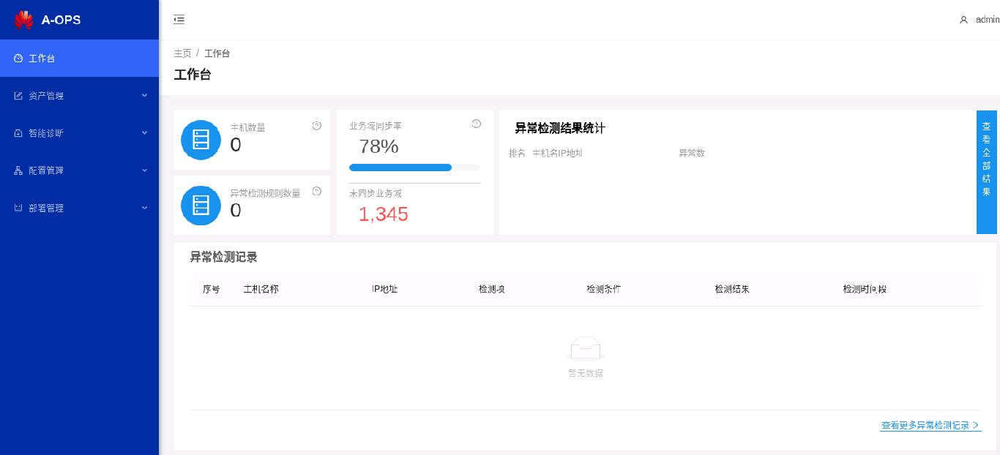
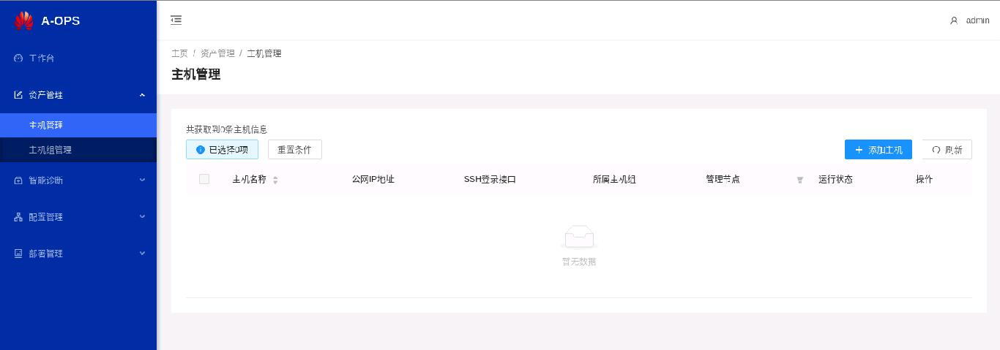
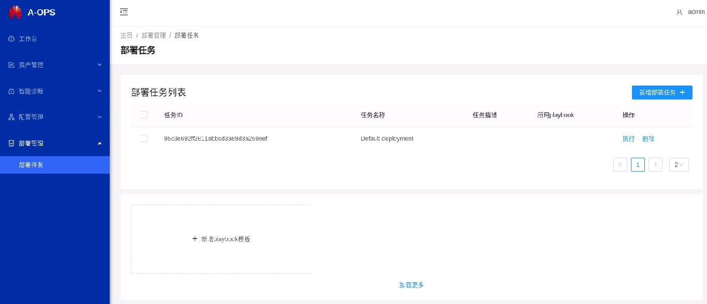
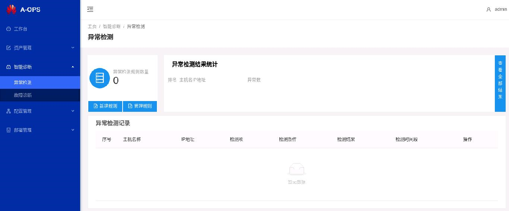
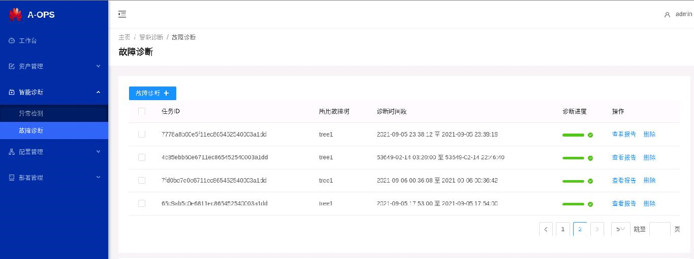
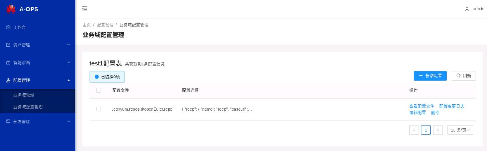

[TOC]

## A-Ops服务部署手册

#### 1.1介绍

A-Ops是一款智能运维工具，通过实现智能运维基本框架，提供配置溯源，架构感知，故障定位基础能力，支持快速排障和运维成本降低。

#### 1.2架构


#### 1.3 运行环境

- 硬件配置：

  | 配置项   | 推荐规格  |
  | -------- | --------- |
  | CPU      | 8核       |
  | 内存     | 3G        |
  | 网络带宽 | 300M      |
  | I/O      | 375MB/sec |

- 软件配置：

  | 软件名        | 版本      |
  | ------------- | --------- |
  | Python        | 3.8及以上 |
  | Mysql         | 8.0.26    |
  | Elasticsearch | 7.14.0-1  |
  | Kafka         | 2.4.0     |
  | Prometheus    | 2.20.0    |


#### 1.2 安装下载

##### 1.2.1 yum下载安装

1. 配置yum源：openEuler21.09 和 openEuler21.09:Epol

   ```repo
   [openEuler21.09] # openEuler 21.09 官方发布源
   name=openEuler21.09
   baseurl=https://repo.openeuler.org/openEuler-21.09/everything/aarch64/ 
   enabled=1
   gpgcheck=1
   gpgkey=https://repo.openeuler.org/openEuler-21.09/everything/aarch64/RPM-GPG-KEY-openEuler
   
   [Epol] # openEuler 21.09:Epol 官方发布源
   name=Epol
   baseurl=https://repo.openeuler.org/openEuler-21.09/EPOL/aarch64/ 
   enabled=1
   gpgcheck=1
   gpgkey=https://repo.openeuler.org/openEuler-21.09/OS/aarch64/RPM-GPG-KEY-openEuler
   ```

   

2. 通过yum install 安装

   ```shell
   # 管理节点:
   
   yum install aops-utils # A-Ops 的基础设施，是其他A-Ops服务的依赖项
   
   yum install aops-manager # A-Ops 管理中心服务：主机管理、部署管理、模板管理、任务管理4个模块。
   
   yum install aops-database # A-Ops 数据中心服务：数据存放和数据库管理。
   
   yum install aops-cli # A-Ops 基础命令行：主机管理、部署管理、模板管理、任务管理。
   
   yum install adoctor-cli # A-Ops 智能定位命令行：异常检测、故障定位。
   
   yum install gala-ragdoll # A-Ops 配置溯源
   yum install python3-gala-ragdoll
   
   yum install gala-spider # A-Ops 架构感知
   yum install python3-gala-spider
   
   # 管理节点 and 监测节点：
   
   yum install adoctor-check-scheduler # A-Ops 异常检测
   
   yum install adoctor-check-executor # A-Ops 异常检测
   
   yum install adoctor-diag-scheduler # A-Ops 故障定位
   
   yum install adoctor-diag-executor # A-Ops 故障定位
   
   yum install gala-gopher # A-Ops 架构感知探针
   ```


##### 1.2.2 rpm下载安装

1. rpm包版本下载地址：https://117.78.1.88/project/show/openEuler:21.09:Epol

    

2. 执行如下命令进行安装（其中“x.x.x-x”表示版本号，请用实际情况代替）

   ```shell
   # 管理节点:
   
   rpm -ivh adoctor-cli-vx.x.x-x.oe1.aarch64.rpm
   
   rpm -ivh aops-utils-vx.x.x-x.oe1.aarch64.rpm
   
   rpm -ivh aops-manager-vx.x.x-x.oe1.aarch64.rpm
   
   rpm -ivh aops-database-vx.x.x-x.oe1.aarch64.rpm
   
   rpm -ivh aops-cli-vx.x.x-x.oe1.aarch64.rpm
   
   rpm -ivh gala-spider-vx.x.x-x.oe1.aarch64.rpm
   
   rpm -ivh gala-gopher-vx.x.x-x.oe1.aarch64.rpm
   
   # 管理节点 and 监测节点：
   
   rpm -ivh adoctor-check-scheduler-vx.x.x-x.oe1.aarch64.rpm
   
   rpm -ivh adoctor-check-executor-vx.x.x-x.oe1.aarch64.rpm
   
   rpm -ivh adoctor-diag-scheduler-vx.x.x-x.oe1.aarch64.rpm
   
   rpm -ivh adoctor-diag-executor-vx.x.x-x.oe1.aarch64.rpm
   
   rpm -ivh gala-spider-vx.x.x-x.oe1.aarch64.rpm
   ```


##### 1.2.3 源码下载

1. 源码下载地址: https://gitee.com/openeuler/A-Ops


#### 1.3 安装后配置数据库

如果环境没有安装Elasticsearch或者mysql，可以在aops-utils安装之后执行自动化安装脚本。 

```shell
aops-basedatabase mysql # 安装21.09源中的mysql数据库并启动
```

```shell
aops-basedatabase elasticsearch # 安装eleasticsearch官方源中的elasticsearch数据库并启动
```

> **说明:** 因为A-Ops以免密方式连接数据库，以rpm包方式安装Elasticsearch和Mysql默认为无密码模式。出于安全性考虑，当前建议Elasticsearch和Mysql需安装在同一管理节点。 


#### 1.4 配置参数

1. 系统配置：系统默认配置文件存放在/etc/aops/system.ini,请根据实际情况对配置进行更改。

   ```shell
   vim /etc/aops/system.ini
   ```

   ```ini
   # log module 日志设置
   [log]
   log_level=INFO # 日志级别 可设置为 DEBUG 查看运行详细
   log_dir=/var/log/aops # 日志存放目录
   max_bytes=31457280 # 日志最大储存
   backup_count=40 # 备份数量
   
   # 服务ip和端口，根据实际情况设置，主要由于cli的restful请求
   [manager] # aops-manager 端口
   ip=127.0.0.1
   port=11111
   
   [database] # aops-database 端口
   ip=127.0.0.1
   port=11119
   
   [check_scheduler] # aops-check-scheduler 端口
   ip=127.0.0.1
   port=11112
   
   [diag_scheduler] # aops-diag-scheduler 端口
   ip=127.0.0.1
   port=11113
   ```

   

2. 管理中心配置: 管理中心默认配置文件存放在/etc/aops/manager.ini,请根据实际情况对配置进行更改。

   ```shell
   vim /etc/aops/manager.ini
   ```

   ```ini
   [manager] 
   ip=127.0.0.1 # 管理中心ip
   port=11111 # 管理中心端口
   host_vault_dir=/opt/aops # 加密文件文件夹
   host_vars=/opt/aops/host_vars/ # 加密主机文件夹
   
   [database]
   ip=127.0.0.1 # 数据中心ip
   port=11112 # 数据中心端口
   
   [uwsgi]
   wsgi-file=manage.py # flask启动脚本
   daemonize=/var/log/aops/uwsgi/manager.log # 管理中心日志文件路径
   http-timeout=600 # 响应超时时间
   harakiri=600 # 后端运行超时时间
   ```

   

3. 数据中心配置： 数据中心默认配置文件存放在/etc/aops/database.ini,请根据实际情况对配置进行更改。

   ```shell
   vim /etc/aops/database.ini
   ```

   ```ini
   [database]
   ip=127.0.0.1 # 数据中心ip
   port=11119 # 数据中心端口
   
   [elasticsearch]
   ip=127.0.0.1 # elasticsearch ip
   port=9200 # elasticsearch 端口
   max_es_query_num=10000000 # es最大查询数量
   
   [mysql]
   ip=127.0.0.1 # mysql ip
   port=3306 # mysql 端口
   database_name=aops # A-Ops 数据库名称
   engine_format=mysql+pymysql://@%s:%s/%s # mysql连接，默认免密
   pool_size=10000 # mysql 连接池最大连接数
   pool_recycle=7200  # mysql DBAPI最大存活时间
   
   [prometheus]
   ip=127.0.0.1 # prometheus ip
   port=9090 # prometheus 端口
   disable_ssl=True # 取消ssl认证
   
   [uwsgi]
   wsgi-file=manage.py # flask启动脚本
   daemonize=/var/log/aops/uwsgi/database.log # 数据中心日志文件路径
   http-timeout=600 # 响应超时时间
   harakiri=600 # 后端运行超时时间
   ```

   

4. 异常检测配置：

   1. 异常检测scheduler默认配置文件存放在/etc/aops/check_scheduler.ini,请根据实际情况对配置进行更改。详细说明参照异常检测部分。

      ```ini
      [producer]
      kafka_server_list = 127.0.0.1:9092 # kafka ip 和 端口，需要使用kafka部署的真实IP和端口。
      api_version = 0.11.5
      acks = 1
      retries = 3
      retry_backoff_ms = 100
      
      [consumer]
      kafka_server_list = 127.0.0.1:9092 # kafka ip 和 端口，需要使用kafka部署的真实IP和端口。
      group_id = DiagGroup
      enable_auto_commit = False
      auto_offset_reset = earliest
      timeout_ms = 5
      max_records = 3
      
      [check_scheduler]
      ip = 127.0.0.1  # 异常检测scheduler ip
      port = 11112 # 异常检测scheduler 端口
      max_retry_num = 3
      cool_down_time = 120
      max_dead_retry_task = 10000
      dead_retry_task_discount = 0.5
      backward_task_step = 60
      backward_task_interval = 60
      ; Indicates the minimum timestamp, which is the end point of a historical task.
      ; Earliest detected Sep 1, 2021 at 01:01:00
      backward_min_timestamp = 1630429261
      forward_task_interval = 60
      ;forward max task step default 1 day
      forward_max_task_step = 86400
      
      [uwsgi]
      wsgi-file=manage.py # flask启动脚本
      daemonize=/var/log/aops/uwsgi/check_scheduler.log # 异常检测scheduler日志文件路径
      http-timeout=600 # 响应超时时间
      harakiri=600 # 后端运行超时时间
      
      ```

      

   2. 异常检测check_executor配置默认配置文件存放在/etc/aops/check_executor.ini,请根据实际情况对配置进行更改。详细说明参照异常检测部分。

      ```ini
      [consumer]
      kafka_server_list=127.0.0.1:9092 # kafka ip 和 端口，需要使用kafka部署的真实IP和端口。
      enable_auto_commit=False
      auto_offset_reset=earliest
      timeout_ms=5
      max_records=3
       
      [producer]
      kafka_server_list=127.0.0.1:9092 # kafka ip 和 端口，需要使用kafka部署的真实IP和端口。
      api_version=0.11.5
      acks=1
      retries=3
      retry_backoff_ms=100
       
      [executor]
      plugin_path = adoctor_check_executor.check_rule_plugins
      do_check_consumer_num = 2
      sample_period = 15
      ```

   

5. 故障诊断配置： 

   1. 故障诊断diag_scheduler默认配置文件存放在/etc/aops/diag_scheduler.ini,请根据实际情况对配置进行更改。

      ```ini
      [producer]
      kafka_server_list=127.0.0.1:9092 # kafka ip 和 端口，需要使用kafka部署的真实IP和端口。
      api_version=0.11.5
      acks=1
      retries=3
      retry_backoff_ms=100
      
      [topic]
      name=DIAGNOSE_EXECUTE_REQ
       
      [diag_scheduler]
      ip=127.0.0.1 # 故障诊断 diag_schedule ip
      port=11113 # 故障诊断 diag_schedule 端口
       
      [uwsgi]
      wsgi-file=manage.py # flask启动脚本
      daemonize=/var/log/aops/uwsgi/diag_scheduler.log # 故障诊断scheduler日志文件路径
      http-timeout=600 # 响应超时时间
      harakiri=600 # 后端运行超时时间
      ```

      

   2. 故障诊断diag_executor默认配置文件存放在/etc/aops/diag_executor.ini,请根据实际情况对配置进行更改。

      ```ini
      [consumer]
      kafka_server_list=127.0.0.1:9092 #kafka ip 和 端口，需要使用kafka部署的真实IP和端口。
      group_id=DiagGroup
      enable_auto_commit=False
      auto_offset_reset=earliest
      timeout_ms=5
      max_records=3
      
      [topic]
      name=DIAGNOSE_EXECUTE_REQ
      ```

6. 配置溯源配置

   配置溯源默认配置文件存放在/etc/ragdoll/gala-ragdoll.conf，请根据实际情况对配置进行更改。 

   ```conf
   [git]
   git_dir = "/home/confTraceTest" # confTraceTest仓库存放路径
   user_name = "XXXXX-XXX" # git 账号
   user_email = "XXXX@XXXX.com" git 邮箱
   
   [collect]
   collect_address = "http://127.0.0.1:11111" # aops-manager ip 和 端口
   collect_api = "/manage/config/collect" # A-Ops 收集配置接口路由
   
   [ragdoll]
   port = 11114 # gala-ragdoll 端口
   ```

7. 架构感知配置  

   1. gala-spider默认配置文件存放在/etc/spider/gala-spider.conf，请根据实际情况对配置进行更改。

      ```
      [global]
      data_source = "kafka"
      ui_source = "xxx"
      
      [kafka]
      topic = gala_gopher # kafka topic
      broker = ["192.168.1.1:9092"] # kafka ip 和 端口，需要使用kafka部署的真实IP和端口。
      
      [promecheus]
      broker =
      
      [table_info] # 表名称
      base_table_name = ["tcp_link", "lvs_link"]
      other_table_name = ["nginx_statistic" , "lvs_link" , "haproxy_link" , "dnsmasq_link"]
      
      [option]
      exclude_addr = ['1.2.3.4'] # 不进行感知的主机ip
      
      [spider]
      port = 11115 # gala-spider 端口
      
      [temp_path]
      temp_tcp_file = "/var/tmp/spider/tcpline.txt" # tcp 数据存放路径
      temp_other_file = "/var/tmp/spider/otherline.txt" # 其他数据存放路径
      
      ```

   2. gala-gopher默认配置文件存放在/opt/gala-gopher/gala-gopher.conf，请根据实际情况对进行更改。

      ```conf
      global =
      {
          log_directory = "/var/log/gala-gopher"; # 日志文件架
          log_level = "debug";
      };
      
      ingress =
      {
          interval = 5;
      };
      
      egress =
      {
          interval = 5;
          time_range = 5;
      };
      
      imdb =
      {
          max_tables_num = 1024;
          max_records_num = 1024;
          max_metrics_num = 1024;
      };
      
      # 网络端口
      web_server =
      {
          port = 8888;
      };
      
      kafka =
      {
          kafka_broker = "172.168.128.61:9092"; # kafka ip 和端口，使用kafka部署的真实IP和端口。
          kafka_topic = "gala_gopher"; # kafka topic
          switch = "on";
      };
      
      #探针和扩展探针
      probes =   
      (
          {
              name = "example";
              switch = "off";
              interval = 1;
          },
          {
              name = "system_meminfo";
              switch = "off";
              interval = 1;
          },
          {
              name = "system_vmstat";
              switch = "off";
              interval = 2;
          },
          {
              name = "system_tcp";
              switch = "off";
              interval = 2;
          },
          {
              name = "system_inode";
              switch = "off";
              interval = 2;
          },
      );
      
      extend_probes =
      (
          {
              name = "redis";
              command = "python3 /opt/gala-gopher/extend_probes/redis_probe.py";
              param = "";
              switch = "off";
          },
          {
              name = "tcp";
              command = "/opt/gala-gopher/extend_probes/tcpprobe";
              param = "";
              switch = "on";
          },
          {
              name = "dnsmasq";
              command = "/opt/gala-gopher/extend_probes/trace_dnsmasq";
              param = "";
              start_check = "ps axf | grep dnsmasq | grep -v grep | wc -l";
              check_type = "count";
              switch = "auto";
          },
          {
              name = "haproxy";
              command = "/opt/gala-gopher/extend_probes/trace_haproxy";
              param = "";
              start_check = "ps axf | grep haproxy | grep -v grep | wc -l";
              check_type = "count";
              switch = "auto";
          },
          {
              name = "nginx";
              command = "/opt/gala-gopher/extend_probes/nginx_probe";
              param = "";
              start_check = "ps axf | grep nginx | grep -v grep | wc -l";
              check_type = "count";
              switch = "auto";
          },
          {
              name = "lvs";
              command = "/opt/gala-gopher/extend_probes/trace_lvs";
              param = "";
              start_check = "lsmod | grep ip_vs | wc -l";
              check_type = "count";
              switch = "auto";
          }
      );
      ```

      

8. 其他配置

   1. 默认任务配置：/etc/aops/default.json 修改默认执行任务的主机列表ip，需要启动数据库前修改，没有修改的话但已经启动数据库服务的话，需要执行task delete 命令删除task后，重启数据库，方可正确导入默认任务。

      ```shell
      vim /etc/aops/default.json
      ```

      ```json
      {
          "tasks": [
              {
                  "task_id": "95c3e692ff3811ebbcd3a89d3a259eef",
                  "task_name": "Default deployment",
                  "username": "admin",
                  "host_list": [
                      {
                          "host_name": "xx.xx.xx.xx",
                          "host_id": "xxxxxxxxxxxxxxxxxxxxxxxxxxxxxxxxxxx"
                      },
                      {
                          "host_name": "xx.xx.xx.xx",
                          "host_id": "xxxxxxxxxxxxxxxxxxxxxxxxxxxxxxxxxxxx"
                      },
                      {
                          "host_name": "xx.xx.xx.xx",
                          "host_id": "xxxxxxxxxxxxxxxxxxxxxxxxxxxxxxxxxxxxx"
                      }
                  ]
              }
          ]
      }
      ```

      

   2. 修改/etc/ansible/ansible.cfg ， 需要取消#71注释host_key_checking 的注释.

      ```shell
      vim /etc/ansible/ansible.cfg
      ```

      ```cfg
      # uncomment this to disable SSH key host checking
      host_key_checking = False 
      ```


#### 1.5、服务启动和停止

A-Ops 服务可以通过systemd 启动、停止和重启。

```shell
systemctl start aops-database # 启动服务
systemctl stop aops-database # 停止服务
systemctl restart aops-database # 重启服务

# 其他可选项有
aops-manager 
adoctor-check-scheduler 
adoctor-check-executor 
adoctor-diag-scheduler
adoctor-diag-executor
aops-web
gala-spider
gala-gopher
gala-ragdoll
```


#### 1.6、网页服务启动

   - web的配置文件为/etc/nginx/aops-nginx.conf
   - 主要修改以下内容
     - web服务端口号，默认为80
     - 后端服务路由地址，需与后端每个服务对应，其中/api/表示机器管理和用户管理服务，/api/domain、/api/host、/api/confs、/api/management表示配置溯源服务，/api/check表示异常检测服务，/api/diag表示诊断服务，/api/gala-spider表示架构感知服务。

   ```conf
   	server {
           # 设置前端端口号,默认为80端口
           listen       80 default_server;
           listen       [::]:80 default_server;
           # 设置IP/域名
           server_name  localhost;
   
           location /api/ {
               proxy_pass http://127.0.0.1:11111/;
           }
   
           location /api/domain {
               proxy_pass http://127.0.0.1:11114/;
               rewrite ^/api/(.*) /$1 break;
           }
   
           location /api/host {
               proxy_pass http://127.0.0.1:11114/;
               rewrite ^/api/(.*) /$1 break;
           }
   
           location /api/confs {
               proxy_pass http://127.0.0.1:11114/;
               rewrite ^/api/(.*) /$1 break;
           }
   
           location /api/management {
               proxy_pass http://127.0.0.1:11114/;
               rewrite ^/api/(.*) /$1 break;
           }
   
           location /api/check {
               proxy_pass http://127.0.0.1:11112/;
               rewrite ^/api/(.*) /$1 break;
           }
   
           location /api/diag {
               proxy_pass http://127.0.0.1:11113/;
               rewrite ^/api/(.*) /$1 break;
           }
           
           location /api/gala-spider {
           	   proxy_pass http://127.0.0.1:11115/;
               rewrite ^/api/(.*) /$1 break;
           }
   ```

   - 关闭selinux：setenforce 0

   - 关闭防火墙: 

     ```shell
     systemctl stop firewalld 
     ```

   - 启动web服务

     ```shell
     systemctl start aops-web
     ```

   - 访问

     - 方法一：假设web服务启动在1.1.1.1:80，则访问1.1.1.1:80即可访问页面（注意浏览器所在的机器与web服务的机器需要能ping通）
     - 方法二：通过vscode转发。

       1. vscode安装remote_ssh插件

       2. 修改remote_ssh config 配置

       3. 修改部署web服务机器的/etc/ssh/sshd_config:

          ```conf
          StricModes yes 
          AllowTcpForwarding yes 
          AllowAgentForwarding yes 
          GatewayPorts yes 
          PermitTunnel yes  
          ```

          ```shell
          systemctl restart sshd.service 
          ```

       4. 启动remote_ssh, 通过vscode 插件reomote_ssh 转发 部署web服务机器的80端口。

   - 登录

     默认账户名为admin，密码为changeme

   - 页面介绍

   （1）工作台：该页面为数据看板页面，用户登录后就在此页

 

   数据信息支持查看

   - 当前纳管的主机数量
   - 异常检测规则数量
   - 每个主机异常情况的统计
   - 异常情况的具体记录。
   - 目前业务域相关信息尚不支持。

   用户账户操作（右上角）

   - 修改密码
   - 输入解密密钥
   - 登出

   

   （2）资产管理：分为主机管理与主机组管理页面

   主机组页面支持操作

   

   - 添加主机组
   - 查看当前所有主机组（支持通过主机组名称、拥有主机数进行排序）
   - 查看每个主机组下的主机信息
   - 删除主机组

   

   主机管理页面支持操作

   

   - 添加主机
   - 查看主机（可根据主机组、管理节点进行筛选， 可根据主机名称进行排序）
   - 查看主机详细信息（目前暂不支持）
   - 删除主机

   

   （3）部署管理

   

   支持操作

   - 查看部署任务列表
   - 新建部署任务
   - 新增模板（yaml格式）
   - 查看当前模板
   - 删除模板
   - 删除任务
   - 执行任务（只支持执行默认任务，且由于当前没有查询任务进度的接口，前台直接会显示成功，但后台还是会在执行任务）

   

   （4）智能诊断

   异常检测页面支持操作

   

   - 查看当前异常检测规则数量
   - 查看异常检测结果统计
   - 新建规则（传入json文件）
   - 查看所有规则
   - 查看所有异常检测记录

   

   故障诊断页面支持操作

   

   - 查看所有任务
   - 创建故障诊断任务并执行
   - 查看某个任务的进度
   - 查看某个任务的报告
   - 删除web尚不支持
   - 新增故障树（json文件）
   - 查看当前故障树
   - 删除故障树
   - 查看某报告详细内容

   

   （5）配置管理

   业务域管理页面支持操作

   

   - 查看当前业务域
   - 添加业务域
   - 域内添加主机
   - 查看业务域内主机列表
   - 进入主机列表查看当前配置（收集配置）
   - 删除业务域

   

   业务域配置管理页面支持操作

   

   - 查看配置项
   - 新增配置项（目前仅支持/etc/yum.repos.d/openEuler.repo 和 /etc/coremail/coremail.conf，格式需正确）
   - 查看配置文件（期望配置）
   - 查看配置变更日志


#### 1.7 日志查看

##### 1.7.1 A-Ops日志

**路径**：/var/log/aops/

功能记录A-Ops的操作信息以及内部运行状态，方便维护和故障检查。使用python中logging模块设置日志大小和备份数量。

> ; Maximum capacity of each file, the unit is byte, default is 30 M
>
> max_bytes=31457280
>
> ; Number of old logs to keep;default is 30
>
> backup_count=40

- aops.log： A-Ops运行整体日志

  功能：负责显示A-Ops整体运行的日志，包括管理中心、数据中心等。

- manager.log: 管理中心日志

  功能：负责显示主机管理、主机组管理、模板管理、任务管理的运行日志。

- database.log: 数据中心日志

  功能：负责显示其他功能模块与数据库的交互日志。

- check_scheduler.log: 异常检测日志

  功能：负责显示异常检测模块运行日志。

- diag_scheduler.log: 故障诊断日志

  功能：负责显示异常诊断模块运行日志。

-  架构感知日志：通过 journal 和 systemctl status 查看

- 配置溯源日志：通过 journal 和 systemctl status 查看

  

#### 1.8 集群内安装部署

###### 1.8.1 A-Ops 部署服务

A-Ops支持14个组件在集群内的安装部署,其中包括：

```
zookeeper、kafka、prometheus、node_exporter、mysql、elasticsearch、fluentd、adoctor_check_executor、 adoctor_check_scheduler、 adoctor_diag_executor、 adoctor_diag_scheduler、 gala_gopher、gala_spider、 gala_ragdoll
```


###### 1.8.2 A-Ops 部署服务操作

- 首先task query 查询默认任务id，注意默认任务的主机必须已经被正确添加。

- /usr/lib/python3.8/site-packages/aops_manager/deploy_manager/ansible_handler下的修改：

  - inventory目录下 将相应任务中的主机需要改为执行任务的主机ip，以gala_spider为例：

    ```yml
    gala_spider_hosts:
      hosts:
       90.90.64.66: # 设置为需要操作的主机名
          ansible_host: 90.90.64.66 # 设置为需要操作的主机ip
          ansible_python_interpreter: /usr/bin/python3
    ```

- 任务配置

  - 默认任务配置：/etc/aops/default.json。参照1.4配置参数

  ```shell
  vim /etc/aops/default.json
  ```

  - 修改/etc/ansible/ansible.cfg ， 需要取消#71注释host_key_checking 的注释.

  ```shell
  vim /etc/ansible/ansible.cfg
  ```

  ```cfg
  # uncomment this to disable SSH key host checking
  host_key_checking = False 
  ```

  - /usr/lib/python3.8/site_packages/aops_manager/deploy_manager/tasks/95c3e692ff3811ebbcd3a89d3a259eef.yml，根据需求选择部署，设置enable 为true。continue选项为某一步执行失败不阻塞其他任务。

    ```yml
    ---
    step_list:
     zookeeper:
      enable: true
      continue: false
     kafka:
      enable: false
      continue: false
     prometheus:
      enable: false
      continue: false
     node_exporter:
       enable: false
       continue: false
     mysql:
       enable: false
       continue: false
     elasticsearch:
       enable: false
       continue: false
     fluentd:
       enable: false
       continue: false
     adoctor_check_executor:
       enable: false
       continue: false
     adoctor_check_scheduler:
       enable: false
       continue: false
     adoctor_diag_executor:
       enable: false
       continue: false
     adoctor_diag_scheduler:
       enable: false
       continue: false
     gala_gopher:
       enable: false
       continue: false
     gala_spider:
       enable: false
       continue: false
     gala_ragdoll:
       enable: false
       continue: false
    ```

  - account certificate ： key 必须是添加主机时使用的key ， 每次重启manager后必须重新执行certificate

    ```shell
    aops certificate --key xxxx --access_token xxxx
    ```

  - 执行任务命令

    ```shell
    aops task --action execute --task_list 95c3e692ff3811ebbcd3a89d3a259eef --access_token xxx
    ```

    