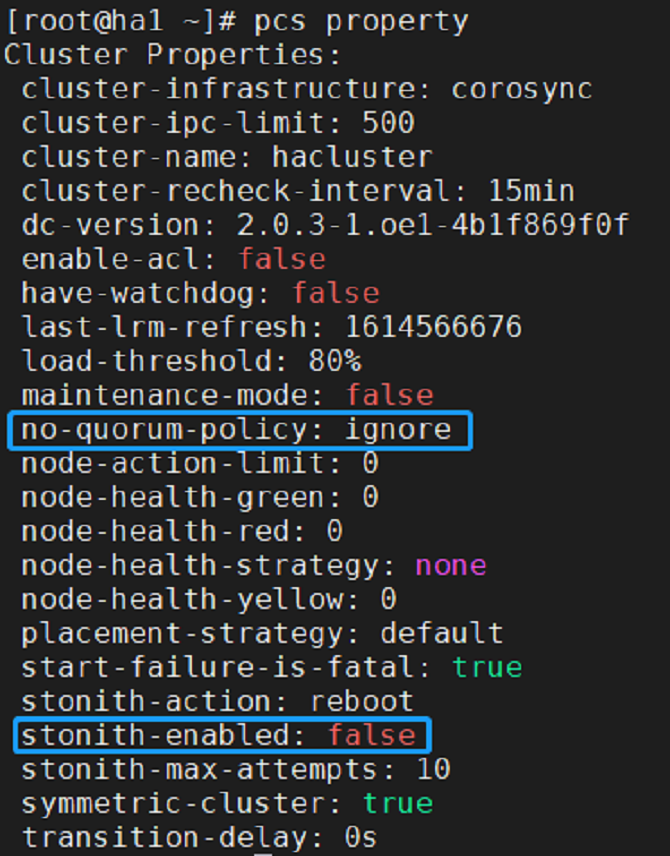

# HA使用实例

本章介绍如何快速使用HA高可用集群，以及添加一个实例。若不了解怎么安装，请参考[HA的安装与部署文档](./HA的安装与部署.md\)。

<!-- TOC -->
  - [HA使用实例](#HA使用与实例)
    - [快速使用指南](#快速使用指南)
      - [登陆页面](#登陆页面)
      - [主页面](#主页面)
        - [导航栏](#导航栏)
        - [顶部操作区](#顶部操作区)
        - [资源节点列表区](#资源节点列表区)
        - [节点操作浮动区](#节点操作浮动区)
    - [首选项配置](#首选项配置)
      - [添加资源](#添加资源)
        - [添加普通资源](#添加普通资源)
        - [添加组资源](#添加组资源)
        - [添加克隆资源](#添加克隆资源)
      - [编辑资源](#编辑资源)
      - [设置资源关系](#设置资源关系)
    - [高可用mysql实例配置](#高可用mysql实例配置)
      - [配置虚拟IP](#配置虚拟IP)
      - [配置NFS存储](#配置NFS存储)
      - [配置mysql](#配置mysql)
      - [添加上述资源为组资源](#添加上述资源为组资源)
    <!-- /TOC -->

## 快速使用指南

- 以下操作均以社区新开发的管理平台为例。

### 登陆页面
用户名为`hacluster`，密码为该用户在主机上设置的密码。


### 主页面
登录系统后显示主页面，主页面由四部分组成：侧边导航栏、顶部操作区、资源节点列表区以及节点操作浮动区。

以下将详细介绍这四部分的特点与使用方法。


#### 导航栏
侧边导航栏由两部分组成：高可用集群软件名称和 logo 以及系统导航。系统导航由三项组成：【系统】、【集群配置】和【工具】。【系统】是默认选项，也是主页面的对应项，主要展示系统中所有资源的相关信息以及操作入口；【集群配置】下设【首选项配置】和【心跳配置】两项；【工具】下设【日志下载】和【集群快捷操作】两项，点击后以弹出框的形式出现。

#### 顶部操作区
登录用户是静态显示，鼠标滑过用户图标，出现操作菜单项，包括【刷新设置】和【退出登录】两项，点击【刷新设置】，弹出【刷新设置】对话框，包含【刷新设置】选项，可以设置系统的自动刷新模式，包括【不自动刷新】、【每 5 秒刷新】和【每 10 秒刷新】三种选择，默认选择【不自动刷新】、【退出登录】即可注销本次登录，系统将自动跳到登录页面，此时，如果希望继续访问系统，则需要重新进行登录。


#### 资源节点列表区
资源节点列表集中展现系统中所有资源的【资源名】、【状态】、【资源类型】、【服务】、【运行节点】等资源信息，以及系统中所有的节点和节点的运行情况等节点信息。同时提供资源的【添加】、【编辑】、【启动】、【停止】、【清理】、【迁移】、【回迁】、【删除】和【关系】操作。

#### 节点操作浮动区
节点操作浮动区域默认是收起的状态，每当点击资源节点列表表头中的节点时，右侧会弹出节点操作扩展区域，如图所示，该区域由收起按钮、节点名称、停止和备用四个部分组成，提供节点的【停止】和【备用】操作。点击区域左上角的箭头，该区域收起。

### 首选项配置
以下操作均可用命令行配置，现只做简单示例，若想使用更多命令可以使用``pcs --help``进行查询。

```
# pcs property set stonith-enabled=false
# pcs property set no-quorum-policy=ignore
```
``pcs property``查看全部设置



-  点击侧边导航栏中的【首选项配置】按钮，弹出【首选项配置】对话框。将No Quorum Policy和Stonith Enabled由默认状态改为如下对应状态；修改完成后，点击【确定】按钮完成配置。


#### 添加资源
##### 添加普通资源
鼠标点击【添加普通资源】，弹出【创建资源】对话框，其中资源的所有必填配置项均在【基本】页面内，选择【基本】页面内的【资源类型】后会进一步给出该类资源的其他必填配置项以及选填配置项。填写资源配置信息时，对话框右侧会出现灰色文字区域，对当前的配置项进行解释说明。全部必填项配置完毕后，点击【确定】按钮即可创建普通资源，点击【取消】按钮，取消本次添加动作。【实例属性】、【元属性】或者【操作属性】页面中的选填配置项为选填项，不配置不会影响资源的创建过程，可以根据场景需要可选择修改，否则将按照系统默认值处理。

下面以apache为例，添加apache资源
```
# pcs resource create httpd ocf:heartbeat:apache
```
查看资源运行状态
```
# pcs status
```


-  添加apache资源


-  若回显为如下，则资源添加成功


-  资源创建成功并启动，运行于其中一个节点上，例如ha1；成功访问apache界面。


##### 添加组资源
添加组资源时，集群中需要至少存在一个普通资源。鼠标点击【添加组资源】，弹出【创建资源】对话框。【基本】页面内均为必填项，填写完毕后，点击【确定】按钮，即可完成资源的添加，点击【取消】按钮，取消本次添加动作。

-  **注：组资源的启动是按照子资源的顺序启动的，所以选择子资源时需要注意按照顺序选择。**


若回显为如下，则资源添加成功


##### 添加克隆资源
鼠标点击【添加克隆资源】，弹出【创建资源】对话框。【基本】页面内填写克隆对象，资源名称会自动生成，填写完毕后，点击【确定】按钮，即可完成资源的添加，点击【取消】按钮，取消本次添加动作。


若回显为如下，则资源添加成功


#### 编辑资源
-  启动资源：资源节点列表中选中一个目标资源，要求：该资源处于非运行状态。对该资源执行启动动作。
-  停止资源：资源节点列表中选中一个目标资源，要求：该资源处于运行状态。对该资源执行停止操作。
-  清理资源：资源节点列表中选中一个目标资源，对该资源执行清理操作。
-  迁移资源：资源节点列表中选中一个目标资源，要求：该资源为处于运行状态的普通资源或者组资源，执行迁移操作可以将资源迁移到指定节点上运行。
-  回迁资源：资源节点列表中选中一个目标资源，要求：该资源已经完成迁移动作，执行回迁操作，可以清除该资源的迁移设置，资源重新迁回到原来的节点上运行。
点击按钮后，列表中该资源项的变化状态与启动资源时一致。
-  删除资源：资源节点列表中选中一个目标资源，对该资源执行删除操作。

#### 设置资源关系
资源关系即为目标资源设定限制条件，资源的限制条件分为三种：资源位置、资源协同和资源顺序。
-  资源位置：设置集群中的节点对于该资源的运行级别，由此确定启动或者切换时资源在哪个节点上运行，运行级别按照从高到低的顺序依次为：Master Node、Slave 1。
-  资源协同：设置目标资源与集群中的其他资源是否运行在同一节点上，同节点资源表示该资源与目标资源必须运行在相同节点上，互斥节点资源表示该资源与目标资源不能运行在相同的节点上。
-  资源顺序：设置目标资源与集群中的其他资源启动时的先后顺序，前置资源是指目标资源运行之前，该资源必须已经运行；后置资源是指目标资源运行之后，该资源才能运行。

## 高可用mysql实例配置
- 先单独配置三个普通资源，待成功后添加为组资源。
### 配置虚拟IP
在首页中点击添加-->添加普通资源，并按如下进行配置。


-  资源创建成功并启动，运行于其中一个节点上，例如ha1；可以ping通并连接，登录后可正常执行各种操作；资源切换到ha2运行；能够正常访问。
-  若回显为如下，则资源添加成功


设置资源位置（每个资源都需要设置），以vip资源为例。


### 配置NFS存储
-  另外找一台机器作为nfs服务端进行配置

安装软件包

```
# yum install -y nfs-utils rpcbind
```
关闭防火墙
```
# systemctl stop firewalld && systemctl disable firewalld
```
修改/etc/selinux/config文件中SELINUX状态为disabled
```
# SELINUX=disabled
```
启动服务
```
# systemctl start rpcbind && systemctl enable rpcbind
# systemctl start nfs-server && systemctl enable nfs-server
```
服务端创建一个共享目录
```
# mkdir -p /test
```
修改NFS配置文件
```
# vim /etc/exports
# /test *(rw,no_root_squash)
```
重新加载服务
```
# systemctl reload nfs
```

客户端安装软件包，先把mysql安装上，为了把下面nfs挂载到mysql数据路径
```
# yum install -y nfs-utils mariadb-server
```
在首页中点击添加-->添加普通资源，并按如下进行配置NFS资源。


-  资源创建成功并启动，运行于其中一个节点上，例如ha1；nfs成功挂载到/var/lib/mysql路径下。资源切换到ha2运行；nfs从ha1节点取消挂载，并自动在ha2节点上挂载成功。
-  若回显为如下，则资源添加成功


### 配置mysql
在首页中点击添加-->添加普通资源，并按如下进行配置mysql资源。


配置操作属性


-  若回显为如下，则资源添加成功


### 添加上述资源为组资源
-  按资源启动顺序添加三个资源，需要先停止vip、nfs、mariadb资源

在首页中点击添加-->添加组资源，并按如下进行配置组资源。


-  组资源创建成功并启动，若回显与上述三个普通资源成功现象一致，则资源添加成功


-  将ha1节点备用，成功迁移到ha2节点，运行正常

