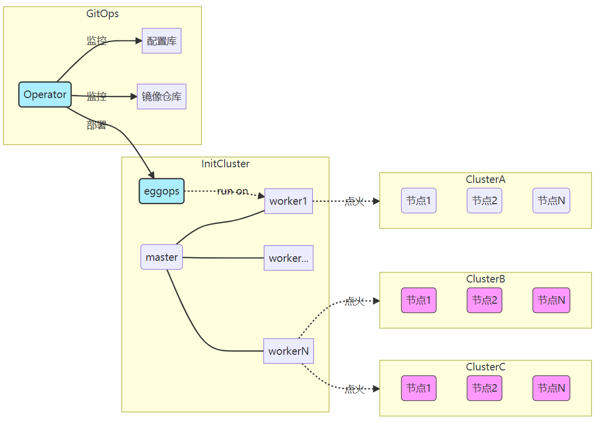

# 自动化部署

由于手动部署 Kubernetes 集群依赖人工部署各类组件，该方式耗时耗力。尤其是在大规模部署 Kubernetes  集群环境时，面临效率和出错的问题。为了解决该问题，openEuler 自 21.09 版本推出 Kubernetes 集群部署工具，该工具实现了大规模 Kubernetes 的自动化部署、部署流程追踪等功能，并且具备高度的灵活性。

这里介绍 Kubernetes 集群自动化部署工具的使用方法。

## 架构简介

自动化集群部署整体架构如图所示，各模块含义如下：

- GitOps：负责集群配置信息的管理，如更新、创建、删除等； 21.09 版本暂时不提供集群管理集群的功能。
- InitCluster：元集群，作为中心集群管理其他业务集群。
- eggops：自定义 CRD 和 controller 用于抽象 k8s 集群。
- master：k8s 的 master 节点，承载集群的控制面。
- worker：k8s 的负载节点，承载用户业务。
- ClusterA、ClusterB、ClusterC：业务集群，承载用户业务。

如果您对openEuler提供的k8s集群部署工具感兴趣，欢迎访问源码仓：[https://gitee.com/openeuler/eggo](https://gitee.com/openeuler/eggo)

