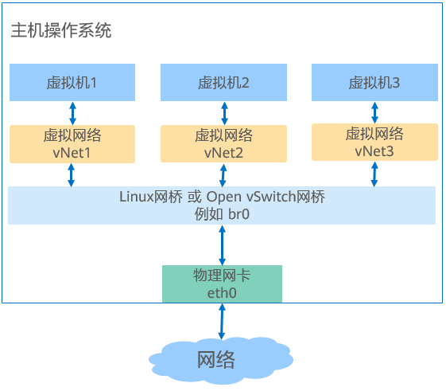

# 准备使用环境
<!-- TOC -->
- [准备使用环境](#准备使用环境)
    - [准备虚拟机镜像](#准备虚拟机镜像)
    - [准备虚拟机网络](#准备虚拟机网络)
    - [准备引导固件](#准备引导固件)
    - [非root用户配置](#非root用户配置)
<!-- /TOC -->


## 准备虚拟机镜像

### 概述

虚拟机镜像是一个文件，包含了已经完成安装并且可启动操作系统的虚拟磁盘。虚拟机镜像具有不同格式，常见的有raw格式和qcow2格式。qcow2格式镜像相比raw格式，具有占用更小的空间，支持快照、Copy-On-Write、AES加密、zlib压缩等特性，但性能略逊于raw格式镜像。镜像文件的制作借助于qemu-img工具，本节以qcow2格式镜像文件为例，介绍虚拟机镜像制作过程。

### 制作镜像

制作qcow2格式镜像文件的操作步骤如下：

1.  使用root用户安装qemu-img软件包。

    ```
    # yum install -y qemu-img
    ```

2.  使用qemu-img工具的create命令，创建镜像文件，命令格式为：

    ```
    $ qemu-img create -f <imgFormat> -o <fileOption> <fileName> <diskSize>
    ```

    其中，各参数含义如下：

    -   _imgFormat_：镜像格式，取值为raw, qcow2等。
    -   _fileOption_：文件选项，用于设置镜像文件的特性，如指定后端镜像文件，压缩，加密等特性。
    -   _fileName_：文件名称。
    -   _diskSize_：磁盘大小，用于指定块磁盘设备的大小，支持的单位有K、M、G、T，分别代表KiB、MiB、GiB、TiB。

    例如，创建一个磁盘设备大小为4GB、格式为qcow2的镜像文件openEuler-imge.qcow2，命令和回显如下：

    ```
    $ qemu-img create -f qcow2 openEuler-image.qcow2 4G
    Formatting 'openEuler-image.qcow2', fmt=qcow2 size=4294967296 cluster_size=65536 lazy_refcounts=off refcount_bits=16
    ```


### 修改镜像磁盘空间大小

当虚拟机需要更大的磁盘空间时，可以使用qemu-img工具，修改虚拟机镜像磁盘空间的大小，修改方法如下。

1.  查询当前虚拟机镜像磁盘空间大小，命令如下：

    ```
    $ qemu-img info <imgFiLeName>
    ```

    例如，查询openEuler-image.qcow2镜像磁盘空间大小的命令和回显如下，说明该镜像磁盘空间大小为4GiB。

    ```
    $ qemu-img info openEuler-image.qcow2 
    image: openEuler-image.qcow2
    file format: qcow2
    virtual size: 4.0G (4294967296 bytes)
    disk size: 196K
    cluster_size: 65536
    Format specific information:
        compat: 1.1
        lazy refcounts: false
        refcount bits: 16
        corrupt: false
    ```

2.  修改镜像磁盘空间大小，命令如下，其中_imgFiLeName_为镜像名称，“+”和“-”分别表示需要增加或减小的镜像磁盘空间大小，单位为K、M、G、T，代表KiB、MiB、GiB、TiB。

    ```
    $ qemu-img resize <imgFiLeName> [+|-]<size>
    ```

    例如，将上述openEuler-image.qcow2镜像磁盘空间大小扩展到24GiB，即在原来4GiB基础上增加20GiB，命令和回显如下：

    ```
    $ qemu-img resize openEuler-image.qcow2 +20G
    Image resized.
    ```

3.  查询修改后的镜像磁盘空间大小，确认是否修改成功，命令如下：

    ```
    $ qemu-img info <imgFiLeName>
    ```

    例如，上述openEuler-image.qcow2镜像磁盘空间已扩展到24GiB，命令和回显如下：

    ```
    $ qemu-img info openEuler-image.qcow2 
    image: openEuler-image.qcow2
    file format: qcow2
    virtual size: 24G (25769803776 bytes)
    disk size: 200K
    cluster_size: 65536
    Format specific information:
        compat: 1.1
        lazy refcounts: false
        refcount bits: 16
        corrupt: false
    ```


## 准备虚拟机网络

### 概述

为了使虚拟机可以与外部进行网络通信，需要为虚拟机配置网络环境。KVM虚拟化支持Linux网桥、Open vSwitch网桥等多种类型的网桥。如[图1](#fig1785384714917)所示，数据传输路径为“虚拟机 -\> 虚拟网卡设备  -\> Linux网桥或Open vSwitch网桥 -\> 物理网卡”。创建网桥，除了为虚拟机配置虚拟网卡设备外，为主机创建网桥是连接虚拟化网络的关键。

本节给出搭建Linux网桥和Open vSwitch网桥的方法，使虚拟机连接到网络，用户可以根据情况选择搭建网桥的类型。

**图 1**  虚拟网络结构图<a name="fig1785384714917"></a>


### 搭建Linux网桥

以物理网卡eth0绑定到Linux网桥br0的操作为例，使用root用户执行如下命令搭建Linux网桥：

1.  安装bridge-utils软件包。

    Linux网桥通常通过brctl工具管理，其对应的安装包为bridge-utils，安装命令如下：

    ```
    # yum install -y bridge-utils
    ```

2.  创建网桥br0。

    ```
    # brctl addbr br0
    ```

3.  将物理网卡eth0绑定到Linux网桥。

    ```
    # brctl addif br0 eth0
    ```

4.  eth0与网桥连接后，不再需要IP地址，将eth0的IP设置为0.0.0.0。

    ```
    # ifconfig eth0 0.0.0.0
    ```

5.  设置br0的IP地址。
    -   如果有DHCP服务器，可以通过dhclient设置动态IP地址。

        ```
        # dhclient br0
        ```

    -   如果没有DHCP服务器，给br0配置静态IP，例如设置静态IP为192.168.1.2，子网掩码为255.255.255.0。

        ```
        # ifconfig br0 192.168.1.2 netmask 255.255.255.0
        ```


### 搭建Open vSwitch网桥

Open vSwitch网桥，具有更便捷的自动化编排能力。搭建Open vSwitch网桥需要安装网络虚拟化组件，这里介绍总体操作。

**一、安装Open vSwitch组件**

使用Open vSwitch提供虚拟网络，需要安装Open vSwitch网络虚拟化组件，使用root用户执行如下命令：

1.  安装Open vSwitch组件。

    ```
    # yum install -y openvswitch
    ```

2.  启动Open vSwitch服务。

    ```
    # systemctl start openvswitch
    ```


**二、确认安装是否成功**

确认Open vSwitch组件是否安装成功。

1.  确认openvswitch组件是否安装成功。若安装成功，可以看到软件包相关信息，命令和回显如下：

    ```
    $ rpm -qi openvswitch
    Name        : openvswitch
    Version     : 2.11.1
    Release     : 1
    Architecture: aarch64
    Install Date: Thu 15 Aug 2019 05:08:35 PM CST
    Group       : System Environment/Daemons
    Size        : 6051185
    License     : ASL 2.0
    Signature   : (none)
    Source RPM  : openvswitch-2.11.1-1.src.rpm
    Build Date  : Thu 08 Aug 2019 05:24:46 PM CST
    Build Host  : armbuild10b247b121b105
    Relocations : (not relocatable)
    Vendor      : Nicira, Inc.
    URL         : http://www.openvswitch.org/
    Summary     : Open vSwitch daemon/database/utilities
    Description :
    Open vSwitch provides standard network bridging functions and
    support for the OpenFlow protocol for remote per-flow control of
    traffic.
    ```

2.  查看Open vSwitch服务是否启动成功。若服务处于“Active”状态，说明服务启动成功，可以正常使用Open vSwitch提供的命令行工具，命令和回显如下：

    ```
    $ systemctl status openvswitch
    ● openvswitch.service - LSB: Open vSwitch switch
       Loaded: loaded (/etc/rc.d/init.d/openvswitch; generated)
       Active: active (running) since Sat 2019-08-17 09:47:14 CST; 4min 39s ago
         Docs: man:systemd-sysv-generator(8)
      Process: 54554 ExecStart=/etc/rc.d/init.d/openvswitch start (code=exited, status=0/SUCCESS)
        Tasks: 4 (limit: 9830)
       Memory: 22.0M
       CGroup: /system.slice/openvswitch.service
               ├─54580 ovsdb-server: monitoring pid 54581 (healthy)
               ├─54581 ovsdb-server /etc/openvswitch/conf.db -vconsole:emer -vsyslog:err -vfile:info --remote=punix:/var/run/openvswitch/db.sock --private-key=db:Open_vSwitch,SSL,private_key --certificate>
               ├─54602 ovs-vswitchd: monitoring pid 54603 (healthy)
               └─54603 ovs-vswitchd unix:/var/run/openvswitch/db.sock -vconsole:emer -vsyslog:err -vfile:info --mlockall --no-chdir --log-file=/var/log/openvswitch/ovs-vswitchd.log --pidfile=/var/run/open>
    ```


**三、搭建Open vSwitch网桥**

以创建Open vSwitch一层网桥br0为例，介绍搭建方法，使用root用户执行如下命令：

1.  创建Open vSwitch网桥br0。

    ```
    # ovs-vsctl add-br br0
    ```

2.  将物理网卡eth0添加到br0。

    ```
    # ovs-vsctl add-port br0 eth0
    ```

3.  eth0与网桥连接后，不再需要IP地址，将eth0的IP设置为0.0.0.0。

    ```
    # ifconfig eth0 0.0.0.0
    ```

4.  为OVS网桥br0分配IP。
    -   如果有DHCP服务器，可以通过dhclient设置动态IP地址。

        ```
        # dhclient br0
        ```

    -   如果没有DHCP服务器，给br0配置静态IP，例如192.168.1.2。

        ```
        # ifconfig br0 192.168.1.2
        ```


## 准备引导固件

### 概述

针对不同的架构，引导的方式有所差异。x86支持UFEI（Unified Extensible Firmware Interface）和BIOS方式启动，AArch64仅支持UFEI方式启动。openEuler默认已安装BIOS启动对应的引导文件，不需要用户额外操作。所以这里仅介绍UEFI启动方式的安装方法。

统一的可扩展固件接口UEFI是一种全新类型的接口标准，用于开机自检、引导操作系统的启动，是传统BIOS的一种替代方案。EDK II是一套实现了UEFI标准的开源代码，在虚拟化场景中，通常利用EDK II工具集，通过UEFI的方式启动虚拟机。使用EDK II工具需要在虚拟机启动之前安装对应的软件包 ，本节介绍EDK II的安装方法。

### 安装方法

如果使用UEFI方式引导，需要安装工具集EDK II，AArch64架构对应的安装包为edk2-aarch64，x86架构对应的安装包为edk2-ovmf。这里以AArch64架构为例，给出具体的安装方法，x86架构仅需将edk2-aarch64替换为edk2-ovmf。

1.  安装edk软件包，使用root用户执行如下命令：

    在AArch64架构下edk2的包名为edk2-aarch64

    ```
    # yum install -y edk2-aarch64
    ```

    在x86\_64架构下edk2的包名为edk2-ovmf

    ```
    # yum install -y edk2-ovmf
    ```

2.  查询edk软件是否安装成功，命令如下：

    在AArch64架构下查询如下

    ```
    $ rpm -qi edk2-aarch64
    ```

    若edk软件安装成功，回显类似如下：

    ```
    Name        : edk2-aarch64
    Version     : 20180815gitcb5f4f45ce
    Release     : 1.oe3
    Architecture: noarch
    Install Date: Mon 22 Jul 2019 04:52:33 PM CST
    Group       : Applications/Emulators
    ```

    在x86\_64架构下查询如下

    ```
    $ rpm -qi edk2-ovmf
    ```

    若edk软件安装成功，回显类似如下：

    ```
    Name        : edk2-ovmf
    Version     : 201908
    Release     : 6.oe1
    Architecture: noarch
    Install Date: Thu 19 Mar 2020 09:09:06 AM CST
    ```

## 非root用户配置

### 概述

openEuler虚拟化使用virsh管理虚拟机。如果希望在非root用户使用virsh命令管理虚拟机，在使用之前需要进行相关配置，这里给出配置指导。

### 操作指导

允许非root用户使用virsh命令管理虚拟机的配置操作如下，以下命令中的userName请改为实际的非root用户名称：

1. 使用root用户登陆主机。

2. 将非root用户添加到libvirt用户组。

   ```
   # usermod -a -G libvirt userName
   ```

3. 切换到非root用户。

   ```
   # su userName
   ```

4. 配置非root用户的环境变量。使用vim打开~/.bashrc文件:

   ```
   $ vim ~/.bashrc
   ```
   并在末尾加上如下内容后保存。

   ```
   export LIBVIRT_DEFAULT_URI="qemu:///system"
   ```
   执行如下命令，使配置生效。
   ```
   $ source ~/.bashrc
   ```
5. 在虚拟机XML配置文件中的domain根元素中添加如下内容，使qemu-kvm进程可以访问磁盘镜像文件。

   ```
   <seclabel type='dynamic' model='dac' relabel='yes'>
   ```
