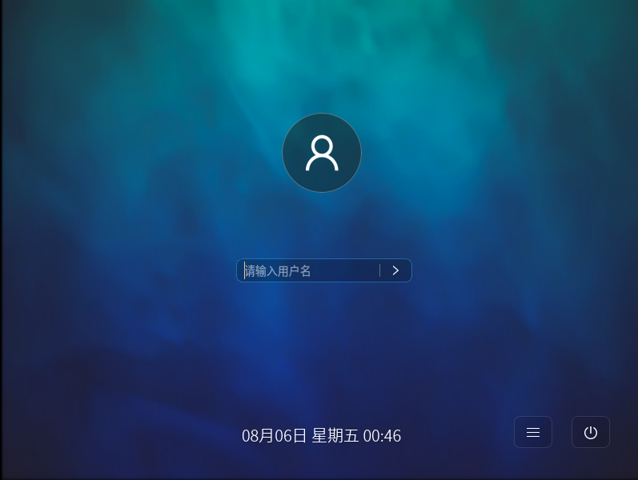

# Kiran桌面环境用户手册
## 1.概述
Kiran桌面是一款以用户和市场需求为主导的稳定、高效、易用的桌面环境，主要包括了桌面、任务栏、托盘、控制中心和窗口管理等组件。本文介绍了Kiran桌面的使用。

## 2.桌面
### 2.1.登录界面
安装完成后重启系统，系统启动后需要输入登录的用户名和密码才能进入系统，登录界面会显示时间日期，电源按钮，软键盘按钮。界面支持自适应调整，支持屏幕放缩，支持多屏显示，登录框可以跟随鼠标进行屏幕切换。

### 2.2.主界面
输入正确的用户名和密码后即可登录系统进入主界面，如下图所示：

桌面上放置有几个图标，如计算机、主文件夹、回收站等，位于屏幕底部的一个长条称为面板，从这里可以启动应用程序或在模拟桌面上切换。
桌面是用户的工作区域，用户操作和程序运行都是在桌面上。桌面上还有用户希望能方便访问的文件和应用程序图标，用鼠标双击可以运行相应程序或打开文件。可以拖动、添加或删除桌面图标。使用桌面图标可以更加便捷地完成工作。

计算机：双击可以显示从本计算机访问的所有本地和远程磁盘和文件夹。

主文件夹：双击可以显示kylin目录下的内容。

回收站：暂时存放已删除文件的地方。

桌面右键：桌面右键提供了一些图标管理、创建文件夹、创建文档、桌面背景、主题、等快捷方式。

创建文件夹：可以创建新的文件夹。

创建启动器：可以创建一个新的启动器。

创建文档：可以创建空的纯文本文档。

打开终端：直接打开终端应用。

按名称组织桌面：按名称来进行排序桌面文件。

保持对齐：勾选了保持对齐，桌面图标会按照网格对齐排列。

更改桌面背景：打开“背景”，以改变桌面或锁屏的背景图片。

### 2.3.面板
面板通常位于屏幕的底部，上面包括了开始菜单按钮、快速启动区域、经常使用的应用程序与桌面小程序图标和显示当前运行应用程序的任务条。
将鼠标停在某个图标上呆几秒钟，会看到一个白色的弹出提示框，内容是对这个图标作用的描述。

## 3.任务栏
任务栏：显示正在运行的程序或打开的文档，点击任务条上某一项可以最大化或最小化被选中的程序。可以通过在对应项上点击鼠标右键对其运行窗口进行最大化、最小化或关闭等操作。

| 组件    | 说明 |
| :------------ | :------------ |
||开始菜单按钮：相当于Windows中的开始按钮，单击会弹出系统级联的开始菜单|
||单机此按钮启动工作区|
||单击此按钮启动文件浏览器，可浏览管理文件|
||单击将启动终端|
||单击此按钮启动firefox浏览器|
||显示当前网络状态，单击可修改系统的网络配置|
||显示当前日期和时间，可以根据需要定制显示的样式|

## 4.控制中心
### 4.1.开始菜单设置
选择“开始菜单”>“控制中心”>“开始菜单设置”。
开始菜单可设置开始菜单样式，根据个人喜好设置开始菜单的显示模式与不透明度，如图所示：

开始菜单根据设置的透明度、显示模式而更改，如下图：

### 4.2.登录设置
选择“开始菜单”>“控制中心”>“登录设置”打开。
在kiran桌面，用户可以通过选择控制中心中的登录设置对登录界面环境效果进行设置，其中包括登录界面背景图、是否自动登录、缩放比例、是否允许手动输入用户名登录、是否显示用户列表等，如图所示：

还可以设置自动登录，设置自动登录的用户和延时，重启系统后会自动登录该用户，无需输入密码。

### 4.3.显示设置
定制显示属性是每个桌面系统所必备的，kiran桌面提供了强大的显示属性定制工具。您可以通过选择“开始菜单”>“控制中心”>“显示设置”进入显示设置界面，如下图所示：

这里可以设置屏幕旋转、分辨率、刷新率、缩放率和旋转，设置完成后点击“应用”即可。

### 4.4.鼠标设置
用户可以通过选择控制中心中的“鼠标设置”对鼠标进行配置，可以修改鼠标手持模式为左手和右手模式，调整鼠标移动速度，可以设置是否自动滚动，是否同时按下左右键模拟中键功能。鼠标设置常见界面如图所示：

### 4.5.账户管理工具
账户管理工具工具是对用户和组进行管理的一个简单易用工具，您可以通过这个工具对用户和组群进行配置和管理，主要包括：
1)增加用户，设置用户属性；
2)修改用户属性；
3)显示用户属性；
4)删除用户；
用户属性包括：账号、口令(密码)、登录 shell，用户组属性指在该组包含哪些用户。
#### 4.5.1.启动账户管理工具
在控制中心中选择启动“账户管理工具”选项即可启动账户管理工具，如图所示：

在这个界面中您可以看到有左侧菜用户栏和右侧详细信息栏两个部分。目前在列出的是系统中的所有用户（除root用户除外）。点击左侧某个用户，详细信息栏将显示用户的基本信息（用户ID、用户类型等）。
点击“创建用户”，在右侧出现页面，如下图所示，按照要求填写您要添加的用户名、用户类型、设置密码、头像。填写完毕后，单击“创建”即完成添加。

【注】：如果您已经设置了密码允许的最小位数(例如四位)，则您在此处输入的密码位数要不小于 4 位，否则系统将不会接受该密码。

单击头像区域打开头像修改功能，系统预设了各种类型的头像供用户选择，用户也可以自己添加头像，点击“确认”后记得保存：

#### 4.5.2.删除用户
首先在左侧信息栏里的欲删除的用户上单击，选中该用户，然后在右侧工具栏上点击“删除”按钮，如下图所示：

在弹出上图所示的对话框中单击“否”撤消删除，单击“是”确认删除。
#### 4.5.3.高级设置
选择“创建新用户”>“输入账号密码”>“高级设置”，打开一个对话框，如下图所示，可以设置用户的登录shell、指定用户ID和指定用户目录。

### 4.6. 外观
定制显示属性是每个桌面系统所必备的，Kiran桌面为您提供了强大的显示属性定制工具。外观是一个对系统的桌面背景，主题，字体三个方面提供统一配置和管理的工具。
选择“开始菜单”>“控制中心”>“外观”，显示的界面如下图所示：

#### 4.6.1.主题
主题可以对系统的对话框风格，菜单风格，系统面板风格，图标风格进行统一设置或者也可以根据用户的喜好定制。

1)主题设置
系统中默认已提供了多套主题，可以在主题浏览对话框中浏览主题的相关信息。点击主题浏览对话框中的主题，即可设置系统主题，如图所示：

2)自定义主题
用户可以通过点击“自定义”按钮，来根据用户的喜好定制系统主题，如下图所示：自定义主题包括：
a.控制；
b.色彩；
c.窗口边框；
d.图标；
e.指针；

#### 4.6.2.背景
用户可以对桌面背景进行设置，可以修改颜色、样式。
1)背景图片设置
如下图所示，点击壁纸文件浏览对话框中的壁纸，即可将桌面设置为此壁纸。

2)样式
用户可以根据自己的喜好通过样式下拉式选择框来调整壁纸填充桌面背景时的方式。填充方式有以下五种方式：

a.平铺；
b.缩放；
c.居中；
d.比例放大；
e.伸展；
f.适合宽度。

3)壁纸的添加与删除
用户可以通过“添加”按钮添加自己喜欢的壁纸，如下图所示：

点击“打开”即可添加壁纸。
同时可以点击“删除”按钮来删除用户不喜欢的壁纸。具体步骤：选择壁纸，点击“删除”。

4)桌面背景色彩填充设置
用户如果不喜欢用壁纸来设置桌面背景，也可以用色彩来设置背景，在壁纸选择对话框中选择无壁纸选项，即可使用色彩来填充桌面背景。
填充色彩的方式有三种：

a.纯色；
b.水平梯度；
c.垂直梯度。

#### 4.6.3.字体
1)字体设置
用户可以通过字体设置来设置系统图形界面的各种类型的字体，字体类型包括以下五种类型：

a.应用程序字体；
b.文档字体；
c.桌面字体；
d.窗口标题字体；
e.等宽字体。

2)字体效果设置与详情设置
字体渲染效果设置
用户可以通过字体渲染效果设置来设置系统图形界面的以下四种类型的字体效果：

a.单色；
b.最佳形状；
c.最佳对比；
d.次像素平滑；
系统默认使用的最佳形状的字体渲染效果，如下图所示：

3)字体细节设置
字体效果的一些详情设置可以通过“细节”按钮进行设置。详情设置包括：

a.字体分辨率；
b.字体平滑度；
c.字体微调；
d.字体次像素排序。

4)用户可以设置界面，选择是否在菜单显示图标和在按钮中显示图标：

## 5.桌面应用
### 5.1.文本编辑器 
要启动文本编辑器，点击“开始菜单”>“所有应用”>“工具”>“pluma”。也可以在shell提示符下键入pluma启动文本编辑器。
文本编辑器是所有计算机系统中最常用的一种工具。用户在使用计算机时，往往需要创建自己的文件，无论是一般的文字文件、资料文件，还是编写源程序，这些工作都离不开编辑器。它用于查看和修改纯文本文件，纯文本文件是不包含应用字体或风格格式的普通文本文件，如系统日志和配置文件：

### 5.2.终端
在桌面环境下，可以利用终端程序进入传统的命令操作界面，启动命令行终端的方法是：选择“开始菜单”>“所有应用”>“工具”>“终端”或者桌面面板上的图标：

### 5.3.Firefox火狐浏览器
要启动Firefox火狐浏览器，点击“开始菜单”>“所有应用”>“互联网”>“Firefox火狐浏览器”。
Firefox火狐浏览器，是一个自由及开放源代码网页浏览器，使用Gecko排版引擎，支持多种操作系统，如Windows、Mac OS X及GNU/Linux等。它体积小速度快，还有其他一些高级特征，主要特性有：标签式浏览、使用网上冲浪更快、可以禁止弹出式窗口、自定制工具栏、扩展管理、更好的搜索特性、快速而方便的侧栏：

### 5.4.截图工具
选择“开始菜单”>“所有应用”>“图像”>“截图工具”，可以启动截图工具。
截图工具是kiranz桌面的一款小巧灵活的屏幕捕捉软件，操作界面简洁、使用极为方便。该软件启动时会在托盘处添加截图工具图标，点击该图标后，直接弹出屏幕捕捉界面，可自行选择截图范围。可通过有击该图标打开“打开启动器”，可选择需要抓取的范围是整个桌面，或者方形区域，可设置截图延迟时间，如下图所示：

在弹出的对话框中，点击“√”，即可保存至桌面，如想自定义保存位置，点击“选项”>勾选“自定义保存位置”即可。如下图所示：

### 5.5.网络设置
Kiran桌面采用了NetworkManager作为网络配置工具，NetworkManager是用来设定、配置和管理各种网络类型的桌面工具，NetworkManager提供了对移动宽带设备、蓝牙、IPv6 提供改进的支持。通过点击“开始菜单-控制中心-网络连接”打开，或者通过点击桌面右下角网络图标选择编辑连接打开，如图所示：

设置有线连接： 
设备选择当前的网卡，如“ens160”是当前系统的网卡，选中该网卡，点击“编辑”按钮，弹出网卡编辑对话框：

“IPv4设置”是用户常用到的设置，这里选择了DHCP的方式获取IP和DNS服务器，系统会自动给用户分配IP地址。
有些时候用户会碰到需要手动填写IP地址的情况，这就需要在IPv4设置的上方“方法”下拉菜单中选择“手动”，如下图所示：

接下来点击“添加”按钮依次输入IP地址、子网掩码和网关，并填写DNS服务器，如下图：

填写ip地址、子网掩码、网关和DNS后保存，点击桌面右下角网络图标断开网络后重新连接。
### 5.6.时间和日期管理
要对系统的日期和时间进行设置，您可以在控制中心中选择“时间和日期管理”选项，也可以通过点击桌面右下角日期区域，系统将弹出如图所示的界面：

自动同步日期和时间：打开“自动同步”并连接外网可以自动同步时间。
设置时区：点击“更改时区”按钮，右侧显示如下图所示时区设置对话框，点击需要更改的时区后保存即可修改时区。

手动设置时间：关闭自动同步按钮，点击手动设置时间，可以手动调整年份、月份、日以及时间，修改完成后保存。

修改日期格式：点击日期时间格式设置可以修改显示的日期格式，可以设置长日期显示格式、短日期显示格式、时间格式、以及是否显示秒：

