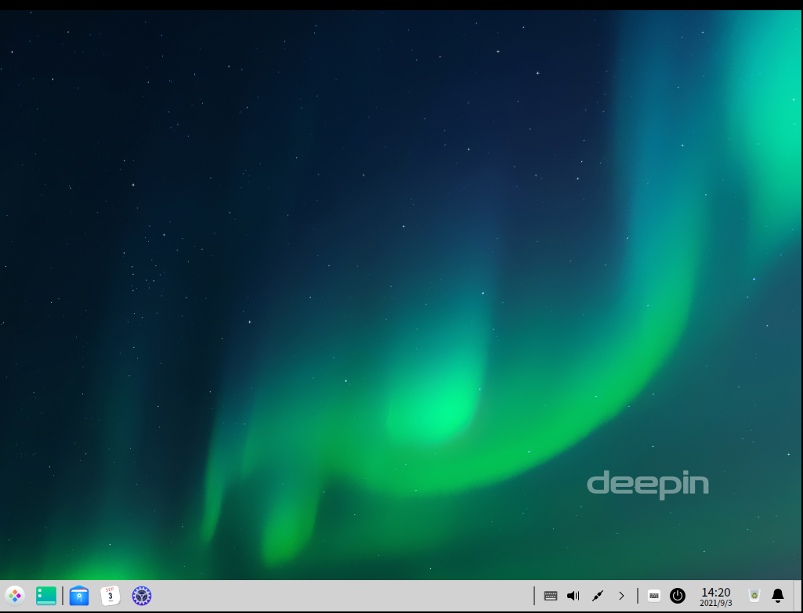
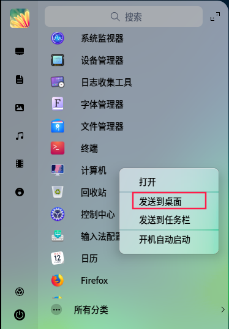

# DDE 用户指南

本节主要描述 DDE 桌面环境的安装和使用。

## FAQ 常见问题及解答

### 1.安装DDE后，root账户登录桌面无计算机和回收站图标？

* 问题表现

  安装DDE后，root账户登录桌面无计算机和回收站图标

* 问题原因

  由于root用户在安装DDE前已创建，而DDE在安装时不会对已经创建的用户进行新增桌面图标操作。DDE安装后新建用户无此问题。

* 解决方案

  用户可通过启动器中右键对应图标发送到桌面即可，无任何功能差异。

  

