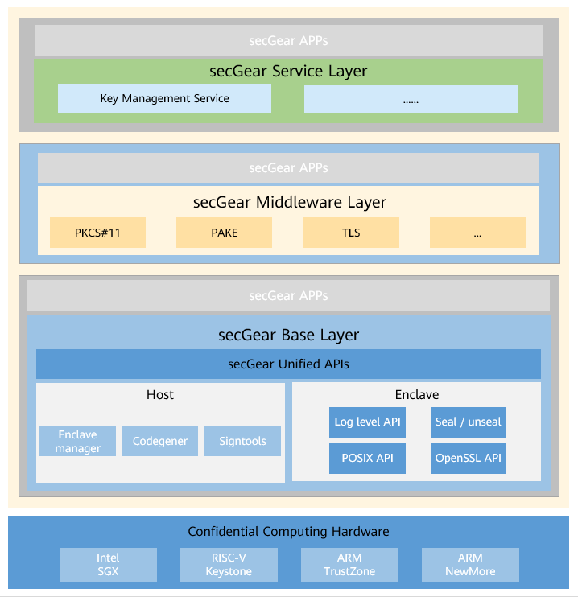

### 概述

随着云计算的快速发展，越来越多的企业把计算业务部署到云上，对数据的保护变得更加复杂，同时，数据泄露是云计算面临的重大安全问题。因此，如何保障用户数据在云上的安全变得尤为重要。当前对数据的保护通常注重离线存储安全和网络传输安全，缺乏对数据运行时的安全防护。为了保障云端数据运行时的安全性，方便开发者开发云上应用，openEuler 推出了 secGear 。

secGear 是统一机密计算编程框架，提供了易用的开发套件，包括安全区（使用 secGear 编程会将内存分为安全区域和不安全区域） 生命周期管理、安全开发库、代码辅助生成工具、代码构建与签名工具、安全能力和安全服务组件实现方案。可用于信任环、密态数据库、多方计算、AI安全保护等多种场景。

本文档介绍 secGear 的使用方法，以便指导开发者基于 secGear 开发应用程序，从而更好地保护数据。

### 架构介绍

 

如图所示，secGear 主题包含三个层级（当前仅开源基础层 Base Layer，服务层和中间件层逐步开源）：

- 服务层：提供完整的运行在安全侧的安全服务。

- 中间件层：提供一套协议接口，满足用户基本安全应用。

- 基础层：提供丰富的 enclave 开发接口或工具，并且在安全侧支持 C POSIX APIs 和标准 OpenSLL 接口，用户基于这些接口可以自由开发安全应用程序 。