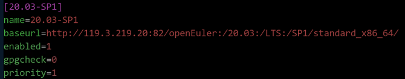
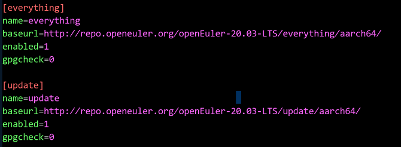
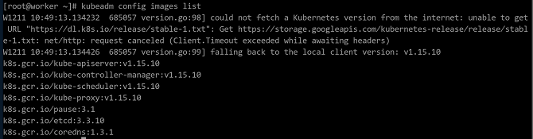
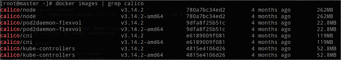
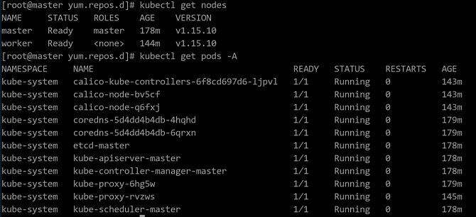

# K8S 迁移至 openEuler 指导

[[toc]]

## 软件介绍

Kubernetes 集群（以下简称 K8S）是一个开源的容器集群管理平台，可以实现容器集群的自动化部署、自动扩缩容、维护等功能。Kubernetes的目标是促进完善组件和工具的生态系统，以减轻应用程序在云上运行的负担。

Kubernetes 集群中存在两种节点，Master 节点和 Worker 节点。Master 节点是集群的控制节点，负责整个集群的管理和控制。针对集群执行的控制命令都是发送给 Master 节点的。Worker 节点是 Kubernetes 集群中的工作负载节点，Worker 上的工作负载由 Master 分配，当某个 Worker 宕机时，Master 会将上面的工作负载转移到其他节点上去。

本文描述使用两个节点来搭建 Kubernetes 集群的方法，一个作为 Master 节点，另一个作为 Worker 节点。


## 环境配置

### 软件平台

|  软件名称   |版本号  |安装方法   |
|:---  |:----  |:----  |
| openEuler | 20.03-LTS-SP1 |iso  |
| gnu | 7.3.0 |  |
| python3 | 3.7.4 | |
| bash | 5.0.11 |          |

### 必要依赖包

|  软件名称   |版本号  |安装方法   |
|:---  |:----  |:----  |
| docker-engine | 18.09.0-101 |见安装docker配置yum源  |
| kubelet | 1.15.10/1.18/1.16 | 见安装k8s组件 |
| kubeadm | 1.15.10/1.18/1.16 | 见安装k8s组件 |
| kubectl | 1.15.10/1.18/1.16 | 见安装k8s组件 |
| kubernetes-cni | 1.15.10/1.18/1.16 | 见安装k8s组件 |

> **说明：**
>本文适用于 K8S 1.15.10/1.18/1.16 三个版本，本文以 1.15.10 版本为例说明。

## 系统配置


### 修改主机配置

分别编辑 Master 和 Worker 节点的`/etc/hosts` 文件，在文件末尾添加 Master 和 Worker 节点的IP。

```
192.168.122.72 master
192.168.122.130 worker 
```

### 安装 docker 配置 yum 源

1. 可选，官方发布的镜像中已配置好 yum 源，不需要另外配置。如系统中没有配置任何 openEuler yum 源，则需要按照如下操作新增 repo 文件，`baseurl`值以发布版本中的源地址为准。
* aarch64架构
    ```
    $ vim /etc/yum.repos.d/openEuler_aarch64.repo
    ```

    

* x86架构

    ```
    $ vim /etc/yum.repos.d/openEuler_x86_64.repo
    ```

    
	
2. 分别在 Master 和 Worker 节点上执行。
清除缓存中的软件包及旧的headers，重新建立缓存。

    ```
    $ yum clean all
    $ yum makecache
    ```
3. 安装docker并启动相关服务，输出Docker的状态。
	
    ```	
    $ yum -y install docker-engine
    $ systemctl daemon-reload
    $ systemctl status docker
    $ systemctl restart docker
    $ systemctl status docker
    $ systemctl enable docker
    ```

### 关闭防火墙和selinux

由于 nftables 后端兼容性问题，产生了重复的防火墙规则，需要关闭防火墙；为了使容器可以访问宿主机的文件系统，需要关闭 selinux。

分别在 Master 和 Worker 节点上执行如下命令，关闭防火墙和 selinux。

```
$ systemctl stop firewalld
$ systemctl disable firewalld
$ setenforce 0
$ sed -i '/^SELINUX=/s/enforcing/disabled/' /etc/selinux/config
```

### 配置 kubernetes yum 源

1. 分别在 Master 和 Worker 节点上执行如下命令，配置 kubernetes 的 yum 源。
    * aarch64架构
    ```
    cat <<EOF > /etc/yum.repos.d/kubernetes.repo

    [kubernetes]
    name=Kubernetes
    baseurl=https://mirrors.aliyun.com/kubernetes/yum/repos/kubernetes-el7-aarch64
    enable=1
    gpgcheck=1
    repo_gpgcheck=1
    gpgkey=http://mirrors.aliyun.com/kubernetes/yum/doc/yum-key.gpg
	      http://mirrors.aliyun.com/kubernetes/yum/doc/rpm-package-key.gpg
    EOF
    ```

    * x86架构:
    ```
    cat <<EOF > /etc/yum.repos.d/kubernetes.repo

    [kubernetes]
    name=Kubernetes
    baseurl=https://mirrors.aliyun.com/kubernetes/yum/repos/kubernetes-el7-x86_64
    enable=1
    gpgcheck=1
    repo_gpgcheck=1
    gpgkey=http://mirrors.aliyun.com/kubernetes/yum/doc/yum-key.gpg
    	  http://mirrors.aliyun.com/kubernetes/yum/doc/rpm-package-key.gpg
    EOF
    ```

2. 配置完成后，执行如下命令，清除缓存中的软件包及旧的 headers，重新建立缓存。
    ```
    $ yum clean all
    $ yum makecache
    ```


### 关闭交换分区

在安装 K8S 集群时，Linux 的 Swap 内存交换机制需要关闭，否则会因为内存交换影响系统的性能和稳定性。 

1. 分别在 Master 和 Worker 节点上执行如下命令，关闭交换分区。

    ```
    $ swapoff -a
    $ cp -p /etc/fstab /etc/fstab.bak$(date '+%Y%m%d%H%M%S')
    $ sed -i "s/\/dev\/mapper\/openeuler-swap/\#\/dev\/mapper\/openeuler-swap/g" /etc/fstab
    ```

2. 执行如下命令查看是否修改成功。
    ```
    $ cat /etc/fstab
    ```
	
    	

3. 执行如下命令重启系统。

    ```
    $ reboot
    ```

## 软件安装

### 安装k8s组件

分别在 Master 和 Worker 节点上执行如下命令，安装 k8s 组件。

```
$ yum install -y kubelet-1.15.10 kubeadm-1.15.10 kubectl-1.15.10 kubernetes-cni-0.7.5
```

### 配置开机启动项

1. 分别在 Master 和 Worker 节点上执行如下命令，配置开机启动 kubelet。

    ```
    $ systemctl enable kubelet
    ```

2. 分别在 Master 和 Worker 节点上创建 `/etc/sysctl.d/k8s.conf` 文件，并添加如下内容。

    ```
    net.bridge.bridge-nf-call-ip6tables = 1
    net.bridge.bridge-nf-call-iptables = 1
    net.ipv4.ip_forward = 1
    vm.swappiness=0
    ```

3. 分别在 Master 和 Worker 节点上执行如下命令，使修改生效。

    ```
    $ modprobe br_netfilter
    $ sysctl -p /etc/sysctl.d/k8s.conf
    ```

### 通过Docker下载组件

Master 和 Worker 节点通过 Docker 下载其他组件，下载镜像时需要根据架构选择相应的版本,以下命令分别两台节点上执行，操作步骤如下。

1. 查看初始化所需镜像，执行如下命令，结果如图所示。
    ```
	$ kubeadm config images list
	```
      
	> **说明：**   
    > K8S所需镜像版本有可能会变动，故需查看列表匹配需要下载的Docker镜像，以下镜像版本仅供参考。
	
2. 执行如下命令，从 DockerHub 上下载镜像。
    * aarch64架构
    ```
    $ docker pull gcmirrors/kube-apiserver-arm64:v1.15.10
    $ docker pull gcmirrors/kube-controller-manager-arm64:v1.15.10
    $ docker pull gcmirrors/kube-scheduler-arm64:v1.15.10
    $ docker pull gcmirrors/kube-proxy-arm64:v1.15.10
    $ docker pull gcmirrors/pause-arm64:3.1
    $ docker pull gcmirrors/etcd-arm64:3.3.10
    $ docker pull coredns/coredns:1.3.1
    ```
    * x86架构	
    ```
    $ docker pull gcmirrors/kube-apiserver-amd64:v1.15.10
    $ docker pull gcmirrors/kube-controller-manager-amd64:v1.15.10
    $ docker pull gcmirrors/kube-scheduler-amd64:v1.15.10
    $ docker pull gcmirrors/kube-proxy-amd64:v1.15.10
    $ docker pull gcmirrors/pause-amd64:3.1
    $ docker pull gcmirrors/etcd-amd64:3.3.10
    $ docker pull coredns/coredns:1.3.1
    ```
	> **说明：**   
    >如果配置了docker镜像库代理，可以直接将标签换为“k8s.gcr.io”并省略以下步骤。

3. 执行如下命令，给已下载的镜像打标签。
    * aarch64架构
    ```
    $ docker tag gcmirrors/kube-apiserver-arm64:v1.15.10 k8s.gcr.io/kube-apiserver:v1.15.10
    $ docker tag gcmirrors/kube-controller-manager-arm64:v1.15.10 k8s.gcr.io/kube-controller-manager:v1.15.10
    $ docker tag gcmirrors/kube-scheduler-arm64:v1.15.10 k8s.gcr.io/kube-scheduler:v1.15.10
    $ docker tag gcmirrors/kube-proxy-arm64:v1.15.10 k8s.gcr.io/kube-proxy:v1.15.10
    $ docker tag gcmirrors/pause-arm64:3.1 k8s.gcr.io/pause:3.1
    $ docker tag gcmirrors/etcd-arm64:3.3.10 k8s.gcr.io/etcd:3.3.10
    $ docker tag coredns/coredns:1.3.1 k8s.gcr.io/coredns:1.3.1
    ```
    * x86架构
    ```
    $ docker tag gcmirrors/kube-apiserver-amd64:v1.15.10 k8s.gcr.io/kube-apiserver:v1.15.10
    $ docker tag gcmirrors/kube-controller-manager-amd64:v1.15.10 k8s.gcr.io/kube-controller-manager:v1.15.10
    $ docker tag gcmirrors/kube-scheduler-amd64:v1.15.10 k8s.gcr.io/kube-scheduler:v1.15.10
    $ docker tag gcmirrors/kube-proxy-amd64:v1.15.10 k8s.gcr.io/kube-proxy:v1.15.10
    $ docker tag gcmirrors/pause-amd64:3.1 k8s.gcr.io/pause:3.1
    $ docker tag gcmirrors/etcd-amd64:3.3.10 k8s.gcr.io/etcd:3.3.10
    $ docker tag coredns/coredns:1.3.1 k8s.gcr.io/coredns:1.3.1
    ```

4. 执行如下命令，查看上步中的镜像是否成功打上 k8s 标签，查询结果如下图所示：

    ```
    $ docker images | grep k8s
    ```

    
	
5. 标签打好后，执行如下命令，删除当前环境上的旧镜像。
    * aarch64架构
    ```
    $ docker rmi gcmirrors/kube-apiserver-arm64:v1.15.10
    $ docker rmi gcmirrors/kube-controller-manager-arm64:v1.15.10
    $ docker rmi gcmirrors/kube-scheduler-arm64:v1.15.10
    $ docker rmi gcmirrors/kube-proxy-arm64:v1.15.10
    $ docker rmi gcmirrors/pause-arm64:3.1
    $ docker rmi gcmirrors/etcd-arm64:3.3.10
    $ docker rmi coredns/coredns:1.3.1  
    ```
    * x86架构
    ```	
    $ docker rmi gcmirrors/kube-apiserver-amd64:v1.15.10
    $ docker rmi gcmirrors/kube-controller-manager-amd64:v1.15.10
    $ docker rmi gcmirrors/kube-scheduler-amd64:v1.15.10
    $ docker rmi gcmirrors/kube-proxy-amd64:v1.15.10
    $ docker rmi gcmirrors/pause-amd64:3.1
    $ docker rmi gcmirrors/etcd-amd64:3.3.10
    $ docker rmi coredns/coredns:1.3.1
    ```
### 配置 Master 节点

1. 在 Master 节点上执行如下命令，进行集群初始化。

    ```
    $ systemctl daemon-reload
    $ systemctl restart kubelet
    $ kubeadm init --kubernetes-version v1.15.10 --pod-network-cidr=10.244.0.0/16  
    ```
    集群初始化成功后，界面显示信息如下。
	
      
	
	保存上图中的`kubeadm join`命令，在下文[Worker节点加入集群](#jump2)步骤中需要执行该命令。<a name="jump1"></a>

    
	>  **说明：**
    > 使用 kubeadm 安装的 Kubernetes 会自动生成集群所需的证书。所有证书都存放在 `/etc/kubernetes/pki` 目录下。

2. 按照初始化成功的控制台显示信息配置集群，命令如下所示。

    ```
    $ mkdir -p $HOME/.kube
    $ cp -i /etc/kubernetes/admin.conf $HOME/.kube/config
    $ chown $(id -u):$(id -g) $HOME/.kube/config  
    ```
	
3. 在Master节点执行如下命令，查看集群节点信息。
    ```
    $ kubectl get node 
    ```
    由于还没有配置calico网络，当前node状态为未就绪。
	
### 安装calico网络插件

1. 分别在 Master 和 Worker 节点上执行如下命令，下载 calico 容器镜像。
    * aarch64架构
    ```
    $ docker pull calico/cni:v3.14.2-arm64
    $ docker pull calico/node:v3.14.2-arm64
    $ docker pull calico/kube-controllers:v3.14.2-arm64
	$ docker pull calico/pod2daemon-flexvol:v3.14.2-arm64
    ```
	* x86架构
    ```
    $ docker pull calico/cni:v3.14.2-amd64
    $ docker pull calico/node:v3.14.2-amd64
    $ docker pull calico/kube-controllers:v3.14.2-amd64
	$ docker pull calico/pod2daemon-flexvol:v3.14.2-amd64
    ```
2. 分别在 Master 和 Worker 节点上执行如下命令，修改已下载的镜像标签
    * aarch64架构
    ```
    $ docker tag calico/cni:v3.14.2-arm64 calico/cni:v3.14.2
    $ docker tag calico/node:v3.14.2-arm64 calico/node:v3.14.2
    $ docker tag calico/kube-controllers:v3.14.2-arm64 calico/kube-controllers:v3.14.2
	$ docker tag calico/pod2daemon-flexvol:v3.14.2-arm64 calico/pod2daemon-flexvol:v3.14.2
    ```
	* x86架构
    ```
    $ docker tag calico/cni:v3.14.2-amd64 calico/cni:v3.14.2
    $ docker tag calico/node:v3.14.2-amd64 calico/node:v3.14.2
    $ docker tag calico/kube-controllers:v3.14.2-amd64 calico/kube-controllers:v3.14.2
	$ docker tag calico/pod2daemon-flexvol:v3.14.2-amd64 calico/pod2daemon-flexvol:v3.14.2
    ```

3. 执行如下命令，查看是否成功打上 calico 标签。
   
	```
    $ docker images | grep calico
   ```
    

4. 分别在 Master 和 Worker 节点上执行如下命令，删除旧镜像
    * aarch64架构
    ```
    $ docker rmi calico/cni:v3.14.2-arm64
    $ docker rmi calico/node:v3.14.2-arm64
    $ docker rmi calico/kube-controllers:v3.14.2-arm64
	$ docker rmi calico/pod2daemon-flexvol:v3.14.2-arm64
    ```
	* x86架构
    ```
    $ docker rmi calico/cni:v3.14.2-amd64
    $ docker rmi calico/node:v3.14.2-amd64
    $ docker rmi calico/kube-controllers:v3.14.2-amd64
	$ docker rmi calico/pod2daemon-flexvol:v3.14.2-amd64
    ```
5. 在 Master 节点上执行如下命令，下载 yaml 文件。

    ```
    $ wget https://docs.projectcalico.org/v3.14/getting-started/kubernetes/installation/hosted/kubernetes-datastore/calico-networking/1.7/calico.yaml --no-check-certificate
    ```

6. 在 Master 节点上执行如下命令，部署 calico。

    ```
    $ kubectl apply -f calico.yaml
    ```
7. 在 Master 节点上执行如下命令，查看节点状态,状态为 Ready 即表明安装成功。

    ```
    $ kubectl get nodes
    ```


### 加入集群

1. 在 Worker 节点执行[配置 Master 节点](#jump1)中保存的命令，将 Worker 节点加入集群。<a name="jump2"></a>

    ```
    $ kubeadm join 192.168.122.72:6443 --token 9hyjsw.102m4qpmr93msfdv --discovery-token-ca-cert-hash sha256:ccf9a7762c7ae08fab3ec0649897b1de8e3ef37cf789517f42ea95fad0bd29b1
    ```
    > **说明：**
    >token默认有效期为24小时，若token超时，可在Master节点上执行命令`kubeadm token create --print-join-command`重新生成。	

2. 在Master节点上执行如下命令，查看集群中加入的子节点。

    ```
    $ kubectl get nodes
    ```

3. 在Master节点上执行如下命令，查看集群中的 pod 状态，所有 pod 状态均为 Running 时表示配置成功，配置成功的界面显示如下图所示。

    ```
    $ kubectl get pods -A
    ```

    


### 查看状态信息相关命令

* 查看所有 pods

    ```
    kubectl get pods -A
    ```

* 查看当前节点上运行在某一命名空间的所有 pod。

    ```
    kubectl get pods -n $namespace
    ```

* 查看某一命名空间下 pod 的详细信息。

    ```
    kubectl get pods -n $namespace -o wide
    ```

* 查看单个 pod 信息，可用于定位 pod 状态异常问题。

    ```
    kubectl describe pod $podname -n $namespace
    ```

* 删除pod，删除正在运行的pod,控制器会马上再创建一个新的

    ```
    kubectl delete pods $podname
    ```


## 软件卸载

如果不需要使用 k8s 集群时，可以按本章节操作，删除 k8s 集群，以下命令需要分别在 Master 和 Worker 节点上执行。
1. 执行如下命令，清空 k8s 集群设置

    ```
    $ kubeadm reset
	$ rm –rf $HOME/.kube/config
    ```

2.  执行如下命令，删除基础组件镜像。

    ```
    $ docker rmi k8s.gcr.io/kube-apiserver:v1.15.10
    $ docker rmi k8s.gcr.io/kube-controller-manager:v1.15.10
    $ docker rmi k8s.gcr.io/kube-scheduler:v1.15.10
    $ docker rmi k8s.gcr.io/kube-proxy:v1.15.10
    $ docker rmi k8s.gcr.io/pause:3.1
    $ docker rmi k8s.gcr.io/etcd:3.3.10
    $ docker rmi k8s.gcr.io/coredns:1.3.1 
    ```

3.  执行如下命令，卸载管理软件。

    ```
    $ yum erase –y kubelet kubectl kubeadm kubernetes-cni 
    ```


