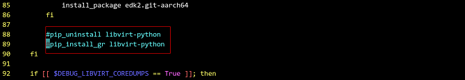
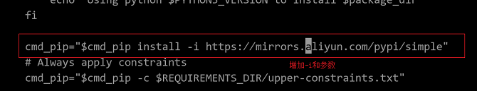
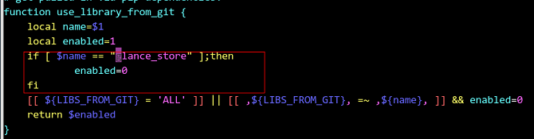
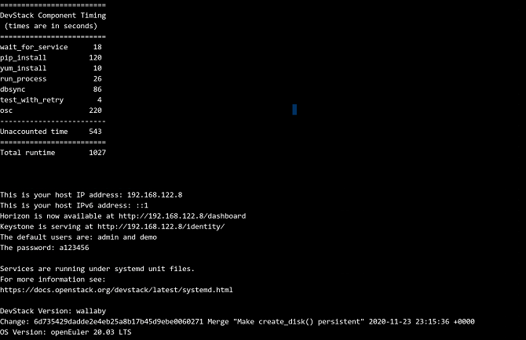
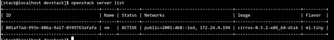
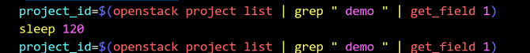

# OpenStack-Train 迁移至 openEuler 指导

[[toc]]

# 软件介绍

## OpenStack 简介

OpenStack 是一个社区，也是一个项目。它提供了一个部署云的操作平台或工具集，为组织提供可扩展的、灵活的云计算。

作为一个开源的云计算管理平台，OpenStack 由nova、neutron、glance、keystone、horizon等几个主要的组件组合起来完成具体工作。OpenStack 支持几乎所有类型的云环境，项目目标是提供实施简单、可大规模扩展、丰富、标准统一的云计算管理平台。OpenStack 通过各种互补的服务提供了基础设施即服务（IaaS）的解决方案，每个服务提供 API 进行集成。

## 适配版本

本文使用“Train”版本进行适配，OpenStack Train版本于2019年10月16日发布，是部署最广泛的开源云基础设施软件的第20个版本。

## DevStack 介绍

DevStack 是一组模块化脚本，运行这些脚本可以使开发人员快速轻松部署 OpenStack。这些脚本可以在裸机或虚拟机的单个节点上运行，也可以部署到多个节点。

DevStack 默认会安装 OpenStack 的核心服务，用户也可以修改配置文件来部署其他服务。通常，DevStack 从 git master 中拉取核心服务，也可以修改配置文件从稳定分支（stable branch）（如 stable/pike）克隆。

所有服务均从源安装，我们可以从[devstack.github](https://github.com/OpenStack/devstack )获取源。

本文使用 DevStack 脚本进行安装部署和测试，采用单机“All In One”模式，按照 CPU 架构不同，可以安装在 x86 或者 ARM 上。两者主要的安装步骤相同，仅有部分命令或者步骤有差异，具体差异点本文会有详细描述。


# 环境配置

## 软件平台

<a name="table4006700"></a>
<table><thead align="left"><tr id="row48514281"><th class="cellrowborder" valign="top" width="27.55102040816326%" id="mcps1.1.5.1.1"><p id="p37342697"><a name="p37342697"></a><a name="p37342697"></a>软件名称</p>
</th>
<th class="cellrowborder" valign="top" width="14.285714285714285%" id="mcps1.1.5.1.2"><p id="p4859597"><a name="p4859597"></a><a name="p4859597"></a>版本号</p>
</th>
<th class="cellrowborder" valign="top" width="19.387755102040817%" id="mcps1.1.5.1.3"><p id="p58083070"><a name="p58083070"></a><a name="p58083070"></a>安装方法</p>
</th>
<th class="cellrowborder" valign="top" width="38.775510204081634%" id="mcps1.1.5.1.4"><p id="p7108195"><a name="p7108195"></a><a name="p7108195"></a>备注</p>
</th>
</tr>
</thead>
<tbody><tr id="row38892900"><td class="cellrowborder" valign="top" width="27.55102040816326%" headers="mcps1.1.5.1.1 "><p id="p63317227"><a name="p63317227"></a><a name="p63317227"></a>openEuler</p>
</td>
<td class="cellrowborder" valign="top" width="14.285714285714285%" headers="mcps1.1.5.1.2 "><p id="p28421725"><a name="p28421725"></a><a name="p28421725"></a>20.03-LTS-SP1</p>
</td>
<td class="cellrowborder" valign="top" width="19.387755102040817%" headers="mcps1.1.5.1.3 "><p id="p20458404"><a name="p20458404"></a><a name="p20458404"></a>iso</p>
</td>
<td class="cellrowborder" valign="top" width="38.775510204081634%" headers="mcps1.1.5.1.4 "><p id="p46518056"><a name="p46518056"></a><a name="p46518056"></a>x86可以选择虚拟机或物理机部署，ARM只能在物理机部署</p>
</td>
</tr>
<tr id="row16009324"><td class="cellrowborder" valign="top" width="27.55102040816326%" headers="mcps1.1.5.1.1 "><p id="p21686869"><a name="p21686869"></a><a name="p21686869"></a>gcc</p>
</td>
<td class="cellrowborder" valign="top" width="14.285714285714285%" headers="mcps1.1.5.1.2 "><p id="p11805999"><a name="p11805999"></a><a name="p11805999"></a>7.3.0</p>
</td>
<td class="cellrowborder" valign="top" width="19.387755102040817%" headers="mcps1.1.5.1.3 "><p id="p16761890"><a name="p16761890"></a><a name="p16761890"></a>见必要库和依赖安装</p>
</td>
<td class="cellrowborder" valign="top" width="38.775510204081634%" headers="mcps1.1.5.1.4 ">&nbsp;&nbsp;</td>
</tr>
<tr id="row5604734"><td class="cellrowborder" valign="top" width="27.55102040816326%" headers="mcps1.1.5.1.1 "><p id="p51330292"><a name="p51330292"></a><a name="p51330292"></a>python3</p>
</td>
<td class="cellrowborder" valign="top" width="14.285714285714285%" headers="mcps1.1.5.1.2 "><p id="p64113024"><a name="p64113024"></a><a name="p64113024"></a>3.7.9</p>
</td>
<td class="cellrowborder" valign="top" width="19.387755102040817%" headers="mcps1.1.5.1.3 "><p id="p25772423"><a name="p25772423"></a><a name="p25772423"></a>见必要库和依赖安装</p>
</td>
<td class="cellrowborder" valign="top" width="38.775510204081634%" headers="mcps1.1.5.1.4 ">&nbsp;&nbsp;</td>
</tr>
<tr id="row64723859"><td class="cellrowborder" valign="top" width="27.55102040816326%" headers="mcps1.1.5.1.1 "><p id="p8141201"><a name="p8141201"></a><a name="p8141201"></a>bash</p>
</td>
<td class="cellrowborder" valign="top" width="14.285714285714285%" headers="mcps1.1.5.1.2 "><p id="p55457511"><a name="p55457511"></a><a name="p55457511"></a>5.0</p>
</td>
<td class="cellrowborder" valign="top" width="19.387755102040817%" headers="mcps1.1.5.1.3 "><p id="p62873406"><a name="p62873406"></a><a name="p62873406"></a>见必要库和依赖安装</p>
</td>
<td class="cellrowborder" valign="top" width="38.775510204081634%" headers="mcps1.1.5.1.4 ">&nbsp;&nbsp;</td>
</tr>
<tr id="row66468012"><td class="cellrowborder" valign="top" width="27.55102040816326%" headers="mcps1.1.5.1.1 "><p id="p15199867"><a name="p15199867"></a><a name="p15199867"></a>devstack</p>
</td>
<td class="cellrowborder" valign="top" width="14.285714285714285%" headers="mcps1.1.5.1.2 "><p id="p23229703"><a name="p23229703"></a><a name="p23229703"></a>Latest</p>
</td>
<td class="cellrowborder" valign="top" width="19.387755102040817%" headers="mcps1.1.5.1.3 "><p id="p2557751"><a name="p2557751"></a><a name="p2557751"></a>见修改 devstack 脚本和安装配置</p>
</td>
<td class="cellrowborder" valign="top" width="38.775510204081634%" headers="mcps1.1.5.1.4 "><p id="p5851251"><a name="p5851251"></a><a name="p5851251"></a>https://github.com/OpenStack/devstack</p>
</td>
</tr>
</tbody>
</table>

## 必要依赖包

<a name="table56107302"></a>
<table><thead align="left"><tr id="row38793220"><th class="cellrowborder" valign="top" width="48.484848484848484%" id="mcps1.1.4.1.1"><p id="p55243139"><a name="p55243139"></a><a name="p55243139"></a>软件名称</p>
</th>
<th class="cellrowborder" valign="top" width="11.11111111111111%" id="mcps1.1.4.1.2"><p id="p45509270"><a name="p45509270"></a><a name="p45509270"></a>版本号</p>
</th>
<th class="cellrowborder" valign="top" width="40.4040404040404%" id="mcps1.1.4.1.3"><p id="p62372262"><a name="p62372262"></a><a name="p62372262"></a>安装方法</p>
</th>
</tr>
</thead>
<tbody><tr id="row18988442"><td class="cellrowborder" valign="top" width="48.484848484848484%" headers="mcps1.1.4.1.1 "><p id="p61668827"><a name="p61668827"></a><a name="p61668827"></a>python3-systemd</p>
</td>
<td class="cellrowborder" valign="top" width="11.11111111111111%" headers="mcps1.1.4.1.2 "><p id="p29119056"><a name="p29119056"></a><a name="p29119056"></a>234</p>
</td>
<td class="cellrowborder" valign="top" width="40.4040404040404%" headers="mcps1.1.4.1.3 "><p id="p9833313"><a name="p9833313"></a><a name="p9833313"></a>见必要库和依赖安装</p>
</td>
</tr>
<tr id="row21390960"><td class="cellrowborder" valign="top" width="48.484848484848484%" headers="mcps1.1.4.1.1 "><p id="p54946232"><a name="p54946232"></a><a name="p54946232"></a>pcp-system-tools</p>
</td>
<td class="cellrowborder" valign="top" width="11.11111111111111%" headers="mcps1.1.4.1.2 "><p id="p21459792"><a name="p21459792"></a><a name="p21459792"></a>4.1.3</p>
</td>
<td class="cellrowborder" valign="top" width="40.4040404040404%" headers="mcps1.1.4.1.3 "><p id="p60521568"><a name="p60521568"></a><a name="p60521568"></a>见必要库和依赖安装</p>
</td>
</tr>
<tr id="row7823205"><td class="cellrowborder" valign="top" width="48.484848484848484%" headers="mcps1.1.4.1.1 "><p id="p29699869"><a name="p29699869"></a><a name="p29699869"></a>haproxy</p>
</td>
<td class="cellrowborder" valign="top" width="11.11111111111111%" headers="mcps1.1.4.1.2 "><p id="p56879202"><a name="p56879202"></a><a name="p56879202"></a>2.0.14</p>
</td>
<td class="cellrowborder" valign="top" width="40.4040404040404%" headers="mcps1.1.4.1.3 "><p id="p43812635"><a name="p43812635"></a><a name="p43812635"></a>见必要库和依赖安装</p>
</td>
</tr>
<tr id="row58769399"><td class="cellrowborder" valign="top" width="48.484848484848484%" headers="mcps1.1.4.1.1 "><p id="p62700858"><a name="p62700858"></a><a name="p62700858"></a>httpd httpd-devel</p>
</td>
<td class="cellrowborder" valign="top" width="11.11111111111111%" headers="mcps1.1.4.1.2 "><p id="p45604709"><a name="p45604709"></a><a name="p45604709"></a>2.4.43</p>
</td>
<td class="cellrowborder" valign="top" width="40.4040404040404%" headers="mcps1.1.4.1.3 "><p id="p2993953"><a name="p2993953"></a><a name="p2993953"></a>见必要库和依赖安装</p>
</td>
</tr>
<tr id="row26945581"><td class="cellrowborder" valign="top" width="48.484848484848484%" headers="mcps1.1.4.1.1 "><p id="p35108420"><a name="p35108420"></a><a name="p35108420"></a>memcached</p>
</td>
<td class="cellrowborder" valign="top" width="11.11111111111111%" headers="mcps1.1.4.1.2 "><p id="p25209792"><a name="p25209792"></a><a name="p25209792"></a>1.5.10</p>
</td>
<td class="cellrowborder" valign="top" width="40.4040404040404%" headers="mcps1.1.4.1.3 "><p id="p28727305"><a name="p28727305"></a><a name="p28727305"></a>见必要库和依赖安装</p>
</td>
</tr>
<tr id="row57219158"><td class="cellrowborder" valign="top" width="48.484848484848484%" headers="mcps1.1.4.1.1 "><p id="p4240188"><a name="p4240188"></a><a name="p4240188"></a>python3-devel</p>
</td>
<td class="cellrowborder" valign="top" width="11.11111111111111%" headers="mcps1.1.4.1.2 "><p id="p7910947"><a name="p7910947"></a><a name="p7910947"></a>3.7.9</p>
</td>
<td class="cellrowborder" valign="top" width="40.4040404040404%" headers="mcps1.1.4.1.3 "><p id="p36806962"><a name="p36806962"></a><a name="p36806962"></a>见必要库和依赖安装</p>
</td>
</tr>
<tr id="row62827209"><td class="cellrowborder" valign="top" width="48.484848484848484%" headers="mcps1.1.4.1.1 "><p id="p55839144"><a name="p55839144"></a><a name="p55839144"></a>libffi-devel</p>
</td>
<td class="cellrowborder" valign="top" width="11.11111111111111%" headers="mcps1.1.4.1.2 "><p id="p26676804"><a name="p26676804"></a><a name="p26676804"></a>3.3.7</p>
</td>
<td class="cellrowborder" valign="top" width="40.4040404040404%" headers="mcps1.1.4.1.3 "><p id="p13337476"><a name="p13337476"></a><a name="p13337476"></a>见必要库和依赖安装</p>
</td>
</tr>
<tr id="row52928421"><td class="cellrowborder" valign="top" width="48.484848484848484%" headers="mcps1.1.4.1.1 "><p id="p59343703"><a name="p59343703"></a><a name="p59343703"></a>open-iscsi-devel</p>
</td>
<td class="cellrowborder" valign="top" width="11.11111111111111%" headers="mcps1.1.4.1.2 "><p id="p42110625"><a name="p42110625"></a><a name="p42110625"></a>2.1.1</p>
</td>
<td class="cellrowborder" valign="top" width="40.4040404040404%" headers="mcps1.1.4.1.3 "><p id="p55517484"><a name="p55517484"></a><a name="p55517484"></a>见必要库和依赖安装</p>
</td>
</tr>
<tr id="row29895313"><td class="cellrowborder" valign="top" width="48.484848484848484%" headers="mcps1.1.4.1.1 "><p id="p5601312"><a name="p5601312"></a><a name="p5601312"></a>libxml2 libxml2-devel python3-libxml2</p>
</td>
<td class="cellrowborder" valign="top" width="11.11111111111111%" headers="mcps1.1.4.1.2 "><p id="p51053123"><a name="p51053123"></a><a name="p51053123"></a>2.9.10</p>
</td>
<td class="cellrowborder" valign="top" width="40.4040404040404%" headers="mcps1.1.4.1.3 "><p id="p41662307"><a name="p41662307"></a><a name="p41662307"></a>见必要库和依赖安装</p>
</td>
</tr>
<tr id="row39416445"><td class="cellrowborder" valign="top" width="48.484848484848484%" headers="mcps1.1.4.1.1 "><p id="p38615458"><a name="p38615458"></a><a name="p38615458"></a>python3-lxml</p>
</td>
<td class="cellrowborder" valign="top" width="11.11111111111111%" headers="mcps1.1.4.1.2 "><p id="p40844408"><a name="p40844408"></a><a name="p40844408"></a>4.2.3</p>
</td>
<td class="cellrowborder" valign="top" width="40.4040404040404%" headers="mcps1.1.4.1.3 "><p id="p20062758"><a name="p20062758"></a><a name="p20062758"></a>见必要库和依赖安装</p>
</td>
</tr>
<tr id="row46347102"><td class="cellrowborder" valign="top" width="48.484848484848484%" headers="mcps1.1.4.1.1 "><p id="p63127813"><a name="p63127813"></a><a name="p63127813"></a>libxslt libxslt-devel</p>
</td>
<td class="cellrowborder" valign="top" width="11.11111111111111%" headers="mcps1.1.4.1.2 "><p id="p13079191"><a name="p13079191"></a><a name="p13079191"></a>1.1.34</p>
</td>
<td class="cellrowborder" valign="top" width="40.4040404040404%" headers="mcps1.1.4.1.3 "><p id="p52781566"><a name="p52781566"></a><a name="p52781566"></a>见必要库和依赖安装</p>
</td>
</tr>
<tr id="row5272053"><td class="cellrowborder" valign="top" width="48.484848484848484%" headers="mcps1.1.4.1.1 "><p id="p24383158"><a name="p24383158"></a><a name="p24383158"></a>edk2-ovmf(x86) edk2-aarch64(ARM) edk2-devel python3-edk2-devel</p>
</td>
<td class="cellrowborder" valign="top" width="11.11111111111111%" headers="mcps1.1.4.1.2 "><p id="p28878783"><a name="p28878783"></a><a name="p28878783"></a>202002</p>
</td>
<td class="cellrowborder" valign="top" width="40.4040404040404%" headers="mcps1.1.4.1.3 "><p id="p57480121"><a name="p57480121"></a><a name="p57480121"></a>见必要库和依赖安装</p>
</td>
</tr>
<tr id="row47559048"><td class="cellrowborder" valign="top" width="48.484848484848484%" headers="mcps1.1.4.1.1 "><p id="p27077678"><a name="p27077678"></a><a name="p27077678"></a>qemu qemu-guest-agent</p>
</td>
<td class="cellrowborder" valign="top" width="11.11111111111111%" headers="mcps1.1.4.1.2 "><p id="p45808280"><a name="p45808280"></a><a name="p45808280"></a>4.1.0</p>
</td>
<td class="cellrowborder" valign="top" width="40.4040404040404%" headers="mcps1.1.4.1.3 "><p id="p19483182"><a name="p19483182"></a><a name="p19483182"></a>见必要库和依赖安装</p>
</td>
</tr>
<tr id="row41130918"><td class="cellrowborder" valign="top" width="48.484848484848484%" headers="mcps1.1.4.1.1 "><p id="p43270058"><a name="p43270058"></a><a name="p43270058"></a>libvirt*  python3-libvirt</p>
</td>
<td class="cellrowborder" valign="top" width="11.11111111111111%" headers="mcps1.1.4.1.2 "><p id="p15213839"><a name="p15213839"></a><a name="p15213839"></a>6.2.0</p>
</td>
<td class="cellrowborder" valign="top" width="40.4040404040404%" headers="mcps1.1.4.1.3 "><p id="p24361469"><a name="p24361469"></a><a name="p24361469"></a>见必要库和依赖安装</p>
</td>
</tr>
<tr id="row17926630"><td class="cellrowborder" valign="top" width="48.484848484848484%" headers="mcps1.1.4.1.1 "><p id="p42770931"><a name="p42770931"></a><a name="p42770931"></a>rabbitmq-server</p>
</td>
<td class="cellrowborder" valign="top" width="11.11111111111111%" headers="mcps1.1.4.1.2 "><p id="p41893405"><a name="p41893405"></a><a name="p41893405"></a>3.7.23</p>
</td>
<td class="cellrowborder" valign="top" width="40.4040404040404%" headers="mcps1.1.4.1.3 "><p id="p37922635"><a name="p37922635"></a><a name="p37922635"></a>见必要库和依赖安装</p>
</td>
</tr>
<tr id="row5759399"><td class="cellrowborder" valign="top" width="48.484848484848484%" headers="mcps1.1.4.1.1 "><p id="p63858199"><a name="p63858199"></a><a name="p63858199"></a>python3-copr</p>
</td>
<td class="cellrowborder" valign="top" width="11.11111111111111%" headers="mcps1.1.4.1.2 "><p id="p5131648"><a name="p5131648"></a><a name="p5131648"></a>1.105</p>
</td>
<td class="cellrowborder" valign="top" width="40.4040404040404%" headers="mcps1.1.4.1.3 "><p id="p13010313"><a name="p13010313"></a><a name="p13010313"></a>见必要库和依赖安装</p>
</td>
</tr>
<tr id="row49983953"><td class="cellrowborder" valign="top" width="48.484848484848484%" headers="mcps1.1.4.1.1 "><p id="p22168365"><a name="p22168365"></a><a name="p22168365"></a>python3-uWSGI</p>
</td>
<td class="cellrowborder" valign="top" width="11.11111111111111%" headers="mcps1.1.4.1.2 "><p id="p50807166"><a name="p50807166"></a><a name="p50807166"></a>2.0.19</p>
</td>
<td class="cellrowborder" valign="top" width="40.4040404040404%" headers="mcps1.1.4.1.3 "><p id="p21739820"><a name="p21739820"></a><a name="p21739820"></a>见必要库和依赖安装</p>
</td>
</tr>
<tr id="row61440657"><td class="cellrowborder" valign="top" width="48.484848484848484%" headers="mcps1.1.4.1.1 "><p id="p10637333"><a name="p10637333"></a><a name="p10637333"></a>python3-mod_wsgi</p>
</td>
<td class="cellrowborder" valign="top" width="11.11111111111111%" headers="mcps1.1.4.1.2 "><p id="p56317608"><a name="p56317608"></a><a name="p56317608"></a>4.6.4</p>
</td>
<td class="cellrowborder" valign="top" width="40.4040404040404%" headers="mcps1.1.4.1.3 "><p id="p65432437"><a name="p65432437"></a><a name="p65432437"></a>见必要库和依赖安装</p>
</td>
</tr>
<tr id="row52021024"><td class="cellrowborder" valign="top" width="48.484848484848484%" headers="mcps1.1.4.1.1 "><p id="p52953396"><a name="p52953396"></a><a name="p52953396"></a>python3-sqlalchemy python3-sqlalchemy-utils</p>
</td>
<td class="cellrowborder" valign="top" width="11.11111111111111%" headers="mcps1.1.4.1.2 "><p id="p61366677"><a name="p61366677"></a><a name="p61366677"></a>1.2.19</p>
</td>
<td class="cellrowborder" valign="top" width="40.4040404040404%" headers="mcps1.1.4.1.3 "><p id="p4644906"><a name="p4644906"></a><a name="p4644906"></a>见必要库和依赖安装</p>
</td>
</tr>
<tr id="row41804155"><td class="cellrowborder" valign="top" width="48.484848484848484%" headers="mcps1.1.4.1.1 "><p id="p30693434"><a name="p30693434"></a><a name="p30693434"></a>python3-scss</p>
</td>
<td class="cellrowborder" valign="top" width="11.11111111111111%" headers="mcps1.1.4.1.2 "><p id="p3140258"><a name="p3140258"></a><a name="p3140258"></a>1.3.5</p>
</td>
<td class="cellrowborder" valign="top" width="40.4040404040404%" headers="mcps1.1.4.1.3 "><p id="p53034330"><a name="p53034330"></a><a name="p53034330"></a>见必要库和依赖安装</p>
</td>
</tr>
<tr id="row41804156"><td class="cellrowborder" valign="top" width="48.484848484848484%" headers="mcps1.1.4.1.1 "><p id="p30693434"><a name="p30693434"></a><a name="p30693434"></a>openeuler-lsb</p>
</td>
<td class="cellrowborder" valign="top" width="11.11111111111111%" headers="mcps1.1.4.1.2 "><p id="p3140258"><a name="p3140258"></a><a name="p3140258"></a>5.0</p>
</td>
<td class="cellrowborder" valign="top" width="40.4040404040404%" headers="mcps1.1.4.1.3 "><p id="p53034330"><a name="p53034330"></a><a name="p53034330"></a>见必要库和依赖安装</p>
</td>
</tr>
<tr id="row41804156"><td class="cellrowborder" valign="top" width="48.484848484848484%" headers="mcps1.1.4.1.1 "><p id="p30693434"><a name="p30693434"></a><a name="p30693434"></a>mariadb-server</p>
</td>
<td class="cellrowborder" valign="top" width="11.11111111111111%" headers="mcps1.1.4.1.2 "><p id="p3140258"><a name="p3140258"></a><a name="p3140258"></a>10.3.9</p>
</td>
<td class="cellrowborder" valign="top" width="40.4040404040404%" headers="mcps1.1.4.1.3 "><p id="p53034330"><a name="p53034330"></a><a name="p53034330"></a>见必要库和依赖安装</p>
</td>
</tr>
</tbody>
</table>


# 系统配置

## 关闭防火墙

1. 执行以下命令，停止防火墙。

    ```
    # systemctl stop firewalld.service
    ```

2. 执行以下命令，关闭防火墙。

    ```
    # systemctl disable firewalld.service
    ```

## 修改SELINUX为disabled

执行以下命令，关闭 SELINUX。

```
# sed -i 's/SELINUX=enforcing/SELINUX=disabled/g' /etc/sysconfig/selinux
# setenforce 0
```

# 软件编译

## 必要库和依赖安装（本地yum源）

> **说明：**   
>本节内容可以通过执行自动化脚本prep_install.sh实现，详见附录。

执行以下命令，安装脚本执行过程中所需的必要库和依赖。

```
# yum -y install tar git bash
# yum -y install python3-systemd
# yum -y install libffi-devel
# yum -y install open-iscsi-devel
# yum -y install libxml2-devel 
# yum -y install python3-lxml python3-libxml2 libxslt libxslt-devel
# yum -y install pcp-system-tools
# yum -y install haproxy
# yum -y install qemu qemu-guest-agent
# yum -y install libvirt*  python3-libvirt
# yum -y install httpd httpd-devel
# yum -y install memcached
# yum -y install mariadb-server
# yum -y install rabbitmq-server
# yum -y install python3-uWSGI
# yum -y install python3-mod_wsgi 
# yum -y install python3-copr
# yum -y install python3-scss
# yum -y install gcc-c++
# yum -y install python3-devel
# yum -y install python3-sqlalchemy python3-sqlalchemy-utils
# yum -y install openeuler-lsb
```
利用 yum 源，安装 uefi 相关库，按照 CPU 架构不同，命令分别如下。

* x86 架构
```
# yum -y install edk2-ovmf edk2-devel  python3-edk2-devel
```
* ARM 架构
```
# yum -y install edk2-aarch64 edk2-devel  python3-edk2-devel
```


## 创建执行用户

1. 使用root用户登录待安装主机，执行以下命令创建 stack 用户来执行脚本。
    ```
    # useradd -s /bin/bash -d /home/stack -m stack
    ```

2. 执行以下操作，为 stack 用户设置 root 用户权限，后续操作使用 stack 用户操作。

    ```
    # chmod +w /etc/sudoers
    # vi /etc/sudoers //在sudoers文件的“root ALL=(ALL) ALL”下面，加入如下内容:stack  ALL=(ALL) NOPASSWD: ALL
    # chmod -w /etc/sudoers
    ```
    

## 下载 devstack 脚本

切换 stack 用户，执行以下命令，下载 devstack 脚本文件:

```
# su - stack
$ git clone https://opendev.org/OpenStack/devstack  
```
以下操作均使用 stack 用户执行。

## 修改主机相关环境

> **说明：**   
>本节内容可以通过执行自动化脚本prep_install.sh实现，详见附录。

1. 执行`sudo vi /etc/httpd/conf/httpd.conf`命令，使用管理员权限在 `/etc/httpd/conf/httpd.conf` 文件中增加如下配置，使之可以加载第三方插件服务，插入位置见下图。

    ```
	LoadModule wsgi_module modules/mod_wsgi_python3.so
	```
    

2. 执行如下命令，修正 yum 安装 edk2.x86_64 （ARM 架构的安装 edk2.aarch64）相关库时的bug，注意目录及文件相关权限。
    * x86 架构
        ```
	    # cd /usr/share
        # sudo mkdir OVMF && sudo chmod -R 755 OVMF
        # cd OVMF
        # sudo ln -s ../edk2/ovmf/OVMF_CODE.fd OVMF_CODE.fd
        # sudo ln -s ../edk2/ovmf/OVMF_VARS.fd OVMF_VARS.fd
	    ```

    * ARM 架构
        ```
		# cd /usr/share
        # sudo mkdir AAVMF && chmod -R 755 AAVMF
        # cd AAVMF
        # sudo ln -s ../edk2/aarch64/QEMU_EFI-pflash.raw AAVMF_CODE.fd
        # sudo ln -s ../edk2/aarch64/vars-tmplate-pflash.raw AAVMF_VARS.fd
	    ```

3. 在 `/etc/libvirt/qemu.conf` 文件中增加如下配置，增加 qemu 对 uefi 的支持。

    * x86 架构
        ```
        nvram = ["/usr/share/OVMF/OVMF_CODE.fd:/usr/share/OVMF/OVMF_VARS.fd","/usr/share/edk2/ovmf/OVMF_CODE.fd:/usr/share/edk2/ovmf/OVMF_VARS.fd"]
	    ```

    * ARM 架构
        ```
        nvram = ["/usr/share/AAVMF/AAVMF_CODE.fd:/usr/share/AAVMF/AAVMF_VARS.fd","/usr/share/edk2/aarch64/QEMU_EFI-pflash.raw:/usr/share/edk2/aarch64/vars-template-pflash.raw"]
	    ```


## 修改devstack脚本和相关配置

1. 执行以下命令，创建 `local.conf` 文件。

    ```
    # cd /home/stack/devstack
    # touch local.conf 
    ```
2. 编辑 `local.conf` 文件，配置如下内容。

    * x86 架构
        ```
        [[local|localrc]]
        HOST_IP=172.168.132.11    ///主机ip
        ADMIN_PASSWORD=a123456        ///各模块服务密码
        DATABASE_PASSWORD=d123456
        RABBIT_PASSWORD=r123456
        SERVICE_PASSWORD=s123456

        disable_service tempest       ///默认关闭测试模块的加载

        GIT_BASE=http://git.trystack.cn                   ///国内git源，用来下载OpenStack组件
        NOVNC_REPO=http://git.trystack.cn/kanaka/noVNC.git
        SPICE_REPO=http://git.trystack.cn/git/spice/spice-html5.git

        LOGFILE=$DEST/logs/stack.sh.log
		
	    ```

    * ARM 架构
        ```
        [[local|localrc]]
        HOST_IP=192.168.122.8        ///主机ip
        ADMIN_PASSWORD=a123456        ///各模块服务密码
        DATABASE_PASSWORD=d123456
        RABBIT_PASSWORD=r123456
        SERVICE_PASSWORD=s123456

        disable_service tempest       ///默认关闭测试模块的加载

        GIT_BASE=http://git.trystack.cn                   ///国内git源，用来下载OpenStack组件
        NOVNC_REPO=http://git.trystack.cn/kanaka/noVNC.git
        SPICE_REPO=http://git.trystack.cn/git/spice/spice-html5.git

        DOWNLOAD_DEFAULT_IMAGES=False    ///修改mirros镜像地址，默认下载aarch64镜像
        IMAGE_URLS="https://github.com/cirros-dev/cirros/releases/download/0.5.1/cirros-0.5.1-aarch64-disk.img"
        ETCD_DOWNLOAD_LOCATION=https://mirrors.huaweicloud.com/etcd/v3.3.12/etcd-v3.3.12-linux-arm64.tar.gz                 ///改用huaweicloud，减少脚本耗时

        LOGFILE=$DEST/logs/stack.sh.log

	    ```
> **说明：**   
>本节以下内容可以通过执行自动化脚本prep_install.sh实现，详见附录。
3. 编辑 `/home/stack/devstack/stackrc` 文件，修改下图所示字段值为 stable/train，指定待安装的 OpenStack 的版本。

    

4. devstack 维护的平台暂不包含 openEuler，修改 `/home/stack/devstack/functions-common` 文件中的 GetOSVersion 函数，使脚本识别默认使用 fedora30 模式安装，修改方法如下图所示。

    

5. 由于脚本文件中默认的 python-libvirt 版本不适配，需编辑 `/home/stack/devstack/lib/nova_plugins/functions-libvirt` 文件，注释掉安装 python-libvirt 相关代码。python-libvirt 已在openEuler-20.03-LTS-SP1 的 yum 源中手动安装。

    
	
6. 编辑`/home/stack/devstack/inc/python` 文件，修改`cmd_pip` 参数，参数值修改为使用国内源，如下图所示。

    

7. 修改 `/home/stack/devstack/inc/python` 文件，默认安装 glance 组件

    

8. 修改`/home/stack/devstack/lib/neutron_plugins/services/l3` 文件，在图示位置添加如下配置。

    ```
    source openrc admin admin
    ```

    

9. 修改`/home/stack/devstack/stackrc` 文件，修改 `VIRTUALENV_CMD` 参数值。

    

    修改完成后，保存退出，并执行以下命令：
	```
    pip3 install virtualenv
    ```

# 执行 devstack 脚本安装 OpenStack

以stack用户，执行以下命令，运行 stack.sh 脚本，进行 OpenStack 单机版安装。

```
# cd  /home/stack/devstack
# FORCE=yes ./stack.sh 
    
```

安装过程大约需要十几分钟，x86架构安装成功显示信息与ARM架构一致，此处以安装ARM架构为例，安装成功页面如下图所示。



# 软件运行

devstack.sh 若执行成功，会在当前主机内，根据 local.conf 文件中的配置信息，安装指定的子模块，若 local.conf 中没有指定模块，则会安装所有子模块。

以 stack 用户执行以下命令，使用管理员登录 OpenStack 客户端。

```
source openrc admin admin
```

* 获取相关资源列表

    - 执行以下命令，可以获取镜像资源列表
	    ```
        # openstack image list
        ```
    - 执行以下命令，可以获取网络资源列表
	    ```
        # openstack network list
        ```
    - 执行以下命令，可以获取虚拟机配置类型列表
	    ```
        # openstack flavor list
        ```


* 启动一个实例

    - 使用查询到的资源，执行以下命令创建虚拟机。
        ```
        # openstack server create -image cirros-0.5.1-x86_64-disk -flavor 1 vm
        ```
		
        
		
    - 执行如下命令，查看虚拟机状态。

        ```
        # openstack server list   //查看虚拟机状态
        ```
        
		
			
			
# 软件卸载

1. 分别执行以下命令，卸载并清理 devstack 生成的文件及环境配置。

    ```
    # cd /home/stack/devstack

    # ./unstack.sh

    # ./clean.sh
    ```

2.  删除 devstack。

    ```
    # cd /home/stack 
    # rm -rf devstack
    # rm -rf /opt/stack
    ```


# FAQ

## openstack project list 因为网络问题有概率性失败

**问题现象**
脚本执行 `openstack project list` 命令报错。

**问题原因**
网络原因，执行完命令 `source openrc admin admin` 后，需要等待一段时间，再执行命令 `openstack project list` 才生效

**解决方法**
参考下图修改 `/home/stack/devstack/lib/neutron\_plugins/services/l3` 文件




## devstack@q-meta.service 服务概率性启动失败

**问题现象**
命令 `sudo systemctl start devstack@q-meta.service` 执行失败。

**问题原因**
执行 `systemctl enable devstack@q-meta.service` 命令后，要等待一段时间。

**解决方法**
服务 enable 后，等待 30s 再启动。

参考下图修改 `/home/stack/devstack/functions-common` 文件。


## mariadb 服务启动失败

**问题现象**
mariadb 服务启动失败。

**问题原因**
mysql_install_db 数据库创建失败，提示gssapi插件报错、inodb建立失败、galgare地址失效等问题。

**解决方法**
由于没有使用到 gssapi插件，执行如下命令，卸载 mariadb-gssapi-server 包。
```
./unstack.sh ./clean.sh && FORCE=yes ./stack.sh
```


## neutron 服务启动失败

**问题现象**
neutron 服务启动过程中，有概率启动失败。

**问题原因**
网络波动，导致network节点搭建失败。

**解决方法**
执行如下命令，重新执行脚本。
```
# ./unstack.sh && FORCE=yes ./stack.sh
```

## pip引导失败
**问题现象**
pip 引导失败，控制台报错信息为 "ERROR: Links are not allowed as constraints"

**问题原因**
pip 社区更新至20.3，版本不适配。

**解决方法**
删除/opt/stack/requirement/.venv 下旧的python 虚拟运行环境，参考社区解决方案 ，使用补丁修改 devstack 源码。
在 /home/stack/devstack 目录下，执行如下命令：

```
# wget https://github.com/openstack/devstack/commit/7a3a7ce87.patch 
# sudo yum install patch -y  
# patch -p1 < 7a3a7ce87.patch
```

# 附录

自动化脚本 prep_install.sh点击[prep_install.sh](./prep_install.sh)获取。
将脚本存放到`/home/stack`目录，执行命令 `bash -x prep_install.sh`即可完成必要库和依赖安装、修改主机相关环境和修改devstack脚本和相关配置的部分操作。