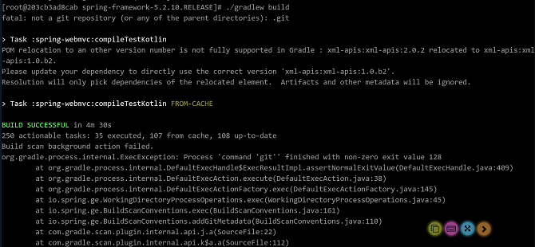
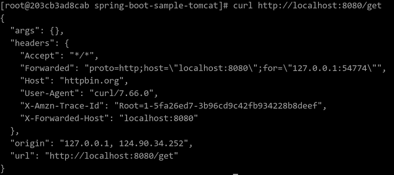
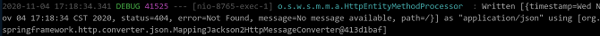
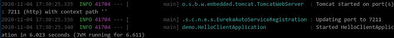
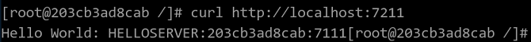
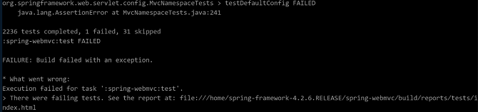
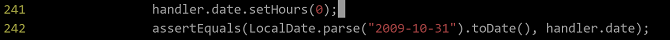
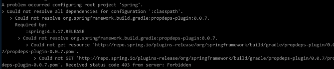
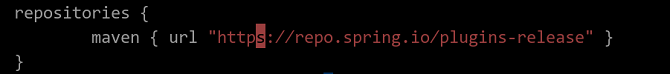

# Spring Framework迁移至 openEuler 指导

[[toc]]

# 软件介绍

## Spring Framwork 简介

Spring Framework 是为解决 EJB 开发 JavaEE 程序代码冗余，配置复杂等诸多问题而引入的开源框架。Spring 作为容器，提供了对多种技术\(JMS, MQ, UnitTest\)的支持，同时通过 AOP\(事物管理，日志等\)提供了众多方便应用的辅助类，对主流框架提供了良好的支持。

Spring Framework 整体框架结构如 [图1](#fig1601161484619)所示

**图 1**  Spring Framework 整体框架结构<a name="fig1601161484619"></a>  


Spring Framework 包括三个核心组件 Spring-Core、Spring-Context 和 Spring-Beans。还包括基础组件Spring-AOP、Spring-Web 和 Spring-Webmvc 等，各个组件的功能说明如下：

**Spring-Core**
核心容器提供 Spring 框架的基本功能，主要组件是 BeanFactory ,实现对 Bean 的管理。

**Spring-Context**
是一个配置文件，向Spring Framework 提供上下文信息。上下文包括企业服务，例如 JNDI，EJB，电子邮件，国际化，校验和调度功能。

**Spring-Beans**
实现IOC\(控制反转\)的包，是 Spring Framework 的关键特性。

**Spring-AOP**
直接将面向切面的编程功能集成到 Spring 框架中，所以可以很容易的使用 Spring 框架管理任何对象。Spring-AOP 为基于 Spring 的应用程序中的对象提供了事物管理服务，不依赖 EJB 组件，就可以将声明性事物管理集成到应用程序中。

**Spring-Web**
建立在 Spring-Context 模块之上，为基于 Web 的应用程序提供上下文。

**Spring-Webmvc**
是一个全功能的构建 web 应用程序的 MVC 实现，容纳了大量视图技术。MVC 框架通过策略接口变成了高度可配置的。

从上面的介绍可以看出，IOC\(控制反转\)的实现包 Spring-Beans 和 AOP\(依赖注入\)的实现包  Spring-AOP 是整个框架的基础，而 Spring-Core 是整个框架的核心。在此基础上，Spring-Context 提供了上下文环境，为各个模块提供粘合作用。而 web 部分的功能，是依赖 Spring-Web 和 Spring-Webmvc 来实现的。


## Spring Boot 和 Spring Cloud 简介

Spring Framework 引入到本地 maven 仓库后，就可以使用这个框架对 Java 程序进行 maven 构建。但 Spring 构建需要配置大量的 xml 文件，开发繁琐。Spring Boot 基于 Spring Framework 来构建，是一种快速构建 Spring 应用的方案，而 Spring Cloud 是构建 Spring Boot的分布式环境，也就是常说的云应用，Spring Boot 起到承上启下的作用。

Spring Framework,Spring-Boot和Spring-Cloud三者的关系如 [图2](#fig1601161484620)所示

**图 2**  组件关系<a name="fig1601161484620"></a>  


Spring Boot 是 Spring 的一套快速配置方案，可以用来快速开发单个微服务，Spring Cloud 是一个基于 Spring Boot 实现的云应用开发工具；Spring Boot 专注于快速、方便集成单个个体，Spring Cloud 是关注全局的服务治理框架。Spring Boot 可以离开 Spring Cloud 独立使用开发项目，但 Spring Cloud 无法离开 Spring Boot使用。

## 环境配置

本文档基于 TaiShan 200K 服务器硬件环境部署。

<a name="table31806751"></a>
<table><thead align="left"><tr id="row58442900"><th class="cellrowborder" valign="top" width="34.34343434343434%" id="mcps1.1.3.1.1"><p id="p36254449"><a name="p36254449"></a><a name="p36254449"></a>服务器</p>
</th>
<th class="cellrowborder" valign="top" width="65.65656565656566%" id="mcps1.1.3.1.2"><p id="p50929238"><a name="p50929238"></a><a name="p50929238"></a>TaiShan 200K</p>
</th>
</tr>
</thead>
<tbody><tr id="row31627628"><td class="cellrowborder" valign="top" width="34.34343434343434%" headers="mcps1.1.3.1.1 "><p id="p11701082"><a name="p11701082"></a><a name="p11701082"></a>处理器</p>
</td>
<td class="cellrowborder" valign="top" width="65.65656565656566%" headers="mcps1.1.3.1.2 "><p id="p8263625"><a name="p8263625"></a><a name="p8263625"></a>2\*KunPeng 920-4826 aarch64，2600MHz</p>
</td>
</tr>
<tr id="row7263769"><td class="cellrowborder" valign="top" width="34.34343434343434%" headers="mcps1.1.3.1.1 "><p id="p51494379"><a name="p51494379"></a><a name="p51494379"></a>内存</p>
</td>
<td class="cellrowborder" valign="top" width="65.65656565656566%" headers="mcps1.1.3.1.2 "><p id="p10295186"><a name="p10295186"></a><a name="p10295186"></a>16\*16G，2933MHz，DDR4</p>
</td>
</tr>
<tr id="row25547817"><td class="cellrowborder" valign="top" width="34.34343434343434%" headers="mcps1.1.3.1.1 "><p id="p56107306"><a name="p56107306"></a><a name="p56107306"></a>硬盘</p>
</td>
<td class="cellrowborder" valign="top" width="65.65656565656566%" headers="mcps1.1.3.1.2 "><p id="p48397939"><a name="p48397939"></a><a name="p48397939"></a>OS：1 \* 960G SSD，DATA：1*8000G HDD</p>
</td>
</tr>
<tr id="row32928275"><td class="cellrowborder" valign="top" width="34.34343434343434%" headers="mcps1.1.3.1.1 "><p id="p49944604"><a name="p49944604"></a><a name="p49944604"></a>网络</p>
</td>
<td class="cellrowborder" valign="top" width="65.65656565656566%" headers="mcps1.1.3.1.2 "><p id="p18981122"><a name="p18981122"></a><a name="p18981122"></a>1 \* 1000Mb/s</p>
</td>
</tr>
</tbody>
</table>

软件平台

<a name="table34563480"></a>
<table><thead align="left"><tr id="row39539678"><th class="cellrowborder" valign="top" width="27.55102040816326%" id="mcps1.1.5.1.1"><p id="p48597379"><a name="p48597379"></a><a name="p48597379"></a>软件名称</p>
</th>
<th class="cellrowborder" valign="top" width="19.387755102040817%" id="mcps1.1.5.1.2"><p id="p44073649"><a name="p44073649"></a><a name="p44073649"></a>版本号</p>
</th>
<th class="cellrowborder" valign="top" width="19.387755102040817%" id="mcps1.1.5.1.3"><p id="p13195791"><a name="p13195791"></a><a name="p13195791"></a>安装方法</p>
</th>
<th class="cellrowborder" valign="top" width="33.6734693877551%" id="mcps1.1.5.1.4"><p id="p62226117"><a name="p62226117"></a><a name="p62226117"></a>备注</p>
</th>
</tr>
</thead>
<tbody><tr id="row7150716"><td class="cellrowborder" valign="top" width="27.55102040816326%" headers="mcps1.1.5.1.1 "><p id="p42337115"><a name="p42337115"></a><a name="p42337115"></a>openEuler</p>
</td>
<td class="cellrowborder" valign="top" width="19.387755102040817%" headers="mcps1.1.5.1.2 "><p id="p6754315"><a name="p6754315"></a><a name="p6754315"></a>20.03-LTS-SP1</p>
</td>
<td class="cellrowborder" valign="top" width="19.387755102040817%" headers="mcps1.1.5.1.3 ">&nbsp;&nbsp;</td>
<td class="cellrowborder" valign="top" width="33.6734693877551%" headers="mcps1.1.5.1.4 ">&nbsp;&nbsp;</td>
</tr>
<tr id="row7609317"><td class="cellrowborder" valign="top" width="27.55102040816326%" headers="mcps1.1.5.1.1 "><p id="p12374913"><a name="p12374913"></a><a name="p12374913"></a>tar</p>
</td>
<td class="cellrowborder" valign="top" width="19.387755102040817%" headers="mcps1.1.5.1.2 "><p id="p62843922"><a name="p62843922"></a><a name="p62843922"></a>1.32</p>
</td>
<td class="cellrowborder" valign="top" width="19.387755102040817%" headers="mcps1.1.5.1.3 "><p id="p57192960"><a name="p57192960"></a><a name="p57192960"></a>yum install</p>
</td>
<td class="cellrowborder" valign="top" width="33.6734693877551%" headers="mcps1.1.5.1.4 ">&nbsp;&nbsp;</td>
</tr>
<tr id="row19063753"><td class="cellrowborder" valign="top" width="27.55102040816326%" headers="mcps1.1.5.1.1 "><p id="p660124"><a name="p660124"></a><a name="p660124"></a>wget</p>
</td>
<td class="cellrowborder" valign="top" width="19.387755102040817%" headers="mcps1.1.5.1.2 "><p id="p53470121"><a name="p53470121"></a><a name="p53470121"></a>1.20.3</p>
</td>
<td class="cellrowborder" valign="top" width="19.387755102040817%" headers="mcps1.1.5.1.3 "><p id="p36112534"><a name="p36112534"></a><a name="p36112534"></a>yum install</p>
</td>
<td class="cellrowborder" valign="top" width="33.6734693877551%" headers="mcps1.1.5.1.4 ">&nbsp;&nbsp;</td>
</tr>
<tr id="row19362793"><td class="cellrowborder" valign="top" width="27.55102040816326%" headers="mcps1.1.5.1.1 "><p id="p24882366"><a name="p24882366"></a><a name="p24882366"></a>git</p>
</td>
<td class="cellrowborder" valign="top" width="19.387755102040817%" headers="mcps1.1.5.1.2 "><p id="p2205743"><a name="p2205743"></a><a name="p2205743"></a>2.27</p>
</td>
<td class="cellrowborder" valign="top" width="19.387755102040817%" headers="mcps1.1.5.1.3 "><p id="p44447526"><a name="p44447526"></a><a name="p44447526"></a>yum install</p>
</td>
<td class="cellrowborder" valign="top" width="33.6734693877551%" headers="mcps1.1.5.1.4 ">&nbsp;&nbsp;</td>
</tr>
</tbody>
</table>

必要依赖包

<a name="table24167893"></a>
<table><thead align="left"><tr id="row33208779"><th class="cellrowborder" valign="top" width="19.19191919191919%" id="mcps1.1.4.1.1"><p id="p5556592"><a name="p5556592"></a><a name="p5556592"></a>软件名称</p>
</th>
<th class="cellrowborder" valign="top" width="35.35353535353536%" id="mcps1.1.4.1.2"><p id="p47430793"><a name="p47430793"></a><a name="p47430793"></a>版本号</p>
</th>
<th class="cellrowborder" valign="top" width="45.45454545454545%" id="mcps1.1.4.1.3"><p id="p16689023"><a name="p16689023"></a><a name="p16689023"></a>安装方法</p>
</th>
</tr>
</thead>
<tbody><tr id="row9633593"><td class="cellrowborder" valign="top" width="19.19191919191919%" headers="mcps1.1.4.1.1 "><p id="p42123551"><a name="p42123551"></a><a name="p42123551"></a>jdk</p>
</td>
<td class="cellrowborder" valign="top" width="35.35353535353536%" headers="mcps1.1.4.1.2 "><p id="p56564507"><a name="p56564507"></a><a name="p56564507"></a>1.8.0</p>
</td>
<td class="cellrowborder" valign="top" width="45.45454545454545%" headers="mcps1.1.4.1.3 "><p id="p18322322"><a name="p18322322"></a><a name="p18322322"></a>见基础软件安装</p>
</td>
</tr>
<tr id="row9633593"><td class="cellrowborder" valign="top" width="19.19191919191919%" headers="mcps1.1.4.1.1 "><p id="p42123551"><a name="p42123551"></a><a name="p42123551"></a>maven</p>
</td>
<td class="cellrowborder" valign="top" width="35.35353535353536%" headers="mcps1.1.4.1.2 "><p id="p56564507"><a name="p56564507"></a><a name="p56564507"></a>3.5.4</p>
</td>
<td class="cellrowborder" valign="top" width="45.45454545454545%" headers="mcps1.1.4.1.3 "><p id="p18322322"><a name="p18322322"></a><a name="p18322322"></a>见基础软件安装</p>
</td>
</tr>
</tbody>
</table>


# 系统配置

## 配置本地 yum 源

若环境可以连接互联网，可不用配置本地源，直接用系统配置好的源或者自己添加其它网络源即可。

1. 执行以下命令，配置源文件，查看已经配置好的 yum 源的 repo 文件。

    ```
    # cat /etc/yum.repos.d/openEuler.repo
    [base]
    name=base
    baseurl=file:///mnt
    enable=1
    gpgcheck=0
    ```

2. 执行以下命令，挂载源镜像。

    ```
    # mount /root/openEuler-20.03-LTS-SP1-everything-aarch64-dvd.iso /mnt
    ```

# 软件编译

## 使用本地 yum 源安装基础软件

1. 执行以下命令，安装 maven 构建工具。

    ```
    # yum install maven
    ```
	
2. 执行以下命令，利用 yum 源，安装 jdk。

    ```
    # yum -y install java-1.8.0-openjdk-devel
    ```

3. 安装验证,安装成功输入以下命令，分别查看 maven 和 java 的版本信息以及查看 javac 的使用方法

    ```
	# maven -version
    # java -version
    # javac -help
    ```

    


## 安装 Spring Framework 到本地 maven 仓库

1. 执行以下命令，获取 Spring Framework 工程源码包:

    ```
    # cd /home
    # wget https://github.com/Spring-projects/Spring-framework/archive/v5.2.10.RELEASE.tar.gz
    # tar -xvf v5.2.10.RELEASE.tar.gz
    ```

2. 执行以下命令，编译Spring Framework源码包，编译成功页面显示如下：

    ```
    # cd /home/spring-framework-5.2.10.RELEASE
    # ./gradlew build
    ```

    

3. 执行以下命令，安装 Spring Framework 到本地 maven 仓库。

    ```
    # ./gradlew publishToMavenLocal -x javadoc -x dokka -x asciidoctor
    ```

    安装成功后会在`/root/.m2/repository/org/`文件夹下看到 springframework 文件夹。
    


## Spring Boot工程 tomcat 用例编译

1. 执行以下命令，获取用例源码。

    ```
    # cd /home
    # wget https://github.com/Spring-projects/Spring-boot/archive/v1.5.4.RELEASE.tar.gz
    # tar -xvf v1.5.4.RELEASE.tar.gz
    # cd /home/spring-boot-1.5.4.RELEASE/spring-boot-samples/spring-boot-sample-tomcat
    ```

2. 执行以下命令，编译工程。

    ```
    # mvn package -DskipTests
    ```

## Spring Cloud 工程用例编译

1. 执行以下命令，编译 Spring-cloud-gateway-sample 工程。

    ```
    # cd /home
    # git clone https://github.com/Spring-cloud-samples/Spring-cloud-gateway-sample.git
    # cd /home/Spring-cloud-gateway-sample
    # mvn package -DskipTests
    ```

2. 执行以下命令，编译 zuul-server-1.0.0.BUILD-SNAPSHOT 工程。

    ```
    # cd /home
    # git clone https://github.com/Spring-cloud-samples/zuul-server.git 
    # cd /home/zuul-server
    # mvn package -DskipTests
    
    ```

3. 执行以下命令，编译 eureka-0.0.1-SNAPSHOT 工程

    ```
    # cd /home
    # git clone https://github.com/Spring-cloud-samples/eureka.git 
    # cd /home/eureka
    # mvn package -DskipTests
    ```

4. 执行以下命令，编译 feign-eurka 工程。

    ```
    # cd /home
    # git clone https://github.com/Spring-cloud-samples/feign-eureka.git
    # cd /home/feign-eureka
    # mvn package -DskipTests
    ```


# 软件运行

## Spring Boot单机环境运行示例

1. spring-boot-sample-tomcat 若编译成功，会在工程目录的`/home/spring-boot-1.5.4.RELEASE/spring-boot-samples/spring-boot-samples-tomcat/target` 文件夹下生成 spring-boot-sample-tomcat-1.5.4.RELEASE.jar 文件，执行以下命令，运行这个 jar 文件。

    ```
    # java -jar spring-boot-sample-tomcat-1.5.4.RELEASE.jar
    ```

2. 待控制台出现 `tomcat start` 字样后，启动新窗口执行以下命令，查看 tomcat 服务运行状态。

    ```
    # curl http://localhost:8080
    ```
    回显“helloworld”即表明运行成功。

3. 如果要关闭 Spring-Boot 服务，在步骤 1 窗口中，按 ctrl + c 组合键关闭服务。

## Spring Cloud单机环境运行示例


* spring-cloud-gateway-sample 工程运行示例。
spring-cloud-gateway-sample 工程若编译成功，会在工程目录的 target 文件夹下生成 spring-cloud-gateway-sample-0.0.1-SNAPSHOT.jar 文件，执行如下命令。

    ```
    # java -jar spring-cloud-gateway-sample-0.0.1-SNAPSHOT.jar
    # curl http://localhost:8080/get
    ```
返回结果如下图所示，即表明运行成功。




* zuul-server工程运行示例
zuul-server 需要在 eureka 工程运行后再运行。执行如下命令。

    ```
    # cd /home/eureka/target
    # java -jar eureka-0.0.1-SNAPSHOT.jar
    # cd /home/zuul-server/target
    # java -jar zuul-server-1.0.0.BUILD-SNAPSHOT.jar
    # curl http://localhost:8765
    ```

    zuul-server 服务启动后控制台会输出访问的端口为 8765, curl 访问本地 8765 端口，会看到返回的带有时间戳的 404 信息，同时服务端控制会记录到一次访问事件。
		
    Tomcat 8765端口开放如下图所示：
	
     	
    curl访问8765端口如下图所示：
	
      	
    用户访问时服务端打印的日志信息如下图所示：
	
     

* feign-eureka工程运行示例
feign-eureka 要在 eureka 工程运行后执行，执行如下命令，分别运行 feign-eureka 工程下的 server 和 client。

    ```
    # cd /home/eureka/target
    # java -jar eureka-0.0.1-SNAPSHOT.jar
    # cd /home/feign-eureka/server/target
    # java -jar feign-eureka-hello-server-0.0.1-SNAPSHOT.jar
    # cd /home/feign-eureka/client/target
    # java -jar feign-eureka-hello-client-0.0.1-SNAPSHOT.jar
    # curl http://localhost:7211
    ```
    服务启动后会在client的控制台看到，服务打开了7211端口，curl访问这个端口，获得Hello SERVER信息

    工程 feign-eureka 开放 7211 端口如下图所示：
	
     

    访问 feign-eureka 服务查看返回结果如下图所示：
	
     


# FAQ


## Spring Framework编译过程中Spring-webmvc:test 失败

**问题现象**

MvcNamespaceTests.java 中的 assert 未通过测试，失败提示信息如下图所示。



**问题原因**

服务器回传时间存在8小时时差。

**解决方法**

修改工程目录下的文件`spring-webmvc/src/test/java/org/springframework/web/servlet/config/MvcNamespaceTests.java`，

将handler的date成员时间强制置0，与LocalDate转换的默认Time保持一致。




## 任务 asciidoctor 执行失败

**问题现象**

提示找不到`/root/.gem/jruby/1.9`文件夹


**问题原因**

部分 Spring Framework 版本使用的 Gradle 版本在 JDK9 上运行会存在问题\(由于AspectJ升级到1.9版本所导致\)。

**解决方法**

执行命令 `./gradlew clean test` 进行构建


## Spring-test:compileJava执行失败

**问题现象**

Spring-test:compileJava执行失败，页面提示 "error：warnings found and -Werror specified"


**问题原因**

错误提示是因为 warning 导致的错误，分析 warning 原因，一些旧的 package 已经在 repo 上不存在了\(repo源是由 build.gradle 脚本指定的\)，从而导致编译时报出 warning。

**解决方法**

编辑项目的 build.gradle 编译脚本，去除编译参数中的“-Werror”选项


## repo源失效

**问题现象**：

repo源无效，页面提示“Received status code 403 from server: Forbidden”。




**问题原因**

偶现，一般是由于网络不稳定，或编译脚本中指定的repo源无法提供所需的包所导致。

**解决方法**

检查 build.gradle 文件的 repo 源设置，是否正确，登录 repo 源，看是否存在缺失的文件。




以下有效的 repo 源供参考：

https://repo.Spring.io/plugins-release

https://repo.Springsource.org/plugin-release

