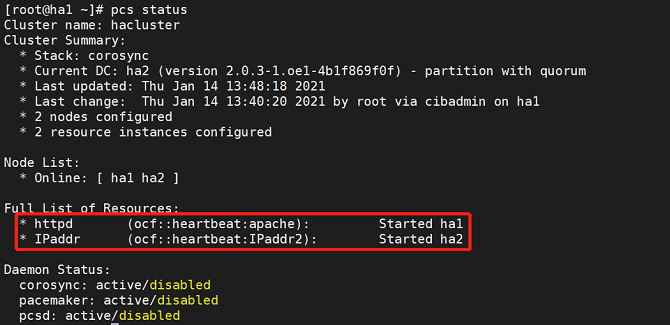
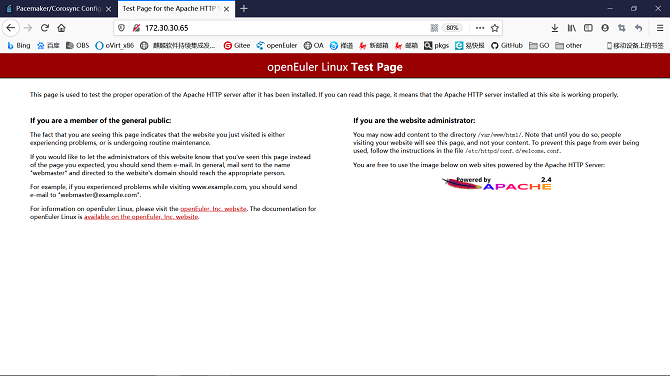
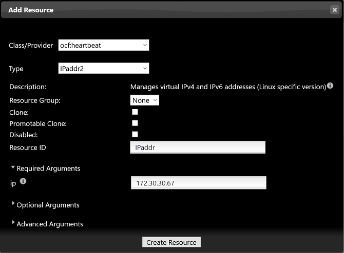
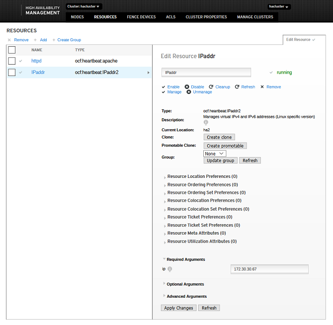
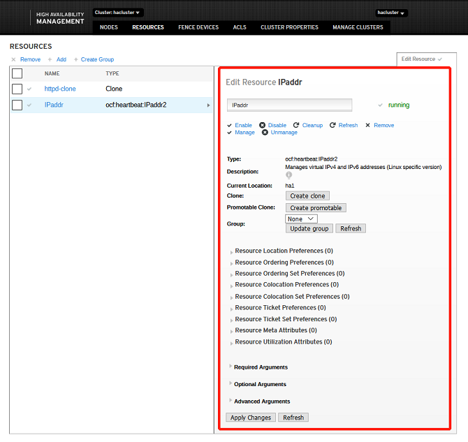

# HA的安装、部署与使用

<!-- TOC -->
- [HA的安装、部署与使用](#ha的安装部署与使用)
  - [安装与配置](#安装与配置)
    - [修改主机名称及/etc/hosts文件](#修改主机名称及etchosts文件)
    - [配置yum源](#配置yum源)
    - [安装HA软件包组件](#安装ha软件包组件)
    - [设置hacluster用户密码](#设置hacluster用户密码)
    - [修改`/etc/corosync/corosync.conf`文件](#修改etccorosynccorosyncconf文件)
    - [管理服务](#管理服务)
      - [关闭防火墙](#关闭防火墙)
      - [管理pcs服务](#管理pcs服务)
      - [管理pacemaker服务](#管理pacemaker服务)
      - [管理corosync服务](#管理corosync服务)
    - [节点鉴权](#节点鉴权)
    - [访问前端管理平台](#访问前端管理平台)
  - [快速使用指南](#快速使用指南)
    - [登陆页面](#登陆页面)
    - [主页面](#主页面)
    - [节点管理](#节点管理)
      - [节点](#节点)
    - [首选项配置](#首选项配置)
      - [添加资源](#添加资源)
        - [添加普通资源](#添加普通资源)
        - [添加组资源](#添加组资源)
        - [添加克隆资源](#添加克隆资源)
      - [编辑资源](#编辑资源)
      - [设置资源关系](#设置资源关系)
      - [ACLS](#acls)
    <!-- /TOC -->

## 安装与配置
-  环境准备：需要至少两台安装了openEuler 20.03 LTS SP1的物理机/虚拟机（现以两台为例），安装方法参考《openEuler 20.03 LTS SP1 安装指南》。

### 修改主机名称及/etc/hosts文件
-  **注：两台主机均需要进行以下操作，现以其中一台为例。**

在使用HA软件之前，需要确认修改主机名并将所有主机名写入/etc/hosts文件中。
-   修改主机名
```
# hostnamectl set-hostname ha1
```

-   编辑/etc/hosts文件并写入以下字段
```
172.30.30.65 ha1
172.30.30.66 ha2
```

### 配置yum源
成功安装系统后，会默认配置好yum源，文件位置存放在`/etc/yum.repos.d/openEuler.repo`文件中，HA软件包会用到以下源：
```
[OS]
name=OS
baseurl=http://repo.openeuler.org/openEuler-20.03-LTS-SP1/OS/$basearch/
enabled=1
gpgcheck=1
gpgkey=http://repo.openeuler.org/openEuler-20.03-LTS-SP1/OS/$basearch/RPM-GPG-KEY-openEuler

[everything]
name=everything
baseurl=http://repo.openeuler.org/openEuler-20.03-LTS-SP1/everything/$basearch/
enabled=1
gpgcheck=1
gpgkey=http://repo.openeuler.org/openEuler-20.03-LTS-SP1/everything/$basearch/RPM-GPG-KEY-openEuler

[EPOL]
name=EPOL
baseurl=http://repo.openeuler.org/openEuler-20.03-LTS-SP1/EPOL/$basearch/
enabled=1
gpgcheck=1
gpgkey=http://repo.openeuler.org/openEuler-20.03-LTS-SP1/OS/$basearch/RPM-GPG-KEY-openEuler
```

### 安装HA软件包组件
```
# yum install corosync pacemaker pcs fence-agents fence-virt corosync-qdevice sbd drbd drbd-utils -y
```

### 设置hacluster用户密码
```
# passwd hacluster
```

### 修改`/etc/corosync/corosync.conf`文件
```
totem {
        version: 2
        cluster_name: hacluster
         crypto_cipher: none
        crypto_hash: none
}
logging {         
        fileline: off
        to_stderr: yes
        to_logfile: yes
        logfile: /var/log/cluster/corosync.log
        to_syslog: yes
        debug: on
       logger_subsys {
               subsys: QUORUM
               debug: on
        }
}
quorum {
           provider: corosync_votequorum
           expected_votes: 2
           two_node: 1
       }
nodelist {
       node {
               name: ha1
               nodeid: 1
               ring0_addr: 172.30.30.65
               }
        node {
               name: ha2
               nodeid: 2
               ring0_addr: 172.30.30.66
               }
        }
```
### 管理服务
#### 关闭防火墙
```
# systemctl stop firewalld
```
修改/etc/selinux/config文件中SELINUX状态为disabled
```
# SELINUX=disabled
```

#### 管理pcs服务
-   启动pcs服务：
```
# systemctl start pcsd
```

-   查询pcs服务状态：
```
# systemctl status pcsd
```

若回显为如下，则服务启动成功。


#### 管理pacemaker服务
-   启动pacemaker服务：
```
# systemctl start pacemaker
```

-   查询pacemaker服务状态：
```
# systemctl status pacemaker
```

若回显为如下，则服务启动成功。


#### 管理corosync服务
-   启动corosync服务：
```
# systemctl start corosync
```

-   查询corosync服务状态：
```
# systemctl status corosync
```

若回显为如下，则服务启动成功。


### 节点鉴权
-  **注：一个节点上执行即可**
```
# pcs host auth ha1 ha2
```

### 访问前端管理平台
上述服务启动成功后，打开浏览器（建议使用：Chrome，Firfox），在浏览器导航栏中输入`https://IP:2224`即可。

## 快速使用指南
### 登陆页面
用户名为`hacluster`，密码为该用户在主机上设置的密码。


### 主页面
主页面是集群管理界面，它包括删除，添加现有集群，毁坏，创建新的集群四个功能。


### 节点管理
#### 节点
可以添加和删除节点，现以添加已存在节点为例。


节点管理里面包含了启动，停止，重启，挂起，修复，配置fencing功能。可以看到该节点开启的服务，正在运行的资源，对节点进行管理。


### 首选项配置
以下操作均可用命令行配置，现只做简单示例，若想使用更多命令可以使用``pcs --help``进行查询。

```
# pcs property set stonith-enabled=false
# pcs property set no-quorum-policy=ignore
```
``pcs property``查看全部设置


-  将No Quorum Policy和Stonith Enabled由默认状态改为如下对应状态：
  


#### 添加资源
##### 添加普通资源
系统中的多选下拉框均支持关键字匹配，用户可以直接输入想要选择的配置项，即可快速选中。

以apache和ipaddr为例

添加apache和ipaddr资源
```
# pcs resource create httpd ocf:heartbeat:apache
# pcs resource create IPaddr ocf:heartbeat:IPaddr2 ip=172.30.30.67
```
查看资源运行状态
```
# pcs status
```




-  添加apache资源


-  若回显为如下，则资源添加成功


-  资源创建成功并启动，运行于其中一个节点上，例如ha1；成功访问apache界面。



-  添加ipaddr资源



-  若回显为如下，则资源添加成功



-  资源创建成功并启动，运行于其中一个节点上，例如ha1；成功访问HA的web登录界面，并能够成功登录，登录后可正常执行各种操作；资源切换到ha2运行；web界面仍然能够正常访问。


##### 添加组资源
添加组资源时，集群中需要至少存在一个普通资源。勾选一个或多个资源再点击Create Group。

-  **注：组资源的启动是按照子资源的顺序启动的，所以选择子资源时需要注意按照顺序选择。**


若回显为如下，则资源添加成功


##### 添加克隆资源


若回显为如下，则资源添加成功


#### 编辑资源
-  启动资源：资源节点列表中选中一个目标资源，要求：该资源处于非运行状态。对该资源执行启动动作。
-  停止资源：资源节点列表中选中一个目标资源，要求：该资源处于运行状态。对该资源执行停止操作。
-  清理资源：资源节点列表中选中一个目标资源，对该资源执行清理操作。
-  迁移资源：资源节点列表中选中一个目标资源，要求：该资源为处于运行状态的普通资源或者组资源，执行迁移操作可以将资源迁移到指定节点上运行。
-  回迁资源：资源节点列表中选中一个目标资源，要求：该资源已经完成迁移动作，执行回迁操作，可以清除该资源的迁移设置，资源重新迁回到原来的节点上运行。
点击按钮后，列表中该资源项的变化状态与启动资源时一致。
-  删除资源：资源节点列表中选中一个目标资源，对该资源执行删除操作。
  
上述资源操作均可在下图页面中设置：



#### 设置资源关系
资源关系即为目标资源设定限制条件，资源的限制条件分为三种：资源位置、资源协同和资源顺序。
-  资源位置：设置集群中的节点对于该资源的运行级别，由此确定启动或者切换时资源在哪个节点上运行，运行级别按照从高到低的顺序依次为：Master、Slave。
-  资源协同：设置目标资源与集群中的其他资源是否运行在同一节点上，同节点资源表示该资源与目标资源必须运行在相同节点上，互斥节点资源表示该资源与目标资源不能运行在相同的节点上。
-  资源顺序：设置目标资源与集群中的其他资源启动时的先后顺序，前置资源是指目标资源运行之前，该资源必须已经运行；后置资源是指目标资源运行之后，该资源才能运行。

成功添加普通资源或者组资源之后，上述资源操作均可在下图页面中设置：


#### ACLS
ACLS是一个访问控制列表。点击Add添加用户，对其访问进行管理。

