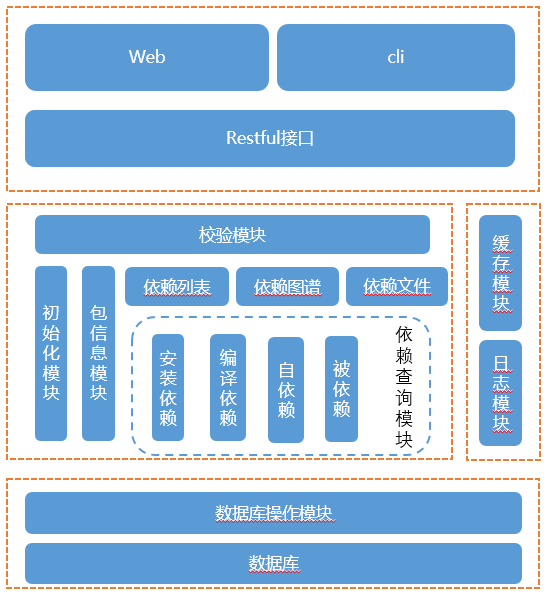

# pkgship

<!-- TOC -->

- [pkgship](#pkgship)
  - [介绍](#介绍)
  - [架构](#架构)
  - [软件下载](#软件下载)
  - [运行环境](#运行环境)
  - [安装工具](#安装工具)
  - [配置参数](#配置参数)
  - [服务启动和停止](#服务启动和停止)
  - [工具使用](#工具使用)
  - [日志查看和转储](#日志查看和转储)

<!-- /TOC -->

## 介绍

pkgship是一款管理OS软件包依赖关系，提供依赖和被依赖关系完整图谱的查询工具，pkgship提供软件包依赖查询、生命周期管理、补丁查询等功能。

1. 软件包依赖查询：方便社区人员在软件包引入、更新和删除的时候了解软件的影响范围。
2. 补丁查询：方便社区人员了解openEuler软件包的补丁情况以及提取补丁内容，详细内容请参见[patch-tracking](../patch-tracking/README.md)。

## 架构

系统采用flask-restful开发，架构如下图所示。



## 软件下载

* Repo源挂载正式发布地址：<https://repo.openeuler.org/>
* 源码获取地址：<https://gitee.com/openeuler/pkgship>
* RPM包版本获取地址：<https://117.78.1.88/project/show/openEuler:Mainline>

## 运行环境

- 硬件配置：

| 配置项   | 推荐规格    |
| -------- | ----------- |
| CPU      | 8核         |
| 内存     | 32G，最小4G |
| 网络带宽 | 300M        |
| I/O      | 375MB/sec   |

- 软件配置：

| 软件名        | 版本和规格                                 |
| ------------- | ------------------------------------------ |
| Elasticsearch | 版本7.10.1；单机部署可用；有能力可部署集群 |
| Redis         | 建议5.0.4及以上；建议大小配置为内存的3/4   |
| Python        | 版本 3.8及以上                             |

## 安装工具

**1、pkgship工具安装**

  工具安装可通过以下两种方式中的任意一种实现。

* 方法一，通过dnf挂载repo源实现。  
  先使用dnf挂载pkgship软件在所在repo源（具体方法可参考[应用开发指南](https://openeuler.org/zh/docs/20.09/docs/ApplicationDev/%E5%BC%80%E5%8F%91%E7%8E%AF%E5%A2%83%E5%87%86%E5%A4%87.html)），然后执行如下指令下载以及安装pkgship及其依赖。

   ```bash
   dnf install pkgship
   ```

* 方法二，通过安装rpm包实现。
  先下载pkgship的rpm包，然后执行如下命令进行安装（其中“x.x-x”表示版本号，请用实际情况代替）。

   ```bash
   rpm -ivh pkgship-x.x-x.oe1.noarch.rpm
   ```

   或者

   ```bash
   dnf install pkgship-x.x-x.oe1.noarch.rpm
   ```

**2、Elasticsearch和Redis安装**

  如果环境没有安装Elasticsearch或者Redis，可以在pkgship安装之后执行自动化安装脚本。

  脚本路径默认为：

```
/etc/pkgship/auto_install_pkgship_requires.sh
```

  执行方法为

```
/bin/bash auto_install_pkgship_requires.sh elasticsearch
```

 或者

```
 /bin/bash auto_install_pkgship_requires.sh redis
```

>**说明:**
>以rpm包方式安装Elasticsearch默认为无密码模式，且pkgship需使用无密码设置的Elasticsearch，因此，当前建议Elasticsearch和pkgship需安装在同一服务器，通过网络隔离提高安全性。后续版本将支持Elasticsearch设置用户名密码。

**3、安装后添加用户**

在安装pkgship软件后，会自动创建名为pkgshipuser的用户和名为pkgshipuser的用户组，无需手动创建，后续服务启动和运行时，都会以该用户角色操作。

## 配置参数

1.在配置文件中对相应参数进行配置，系统的默认配置文件存放在 /etc/pkgship/packge.ini，请根据实际情况进行配置更改。

```
vim /etc/pkgship/package.ini
```

```ini
[SYSTEM-系统配置]
; 初始化数据库时导入的yaml文件存放位置，该yaml中记录导入的sqlite文件位置
init_conf_path=/etc/pkgship/conf.yaml

; 若部署为客户端-服务端方式，服务端需保证query_ip_addr为本机ip或者（0.0.0.0），
; 客户端可通过query_ip_addr和query_port访问服务端，或者通过设置映射的remote_host访问服务端

; 服务查询端口
query_port=8090

; 服务查询ip
query_ip_addr=127.0.0.1

; 远程服务的地址，命令行可以直接调用远程服务来完成数据请求
remote_host=https://api.openeuler.org/pkgmanage

; 初始化和下载临时文件存放目录，不会长时间占用，建议可用空间至少1G
temporary_directory=/opt/pkgship/tmp/

[LOG-日志]
; 业务日志存放路径
log_path=/var/log/pkgship/

; 打印日志级别，支持如下：
; INFO DEBUG WARNING ERROR CRITICAL
log_level=INFO

; 单个业务日志文件最大容量，超过该值会自动压缩转储，默认为30M
max_bytes=31457280

; 备份日志保留的最大数量，默认为30
backup_count=30

[UWSGI-Web服务器配置]
; 操作日志路径
daemonize=/var/log/pkgship-operation/uwsgi.log
; 前后端传输数据大小
buffer-size=65536
; 网络连接超时时间
http-timeout=600
; 服务响应时间
harakiri=600

[REDIS-缓存配置]
; Redis缓存服务器的地址可以是已发布的可以正常访问的域或IP地址
;链接地址默认为127.0.0.1
redis_host=127.0.0.1

;Redis缓存服务器的端口，默认为6379
redis_port=6379

;Redis服务器一次允许的最大连接数
redis_max_connections=10

[DATABASE-数据库]
;数据库访问地址，建议设置为本机地址
database_host=127.0.0.1

;数据库访问端口，默认为9200
database_port=9200

```

2.创建初始化数据库的yaml配置文件：
conf.yaml 文件默认存放在 /etc/pkgship/ 路径下，pkgship会通过该配置读取要建立的数据库名称以及需要导入的sqlite文件，也支持配置sqlite文件所在的repo地址。conf.yaml 示例如下所示。

```yaml
dbname: oe20.03   #数据库名称
src_db_file: /etc/pkgship/repo/openEuler-20.09/src  #源码包所在的本地路径
bin_db_file: /etc/pkgship/repo/openEuler-20.09/bin  #二进制包所在的本地路径
priority: 1 #数据库优先级

dbname: oe20.09
src_db_file: https://repo.openeuler.org/openEuler-20.09/source  #源码包所在的repo源
bin_db_file: https://repo.openeuler.org/openEuler-20.09/everything/aarch64 #二进制包所在的repo源
priority: 2
```


> 如需更改存放路径，请更改package.ini下的 init_conf_path 选项。
>
> 不支持直接配置sqlite文件路径。
>
> dbname请使用小写字母或者数字，不支持大写字母。

## 服务启动和停止

pkgship启动和停止方式有两种，systemctl方式和pkgshipd方式，其中systemctl方式启动可以有异常停止自启动的机制。两种方式的执行命令为：

```shell
systemctl start pkgship.service 启动服务

systemctl stop pkgship.service 停止服务

systemctl restart pkgship.service 重启服务
```

```sh
pkgshipd start 启动服务

pkgshipd stop 停止服务
```

> 每次起停周期内仅支持一种方式，不允许两种操作同时使用。
>
> pkgshipd启动方式只允许在pkgshipuser用户下操作。

## 工具使用

1. 数据库初始化。  

   > 使用场景：服务启动后，为了能查询对应的数据库（比如oe20.03，oe20.09）中的包信息及包依赖关系，需要将这些数据库通过createrepo生成的sqlite（分为源码库和二进制库）导入进服务内，生成对应的包信息json体然后插入Elasticsearch对应的数据库中。数据库名为根据conf.yaml中配置的dbname生成的dbname-source/binary。

    ```bash
    pkgship init [-filepath path]
    ```

    > 参数说明：  
    > -filepath：指定初始化配置文件config.yaml的路径，可以使用相对路径和绝对路径，不带参数则使用默认配置初始化，可选参数。

2. 单包查询。

   用户可查询源码包或者二进制包(packagename)在指定数据库表（database）中的具体信息。

   > 使用场景：用户可查询源码包或者二进制包在指定数据库中的具体信息。  

   ```bash
   pkgship pkginfo $packageName $database [-s]
   ```

   > 参数说明：  
   > packagename：指定要查询的软件包名，必传参数。   
   > database：指定具体的数据库名称，必传参数。
   >
   > -s: 指定`-s`将查询的是`src`源码包信息;若未指定 默认查询`bin`二进制包信息，可选参数。

3. 所有包查询。

   查询数据库下包含的所有包的信息。

   > 使用场景：用户可查询指定数据库下包含的所有软件包信息。

   ```bash
   pkgship list $database [-s]
   ```

   > 参数说明：  
   > database：指定具体的数据库名称，必传参数。  
   > -s: 指定`-s`将查询的是`src`源码包信息;若未指定 默认查询`bin`二进制包信息，可选参数。

4. 安装依赖查询。

   查询二进制包(binaryName)的安装依赖。

   > 使用场景：用户需要安装某个二进制包A时，需要将该二进制包A的安装依赖B，及B的安装依赖C等等，直至所有的安装依赖全部安装到系统才能成功安装二进制包A。因此，在用户安装二进制包A之前，可能会需要查询二进制包A的所有安装依赖。该命令提供了此功能，允许用户根据平台默认的优先级在多个数据库之间进行查询；同时也支持用户自定义数据库查询优先级。

   ```bash
   pkgship installdep [$binaryName $binaryName1 $binaryName2...] [-dbs] [db1 db2...] [-level] $level
   ```

   > 参数说明：  
   > binaryName：需要查询安装的依赖的二进制包名字,支持传多个；必传参数。
   >
   > -dbs： 指定需要查询的database优先级,不传按照系统默认优先级搜索；可选参数。
   >
   > -level：指定需要查询的依赖层级,不传默认为0，查询所有层级；可选参数。

5. 编译依赖查询。

   查询源码包(sourceName)的所有编译依赖。

   > 使用场景：用户要编译某个源码包A的时候，需要安装源码包A的编译依赖B, 要成功安装编译依赖B需要获取B的所有安装依赖。因此，在用户编译源码包A之前，可能会需要查询源码包的编译依赖以及这些编译依赖的所有安装依赖。该命令提供了此功能，允许用户根据平台默认的优先级在多个数据库之间进行查询;同时也支持用户自定义数据库查询优先级。

   ```bash
   pkgship builddep [$sourceName $sourceName1 $sourceName2..] -dbs [db1 db2 ..] [-level] $level
   ```

   > 参数说明：  
   > sourceName：需要查询编译依赖的源码包名字,支持多个查询；必传参数。
   >
   > -dbs： 指定需要查询的database优先级,不传按照系统默认优先级搜索；可选参数。
   >
   > -level：指定需要查询的依赖层级,不传默认为0，查询所有层级；可选参数。

6. 自编译自安装依赖查询。

   查询指定二进制包(binaryName)或源码包(sourceName )的安装及编译依赖，其中[pkgName]为查询的二进制包或者源码包的名称。当查询二进制包时，可以查询到该二进制包的所有安装依赖以及该二进制包对应的源码包的编译依赖，及这些编译依赖的所有安装依赖；当查询源码包时，可以查询该源码包的编译依赖，及这些编译依赖的所有安装依赖，并且查询该源码包生成的所有二进制包的所有安装依赖。同时，配合对应参数使用，该命令也支持查询软件包的自编译依赖查询，和包含子包的依赖查询。

   > 使用场景：如果开发者想在现有的版本库的基础上引入新的软件包，应同时引入该软件包的所有编译、安装依赖。该命令提供开发者一个同时查询这两种依赖关系的功能，能让开发者知晓该软件包会引入哪些其他的包，该命令支持查询二进制包和源码包。

   ```bash
    pkgship selfdepend [$pkgName1 $pkgName2 $pkgName3 ..] [-dbs] [db1 db2..] [-b] [-s] [-w]
   ```

   > 参数说明：  
   >
   > pkgName：需要查询安装的依赖的软件包名字,支持传多个；必传参数。
   >
   > -dbs： 指定需要查询的database优先级,不传按照系统默认优先级搜索；可选参数。
   >
   > -b：指定`-b`表示查询的包是二进制,不指定默认查询源码包；可选参数。
   >
   > -s： 指定-s表示查询软件包的所有安装依赖和所有编译依赖（即编译依赖的源码包的编译依赖），以及所有编译依赖的安装依赖；如果不增加-s参数表示只查询软件包的所有安装依赖和一层编译依赖，以及一层编译依赖的所有安装依赖；可选参数。
   >
   > -w：指定-s表示引入某个二进制包的时候，查询结果会显示出该二进制包对应的源码包以及该源码包生成的所有二进制包；如果不指定-w参数表示引入某个二进制包的时候，查询结果只显示对应的源码包；可选参数。

7. 被依赖查询。  
   查询软件包(pkgName)在某数据库(dbName)中被哪些包所依赖。

   > 使用场景：针对软件包A，在升级或删除的情况下会影响哪些软件包，可通过该命令查询。该命令会显示源码包A(若为源码包)生成的所有二进制包（若输入为二进制包，那此处即为输入的二进制包）被哪些源码包（比如B）编译依赖，被哪些二进制包（比如C1）安装依赖；以及B生成的二进制包及C1被哪些源码包（比如D）编译依赖，被哪些二进制包（比如E1）安装依赖，以此类推，遍历这些二进制包的被依赖。

   ```bash
    pkgship bedepend dbName [$pkgName1 $pkgName2 $pkgName3] [-w] [-b] [-install/build]
   ```

   > 参数说明: 
   >
   > dbName：需要查询依赖关系的仓库，不支持多个；必选参数。
   >
   > pkgName：待查询的软件包名称，支持多个；必选参数。
   >
   > -w ：当不指定-w 时，查询结果默认不包含对应源码包的子包；当命令后指定配置参数[-w] 时，不仅会查询二进制包C1的被依赖关系，还会进一步去查询C1对应的源码包C生成的其他二进制包（比如：C2,C3）的被依赖关系；可选参数。
   >
   > -b：指定`-b`表示查询的包是二进制,默认查询源码包；可选参数。
   >
   > -install/build：指定`-install`表示查询的是安装被依赖,指定`-build`表示查询的是编译被依赖，默认查全部, 不能`-install`和`-build`同时存在；可选参数。

8. 数据库信息。

   > 使用场景，查看Elasticsearch中初始化了哪些数据库，该功能会按照优先级顺序返回已经初始化的数据库列表。

   `pkgship dbs`

9. 获取版本号。

   > 使用场景：获取pkgship软件的版本号。

   `pkgship -v`

## 日志查看和转储

 **日志查看**

 pkgship服务在运行时会产生两种日志，业务日志和操作日志。

 1、业务日志: 

  路径：/var/log/pkgship/log_info.log（支持在package.ini中通过log_path字段自定义路径）。

  功能：主要记录代码内部运行的日志，方便问题定位。

  权限：路径权限755，日志文件权限644，普通用户可以查看。

2、操作日志：

路径：/var/log/pkgship-operation/uwsgi.log （支持在package.ini中通过daemonize字段自定义路径）。

功能：记录使用者操作信息，包括ip，访问时间，访问url，访问结果等，方便后续查阅以及记录攻击者信息。

权限：路径权限700，日志文件权限644，只有root和pkgshipuser可以查看。

**日志转储**

1、业务日志转储：

- 转储机制

  使用python自带的logging内置函数的转储机制，按照日志大小来备份。

> 配置项，package.ini中配置每个日志的容量和备份数量
>
> ```ini
> ; Maximum capacity of each file, the unit is byte, default is 30M
> max_bytes=31457280
> 
> ; Number of old logs to keep;default is 30
> backup_count=30
> ```

- 转储过程

  当某次日志写入后，日志文件大小超过配置的日志容量时，会自动压缩转储，压缩后文件名为log_info.log.x.gz， x是数字，数字越小为越新的备份。

  当备份日志数量到达配置的备份数量之后，最早的备份日志会被删除掉，然后备份一个最新的压缩日志文件。


2、操作日志转储：

- 转储机制

  使用脚本进行转储，按照时间转储，每日转储一次，共保留30天，不支持自定义配置。

  > 脚本位置：/etc/pkgship/uwsgi_logrotate.sh

- 转储过程

  pkgship启动时转储脚本后台运行，从启动时，每隔1天进行转储压缩，共保留30份压缩文件，压缩文件名称为uwsgi.log-20201010x.zip， x为压缩时的小时数。

  pkgship停止后转储脚本停止，不再进行转储，再次启动时，转储脚本重新执行。